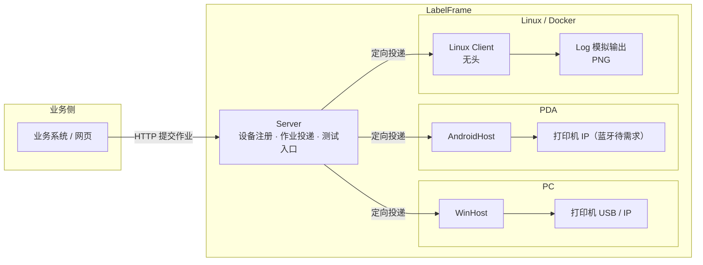

# LabelFrame 设计文档

## 1. 愿景与目标

愿景：**方便仓库完成标签打印，提高办公效率。**

目标（由愿景推导）：
- 操作工在业务动作中一键触发打印，就近出纸，零学习成本；
- 文员可在 PC 上批量打印，无需关心打印机细节；
- 管理员一次配置，多设备可复制，故障可解释；
- 业务系统通过简单契约接入，不依赖具体打印机型号。

## 2. 核心概念（术语表）

| 术语 | 含义 |
|---|---|
| 契约（LabelContract） | 一个标签场景的字段清单（Key / DisplayName / 必填 / 类型 / 格式），可版本化 |
| 版式（LabelLayout） | 标签布局：尺寸 + 元素（文本 / 条码 / 二维码 / 图片 / 线），引用契约版本，毫米坐标 |
| 标签文档（LabelDocument） | 版式 + 数据解析后的中间结果，与打印机指令无关 |
| 作业（Job） | 一次打印请求 = N 张标签，逐张状态，可挂起 / 恢复 / 取消，批内顺序 |
| 设备（Device） | 一台运行宿主的 PC 或 PDA，向 Server 注册 |
| 宿主（Host） | 设备上的打印执行服务（Windows Client / Linux Client / AndroidHost） |
| 编码器（Encoder） | LabelDocument → 打印机指令：整版位图 ZPL `^GF`（当前唯一路径），其他指令集（TSPL / CPCL）待需求 |
| 传输（Transport） | 把指令送到打印机：TCP 9100 / Windows 驱动 / Zebra SDK / 日志模拟（蓝牙待需求，可经插件接入） |
| 模板包（TemplatePackage） | 契约 + 版式 + 静态图片资源的可导入导出单元（zip） |

## 3. 总体架构

### 3.1 两种打印模式

- **路由模式（主）**：业务系统提交作业（requestId + 目标设备 + labels[]）→ Server 校验并投递到目标设备宿主 → 宿主作业队列逐张打印 → 状态可查 / 可通知。
- **直连模式**：PDA 网页或本机程序直接调用本机宿主（本地 HTTP / JS 桥），不经 Server；适合就近单张，页面有数据时可脱离服务器。

### 3.2 一次请求 = 多张

调用方一次提交 N 张标签（每张可不同），异步返回 jobId，进度与失败项可查；出库拆分、批量、补打统一为同一模型。

## 4. 关键技术决策（决策记录）

| # | 决策 | 决定 | 后果 |
|---|---|---|---|
| 1 | 契约与版式分离 | 字段契约稳定、版式易变，两者分开版本化 | 改版式不碰契约；契约升级后可软校验旧版式（Drifted） |
| 2 | 中间文档模型 + 毫米坐标 | 版式用毫米，编码器按 DPI 换算 | 同模板可跨 203/300 dpi；便于预览与多指令集 |
| 3 | 编码器抽象 | `ILabelEncoder`，ZPL 优先 | 换打印机只增加编码器 |
| 4 | 中文渲染下沉编码器 | 中文文本栅格化为位图（^GF），条码始终原生指令 | 不依赖打印机固件；条码质量不妥协 |
| 5 | 异步作业模型 | 提交即返回 jobId；逐张状态持久化；幂等 requestId；挂起 / 恢复 / 取消；批内顺序 | 大批量不阻塞调用方；不重打不漏打 |
| 6 | 设备定向投递 | 作业目标 = 发起设备；Server 维护设备目录精准投递 | 多人并发互不干扰；替代广播方案 |
| 7 | 本地服务统一入口 | 所有打印经设备宿主；直连与路由并存 | PC / PDA 同构 |
| 8 | 预览是设计期能力 | 预览渲染不进打印主链路，模板设计 / 调试用 | 正式流程零预览开销 |
| 9 | 运行平台 | .NET 10；Client Host 共用一套作业 / 路由 / 渲染代码，Windows 目标 `net10.0-windows10.0.26100`（Zebra SDK 需要 Windows SDK 投影），Linux 目标 `net10.0`；Win7/8 的 net48 版有真实需求再做 | Windows 保留完整打印能力，Linux 可作为无头容器客户端运行；兼容后置 |
| 10 | 模板管理先单机 | 单机 CRUD + 模板包导入导出；WMS 下发后置 | 「标准模板包」格式从第一天定，下发复用同一格式 |
| 11 | Server 自带测试入口 | 无业务系统也能提交打印、连接打印机验证 | 系统独立可测 |
| 12 | 迭代 1 编码器范围 | ZPL 编码器先覆盖文本 / Code128 / 图片占位；二维码 / 线元素进入模型但编码器显式报错（NotSupportedException），迭代 2 补全 ^BQ / ^GB | 迭代 1 验收聚焦 ^BC，避免范围膨胀 |
| 13 | 问题码约定 | 校验问题码统一 `LF_VAL_xxx`，消息中文可读 | 故障可解释，后续错误码沿用此约定 |
| 14 | 作业模型与 SQLite 持久化 | 一次请求 = 1 个 Job + N 个 Item（逐张）；SQLite 表 `jobs` / `job_items`，`request_id` 唯一索引实现幂等；Item 存编码后的 ZPL（不可变，避免重打） | 服务重启不丢作业；重放同一 requestId 不重复建单 |
| 15 | 本地 HTTP API（迭代 2 契约） | 提交请求自包含模板（contract + layout + labels[]），因为模板管理在迭代 4；端点：`POST /api/jobs`、`GET /api/jobs/{id}`、`POST /api/jobs/{id}/suspend / resume / cancel`、`GET /healthz` | 无模板库也能端到端打印；迭代 4 再支持模板引用 |
| 16 | 挂起 / 恢复语义 | 传输异常（如打印机离线）→ 当前 Item 记 Failed，若仍有未打 Item 则 Job 挂起；恢复后从未打印的 Pending Item 续打（不重打 Failed，失败项单独重打在迭代 6）；取消 → 剩余 Pending/Printing Item 置 Cancelled；服务重启把 in-flight（Printing）Job 置 Suspended，并把在途（Printing）Item 重置为 Pending，恢复后续打优先保证不漏打（不重打语义在真实设备联调时确认） | 符合底线「不重打、不漏打」；TCP 无法感知缺纸，以发送异常近似 |
| 17 | 中文渲染架构 | Core 定义 `LabelBitmap`（1bpp）+ ZPL `^GF` 编码；PC / Linux Client 用 Skia 把整张标签统一渲染为位图，Android 使用平台位图实现同一编码契约 | 不依赖打印机固件中文字库；各宿主打印主链路同构 |
| 18 | 传输分层 | TCP 9100 在 Core（跨平台，Android 复用）；Windows 驱动（USB）用 winspool P/Invoke raw 打印，放在 WinHost | 每台打印机串行，一台设备一次只处理一个 Item |
| 19 | WinHost 配置 | `appsettings.json` 的 `WinHost` 节 + `LABELFRAME_*` 环境变量覆盖；默认监听 127.0.0.1:53960、Log 传输（联调）、数据库 %LOCALAPPDATA%\\LabelFrame\\jobs.db | 一次配置可复制；无真实打印机时日志模拟 |
| 20 | Zebra 官方 SDK | 传输新增 Zebra 模式（`Zebra.Printer.SDK 3.0.3355`，Link-OS）：TCP / USB（自动发现）/ Windows 驱动统一连接；避开 5.x 引入的 MAUI/WinUI 依赖；轻量 TCP9100 / winspool raw 保留作备选 | 官方 USB 直连与打印机状态（迭代 6）可用；Zebra 模式要求 Win10+ |
| 21 | Server 投递采用「宿主轮询」 | WinHost 注册后周期轮询 Server 领取定向作业，完成后回报结果；不要求宿主开放入站端口 | PC / PDA 同构，天然穿透防火墙；设备在线以心跳（轮询）为准 |
| 22 | 设备离线语义 | 作业投递给离线设备时在 Server 暂存（Pending），设备上线轮询即领取；不设过期 | 符合「不丢作业」底线；后续可按需加过期/通知 |
| 23 | 模板包格式 | zip：`manifest.json`（name / group / contract / layout）+ `images/` 图片资源；模板库 SQLite（Core.Templates，按分组列表） | 两台电脑间可导入导出；WMS 下发复用同一格式 |
| 24 | 预览渲染 | `LabelDocument` → PNG（设计期）与打印位图统一使用 Skia / ZXing；图片来自模板资源；毫米 → 像素按 DPI | 预览与打印共用渲染器，避免平台渲染漂移 |
| 25 | 失败项单独重打 | Failed Item → Pending（清错误），Failed 作业自动恢复 Pending 由 Worker 续打 | 补打不重建整单；不重打已完成项 |
| 26 | 在线状态 / 测试页 | `GET /api/printer/status` + `POST /api/printer/test`；TCP 用 `~HS` 基础解析（字段映射待真实设备联调），Zebra SDK 3.x PrinterStatus 无公开字段先按「连接成功 = 在线」，驱动模式不可读回 | 故障可解释；真实设备联调确认字段语义 |
| 27 | Android 本地 HTTP | AndroidHost 用 TcpListener 极简 HTTP（仅 127.0.0.1:53970），不承载完整 ASP.NET Core | 包体小、依赖少；JS 桥同端口预留 |
| 28 | Android 中文渲染与存储 | Android.Graphics Bitmap → LabelBitmap（^GF，与 WinHost 同契约）；SQLite 用 lib.e_sqlite3.android | 跨宿主中文输出一致 |
| 29 | Studio 模板工具架构 | `LabelFrame.Studio`（WPF，net10.0-windows）作为 WinHost 的 HTTP 客户端：模板管理 / 导入导出 / 预览 / 测试打印全部复用 WinHost API；V1 不做版式可视化编辑（V2 再加画布） | 零重复逻辑，测试打印走生产同一条打印链路；V2 拖拽画布不改变模板包契约 |
| 30 | Studio V2 版式编排 | 画布用 WPF 原生元素（Canvas + TextBlock/Border/Line），mm → px 按缩放换算；条码 / 二维码在画布上为带 SourceKey 的占位框，真实效果由「刷新预览」（WinHost preview PNG）确认 | 拖拽流畅、无需本地条码渲染；编排所见即模板结构 |
| 31 | 后续规划（迭代 9/10） | Excel 导入：列 → 契约字段映射，批量生成标签数据；MSI 安装包（WiX）：安装 WinHost + Studio、生成 appsettings.json（端口 / 传输 / 打印机 / 数据库）、开始菜单快捷方式 | 交付形态完整；业务侧只传文本，模板决定条码 / 二维码 |
| 32 | Excel 读取选型（预研） | 迭代 9 采用第三方 `TemplateFrame.Excel.Simple 1.0.4`：`SimpleExcel.Read(Stream, tableName)` 读取 xlsx → 表头 + 数据行，再按列映射契约字段；底层 `DocumentFormat.OpenXml 3.3.0`；仅作依赖引用，仓库命名仍为 `LabelFrame.*` | 省去自研 xlsx 解析；列映射与批量提交逻辑由我们实现 |
| 33 | 元素样式与区域（格子）布局 | 文本元素可选 `WidthMm`（块宽）/ `TextAlign`（Left/Center/Right）/ `PaddingMm` / `BorderMm`；矩形元素可选 `BorderMm`；新增区域元素 `LabelRegionElement`（X/Y/W/H/BorderMm）；任何元素可选 `RegionId` + `RegionHAlign/RegionVAlign`（Start/Center/End）锚定到区域 | 支持「先画格子再放元素居中」的编排模式；格子保存、移动元素跟随；旧模板无新属性行为不变（向后兼容） |
| 34 | Studio 2.0 界面（迭代 8C） | 两个工作区：作业工作台（模板列表 / 预览 / 数据表单 / 打印 / 状态日志栏）+ 独立模板设计器（控件栏 / 画布 / 属性分组 / 填充 / 区域 / 实时预览 / 打印测试）；不常用功能收进菜单栏 | 文员日常打印与设计分离；画布所见即所得即实时预览 |
| 35 | 元素内容来源（填充） | 文本 / 条码 / 二维码支持两种来源：`Literal` 固定值（如标题）或 `SourceKey` 字段填充；编码与预览取值 = Literal ?? data[SourceKey] | 固定文本无需建字段；旧模板无 Literal 行为不变 |
| 36 | 容器控件（替代“画区域”） | 设计器控件栏提供「容器」（内部仍是 `LabelRegionElement`，模板包格式不变）；元素拖入容器自动锚定居中；属性面板不再暴露 RegionId / 对齐锚定 UI（后台能力保留） | 用户无需理解区域概念；画格子 → 放元素居中的编排方式不变 |
| 37 | 契约字段自动推导 | 字段集合 = 版式中「字段填充」元素的 `SourceKey` 去重（按元素顺序）；移除字段增删 / 重命名 / 显示名编辑 UI；显示名统一取 Key；加载旧模板保留契约字段顺序与元数据（IsRequired / Type），未被元素引用的字段不再保留 | 字段建立是后台逻辑，用户只负责绑定控件；工作台 / 测试表单用 Key 作标签 |
| 38 | 设计器 2.0 交互与布局（迭代 8D） | 设计 / 测试用 Tab 分开；左键选中、8 手柄拖角缩放、框选多选、Delete 删除、中键平移、Ctrl+滚轮缩放（以鼠标为中心）、标尺 + 网格、边缘 / 中心对齐吸附与右键对齐菜单；属性面板选中控件才显示（默认收起）；底部状态 + 日志栏横跨全窗口（自动滚底 + 清空）；控件栏拖拽不再重复建元素；元素属性变化实时驱动画布重绘与预览 | 用户编辑手感接近主流设计器；设计界面与打印测试界面职责分离 |
| 39 | UI 技术选型评估（2026-08-09，用户已选 A 方案） | 后端（Core / Rendering / WinHost / Server / AndroidHost）保持 .NET 10 不动；Studio UI 层评估 Web 技术栈（Tauri 2 / Blazor Hybrid / 纯浏览器），先用本地 Web 原型验证拖拽设计器体验，再决定是否重写 UI；原型直接调 WinHost API，复用全部后端能力 | UI 是纯客户端，可独立替换；原型成本低、结论直观；无论换栈与否，Excel 读取 / 批量打印等业务逻辑做成可复用服务 |
| 40 | 单机服务与前端工程化（2026-08-09，用户确认） | 单机模式 = 演进 WinHost 为单进程服务（模板库 / 作业 / 打印传输 / 静态托管 Web UI / Excel 导入 / PDA 日志）；前端另起 `web/`（Vite + React + TS + Konva），prototypes 原型冻结不改；后端 C#，前端 JS/TS；Excel 解析在后端复用 TemplateFrame.Excel.Simple | 一台 PC = 一个进程 + 浏览器；前后端并行开发，前端按 FRONTEND-SPEC.md 交付，主 agent 联调 |
| 41 | 模板测试数据 testData（契约扩展） | 模板包与模板 API 增加可选 `testData`（键 → 值字典，向后兼容）；PDA 打印测试与 PC 打印测试共用；manifest / SQLite 模板表同步扩展 | 服务端定义测试数据，PDA 点击模板即可本地测试打印 |
| 42 | PDA 测试模式（迭代 11） | AndroidHost 配置 pc_host（PC 单机服务地址）→ 本地 HTTP 增加 `GET /api/pc/templates` 与 `POST /api/pc/templates/{name}/print-test`（拉模板详情 → 服务端 testData 本地打印 → 终态日志回传 PC）；内置 PDA 测试页（浏览器打开 127.0.0.1:53970） | PDA 开箱即用测试打印；日志回传 PC 便于远程调试；Manifest 允许明文 HTTP（内网） |
| 43 | MSI 安装包方案（迭代 10，2026-08-09；2026-08-10 修复） | WiX v7 打包：WinHost 发布产物（win-x64 **framework-dependent**，含 web/dist）+ 桌面 / 开始菜单快捷方式（Target=#WinHostExe）；WinHost 为 WinExe + 自动开浏览器 + host.log + 本机优雅关闭 + **系统托盘（原生 P/Invoke，无 WinForms）**；名称统一 LabelFrame；L 型图标；自签名证书脚本；目标机需 .NET 10 Desktop Runtime（MSI 约 10MB）。2026-08-10 修复：MSI 以 `-arch x64` 构建为 **x64 包**（此前是 32 位包，`ProgramFiles64Folder` 不生效，错装到 `Program Files (x86)`）；版本升至 0.11.1 以支持覆盖已装的 0.11.0 | 干净电脑装 .NET 10 Runtime 后：安装 MSI（`C:\Program Files\LabelFrame`）→ 双击图标 → 浏览器打开即用；正式签名需商业证书 |
| 44 | MSI 运行时缺失处理（2026-08-10，用户决策；2026-08-10 修复检测） | MSI 检测 .NET Desktop Runtime（x64）：缺失时全 UI 安装显示带可点击官方下载链接的对话框（MSI Hyperlink 控件），静默 / 基础 UI 由 LaunchCondition 拦截并提示链接；**放弃 Burn 引导自动下载安装**运行时（曾尝试 WiX v7 Bal 构建 Bundle，扩展加载与依赖链复杂、收益低，用户确认不做）。检测实现改为 WiX NetFx 扩展 `DotNetCompatibilityCheck`（内置官方 NetCoreCheck 自检，检查 Microsoft.WindowsDesktop.App ≥ 10.0.0、RollForward=latestMajor、x64）：不再读取注册表（原方案读 `InstalledVersions\...\sharedfx` 默认值，而运行时版本是**命名值**，且 MSI 为 32 位视图，导致装了运行时仍误报缺失）；NetCoreCheck 实时检测，**装完运行时无需重启**即可识别 | 干净电脑需先装 .NET 10 Desktop Runtime 再装 MSI；MSI 保持约 10MB、不联网自动安装 |
| 45 | 模板预览值 + 测试默认值 + 图片打印（迭代 12，2026-08-10，后端已实施（SkiaSharp 渲染器），前端 renderLabelImage 待实施） | 元素 JSON 新增 `previewValue`（text/barcode/qrcode 字段填充模式写入，固定值仍用 literal）；保存模板时后端自动用元素预览值派生并覆盖 `testData`，作为 PC / PDA 打印测试的初始默认值（单一事实来源=元素预览值）；新增 `PrintMode`（Vector 默认 / Image）：Image 模式用 **SkiaSharp 渲染器**（canvas 类 2D，与前端同源）把整张标签渲染为 1bpp 位图经 `^GF` 直传打印机，用于评估定位与效果；`SubmitJobRequest` 增加可选 `template.name`（取模板图片资源）与 `printMode`（请求覆盖配置） | 先实验评估图片打印效果，再决定是否替代矢量 ZPL；预览值丢失 bug 由前后端契约修复 |
| 46 | 文本垂直对齐契约（迭代 12，2026-08-10） | 文本元素新增 `heightMm`（0=按字高）与 `verticalAlign`（Top/Middle/Bottom，默认 Top 兼容旧模板）；前端保存时写入元素高度与垂直对齐；Skia / GDI 渲染器按框高垂直对齐绘制，边框按框高；修复「打印比前端预览整体偏上」（此前前端框内居中、后端顶部对齐且高度未持久化） | 旧模板需在编辑器重新保存一次才带 heightMm/verticalAlign；矢量 ZPL 打印暂不区分垂直对齐 |
| 47 | 元素契约第二批字段 + 垂直对齐默认值统一（迭代 13，2026-08-10，后端已实施；前后端已完成，用户验收待执行） | 文本 `wrap / lineHeight / fitMode / fontFamily`（默认 Microsoft YaHei）、二维码 `qrEcc / qrMargin`（默认 M / 2）、条码 `displayValue`（默认 true）、通用双边内边距 `paddingH / paddingV`（`PaddingHMm / PaddingVMm`，0=未设，缺失时回退 `paddingMm`）写入版式契约；写方向非默认才写、读回默认（向后兼容，无数据库迁移）。决策 A：`VerticalAlign` 默认由 Top 改为 **Middle**（与前端一致），旧模板无 `heightMm` 时渲染器框高兜底 = `max(字高 + 2×最大内边距, 10mm)`。Skia 图片打印按这些字段真实绘制（换行 / 行距 / 溢出处理 / 字体 / QR 参数 / 条码文字 / 双边内边距）；新字段**不参与** ZPL 矢量编码 | 导入 → 保存 → 重开逐字段一致；图片打印与前端预览同源；旧模板行为 = 前端现状 |
| 48 | MSI 升级保留用户配置 appsettings.json（0.12.2，2026-08-10） | appsettings.json 从自动文件清单中剔除，改为 main.wxs 中 GUID 固定的独立组件，标记 `NeverOverwrite="yes"`（升级 / 修复不覆盖）+ `Permanent="yes"`（卸载不删除）；新装仍写入 packaging 默认配置 | 覆盖安装 / 修复不丢用户配置；卸载保留该文件（属用户数据）；后续新增默认配置项需用户手动合并或应用层兜底默认值 |
| 49 | 字体加粗契约与打印方案（迭代 14，2026-08-10，后端已实施） | 文本元素 JSON 新增 `bold?: boolean`（true 才写 / 默认 false，旧模板兼容）。ZPL 无标准加粗修饰符：方案 A（默认，可配置）粗体字体变体映射（`"0"→"1"`，`ZplEncoder` 可注入映射表，WinHost `LABELFRAME_BOLD_MODE=FontVariant`）；方案 B `WidthScale` 宽度 ×1.15 放大兜底。Skia 用 `SKFont.Embolden` 渲染且测量一致（与前端 Konva `fontStyle:bold` 同源） | 小字号打印可试加粗对比；方案 A 依赖打印机内置粗体字体编号，不同机型可能需调整映射表；矢量 ZPL 加粗为近似，Image 模式最保真 |
| 50 | 图片打印收敛 + 连接管理 + 调试出图（迭代 15，2026-08-10，后端已实施，前后端已完成，用户验收待执行） | 彻底删除矢量 ZPL（`ZplEncoder.Encode` / PrintMode / GdiTextRasterizer 等），打印统一 Skia / Android 整版位图经 `^GF`（`ZplImageEncoder`）；连接管理 `ITransportManager` + `GET/POST /api/transport`（单一连接、先测试后生效、失败回滚、持久化 `%LOCALAPPDATA%\LabelFrame\connection.json`）；调试 = 后端渲染出图下载（单张 `render-image` PNG / 批量 `render-images` zip），不建作业不改作业模型；Log 模拟打印保存 PNG | 打印所见即所得（前后端同源渲染）；连接切换免改文件重启；调试零纸张验证；ZPL 仅保留 ^GF 物理载体 |
| 51 | 迭代 15 前端：DataPrint 会话保留 + 连接管理 UI + 调试独立（2026-08-10，前端已实施） | ① 会话草稿提升 AppContext（`printDraft`：selectedName / valuesByTemplate+dirtyKeysByTemplate / debugMode / jobId），sessionStorage 持久化（刷新保留、标签页天然隔离，**禁 localStorage**）；values 加载 = testData 与用户 dirty 的 key 按 **key 存在性**合并（清空不被顶回）；Excel 数据与列映射不保留。② 连接状态全局化：`transportConfig`（GET /api/transport），切换成功立即用响应 config 更新（healthz 轮询仅兜底重启）；设置页「连接方式」分组（模式单选 / 只显当前模式参数 / testOnly 测试 / 先测试后生效失败回滚）+ DataPrint 顶部徽标与快速切换。③ 调试独立开关（默认关）：开 → 打印按钮改后端渲染出图下载（render-image 单张 PNG / render-images 批量 zip，不建作业不发驱动）、隐藏「出图预览」；关 → 正常作业 +「出图预览」即时预览 | 同标签页切视图不丢设置、标签页间不互通；调试所见 = 打印所出；旧版后端无 /api/transport 时优雅降级（徽标回退 healthz mode） |
| 52 | 服务端 / 客户端拆分（2026-08-11，用户拍板 6 项，待实施） | 拆为双安装包：Server（模板 / 作业 / 设备投递 / Web UI / 调试出图 / 日志，无打印机依赖，Windows 服务）与 Client（本机打印执行 / 作业领取 / 连接配置，托盘部署）；作业提交改 `templateName + labels`、pending 响应附带模板；调试出图在 Server（Skia 同源）、最终打印以 Client 渲染为准；保留单机模式（Server + Client 同机） | 多台打印 PC 共用一个服务端、职责清晰、部署解耦；跨端契约变更按 docs/archive/ARCHITECTURE-SPLIT.md 实施 |
| 53 | UI 归属反转（迭代 18，2026-08-11） | 修订拆分决策 1：服务端默认不提供界面（不再打包 / 托管 web/dist，仅留 /healthz 与 API）；客户端（WinHost 127.0.0.1:53960）托管完整 Web UI（模板设计 / 数据与打印 / 日志 / 设置 / 作业历史）；模板 / 作业 / 设备投递 / 调试出图仍以服务端为中心 | 用户体验回到单机形态，同时保留集中部署；跨端契约增量按 docs/archive/ITERATION-18-SPEC.md 实施 |
| 54 | 服务端 Windows 服务部署（迭代 18） | Server 以 Windows 服务 `LabelFrameServer`（LocalSystem）运行（`UseWindowsService`，控制台模式保留供开发）；安装完成弹窗含「开机自启（默认勾选）/ 立即运行（默认勾选）」，按勾选 `sc config start= auto` / `net start`；升级不触发；卸载停止并删除服务 | 部署即服务、无人值守；0.14 及以前是控制台进程，安装形态变化 |
| 55 | 服务端数据目录改 ProgramData（迭代 18） | Server 的 server.db / templates.db / logs.db 默认 `%ProgramData%\LabelFrame\server`（服务账户 LOCALAPPDATA 指向系统账户目录不可靠）；环境变量覆盖保留 | 数据机器级、可预期；卸载清理路径同步更新；当前无存量数据需迁移 |
| 56 | 历史数据定期清理（迭代 18） | Server 后台任务按 `CleanupIntervalHours`（默认 24h）删除终态（Completed / Failed）且超过 `JobRetentionDays`（默认 30 天）的作业、超过 `LogRetentionDays`（默认 90 天）的日志；非终态作业不删 | 避免历史作业 / 日志无限积累；保留期可配置 |
| 57 | 客户端机器级 ServerUrl（迭代 18） | WinHost 新增 `GET/POST /api/host/config`（返回 serverUrl + deviceId/deviceName），持久化 `%ProgramData%\LabelFrame\Client\settings.json`；前端读写机器级配置（localStorage 仅兜底，缺失 / 损坏返回默认值） | 同机任何浏览器 / 用户配置一致；符合客户端本机配置原则 |
| 58 | 客户端安装完成弹窗（迭代 18） | Client MSI 完成后弹窗含「立即打开（默认勾选）」，确认启动客户端并打开界面；升级不触发 | 装完即可使用，无需手动找入口 |
| 59 | 服务端跨平台部署（迭代 19，2026-08-11） | Rendering / Server 多目标 `net10.0;net10.0-windows`：Windows 专属代码（GDI 预览、UseWindowsService、图标、WindowsServices 包）条件编译；Server 数据目录按平台默认（Windows %ProgramData%\LabelFrame\server / Linux /var/lib/labelframe/server），环境变量优先；Linux 用 systemd（Type=simple），Windows 用 Windows 服务；Client 仍仅 Windows | Ubuntu 可部署服务端，跨机验证（服务端 Linux + 客户端 Windows）；API / 契约不变 |
| 60 | 安装包先停运行程序 + 作业完成回报独立循环（迭代 19 反馈，2026-08-11） | ① Server MSI 安装 / 卸载先 `sc stop LabelFrameServer`（StopServerService，Return=ignore），停机超时缩短为 5s；Client MSI 用 `KillWinHost`（`taskkill /F /IM LabelFrame.WinHost.exe`，序列最前）强制结束 `LabelFrame.WinHost.exe`。② `ServerRoutingWorker` 回报改为独立 1s 循环，本地作业终态后立即回报，不再等 20s 长轮询 | 覆盖更新 / 卸载不再残留运行态；「已领取 → 已完成」延迟消除；进度仍为终态跳变（逐张进度回报待后续按需扩展） |
| 61 | 设备 IP 记录与按 IP 查找（迭代 20，2026-08-11） | `devices` 表新增 `last_ip`（注册 / 心跳时记录服务端所见的来源 IP，每次刷新）；`DeviceView.lastIp`；新增 `GET /api/devices/by-ip/{ip}`；`POST /api/jobs` 支持可选 `targetIp`；WinHost `/api/host/config` 返回本机 `ips`（状态栏展示） | 业务系统可按 IP 定位设备再触发打印；IP 是便捷查找不是身份，deviceId 仍是唯一稳定键（DHCP / NAT 会变化） |
| 62 | 服务端管理界面插件形态（迭代 20，2026-08-11） | 静态前端包目录 `plugins/web-ui`（`Server.WebUiPath`，环境变量可覆盖）作为插件：中间件运行时检测目录存在即托管（放入即生效、无需重启），移除即恢复无头；默认服务端仍无头（不推翻 #53）；不含打印机相关内容；新增 `GET /api/server/info` | 按需“安装”界面、部署简单；不做 .NET 程序集插件（避免过度设计）；无鉴权（局域网） |
| 63 | 前端双构建模式（迭代 20，2026-08-11） | 同一前端工程 `VITE_UI_MODE=client 或 server`：`web/dist`（Client 包）与 `web/dist-server`（服务端 UI 插件）两产物；Server UI 菜单 = 工作台 / 设计器 / 数据与打印 / 在线设备 / 作业历史 / 设备日志，移除设置与打印机相关内容；数据与打印的目标设备改为在线设备选择器（仅在线可选） | 单一代码库双产物、避免双份维护；Server UI 无打印机概念（服务端无驱动） |- Web 设计器原型 v2 已实现（`prototypes/web-designer/`）：视口自适应 + 内容缩放、条码 / 二维码实时渲染（JsBarcode / qrcode-generator）、智能参考线吸附、文本溢出三模式、边框修正、控件精简为文本 / 条码 / 二维码。

| 64 | 发布渠道与自动化发布（迭代 21，2026-08-12） | 镜像发布到 ghcr.io（组织 `marci-labs`），安装包走 GitHub Release；推送 `v*` tag 触发 GitHub Actions 自动完成测试 / 打包 / 推镜像 / 建 Release；版本号唯一来源 = tag；Release 不含 docker 离线包（镜像在 ghcr 拉取，离线包保留本地脚本按需导出） | 无需单独申请镜像仓库、无拉取限流；发版动作收敛为打 tag；ghcr 新包首次需手动设为 Public |
| 65 | MSI 签名过渡（迭代 21，2026-08-12） | 先用自签证书 + GitHub Secret（`MSI_SIGN_CERT_BASE64` / `MSI_SIGN_PASSWORD`）走通签名链路：Secret 存在即签名、不存在则跳过；脚本不再含明文默认密码；正式对外分发再购 OV 证书 | 公开下载仍可能 SmartScreen 提示未知发布者；内网 / 域环境可推受信任根消除警告 |
| 66 | CI 测试环境确定性（迭代 21，2026-08-12） | 测试进程用 `[ModuleInitializer]` 一次性初始化 SQLitePCLRaw；SQLite 存储类自行 `EnsureInitialized()`（幂等）；测试避免依赖本机时区 / 字体 / 端口时序（设备列表日期断言改为任意 MM-dd、Skia 阈值取「有墨迹」级别、TCP 状态测试加就绪同步） | CI（UTC / 不同字体 / 高负载并行）下稳定通过；生产代码不再依赖宿主先初始化 SQLite provider |
| 67 | 传输插件统一接口与参数模型（迭代 22，2026-08-17） | `ITransportPlugin`（Id / DisplayName / Description / Parameters / Create）→ 返回 `IPrintTransport`（发送，接口不变）+ 可选 `IPrinterStatusProvider`（状态）+ 可选 `ITestableTransport`（连接测试）；参数模型 = `TransportParameterSpec`（Key / 中文标签 / 类型 String/Int/Bool/Select / 必填 / 默认 / 枚举 / 提示）+ `TransportPluginParameters`（弱类型字典强类型取值）+ `ITransportPluginContext`（宿主日志 + 数据目录）；注册表 `ITransportPluginRegistry` 按需装配 | 第三方厂商可自研插件接入（TSPL / CPCL、蓝牙、云打印）；内置四模式（log / tcp9100 / winspool / zebra）走同一接口，机制统一 |
| 68 | 传输插件加载 / 卸载 / 使用（迭代 22，2026-08-17） | 加载 = 启动扫描插件目录（默认 `%ProgramData%\LabelFrame\Client\plugins`，`LABELFRAME_PLUGINS` 可覆盖）`*.dll`，collectible AssemblyLoadContext 反射发现 `ITransportPlugin`，单个失败只记日志不影响宿主；使用 = 配置 `pluginId + params` 即启用（TransportManager 从注册表创建 / 校验 / 测试 / 持久化，作业 Worker / 状态 / 测试页链路零改动）；卸载 = 删除插件文件 + 重启生效 | 插件机制完整可测，迭代 23 接精成打印机；运行时热卸载（ALC unload）因依赖固定与线程安全问题本轮不做（记未决） |
| 69 | connection.json 兼容演进（迭代 22，2026-08-17） | 新格式 `{ "pluginId": "tcp9100", "params": { "host": "...", "port": "9100" } }`；旧 `{ Mode, TcpHost, ... }` 读取时自动映射（Log→log、Tcp→tcp9100、WindowsDriver→winspool、Zebra→zebra；TcpHost→host、TcpPort→port、PrinterName→printerName、ZebraKind→kind、ZebraUsbName→usbName）；`LABELFRAME_TRANSPORT` 环境变量同样映射 | 老配置零迁移；API 响应保留旧字段兼容旧前端 |
| 70 | 打印测试体验与权限边界（迭代 22，2026-08-17） | 「下载 Excel 模板」= `POST /api/import/excel-template`（Server 与 WinHost 都实现，生成逻辑放 Core `LabelFrame.Core.Excel`，复用 `TemplateFrame.Excel.Simple` 的 `SimpleExcel.Write`，决策 4A）；客户端仅本机打印测试（在线走服务端路由、未注册 / 离线降级本机直连并提示，决策 1A）；客户端状态栏 / DataPrint 显示本机设备名；作业历史 `GET /api/jobs?deviceId=` 过滤（客户端只看自己、服务端看全部） | 边界明确（客户端不能给其他客户端发打印测试）；测试上手更容易；作业历史按设备可见 |
| 71 | 客户端下载分发（迭代 22，2026-08-17） | 服务端 `client-packages` 目录（`LABELFRAME_SERVER_CLIENT_PACKAGES` 可覆盖）+ GET（列表）/ POST（上传）/ GET（下载）/ DELETE API（文件名路径穿越防护）；目录直放文件与页面上传都支持（决策 3A）；Server UI 新增「客户端下载」页；客户端设置「更新与安装包」默认从服务端获取；Ubuntu / Docker compose 挂载 `./client-packages:/var/lib/labelframe/server/client-packages` | 安装包集中分发、管理员可维护；客户端更新默认走服务端（不依赖外部渠道）；无鉴权（沿用局域网模型，风险记录） |
| 72 | 插件包分发闭环（迭代 23，2026-08-17） | 插件包 = zip（根 `manifest.json`：pluginId/name/version 必填 + 可选 description/author/minHostVersion）+ 插件 DLL，后缀 `.lfplugin`；服务端独立 `plugin-packages` 目录 + `/api/plugin-packages`（列表含元数据与 valid/invalid 状态、上传即校验、路径穿越防护，`LABELFRAME_SERVER_PLUGIN_PACKAGES` 可覆盖，Docker 挂载 `./plugin-packages`）；客户端安装到 `plugins/<pluginId>/` 每插件一目录（决策 3A），设置页「插件管理」卡片安装 / 卸载，与「更新与安装包」UI 并列（决策 7A）；三层校验（zip 完整性 + manifest 必填 + 临时 ALC 预检核对插件 id，内置插件 id 拒绝，决策 5A/6A）；覆盖安装允许、不做版本比较（决策 4A）；包大小上限 64MB；不做签名（局域网无鉴权模型，风险记录） | 厂商插件包可经服务端集中分发、客户端界面安装 / 卸载（重启生效），形成完整闭环；后续厂商打印机插件（如精成）可直接用该通道分发 |
| 73 | 外部插件字节加载（迭代 23，2026-08-17） | `PluginDirectoryLoader` 由 `LoadFromAssemblyPath` 改为 `LoadFromStream` 字节加载（依赖解析回退默认上下文 / 包内伴生 DLL 字节加载）——Windows 下不锁插件 DLL 文件：「卸载 = 删除插件文件 + 重启生效」与覆盖安装真正可用（LoadFromAssemblyPath 会锁文件，已加载插件无法删除）；运行中进程继续使用内存镜像，重启后按新文件装配 | 卸载 / 覆盖安装不再被文件锁卡死（联调冒烟实证）；副作用：插件 `Assembly.Location` 为空（字节加载），插件自定位资源需改用上下文数据目录（`ITransportPluginContext.DataDirectory`），文档注明 |
| 74 | 客户端批次作业（Batch Print，迭代 24，2026-08-18） | WinHost 新增批次节流：PrintSettings（默认 关 / batchSize 10 / batchIntervalMs 500；读取 Normalize 缺失 / 损坏 / 越界回默认值；保存校验 batchSize≥1、batchIntervalMs≥0）+ PrintSettingsStore（%LOCALAPPDATA%\LabelFrame\print-settings.json，原子写）+ GET/POST /api/host/print-settings（仅回环可写、保存即生效、单例 lock 跨线程可见）；JobPrintWorker「发送前暂停（claim-then-delay）」——领取下一张后、SendAsync 前按 BatchPrintPolicy.ShouldPauseBeforeSend（enabled && 已发送数满批次倍数）wait Task.Delay(batchIntervalMs)，计数内存态、跨作业全局累计、不持久化；本机 + 服务端作业统一生效，测试页直发不计入；WinHost 引入 Serilog 文件日志（Serilog.AspNetCore → %LOCALAPPDATA%\LabelFrame\logs\app-20260818.log，RollingInterval.Day）供批间间隔冒烟验证，host.log 通道不动 | 大批量控制打印节奏 / 减轻打印机压力；不拆作业、队列 / 幂等 / 挂起恢复 / 重打语义零改动；服务端进度仍为终态一次（增量进度回报未决 Q2，届时再讨论契约） |
| 75 | API 契约与端点共享库（迭代 27，2026-08-25） | 新增 `LabelFrame.Api`：Server / WinHost 重复的 DTO（SubmitJobRequest / TemplateDto / LabelDto / TemplatePackageDto / PreviewRequest / PushLogRequest / ExcelTemplate* / ErrorView）与模板 / 调试出图 / Excel / 日志端点收敛为共享实现（端点经 Options 传入各自错误码前缀，两宿主对外错误码不变）；xlsx 文本解析下沉 Core（ExcelTableReader），两宿主移除 TemplateFrame.Excel.Simple 直接引用 | 一处修复两端生效（AndroidHost 后续可复用）；共享后行为统一——WinHost 预览 DPI 取宿主配置并统一 Skia 同源渲染、数据缺省回退 testData；模板不存在错误码新增 LF_TPL_001（WinHost 原误用 LF_JOB_001，Server 保持 LF_SRV_006）；ErrorView 统一 Code / Message / FieldKey（Server 原两字段，向后兼容）；render-image(s) 图片解析 = base64 附带优先、按名回退模板库 |
| 76 | 日常 CI（迭代 27，2026-08-25） | 新增 `.github/workflows/ci.yml`：push master / PR 触发，dotnet restore / build / test + 前端 lint / 双模式测试 / 双模式构建（命令与 release.yml test job 一致）；同分支新推送取消旧运行；不改动发布流水线 | 主干回归在提交时即被发现（此前唯一工作流仅 v* tag 触发，是评审发现的最大质量关卡缺口）；AGENTS「非 CI 迭代不修改 CI 工作流」约束下，本项经用户批准的 P0 治理清单执行 |
| 77 | 数据层并发模型（迭代 28，2026-08-25） | 服务端领取 = 单条 `UPDATE ... RETURNING`（原子圈定 + 置 Claimed）；ServerService 信号量收窄到仅提交路径（requestId 幂等「查询-再插入」，DB request_id UNIQUE 兜底跨进程）；注册（单条 UPSERT）/ 领取 / 回报不再进程内串行化；WinHost 打印 Worker 空转改为 `HasPendingItemsAsync`（EXISTS）轻量探测后再走完整领取；TransportManager 配置 / 实例读写加锁、ApplyAsync 串行化 | 多设备并发操作不再全局排队；领取在多实例 / 并发下不重复（原 SELECT-后-UPDATE 无事务）；空闲时不再每 200ms 全量加载作业（含 ZPL） |
| 78 | 全局异常处理与错误契约（迭代 28，2026-08-25） | 两宿主接入共享 `GlobalExceptionHandler`：未捕获异常统一 500 + ErrorView（LF_INTERNAL_001 + 中文提示），不透出堆栈 / 内部路径；上传端点「catch(Exception)→400 且透出 ex.Message」改为确定性错误 400、意外故障 500；render 端点 base64 非法 400 + 中文原因（原裸 500 空响应体） | 状态码语义不失真（服务端故障不再误报 4xx）、不泄露内部信息；前端收到的错误形状统一（code / message / fieldKey） |
| 79 | 安全边界：局域网信任模型（迭代 28，2026-08-25） | 明确决策：定位内网部署，Server / WinHost API 不做鉴权（沿用决策 #62/#71/#72 的局域网模型）；插件包不加下载哈希校验——三层校验（zip 完整性 + manifest + ALC 预检）已覆盖传输损坏，而同信道哈希对主动篡改无防护意义，真实防护需签名 | 攻击面记录：局域网内任何主机可上传插件包 / 安装包（客户端会下载并执行插件 DLL）、可提交作业、可读日志。缓解 = 部署边界（内网 / 防火墙）+ 插件安装仍需本机界面操作 + 作业只投递到已注册设备。升级触发条件：跨网段 / 公网暴露、陌生第三方插件分发 → 先加插件包签名（manifest 加签名块 + 客户端验签），API 鉴权（token）次之 |
| 80 | 程序优化批次：SQLite WAL + 数据层基建 + 质量门禁（迭代 29，2026-08-25） | ① 全库连接启用 WAL（公共 SqliteSupport.OpenAsync 统一 PRAGMA，不可用静默回退）+ 四存储连接串 / 打开 / 时间格式化收拢公共 LabelFrame.Core.Data.SqliteSupport；② AnalysisLevel=latest-recommended + 警告即错误（AndroidHost 实验性除外），豁免逐项注明理由（CA2007/CA1031/CA1848/CA1873 + 测试目录 CA1707/CA1861）；③ 覆盖率只收集不设门禁（首份基线：Server 88% / Api 63% / WinHost 59% / Core 49% / Rendering 31%，类级均值） | WAL 下读写并发不再互阻（Server 长轮询 + 提交并发受益）；分析器清零过程顺带真修——ZPL 输出固定 InvariantCulture、三处信号量持有者实现 IDisposable、Forbid() 依赖认证设施改显式 403（原运行时 500）、UseExceptionHandler 配套 AddProblemDetails（原宿主启动即崩，集成测试发现）；死代码 LabelPreviewRenderer（GDI 预览）移除、Rendering 收敛单 TFM |
| 81 | 安装向导 UI（迭代 31，2026-08-25） | 两个 MSI 接入 `WixUI_InstallDir`（WixToolset.UI.wixext）：欢迎 / 中文许可 / 安装目录（可改，默认不变）/ 完成；品牌位图与应用图标同体系（generate-installer-branding.ps1）；ARP 元数据（图标 / 链接）补全；自定义对话框（运行时缺失 / 卸载清数据）保留并重排到向导之外、执行之前 | 从「默认裸进度窗」升级为完整品牌向导；注意点：ExecuteAction 被扩展固定在 1300，自定义对话框必须排在其前（否则属性传不进执行序列）；清理用户数据动作改为 `[INSTALLFOLDER]` 目录无关 + 尽力语义；Server 完成提示由品牌化 ExitDialog 承担，Client 完成体验 = 向导完成页可选复选框「立即打开 LabelFrame」（默认勾选，Finish 条件启动；应用侧 --install-finished 模式已移除）；RTF 字体表必须用 ASCII 字体名（Unicode 转义会被当正文渲染）；向导文案经 `-culture zh-cn` 本地化；开机自启 = 安装选项页勾选 + HKLM Run 键 + `--autostart` 托盘启动（WiX v7 条件组件用隐藏子 Feature 的 `<Level>` 元素，Condition 子元素已移除） |
| 82 | 测试体系完善策略（迭代 32，2026-08-25） | ① 端点集成测试与生产同一装配（WinHostApp.BuildAsync / Server Program）；② 时序依赖经 TimeProvider 注入（FakeTimeProvider 驱动，恢复测试并行）；③ 画布交互以 onChange 为断言边界（与画布同数据源），Konva 本体留 E2E 层；④ 安装包 UI 契约以 MSI 结构断言（COM 查表）进 CI | 两个结构性缺陷由新测试发现（RegionHAlign 失效、测试与生产 connection.json 未隔离）；WinHost 套件 17s→2s 且可并行；「测到的就是生产的」成为可验证命题 |
| 83 | 性能 / 稳定性测试体系（迭代 33，2026-08-25） | 三层：微基准（BenchmarkDotNet + MemoryDiagnoser，热路径量化）、端到端延迟（xUnit TestServer 与生产同装配，对 REQUIREMENTS 量化指标）、soak（稳态漂移：GC 堆 / WAL 界 / 吞吐 / 错误率）；Trait 隔离（Perf/Soak 不进日常 CI），nightly 每周跑；工具自建不引入 k6/NBomber（局域网规模进程内 harness 更可维护） | 两个实测发现：SQLite 单写者 20 并发 p95 尾部 2-3s（分层阈值记录）、WinHost 延迟主体为 200ms 空转轮询（信号量唤醒为已记录优化机会）；wal_autocheckpoint 显式声明并纳入 soak 断言 |
| 84 | Linux 无头客户端（迭代 34） | 现有 Client Host 多目标编译：Windows 保持完整 UI / 托盘 / winspool / Zebra / 插件能力；Linux `net10.0` 仅注册内置 `log` 传输，不加载外部传输插件，不启动浏览器或托盘。提供 Linux Client 镜像及 Server + Client Compose；测试组合默认固定稳定版 Server `0.21.0`，Linux Client 为当前迭代候选 | 作业队列、Server 轮询、Skia 渲染与结果回报共用同一代码路径，可在 Docker 中验证真实客户端闭环；首版不能连接物理打印机，不能代表 Windows 专属驱动验收 |
| 85 | SQLite provider 初始化与集成测试隔离（迭代 34 E2E 收尾） | `SqliteSupport` 只在 `raw.SetProvider` 成功后发布已初始化状态，等待中的并发调用受同一锁保护；Server 测试因多个完整宿主通过进程环境变量选择独立数据库，测试类禁止并行 | 消除并发首开数据库时读取未就绪 provider 的竞态；完整宿主测试不再互相覆盖数据库路径，代价是 Server 测试程序集串行运行 |
| 86 | Compose 打印产物验收（迭代 34 严格补证） | E2E 不以 TestServer 生成物替代容器产物：从 Linux Client 命名卷直接复制每个 Item 的 PNG，用独立命令行校验器检查非空白并解码预期 Code128；重启验收必须同时证明旧作业持久化与重启后新作业完成 | 自动化证据覆盖真实镜像、数据路径与重启后的继续领取；ZXing 解码仍是软件验证，不能替代真实打印机走纸与扫码枪验收 |
| 87 | Linux Client 发布与同制品门禁（迭代 35） | GHCR 同版本发布 Server / Linux Client 两个 `linux/amd64` 镜像；发布 job 分别构建一次本地候选镜像，先用只引用镜像的 Compose 跑 E2E，通过后对同一镜像追加版本 / `latest` 标签并推送，不在验收后重建。Server 镜像携带管理界面文件但默认无头，测试 Compose 显式启用。发布后再 pull 同版本双镜像复验 | 避免“测试的是源码临时镜像、发布的是另一次构建”造成证据漂移；稳定 Compose 可复现正式发布组合。Linux Client 的能力声明仍严格限于 Log，不能外推为物理打印能力 |
| 88 | Linux 容器中文字体基线（v0.22.1 / v0.22.2） | Ubuntu / Docker Server 镜像自 v0.22.1 起安装中文字体；v0.22.2 起 Server 与 Linux Client 容器默认改为 `fontconfig` + `fonts-wqy-microhei`，让中文字符首选匹配 `WenQuanYi Micro Hei`。Windows 单机仍依赖系统微软雅黑等本机字体 | 服务端管理界面的模板预览 / 出图预览在 Linux 容器中默认支持中文文本，Linux Log Client 测试出图同用文泉驿微米黑；镜像体积增加。应用程序仍不内嵌字体文件，裸机 Ubuntu 部署需由系统安装中文字体 |
| 89 | 服务端暂存作业 TTL 过期（迭代 37，2026-09-07 用户拍板） | 修订决策 #22 的「不设过期」：设备离线期间暂存的 Pending 作业超过 TTL 视为「目标不可达」主动放弃，进入新终态 **Expired**（过期未投递）。TTL 只对 Pending 计龄——Claimed / Completed / Failed 一律豁免（作业被领取后归客户端本地持久化队列管理，服务端不再计龄）；过期判定只以服务端时钟为准（CreatedAt + TTL，与设备在线状态无关）；设为 0 或负值 = 关闭过期（行为与现状一致）。双保险：设备领取查询按「CreatedAt + TTL」过滤，超期作业一律不下发（正确性兜底，不依赖扫描周期）；后台独立任务（与 DataCleanupService 分离，职责是状态转移而非删除数据，周期分钟级即可及时可见）把超期 Pending 批量标记为 Expired 并写入中文 ErrorMessage，Expired 随既有 30 天历史清理回收。幂等语义保持严格：同一 requestId 重放只会返回既有 Expired 作业、不重新投递，业务系统需要重打必须用新 requestId 重发 | 客户端长期离线不再积压陈旧作业、上线不被大量过期补打淹没；作业历史状态可解释；不做取消状态机 / requeue API，客户端零改动 |
| 90 | notify 挂起前积压预检（迭代 37） | `GET /api/devices/{id}/jobs/notify` 在进入长轮询等待前先查一次该设备当前是否有未过期 Pending 作业，有则立即返回 hasPending=true；「未过期」与领取过滤同一判定（CreatedAt + TTL） | 纯积压清空场景（提交脉冲早于 notify 到达已空放）不再每批空等长轮询超时，清空吞吐不再被钉在约 30 作业/分钟；hasPending 语义（有待领取作业）不变，客户端零改动 |
| 91 | 组件测试挂载链等待超时约定（迭代 38） | 组件测试中等待「多段异步挂载链」的 `findBy*` / `waitFor`（如 DataPrint：设备探测 → 模板列表 → 模板详情 → testData 预填，或页面卸载重挂后的整链重跑）显式放宽超时到 3000ms（`MOUNT_WAIT`）；testing library 默认 1000ms 在 CI 高负载（多 worker CPU 争抢）下偶发不足——实证为 ci run `34081028327`：等待语义本身无误（已是 `findBy`），是整链被拖过默认超时后误报「Unable to find display value」。单段 fetch 的等待与同步断言维持既有约定（先 `findBy` 异步锚点、再同步断言同一渲染批状态）；不改测试框架 / vitest 配置 | CI 高负载下挂载链等待不再因默认超时误报 flaky；最坏路径仍在 vitest 5s 测试预算内；本地快速回归耗时与语义零变化 |
| 92 | 性能优化批次：Worker 信号量唤醒 + SQLite 领取写合批 + SKBitmap 池（迭代 39） | ① Worker 唤醒：`LabelJobQueue` 在「产生新待打项」的存储写入提交后发唤醒信号（新提交 / 恢复 / 失败项重打 / 启动恢复中断四条路径），`JobPrintWorker` 空转等待改为 `WaitForPendingWakeAsync`（信号即时返回 + 5s 超时兜底防信号遗漏，正常路径不触发）；「EXISTS 轻量探测 → 完整领取」结构、批次节流（TimeProvider 注入保留）、挂起恢复语义零变化。信号语义 =「可能有变化」而非「一定可领取」，且必须在写入提交后发出——先信号后提交会让 Worker 探测落空且信号已被消费，错过后只能等兜底周期。「探测有 Pending 但领取落空」（挂起作业等不可领场景）保留 200ms 周期、同样可被信号提前唤醒。② SQLite 写事务合批（评估 + 实施一项）：评估结论——提交路径（INSERT OR IGNORE 单写事务 + request_id UNIQUE 兜底）与回报路径（单写事务）已是最细粒度；notify 心跳为语义独立的单写事务，保持；busy_timeout 5s 是排队上限而非延迟目标（调小把排队转化为 SQLITE_BUSY 错误、调大延长尾部，均无收益），保持。实施项 = 领取路径「Touch 心跳 + Claim 圈定」两个自动提交写事务合并为一个显式事务（20 设备并发每轮领取少一次单写锁排队；本机负载下 A/B：无合批 p95 3741ms vs 合批 2954-3422ms）；回报路径顺带移除 UPDATE 受影响后的冗余 id 回读。架构级合批（写队列串行化 / 提交缓冲 / 换存储）明确不做：当前局域网规模（≤20 设备）p50 恒 3-4ms 不受影响、无错误无丢失，尾部排队是 SQLite 单写者的可预期特征，更大规模需求出现再评估。③ SKBitmap 池：`SkiaLabelRenderer` 整版渲染中间态（SKBitmap 像素内存 + 托管像素暂存 byte[]）按「尺寸 + 暂存长度」匹配池化复用（池上限 4、lock 保护；PNG 路径归还空暂存、租用侧校验长度防误配），租用后 Clear 白底全量重置保证与上一张内容无关；输出 LabelBitmap / PNG 始终新分配，对外 API 与渲染结果不变 | 单张提交到终态 p50 205ms → 9ms（延迟主体收敛为渲染+编码与入队开销，Perf 阈值同步收紧 p50 < 20ms）；高并发领取写锁竞争下降；大批量每张托管分配约降 6 成（60×40@203 整链路 ~990KB → ~390KB，被池化的像素暂存为最大单块），Gen2 高频回收缓解；行为零变化（批内顺序 / 节流 / 挂起恢复 / 幂等 / 领取不重复语义全部不动） |
| 93 | PDA 接入边界：自研宿主与第三方集成的关系（迭代 25，2026-09-08 用户拍板） | AndroidHost 是 PDA 上**唯一打印执行宿主**（队列 / 渲染 / TCP9100 传输 / Server 注册轮询 / 保活都在宿主内）；第三方 PDA 程序不嵌入 LabelFrame 代码，统一经**既有 HTTP 公共契约**集成——路由模式（主）：`POST /api/jobs` + targetDeviceId 指 PDA，零耦合；直连模式（就近单张）：与 PDA 同机的程序 / WebView / 浏览器页面直接调 `http://127.0.0.1:53970`（即「JS 桥」，本地 HTTP 已补宽松 CORS + OPTIONS 预检，与 WinHost 迭代 11 同策略）。**不做** Android SDK / AAR / Intent / 广播 / ContentProvider 等新契约形态——出现真实需求再讨论并更新文档后实施 | 零跨端契约变更（本轮仅给本地 HTTP 补 CORS 响应头）；第三方只拿 jobId + 状态 + 错误码，升级解耦；宿主打印链路单点可控（与决策 #7「本地服务统一入口」一脉相承） |
| 94 | SQLitePCLRaw 原生库 Android 打包（迭代 25，2026-09-08） | ① 版本定界：`SQLitePCLRaw.lib.e_sqlite3.android` 定版 **2.1.11**——2.1.12/2.1.13 的 android 包误装 glibc 构建的 so（DT_NEEDED 含 `libc.so.6` / `ld-linux-aarch64.so.1`，Android 上 dlopen 即 LinkageError；这也解释了其 64KB 对齐的假象——是 Linux 二进制）；2.1.11 为 NDK 构建（依赖 liblog/libc/libm/libstdc++/libdl）且 LOAD 段 16KB 对齐。② 原生包下沉：桌面版 `SQLitePCLRaw.lib.e_sqlite3` 从 Core 移除、由各可执行项目自引（WinHost / Server / 各测试项目 / AndroidHost 只引 android 包）——Core 引用时经 RID 回退图（android-arm64 → linux-arm64）会把桌面 glibc so 打进 APK 且先于 AAR 的 NDK so（XA4301 先到先得），ExcludeAssets 无法拦截该路径。③ AndroidHost 服务启动先 `JavaSystem.LoadLibrary("e_sqlite3")`（Android 链接器命名空间要求，否则 `DllImport("e_sqlite3")` 抛 DllNotFoundException）。④ AndroidHost 构建关闭 Fast Deployment（`-p:AndroidFastDeployment=false`，Release 天然满足）——默认 Debug 产物程序集不在 APK 内，脱离开发环境纯 `adb install` 后启动即 abort | 真机可运行（DT50 实测 SQLite 首开正常）；16KB 构建级验证通过（全部 so 段对齐 ≥ 16KB + zipalign -P 16）；桌面宿主零变化（原生包仍经各自项目图解析）；后续升级 SQLitePCLRaw 前必须核对 android 包的 so 是否回归 glibc 构建 |
| 95 | PDA 宿主定位与配置面（迭代 40，2026-09-08 用户定稿） | **AndroidHost 定位 = 后台打印执行服务**（打印入口在业务系统侧：Server 路由或第三方程序经 JS 桥，承接 #93），宿主自身只提供最小配置面 + 测试。① 唯一 UI = 原生配置 Activity（点 App 图标打开，替代此前启动即 Finish 的无界面行为）：服务端地址 +「测试连接」；打印机按「品牌（默认 Zebra，当前唯一）→ 连接类型（默认网口 TCP，当前唯一）→ IP + 端口（默认 9100）」两级结构——**品牌 / 连接类型是未来传输插件的路由键**，配置存储为结构化 `{ brand, connectionType, host, port }`（与 WinHost connection.json 的 `{pluginId, params}` 同构思想），AndroidHost 接入 `.lfplugin` 插件机制时品牌选项卡由已装插件扩展、配置格式不再变更。② **设备号 = `Settings.Secure.ANDROID_ID` 自动生成，不可配置**（2026-09-09 用户决定直接用原值、不加 `pda-` 前缀；多台设备天然不撞号；卸载重装不变、恢复出厂变 = 视为新设备；Android 8 前著名坏值 `9774d56d682e25f8` 与取不到时本地随机码兜底）；设备名称可选编辑，默认 `PDA-<码后 4 位>`，注册 Server 时随 `name` 上报（设备目录 / 目标设备选择器 / 业务系统 `GET /api/devices` 可读）。③ 「保存并应用」= 写 SharedPreferences + 自动重启宿主服务（同进程 stop/start，免 force-stop）；运行状态经进程内 `HostStatus` 不可变快照供配置页 / 状态页 / 通知读取。④ 常驻通知点击打开配置页、文案随服务端连接 / 打印机端点状态刷新。⑤ 内置浏览器页收敛为轻量状态页（配置概览 + 打印机探测 + 测试打印），**移除 pc_host 测试模式**（#42 废止：状态页收敛后失去唯一消费方；WinHost `/api/logs` 接收端点保留，PDA 不再自动回传日志）。⑥ 测试打印 = 本地提交内置测试标签（60×40）走完整链路（校验 → Android 渲染 → `^GF` → TCP 发送 → 终态），与 `/api/printer/test`（固定 ZPL，仅通讯验证）并存。⑦ 构建脚本改用 `-p:EmbedAssembliesIntoApk=true`——.NET Android 36.1.x 起 `AndroidFastDeployment` 属性失效（决策 #94 ④ 的开关换名），Debug 产物一度退化为 Fast Deployment 壳（纯 `adb install` 启动即 abort） | 宿主配置一次到位（改地址 → 保存 → 自动生效，无需 adb / force-stop）；设备号零配置消除多台 PDA 互相领作业的风险；PDA 业务打印界面（扫码即打 / 模板列表 / 字段表单）明确不做——将来有需求由第三方程序经 JS 桥或路由承接，宿主零改动；跨端公共契约零变更（仅 AndroidHost 本地 HTTP 扩展） |
| 96 | PDA 配置界面信息架构与文案原则（迭代 41，2026-09-08 用户定稿） | ① 信息架构 =「主页 + 三子页」：主页仅状态卡（语义色摘要 + 服务器 / 打印机明细）与三个设置入口（① 连接服务器 / ② 连接打印机 / ③ 本机信息，行内带当前值摘要），每屏一个任务；子页各自「编辑 → 测试 → 保存并重启服务」，**不设全局草稿**——保存动作紧贴修改处，无「改了忘保存」心智负担（改多处需多次保存重启，约 1 秒/次，作业持久化不丢）。② 文案原则（面向不懂技术的仓库用户）：禁用专业术语（宿主 / 路由 / 契约 / 渲染 / 编码 / 终态 / 生效配置；「服务端」统一改称「服务器」）；每个位置只说三件事之一（这里填什么 / 点按钮会发生什么 / 状态意味着什么 + 下一步怎么办）；按钮动词短语；错误转可行动提示、原始异常缩为小字附注仅供排障；引导句从简——**描述能力而非行动的话不说**（用户定稿指令，如品牌支持说明整句删除）。③ 实现路线 = 保留原生 Activity + C# 代码布局 + 轻量设计系统（圆角卡片 / 语义色：绿正常红异常蓝主操作 / 触达 ≥48dp / 等宽设备号），同 Activity 内视图切换零新依赖——调研结论：跨端框架（Kotlin/Compose、Flutter、uni-app）失去与 Core C# 打印链路的代码共享；MAUI 包体与低端机代价对一个配置页不值（社区证据：裁剪后仍难低于 ~18MB、低端真机卡顿议题活跃；纯 .NET Android 为 MAUI 团队认可的正式路径）；**重新评估触发条件 = PDA 业务打印界面立项时**（届时评估 MAUI，或按 #93 由第三方 Web 经 JS 桥承接、宿主零改动）。④ 测试打印诚实性：测试打印走已保存地址（既有行为），输入未保存时提示「先保存再测试」而非打到旧地址（仅 UI 提示，链路零改动）；本地 HTTP API 错误消息面向开发者保持现状，不做人话转译 | 配置页从开发者措辞 + 单页长滚动，转为仓库用户可用的「一屏一任务」结构；后台链路 / 配置模型 / 本地 HTTP 契约零变更 |
| 97 | 工作流模型：Issue 驱动迭代 + PR 门禁（迭代 42，2026-09-09 用户定稿） | 迭代任务全面迁移 GitHub Issue（「迭代任务」模板立项，AC-xx 编号验收；单一事实源：本轮需求 / 范围 / 决议 / 进度 / 验收都在 Issue）；变更走短主题分支 + PR + **squash** 合并（PR 标题 = Conventional Commits 中文）；`master` ruleset 门禁 = 必须 PR + 双必需检查（「构建与测试（dotnet + 前端）」「MSI 结构断言（安装包 UI 契约）」，strict 要求目标分支新鲜度）+ 禁强推，**管理员无豁免名单**；验收滞后用 `待验收` 标签（PR 用 `#N` 普通关联、禁 Closes/Fixes 关闭关键词，代码合并不等于结项）；ROADMAP 降级为状态索引（历史详情归档 archive/ROADMAP-ITERATIONS.md，结项只更新一行）；流程细则 = docs/WORKFLOW.md；未启用选配：Issue 自动巡检 / 合并队列 / Projects 看板 / 多会话 worktree / 规格驱动 | CI 从推送后事后发现变为合并前拦截（master 不再有破损窗口）；Issue 链接即任意新会话的接续入口；仓库状态类 docs 提交减少（进度记在 Issue 而非 ROADMAP）；发布机制不变（`v*` tag → release.yml）；对外部通用工作流资料 v1.1 做了实例化裁剪，仓库运行不依赖该资料 |
| 98 | Claimed 作业超时回收（迭代 43，2026-09-09 用户拍板） | 宿主失联的 Claimed 作业按「领取时间 + 超时时长」回收为终态 **Failed（原因 = 宿主失联超时，错误码 `LF_SRV_009`）**。超时默认 **30 分钟**（`Server.ClaimedJobTimeoutMinutes` / `LABELFRAME_SERVER_CLAIMED_TIMEOUT_MINUTES`，0 或负值 = 关闭回收、沿用现状）；只以服务端时钟与 `claimed_at` 计龄、**与设备在线状态无关**（宿主重启后照常注册心跳，「在线」无法区分映射丢失与正常打印，心跳不能作为超时信号）；后台独立扫描任务（复用 `ExpirationScanIntervalMinutes` 周期，与 Pending 过期扫描同构）批量转移并写中文 ErrorMessage（含「结果未知，可能已实际打印；需重打请用新 requestId 重发」）。**禁止自动重新投递**（作业可能已实际打出，重投会重复打印）；终态即最终——迟到的真实回报按既有幂等重放返回既有终态视图（200），不覆盖超时判定；Failed 随既有 30 天历史清理回收 | 宿主崩溃 / 重启后作业不再停留 Claimed 30 天，进度查询与失败项重打恢复可用；误判权衡：宿主活着但长时间未回报（如打印机离线挂起数小时）也会被回收，业务系统据此重发可能与本地恢复续打叠加成重复打印——30 分钟余量对正常批量（分钟级完成）充足，长挂起场景可调大配置规避，原因文案明确「结果未知」提示重发风险；「客户端持久化映射 + 重启补报」备选方向不做（见未决问题收敛） |
| 99 | Windows 客户端界面壳：WebView2 嵌入窗口（迭代 44，2026-09-09 用户拍板 D1=A / D2=C / D3=A / D4=A） | ① 形态 = **WinHost 内嵌 WebView2 窗口**（WinForms 宿主、独立 STA UI 线程先例承接 TrayIconService；前端零改动、全部能力复用；Evergreen 运行时 Win10/11 绝大多数预装）——替代「启动自动弹默认浏览器」；窗口属性：标题 LabelFrame / 应用图标 / 1280×800 起步；本机地址（回环 + 监听来源）窗口内导航，外链走系统浏览器（防误导航）；WebView2 用户数据目录 `%LOCALAPPDATA%\LabelFrame\webview2`。② 关窗 = **隐藏到托盘、服务常驻**（D3；托盘右键「退出」才真正退出；LABELFRAME_TRAY=0 无托盘时关窗即退出）；托盘双击 /「打开界面」与单实例二次启动共用「显示并前置」路径（互斥锁 `Global\` + 激活事件；二次启动不再走到端口监听，消除端口占用报错）。③ 启动语义（D4）：`OpenBrowser` 配置语义演进为「启动时显示界面」（默认开），`--autostart` 仅托盘不弹窗；`Application.Run` 不挂 MainForm（会自动显示窗口，与 autostart 冲突），FormClosed 手动 ExitThread。④ WebView2 运行时缺失（D2=C）：MSI 检测 EdgeUpdate Clients 产品键（per-machine WOW6432Node / per-user 双视图）——全 UI 显示带官方下载链接的中文对话框（含「重新检测」，注册表键随运行时安装即写入、装完无需重启安装程序；重新检测为外部 VBScript 立时自定义动作，WiX v7 移除内联脚本；VBScript 已弃用组件、仅此按钮依赖）；静默 / 基础 UI 由 LaunchCondition 拦截；应用启动时初始化失败（含装后被卸载）回退默认浏览器 + host.log 记录原因，功能不受损。⑤ 可见性补强：HTTP 监听失败（端口占用等）以中文消息框提示（此前只写 host.log 用户无感知）；WebView2Loader.dll 随 framework-dependent 发布产物进 MSI。⑥ 冒烟实证的三个坑已固化注释：UI 线程须显式 `SetApartmentState(STA)`（.NET 默认 MTA，WebView2 报 RPC_E_CHANGED_MODE）；UI 线程须显式安装 WinForms 同步上下文且窗口经消息队列投递显示（泵启动前 Show 会让 await 续体落到线程池，WebView2 报 UI-thread-only）；首显须重申 ClientSize（WebView2 初始化与布局竞态下窗口可能停在未展开尺寸） | 用户操作「一个客户端程序」：自有窗口 / 图标 / 任务栏项，入口稳定，关窗不退服务；安装 / 快捷方式 / 托盘 / 自启四入口统一到窗口壳；跨端公共契约零变更（`/api/*` 不动、前端零改动）；Linux 无头客户端不受影响（窗口壳文件不参与 net10.0 编译）；代价：MSI 增加约百 KB 级 WebView2 管线文件 + 运行时检测分支；窗口层交互（托盘菜单视觉 / 多显示器位置 / 全功能冒烟）留人工验收 |
| 100 | 批次节流计数按作业重置（迭代 45，2026-09-10 用户定稿；修正 #74 的计数语义） | `JobPrintWorker` 批间计数由「跨作业全局累计、仅重启清零」改为**按作业重置**：领取到与上一次发送不同的作业时计数归零（内存态记录 `_lastSentJobId`），保证**每个作业的首张立即发送、不等待批间间隔**；作业内节流语义不变（发满 batchSize 整数倍后、下一张发送前暂停 batchIntervalMs，`BatchPrintPolicy` 纯函数判定与「已发送数 > 0」守卫均不动——变化的只是计数口径）。动机：原累计语义使任何历史发送都会让下一作业首张触发暂停（batchSize=1 / 间隔 5s 时每个新作业首张前白等 5s），与「首张立即出纸」预期不符；自然推论「连续紧接的作业之间不再有批间停顿」已讨论并接受。范围仅 WinHost 打印循环，公共契约零变更（PrintSettingsDto / API / 模板包不动）；AndroidHost / PDA 如存在同类行为另行评估 | 每个作业首张即时出纸；跨作业「攒批」效应消失（两个连续小作业不再合并计数触发暂停）；既有「跨作业累计」集成测试断言改写为按作业重置语义（含 B 作业从 0 重新计数的口径证明） |
| 101 | 作业进度增量上报 progress 端点（迭代 47，2026-09-10；三项待决议按 Issue 建议采纳——无时间戳 / max 单调 / 1s 变化才发，PR 评审可推翻） | 新增 `POST /api/devices/{deviceId}/jobs/{jobId}/progress`，请求体 `{ completedItems, failedItems }`（复用 ServerJob 既有计数字段；**不带宿主时间戳**——服务端时钟为唯一权威，避免宿主时钟漂移）。语义：仅 `Claimed` 接受；计数**按字段取 max 单调递增**（乱序 / 迟到 / 重复上报取较大值，天然幂等不回退）；**只增不改终态**——不写 status / finished_at / error_message，也不刷新 claimed_at（与决策 #98 超时回收正交：进度流不能给作业「延寿」，失联超时仍按领取时间计）；终态（Completed / Failed / Expired）收到 progress = 幂等 no-op 返回当前视图 200、`Pending` 409、作业不存在 404 / 非领取设备 403（错误语义与 result 端点完全一致）；result 端点仍是**唯一终态写入者**、绝对值覆盖（progress 只描述过程，终态计数以 result 为准）。宿主侧在回报循环节流上报：默认 1s 间隔 + **计数有变化才发**（无变化零流量），`LABELFRAME_PROGRESS_INTERVAL_MS` 可调；Server 不可达静默降级——progress 失败不告警刷屏、不阻塞打印主链路，下一轮自然重试；作业终态后 progress 停发（终态只走 result）。WinHost / Linux Client / AndroidHost 同迭代接入（Android 为同构内联实现） | 打印中查询 `GET /api/jobs/{jobId}` / 作业历史可见 completedItems 逐步增长（不再终态跳变）；既有查询契约零改动；幂等 / 挂起恢复 / 终态语义零变化 |
| 102 | WinHost 日志装配修复与级别可配置（迭代 47，2026-09-10；修复缺陷 #14；日志配置面待决议按 Issue 建议采纳——仅环境变量 / appsettings，PR 评审可推翻） | ① **缺陷 #14 根因**：装配抽取后 `UseSerilog` 留在 `Main` 中只用于配置绑定、从不 Build 的 builder 上——迭代 32（2026-08-25）起文件日志配置即死代码（08-25～09-03 的 `app-*.log` 由更旧版本写入，此后机器换装含缺陷的构建即停写）；修复 = Serilog 配置收拢为 `SerilogSetup.Apply(builder, options)`，经 `WinHostApp.BuildAsync` 的 `configureBuilder` 扩展点挂到**真实 builder**，并启用 SelfLog 落盘（同目录 `serilog-self.log`，sink 失败可见化）+ 启动自检事件（经 ILogger 写入，成功即文件存在）。② **级别可配置**：`WinHost:LogLevel`（appsettings）+ `LABELFRAME_LOG_LEVEL`（环境变量，优先），默认 Information，启动读取生效（不做热切换、不做界面配置）；Server 沿用 ASP.NET 标准 `Logging:LogLevel` 配置节，不新造轮子。③ **失败上下文结构化**：发送失败日志在作业 / 项索引 / 原因之外补传输插件 ID / 打印目标端点 / 错误码字段（WinHost 与 AndroidHost 同步） | `app-*.log` 恢复落盘且有回归测试锚定（同一装配 helper 构建应用 → 写事件 → 断言文件创建且含事件，结构性防止「配置挂在错误的 builder 上」复发）；排障可按级别放大 / 收细；失败项日志字段齐备可直接检索 |
| 103 | 工作台信息架构 + 作业历史轮询（迭代 48，2026-09-10 用户定稿：形态 A / 建议组合） | ① 工作台 = **卡片网格（缩略图主视觉）**：自适应多列卡片（`repeat(auto-fill, minmax(196px, 1fr))`），名称 / 分组 / 日期 / 操作收于卡片下部；既有能力（搜索、分组过滤、缩略图缓存与灯箱、双击编辑、新建 / 导入 / 导出 / 删除）全部保留；「卡片网格 vs 列表+详情面板」双形态在沙箱实现并截图征求后用户拍板 A，未采纳形态不保留。② 作业历史 = **自动轮询（建议组合）**：存在进行中（非终态）作业时 1.5s 轮询（对齐 DataPrint useJobPolling），列表全终态即停（新提交作业不自动出现、手动刷新可见）；页面隐藏暂停、`visibilitychange` 恢复立即拉取一次；轮询失败保留既有列表、2s 退避重试 | 模板选择以视觉识别为主路径（缩略图升为卡片主视觉）；作业历史停留即见进度（迭代 47 增量上报的查询侧受益）；全终态停轮询避免无谓请求，代价是新提交作业需手动刷新（用户接受）；纯前端零契约变更 |
| 104 | PDA 宿主自动化构建与品牌化（迭代 49，2026-09-10 三项待决议用户拍板：自签 keystore / 直接第三必需 / 配置页 + 本地 HTTP） | ① CI 新增「Android 构建（PDA 宿主）」job（ubuntu；JDK 17 + Android SDK 36 + .NET Android workload；Release 配置 + `EmbedAssembliesIntoApk=true`，对齐 #95⑦），用户拍板**直接设为第三必需检查**——落地顺序：先合入 job 的 PR 自身验证全绿，合并后立即补进门禁 ruleset（避免 job 未入库时必需检查自锁；既有两项必需检查名称与语义不变）；AndroidHost 仍不进 `LabelFrame.slnx`（CI 单独构建该工程，不拖慢日常全仓构建）。② release.yml 随 `v*` tag 构建 Release APK 上传 GitHub Release 附件（`LabelFrame-AndroidHost-<版本>.apk`；`ApplicationDisplayVersion` / versionCode 由 tag 注入，csproj 默认 `1.0`/`1` 兜底）。③ 签名 = 专用自签 keystore + GitHub Secrets（`ANDROID_KEYSTORE_BASE64` / `ANDROID_KEYSTORE_PASSWORD` / `ANDROID_KEY_ALIAS` / `ANDROID_KEY_PASSWORD`；`create-android-keystore.ps1` 生成并可选写入 Secrets）——Secret 存在即正式签名、缺失回退 debug 签名并告警（对齐 MSI 自签过渡 #65 思路）；签名变更影响：已装设备需卸载重装，卸载清 SharedPreferences 配置（服务器 / 打印机 / 设备名称需重填），且 Android 8+ 的 ANDROID_ID 绑定签名密钥 → **设备号变化**（Server 设备目录出现新条目、旧条目停留显示离线）。④ 品牌化：沿用 L 型图标体系（主蓝 #1668DC + 白 L，与 MSI / 桌面图标同源）生成各密度启动器位图（`generate-android-icons.ps1`）+ API 26+ 自适应图标（矢量前景）+ 常驻通知小图标（白色单色矢量）；Manifest 补 `icon` / `roundIcon`。⑤ 版本透出：「本机信息」子页 + `GET /healthz` + `GET /api/host/config` 加只读 `version`（向后兼容的宿主本地契约增量） | PDA 侧产物不再依赖单机手工构建（发版漏项风险消除）；master 门禁由双必需升三必需；对外分发通道第一次有正式签名的 APK；本地 HTTP 契约仅增量（旧调用方无感） |
| 105 | PDA 可观测性：logcat + 崩溃捕获 + 本地滚动日志（迭代 53，2026-09-11 两项待决议用户确认：崩溃摘要不回传 / logcat 同步落本地文件——后者为用户追加交付） | ① 轻量静态日志门面 `HostLog`：logcat（tag = `LabelFrame.` 前缀 + 区域名）与**本地滚动文件**（`{FilesDir}/logs/host-yyyyMMdd-NNN.log`，512KB/ 文件滚动、目录保留 6 个）同一封装，Info / Warn / Error 三级，零新依赖、写失败静默（日志设施不影响业务）；轮转按「当天日期 + 递增序号」命名，名字序即时间序，超限删最旧。② 关键路径埋点：本地 HTTP 请求失败（method / path / 异常消息 + 完整堆栈；请求行未解析出的对端断开 / 畸形请求记 Warn 防噪，处理期失败记 Error；`/api/printer/test` 5xx 自身原因补 Error）、打印循环（发送失败含作业 / 项 / 打印机目标 / 原因；领取失败含原因）、Server 轮询与回报失败（含目标地址与原因）、前台服务生命周期（启动一行含版本 / 设备 / 服务器 / 打印机 / 端口、停止、开机自启广播）。③ 全局崩溃捕获 `CrashGuard`：Java 层 `Thread.DefaultUncaughtExceptionHandler`（记录后交回原处理器，保持系统崩溃流程）+ .NET `AppDomain.UnhandledException` 双通道 → logcat 完整堆栈（Error，长堆栈分片）+ 崩溃摘要 `{FilesDir}/crash/crash-<时间戳>.txt`（保留 3 份；双通道只落一份摘要）；注册时机 = `HostApplication`（新增 `[Application]` 子类，进程创建首行、早于一切组件）+ 服务 OnCreate 首行幂等兜底；服务启动时检测上次崩溃摘要并记录 Warn。④ **请求级吞错语义保持**：`EmbeddedHttpServer` 每请求 catch 仍吞掉异常保证服务不中断，只加日志。⑤ 崩溃摘要与本地日志**不回传服务端**（回传管道登记「风险与未决问题」，涉跨端契约需另行立项） | PDA 现场故障可经 adb logcat 或本地滚动文件定位（无需 adb 也可取证）；启动失败 / 进程消失留完整堆栈；请求级 5xx 故障不再不可见；行为零变化（吞错语义、循环重试节奏、打印链路全部不动）；进度上报失败仍静默（沿用 #101「不告警刷屏」，仅主轮询与终态回报记 Warn） |
| 106 | 客户端设备日志链路与前端可观测（迭代 51，2026-09-11 两项待决议用户确认：ErrorBoundary 错误页仅文案 + 重新加载按钮 / 历史「合并行」数据不迁移） | ① **WinHost 补挂共享 `MapLogApi`**（2026-09-11 审计发现装配了 `SqliteLogStore` 却从未映射端点——客户端实例 `GET/POST /api/logs` 命中 SPA 回退返回 `index.html`（HTTP 200 + HTML）；错误码用 `LF_API_001`，与宿主其他共享端点一致，Server 侧仍为自有前缀 `LF_SRV_002`），`/api/logs` 在客户端实例返回 JSON。**与决策 #79 局域网信任模型的关系**：补挂后客户端 53960 开放日志写入接口，无新增攻击面——该端点本就是决策 #75 既定的 Server / WinHost 共享实现；Windows 客户端默认仅监听 `127.0.0.1:53960`（回环，局域网主机本就不可直达），Linux 容器 `0.0.0.0` 与 Server 同暴露面；「局域网内可读 / 可写日志」已在 #79 攻击面记录（缓解 = 部署边界，不变）。② **`SqliteLogStore.AppendAsync` 按行拆分入库**（`/api/logs` 存储语义调整，共享契约先文档后代码）：多行提交（`lines` 多元素或元素内含换行符）按物理行拆为**独立记录**——每行一条、同一提交共用同一时间戳、单事务原子写入（全成全败）、空白行不落库；**既有 logs.db 历史「合并行」数据不迁移**（旧记录仍为含换行符的单条 line，前端 `whiteSpace: pre-wrap` 原样多行呈现，只读不损）。Server 与 WinHost 同源共享实现，一处修复两端生效。③ **前端可观测兜底**：`ErrorBoundary` 错误页**仅文案 + 重新加载按钮**（不附错误摘要——避免透出内部细节；开发线索由 console.error 承担）挂应用根（main.tsx 最外层）；`window.onerror` / `unhandledrejection` 统一 `console.error` 留痕，**不做后端上报**；日志页查询失败（非 2xx / 解析失败——如旧版客户端 SPA 回退返回 HTML 的 200）显示明确错误条并保持自动刷新，不再静默「暂无日志」 | 客户端 / 单机场景日志页行为与 Server 模式一致；前端渲染异常有兜底错误页（非白屏）与控制台线索；按行入库只影响新写入数据（`received` 计数仍按请求行数返回，与存储行数不再必然相等——含空行 / 内嵌换行时拆分后行数多于请求行数），历史数据零迁移成本 |
| 107 | 错误响应分类修正（迭代 50，2026-09-11；三项待决议按 Issue #33 评论用户确认——新增 `LF_TRANSPORT_TEST_FAILED` / 新增 `LF_API_BAD_BODY` / 插件四类具体中文 + 其余通用回退） | ① **请求体反序列化失败分类**：共享层 `AddLabelFrameExceptionHandler` 固定开启 `RouteHandlerOptions.ThrowOnBadRequest`（框架默认仅 Development 开启，Production 下参数绑定失败被短路为「400 空 body」，无法给出统一 ErrorView）——非法 JSON / 非 UTF-8 / 类型不匹配 / 简单参数解析失败统一抛 `BadHttpRequestException` 交给共享 `GlobalExceptionHandler`，返回 **400 + ErrorView（`LF_API_BAD_BODY` + 中文可行动消息）**，不再落入 500 兜底误导业务方排查服务端，也不再有环境相关的空 body 400；原始解析异常（含行 / 列位置）记 Warning 日志供排障，不透出客户端。Server / WinHost 双宿主经共享层 `LabelFrame.Api` 自动一致。② **测试页传输错误分类**：`POST /api/printer/test` 发送失败（连接不可达 / 超时等传输故障）→ **400 + `LF_TRANSPORT_TEST_FAILED`**，消息含打印目标（host:port / 打印机名 / USB 名，取自当前连接配置）与失败原因，口径对齐 `/api/printer/status` 的降级信息；客户端经 ILogger 留痕（目标 / 插件 / 原因）。③ **403 补 ErrorView**：result / progress 端点 `NotJobOwner`（LF_SRV_004）由空 body 403 改为 **403 + ErrorView**，全系统错误响应契约统一为 `{ code, message }`。④ **`LF_INTERNAL_001` 常量化**：入 `ApiErrorCodes.InternalError`，全仓仅注册表一处字面量。⑤ **插件包无效消息中文化**：Core 侧业务性校验失败统一抛 `PluginPackageException`（`Exception` 子类，消息全中文可行动），四类高频（非 zip / zip 损坏 / manifest 缺失或非法 / DLL 无效）给具体中文消息（DLL 无经由 `PluginProbe` 逐 DLL 失败原因区分）；其余框架抛出的 `InvalidDataException` 在 API 边界（WinHost install / uninstall、Server plugin-packages 上传）转通用中文提示，不直出英文框架原话 | 客户端错误不再误报 500（4xx/5xx 分类可信，业务方定位问题归属不再被误导）；错误码全部入注册表、前端可编程分支；ErrorView 全端一致（403 / 绑定失败不再空 body）；新增码均为向后兼容增量（前端对未知码回退展示 message，无需同步改前端） |
| 108 | 日志基础设施加固：轮转 / 保留 / 启动防护 / 业务事件（迭代 52，2026-09-11；三项待决议按 Issue #35 评论用户确认——app-\*.log 保留默认 31 天/个 / server.log + host.log 按日轮转 / 业务事件默认 INFO） | ① **FileLoggerProvider 启动防护**：`LABELFRAME_SERVER_LOG_FILE` 指向无效路径（目录不存在且不可创建 / 磁盘不可用）不再启动即崩——构造不抛异常、调用方输出中文告警（含配置项名与降级事实）后跳过文件通道，宿主正常启动；运行中同样防护：每日轮转开新文件失败继续写旧文件（下次写入再试），实际写入失败自我禁用文件通道并告警一次，`Log` 永不抛出（不打断请求路径）。② **轮转与保留统一口径「按日轮转 + 默认保留 31 个」**：客户端 Serilog `app-*.log` 显式接线 `retainedFileCountLimit`（`LABELFRAME_APP_LOG_RETENTION_DAYS`，≤0 = 不清理；Serilog 包默认本为 31，此前未显式声明未开放配置）；服务端 `server.log` 与客户端 `host.log` 改按日轮转——实际文件 `<名>-<yyyyMMdd>.log`（`LABELFRAME_SERVER_LOG_FILE` / `HostLogPath` 为基准路径），保留上限 `LABELFRAME_SERVER_LOG_FILE_RETENTION_DAYS` / `LABELFRAME_HOST_LOG_RETENTION_DAYS`（默认 31，≤0 = 不清理）；超期清理在启动与每日轮转时执行；历史单名 `server.log` / `host.log` 不迁移不删除。③ **服务端业务事件日志**：作业创建（requestId → jobId / 目标设备 / 标签数）、认领（设备 / 作业）、回报终态（状态 / 计数 / 原因）三条 INFO——`[LoggerMessage]` 源生成、作业粒度（批量作业不逐张一行）；默认 INFO，经标准 `Logging:LogLevel` 配置降级（`Logging__LogLevel__LabelFrame.Server.ServerService=Warning`，沿用 #102「不新造轮子」）。④ **杂项吞错留痕**：connection.json 读取 / 解析失败回退默认连接时写 host.log（原因 + 回退目标）；TCP 连接测试失败原因透传（`TestAsync` 返回具体原因——连接被拒 / 超时 / ~HS 无响应等，不再泛化失败）；无界面壳（`LABELFRAME_OPEN_BROWSER=0` 且 `LABELFRAME_TRAY=0`）启动失败提示同时写控制台 / stderr | 服务端文本日志由「单文件追加」变为「按日多文件」——部署侧 tail 需带日期（DEPLOY 已同步）；日志基础设施故障不再阻断启动（Windows 服务「起不来」只剩配置类且可见中文告警）；作业生命周期正向事件可在 server.log 追溯（对照客户端双 ID 行）；三通道磁盘占用有界（默认 31 天）；跨组件关联 ID（TraceId / Activity）本轮不做，登记「风险与未决问题」 |
## 5. API 概览

错误响应统一为 `{ code, message, fieldKey? }`（问题码约定：`LF_API_xxx` 通用请求 / `LF_JOB_xxx` 作业 / `LF_ENC_xxx` 编码 / `LF_IO_xxx` 传输 / `LF_TPL_xxx` 模板 / `LF_SRV_xxx` 服务端 / `LF_VAL_xxx` 校验 / `LF_TRANSPORT_xxx`、`LF_PLUGIN_xxx` 连接与插件）；未捕获异常统一 500 + `LF_INTERNAL_001`（常量定义于 `ApiErrorCodes.InternalError`，全仓仅此一处字面量）。分类修正（决策 #107）：请求体反序列化失败（非法 JSON / 非 UTF-8 / 类型不匹配）→ 400 + `LF_API_BAD_BODY`（中文消息，原始解析异常详情只进服务端日志）；`POST /api/printer/test` 发送失败 → 400 + `LF_TRANSPORT_TEST_FAILED`（消息含目标地址与原因）；403（非归属设备回报 / 进度）同样返回 ErrorView——错误响应不存在空 body 形态。

### 5.1 Server（默认 0.0.0.0:53961，无鉴权——局域网信任模型见决策 #79）

| 分组 | 端点 |
|---|---|
| 设备 | `POST /api/devices`（注册 / 心跳）、`GET /api/devices`（目录）、`GET /api/devices/by-ip/{ip}` |
| 作业 | `POST /api/jobs`（requestId 幂等；templateName 引用模板库或自包含 template；targetDeviceId / targetIp 定向）、`GET /api/jobs?deviceId=`（历史，按设备过滤）、`GET /api/jobs/{jobId}` |
| 投递 | `GET /api/devices/{id}/jobs/notify?timeout=`（长轮询通知 + 心跳保活；挂起前积压预检见决策 #90）、`GET /api/devices/{id}/jobs/pending`（领取，Pending → Claimed 原子；按 CreatedAt + TTL 过滤超期作业，见决策 #89）、`POST /api/devices/{id}/jobs/{jobId}/result`（回报终态）、`POST /api/devices/{id}/jobs/{jobId}/progress`（进度增量上报，见决策 #101） |
| 模板 | `POST/GET /api/templates`、`GET/DELETE /api/templates/{name}`、`GET /api/templates/{name}/export`、`POST /api/templates/import`、`POST /api/templates/{name}/preview` |
| 调试出图 | `POST /api/print/render-image`（单张 PNG）、`POST /api/print/render-images`（批量 zip） |
| 分发 | `/api/client-packages`（列表 / 上传 / 下载 / 删除）、`/api/plugin-packages`（同前，含 manifest 元数据与 valid 状态） |
| Excel / 日志 | `POST /api/import/excel-template`（按契约生成模板）、`POST /api/import/excel`（解析表头 + 数据行）、`POST/GET /api/logs` |
| 其他 | `GET /api/server/info`、`GET /healthz` |

投递方式：宿主轮询（决策 #21）；设备离线作业暂存（决策 #22），Pending 超过 TTL 视为「目标不可达」主动放弃（决策 #89）。

服务端作业状态机：`Pending`（暂存待领取）→ `Claimed`（已领取打印中）→ `Completed` / `Failed`（回报终态）；`Pending` 超过 TTL（`Server.PendingJobTtlHours`，默认 12 小时，0 或负值 = 关闭）→ `Expired`（服务端主动放弃的终态）。TTL 只对 Pending 计龄（Claimed / Completed / Failed 豁免），判定只以服务端时钟为准；Expired 作业仍按 30 天历史清理回收。幂等是严格的：同一 requestId 重放只会返回既有作业（含 Expired），不会重新投递——超期放弃后如需重打，业务系统必须用新 requestId 重发。

`Claimed` 超时回收（迭代 43，决策 #98）：`Claimed` 超过 `Server.ClaimedJobTimeoutMinutes`（默认 **30 分钟**，0 或负值 = 关闭回收、沿用现状）未回报终态 → **Failed**（服务端按「宿主失联超时」回收的终态：`ErrorMessage` 含错误码 `LF_SRV_009` 与中文原因「领取后超过 N 分钟未回报，结果未知，可能已实际打印；需重打请用新 requestId 重发」）。判定只以 `claimed_at` + 服务端时钟为准，与设备在线状态无关；超时判定不自动重新投递（同一 requestId 重放仍只返回既有作业）；迟到的真实回报按幂等重放返回既有 Failed 终态，不覆盖超时判定。

进度增量上报（迭代 47，决策 #101）：`POST /api/devices/{deviceId}/jobs/{jobId}/progress`，请求体 `{ "completedItems": int, "failedItems": int }`——宿主在打印过程中节流上报（默认 1s 且计数有变化才发），让作业查询视图的计数逐步增长而非终态一次跳变。语义边界：仅 `Claimed` 接受；计数按字段取 max 单调递增（乱序 / 迟到 / 重复上报不回退）；只更新计数，不改 status / finished_at / error_message、不刷新 claimed_at（不干预决策 #98 的超时计龄）；终态收到 progress 幂等 no-op 返回当前视图 200、`Pending` 409（LF_SRV_005 InvalidTransition）、不存在 404 / 非领取设备 403——错误语义与 result 端点一致；result 仍是唯一终态写入者、绝对值覆盖。

服务端业务事件日志（迭代 52，决策 #108）：作业创建（requestId → jobId / 目标设备 / 标签数）、设备认领、回报终态三条 INFO（作业粒度，批量作业不逐张），经 `[LoggerMessage]` 源生成写入标准 ILogger（控制台 + 文本日志通道均可见）；默认 INFO，可经标准 `Logging:LogLevel` 配置降级（如 `Logging__LogLevel__LabelFrame.Server.ServerService=Warning`）。文本日志（`LABELFRAME_SERVER_LOG_FILE` 为基准路径）按日轮转写入 `<名>-<yyyyMMdd>.log`，默认保留 31 个（`LABELFRAME_SERVER_LOG_FILE_RETENTION_DAYS`）；路径无效时跳过文件通道、控制台中文告警，宿主正常启动。

### 5.2 Client Host（Windows 默认 127.0.0.1:53960；Linux 容器内默认 0.0.0.0:53960）

模板 / 调试出图 / Excel / 日志端点与 Server 完全一致（共享实现 `LabelFrame.Api`，宿主前缀错误码除外）。宿主专属：

| 分组 | 端点 |
|---|---|
| 作业 | `POST /api/jobs`（自包含模板，本地打印）、`GET /api/jobs?limit=`、`GET /api/jobs/{id}`、`POST /api/jobs/{id}/suspend / resume / cancel`、`POST /api/jobs/{id}/items/{index}/retry`（失败项重打） |
| 连接 | `GET /api/transport`（当前连接 + 可用插件）、`POST /api/transport`（切换 / 测试，先测试后生效）、`GET /api/transport/plugins` |
| 插件 | `GET /api/plugins/installed`、`POST /api/plugins/install`、`POST /api/plugins/uninstall`（安装 / 卸载重启生效） |
| 机器级 | `GET/POST /api/host/config`（ServerUrl；仅回环可写）、`GET/POST /api/host/print-settings`（批次节流；仅回环可写）、`POST /api/host/shutdown`（仅回环） |
| 打印机 | `GET /api/printer/status`、`POST /api/printer/test` |
| 其他 | `GET /healthz`（含当前连接插件信息） |

Linux 首版只注册 `log`，因此连接查询只返回 Log；插件安装端点、外部插件扫描、Web UI、托盘与浏览器拉起均不启用。运行参数由 `LABELFRAME_*` 环境变量提供，主要用于 Compose 中的发布候选端到端测试。

配置 ServerUrl 后，宿主与 Server 的交互 = 注册心跳 / 长轮询领取 / **进度增量上报（决策 #101，节流间隔 `LABELFRAME_PROGRESS_INTERVAL_MS`，默认 1000ms）** / 终态回报。宿主自身日志：Serilog 文件通道（`%LOCALAPPDATA%\LabelFrame\logs\app-*.log`）级别由 `LABELFRAME_LOG_LEVEL` / `WinHost:LogLevel` 配置（决策 #102，默认 Information），按日轮转默认保留 31 个（`LABELFRAME_APP_LOG_RETENTION_DAYS`，决策 #108）；`host.log` 同口径按日轮转（`host-<yyyyMMdd>.log`，保留 `LABELFRAME_HOST_LOG_RETENTION_DAYS` 默认 31）。

### 5.3 AndroidHost 本地 HTTP（PDA，默认 127.0.0.1:53970，TcpListener 极简实现）

第三方 PDA 程序集成入口（决策 #93）：同机 App / WebView / 浏览器页面直接调用（宽松 CORS + OPTIONS 预检，即「JS 桥」）；与 WinHost 作业端点同构但为独立实现。配置 ServerUrl 后的注册 / 领取 / **进度增量上报（决策 #101，同 WinHost 语义）** / 终态回报为独立内联实现（`ServerPoller`）。

| 分组 | 端点 |
|---|---|
| 作业 | `POST /api/jobs`（自包含模板直连打印）、`GET /api/jobs?limit=`、`GET /api/jobs/{id}`、`POST /api/jobs/{id}/suspend / resume / cancel`、`POST /api/jobs/{id}/items/{index}/retry` |
| 打印机 | `GET /api/printer/status`、`POST /api/printer/test`（固定 ZPL 通讯验证） |
| 配置 | `GET/POST /api/host/config`（serverUrl / printerBrand / connectionType / tcpHost / tcpPort / deviceName；deviceId 只读自动生成；version 只读——构建时注入的应用版本，POST 不可改；持久化 SharedPreferences，重启宿主生效） |
| 测试 | `POST /api/host/test-print`（内置测试标签走完整链路：校验 → 渲染 → `^GF` → TCP 发送，返回作业供轮询终态） |
| 其他 | `GET /healthz`（含 `version` 应用版本）、`GET /`（内置宿主状态页：配置概览 + 打印机探测 + 测试打印） |

宿主配置 UI（决策 #95 / #96）：原生配置 Activity 为唯一界面，组织为「主页 + 三子页」（主页 = 状态卡 + 三个设置入口；服务器 / 打印机 / 本机信息子页各自「编辑 → 测试 → 保存并重启服务」）；文案面向不懂技术的仓库用户（禁专业术语、错误转可行动提示，见决策 #96）；运行状态、通知文案与状态页同源（进程内 `HostStatus` 快照）。

版本透出（迭代 49，决策 #104）：应用版本（`android:versionName`）由构建注入——CI 发版按 `v*` tag（`ApplicationDisplayVersion`），本地 / 日常 CI 构建用 csproj 默认值 `1.0` 兜底；「本机信息」子页与 `GET /healthz`、`GET /api/host/config`（`version` 字段，只读）对外可见，供升级确认与第三方排障。

可观测性（迭代 53，决策 #105）：轻量静态日志门面 `HostLog`（logcat，tag 前缀 `LabelFrame.` + 区域名 Host / Http / Print / Server / Ui / Crash）+ 同一封装同步落**本地滚动文件**（应用私有目录 `{FilesDir}/logs/host-yyyyMMdd-NNN.log`，单文件 512KB 上限滚动、目录保留最近 6 个；现场无法 adb 时取证）。关键路径埋点：本地 HTTP 请求失败（method / path / 异常消息——请求行未解析出的读失败记 Warn、处理期失败记 Error，「单请求失败不影响服务」语义不变）、打印循环发送失败（作业 / 项 / 打印机目标 / 原因）、Server 轮询与回报失败（目标地址 / 原因）、前台服务生命周期（启动参数一行、停止、开机自启广播）。全局崩溃捕获 `CrashGuard`：Java 层 `SetDefaultUncaughtExceptionHandler` + .NET `AppDomain.UnhandledException` → logcat 完整堆栈（Error）+ 崩溃摘要落 `{FilesDir}/crash/crash-<时间戳>.txt`（保留最近 3 份，下次启动服务时检测并记录提示）；注册时机 = 应用进程创建首行（`HostApplication`，早于一切组件）+ 服务 OnCreate 首行幂等兜底；崩溃摘要**不回传服务端**（回传管道见「风险与未决问题」）。

## 6. 风险与未决问题

**真机 / 联调待确认**（集中管理见 [ACCEPTANCE-BACKLOG.md](ACCEPTANCE-BACKLOG.md)）：

- Zebra `~HS` 状态字段映射与 SDK 3.x `PrinterStatus` 语义（`GET /api/printer/status` 展示准确性）待真实设备确认。
- TCP 9100 无法感知缺纸 / 卡纸：以「发送异常 → 作业挂起」近似，真实缺纸语义待真机验证。
- Android PDA 宿主（迭代 25 已完成，UROVO DT50 / Android 11 真机验收通过）：16KB 页**运行时**验证待 Android 15+ 16KB 内核设备（构建级已通过：全部 so 段对齐 ≥ 16KB + zipalign）；真实 IP 打印机物理出纸待验收（发送链路已用 TCP9100 模拟器字节级验证）。

**宿主重启后 Claimed 作业无终态（迭代 25 验收发现；Server 侧已于迭代 43 修复）**：

- 宿主（WinHost / Linux Client / AndroidHost 同构）的「本地作业 ↔ Server 作业」映射是**内存态**（ConcurrentDictionary），宿主进程重启即丢失；重启后本地队列会续打（本地作业持久化）但不会再向 Server 回报终态。迭代 43 起 Server 按 `ClaimedAt + 超时`（默认 30 分钟，决策 #98）把失联 Claimed 作业回收为 Failed 终态（`LF_SRV_009`），不再停留 30 天。备选方向「客户端持久化映射 + 重启补报」不做：可消除超时误判窗口（挂起数小时的长作业），代价是跨端契约与宿主改动——出现真实诉求再立项。

**兼容性**：

- Zebra SDK 要求 Win10+；Win7/8 只能用 tcp9100 / winspool。
- net48 版 WinHost（HttpListener、netstandard2.0 约束）有真实需求再做。
- Linux Client 正式镜像首版只验证 Log 模拟输出；TCP / USB / 厂商 SDK 与真实打印机状态不在该镜像的能力声明内。
- Perf 阈值对宿主 CPU 争用敏感：本地低干扰轮次可通过，CPU 41%–46% 时 WinHost p99 与 Server 20 设备 p50 会超门槛但请求仍 0 错误；保持既有阈值，由 nightly 隔离执行。日常 CI 与 Release 已统一排除 Perf / Soak，避免环境抖动阻断功能发布，性能退化仍由独立 nightly 判定。
- `dotnet run -f` 短 TFM 名的误匹配隐患（迭代 38 本机实证）：机器上残留旧 TFM 时代产物（如 `bin/Debug/net10.0-windows/`，现行 Windows TFM 为 `net10.0-windows10.0.26100`）时，`dotnet run -f net10.0-windows` 会匹配到旧目录、静默运行月龄旧代码（联调表现为端点大面积 404）。已清理该遗留目录，清理后同一命令被 NETSDK1005 拒绝（提示该 TFM 不在 TargetFrameworks 内）。约定：本机起服务调试使用完整 TFM 名；发现旧 TFM 残留 bin 目录随手清理（2026-09-07 已按 csproj 现行 TFM 集合清理全仓 bin/obj 旧残留，含已移除项目 Studio.Tests 的整目录构建残留）。

**暂不做（有需求再排）**：

- 跨组件关联 ID（TraceId / Activity）贯通（2026-09-11 日志与错误可诊断性审计 P2-9，迭代 52 明确不做）：一次打印横跨业务系统 → Server → 宿主（客户端 / PDA）→ 打印机，各端日志目前靠 requestId / jobId / deviceId 人工拼链；引入统一 TraceId（HTTP header 透传 + Activity 贯通 + 各日志通道输出关联字段）涉及跨端契约与日志检索习惯，出现真实排障诉求先按强化路径更新 DESIGN 再单独立项。
- PDA 日志 / 崩溃摘要回传服务端管道（决策 #95 ⑤ 曾移除；迭代 53 确认仍不做）：PDA 现场取证走 adb logcat（tag 前缀 `LabelFrame.`）或应用私有目录本地文件（滚动日志 `{FilesDir}/logs/`、崩溃摘要 `{FilesDir}/crash/`，可 `adb pull` / 下次启动检测）。回传涉及 Server 接收端点与跨端契约（传输协议、批次 / 压缩、设备鉴别、存储与清理），出现真实诉求先按强化路径更新 DESIGN 再实施。
- Code128 中文值专门校验（2026-09-07 决策）：Code 128 字符集仅 ASCII，中文值在渲染 / 编码层按编码异常拒绝（作业项 Failed + `LF_ENC_001` + 原因）即为正确语义，不在提交前加专门校验；了结 v0.22.1 遗留的「独立校验问题后续处理」。
- 应用内嵌中文字体文件：加载机制已实现（内嵌优先、回退系统字体），实际字体文件（开源中文 TTF，体积大）未加入程序集；Linux 容器通过系统包 `fonts-wqy-microhei` 提供中文字体基线。
- `^GF` 数据量优化（二进制 / 压缩模式、字库缓存）。
- 契约字段 Pattern 校验（仅存储元数据，不执行）。
- 打印计数 / 库存联动（如需只提供事件接口）。
- 传输插件运行时热卸载 / 热替换（卸载 = 删文件 + 重启生效）。
- 区域水平锚定对自动宽度文本失效（迭代 32 测试发现）：文本无显式 WidthMm 时，块宽被扩为区域全宽（供块内 TextAlign 使用），RegionHAlign 的 Start/Center/End 计算被抵消；垂直锚定按字高正常。影响：区域布局中「格子内水平对齐」需依赖元素显式宽度或块内 TextAlign，与直觉不符——待后续迭代决策（改解析器按实测文本宽度对齐，或文档明确此语义）。
- Server UI「仅在线设备可选」的提交竞态：现为前端提交时校验在线（尽力而为）；彻底消除需后端原子校验，会改变离线暂存语义（决策 #22），需要时再评估。
- 工程治理遗留：WinHost 专属端点 HTTP 集成测试（需先抽 host builder）；ServerService 提交幂等下沉 DB（多实例需求出现再做）；覆盖率阈值门禁（数据已在 CI 收集）。
- 插件包签名 / 服务端鉴权：升级触发条件见决策 #79；正式对外分发需购买 OV 代码签名证书（自签证书无法消除公开下载的 SmartScreen 提示）。
