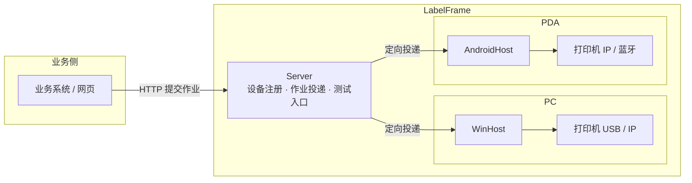

# LabelFrame 设计文档

## 1. 愿景与目标

愿景：**方便仓库完成标签打印，提高办公效率。**

目标（由愿景推导）：
- 操作工在业务动作中一键触发打印，就近出纸，零学习成本；
- 文员可在 PC 上批量打印，无需关心打印机细节；
- 管理员一次配置，多设备可复制，故障可解释；
- 业务系统通过简单契约接入，不依赖具体打印机型号。

## 2. 核心概念（术语表）

| 术语 | 含义 |
|---|---|
| 契约（LabelContract） | 一个标签场景的字段清单（Key / DisplayName / 必填 / 类型 / 格式），可版本化 |
| 版式（LabelLayout） | 标签布局：尺寸 + 元素（文本 / 条码 / 二维码 / 图片 / 线），引用契约版本，毫米坐标 |
| 标签文档（LabelDocument） | 版式 + 数据解析后的中间结果，与打印机指令无关 |
| 作业（Job） | 一次打印请求 = N 张标签，逐张状态，可挂起 / 恢复 / 取消，批内顺序 |
| 设备（Device） | 一台运行宿主的 PC 或 PDA，向 Server 注册 |
| 宿主（Host） | 设备上的本地打印服务（WinHost / AndroidHost） |
| 编码器（Encoder） | LabelDocument → 打印机指令（ZPL 优先，预留 TSPL / CPCL / 图片） |
| 传输（Transport） | 把指令送到打印机：TCP 9100 / Windows 驱动 / 蓝牙 / 日志模拟 |
| 模板包（TemplatePackage） | 契约 + 版式 + 静态图片资源的可导入导出单元（zip） |

## 3. 总体架构

### 3.1 两种打印模式

- **路由模式（主）**：业务系统提交作业（requestId + 目标设备 + labels[]）→ Server 校验并投递到目标设备宿主 → 宿主作业队列逐张打印 → 状态可查 / 可通知。
- **直连模式**：PDA 网页或本机程序直接调用本机宿主（本地 HTTP / JS 桥），不经 Server；适合就近单张，页面有数据时可脱离服务器。

### 3.2 一次请求 = 多张

调用方一次提交 N 张标签（每张可不同），异步返回 jobId，进度与失败项可查；出库拆分、批量、补打统一为同一模型。

## 4. 关键技术决策（决策记录）

| # | 决策 | 决定 | 后果 |
|---|---|---|---|
| 1 | 契约与版式分离 | 字段契约稳定、版式易变，两者分开版本化 | 改版式不碰契约；契约升级后可软校验旧版式（Drifted） |
| 2 | 中间文档模型 + 毫米坐标 | 版式用毫米，编码器按 DPI 换算 | 同模板可跨 203/300 dpi；便于预览与多指令集 |
| 3 | 编码器抽象 | `ILabelEncoder`，ZPL 优先 | 换打印机只增加编码器 |
| 4 | 中文渲染下沉编码器 | 中文文本栅格化为位图（^GF），条码始终原生指令 | 不依赖打印机固件；条码质量不妥协 |
| 5 | 异步作业模型 | 提交即返回 jobId；逐张状态持久化；幂等 requestId；挂起 / 恢复 / 取消；批内顺序 | 大批量不阻塞调用方；不重打不漏打 |
| 6 | 设备定向投递 | 作业目标 = 发起设备；Server 维护设备目录精准投递 | 多人并发互不干扰；替代广播方案 |
| 7 | 本地服务统一入口 | 所有打印经设备宿主；直连与路由并存 | PC / PDA 同构 |
| 8 | 预览是设计期能力 | 预览渲染不进打印主链路，模板设计 / 调试用 | 正式流程零预览开销 |
| 9 | 运行平台 | .NET 10（2026-08-09 起）；WinHost 目标 `net10.0-windows10.0.26100`（Zebra SDK 需要 Windows SDK 投影）；Win7/8 用 net48 版 WinHost（尽量兼容，有真实需求再做） | 官方 SDK 与最新 LTS 能力；兼容后置 |
| 10 | 模板管理先单机 | 单机 CRUD + 模板包导入导出；WMS 下发后置 | 「标准模板包」格式从第一天定，下发复用同一格式 |
| 11 | Server 自带测试入口 | 无业务系统也能提交打印、连接打印机验证 | 系统独立可测 |
| 12 | 迭代 1 编码器范围 | ZPL 编码器先覆盖文本 / Code128 / 图片占位；二维码 / 线元素进入模型但编码器显式报错（NotSupportedException），迭代 2 补全 ^BQ / ^GB | 迭代 1 验收聚焦 ^BC，避免范围膨胀 |
| 13 | 问题码约定 | 校验问题码统一 `LF_VAL_xxx`，消息中文可读 | 故障可解释，后续错误码沿用此约定 |
| 14 | 作业模型与 SQLite 持久化 | 一次请求 = 1 个 Job + N 个 Item（逐张）；SQLite 表 `jobs` / `job_items`，`request_id` 唯一索引实现幂等；Item 存编码后的 ZPL（不可变，避免重打） | 服务重启不丢作业；重放同一 requestId 不重复建单 |
| 15 | 本地 HTTP API（迭代 2 契约） | 提交请求自包含模板（contract + layout + labels[]），因为模板管理在迭代 4；端点：`POST /api/jobs`、`GET /api/jobs/{id}`、`POST /api/jobs/{id}/suspend|resume|cancel`、`GET /healthz` | 无模板库也能端到端打印；迭代 4 再支持模板引用 |
| 16 | 挂起 / 恢复语义 | 传输异常（如打印机离线）→ 当前 Item 记 Failed，若仍有未打 Item 则 Job 挂起；恢复后从未打印的 Pending Item 续打（不重打 Failed，失败项单独重打在迭代 6）；取消 → 剩余 Pending/Printing Item 置 Cancelled；服务重启把 in-flight（Printing）Job 置 Suspended，并把在途（Printing）Item 重置为 Pending，恢复后续打优先保证不漏打（不重打语义在真实设备联调时确认） | 符合底线「不重打、不漏打」；TCP 无法感知缺纸，以发送异常近似 |
| 17 | 中文渲染架构 | Core 定义 `LabelBitmap`（1bpp）+ ZPL `^GF` 编码；WinHost 用 GDI（System.Drawing，Windows 专属）把非 ASCII 文本元素栅格化为位图并替换为图片元素；ASCII 仍用原生 `^A` 文本 | 不依赖打印机固件中文字库；Android 迭代 5 用平台位图实现同契约 |
| 18 | 传输分层 | TCP 9100 在 Core（跨平台，Android 复用）；Windows 驱动（USB）用 winspool P/Invoke raw 打印，放在 WinHost | 每台打印机串行，一台设备一次只处理一个 Item |
| 19 | WinHost 配置 | `appsettings.json` 的 `WinHost` 节 + `LABELFRAME_*` 环境变量覆盖；默认监听 127.0.0.1:53911、Log 传输（联调）、数据库 %LOCALAPPDATA%\\LabelFrame\\jobs.db | 一次配置可复制；无真实打印机时日志模拟 |
| 20 | Zebra 官方 SDK | 传输新增 Zebra 模式（`Zebra.Printer.SDK 3.0.3355`，Link-OS）：TCP / USB（自动发现）/ Windows 驱动统一连接；避开 5.x 引入的 MAUI/WinUI 依赖；轻量 TCP9100 / winspool raw 保留作备选 | 官方 USB 直连与打印机状态（迭代 6）可用；Zebra 模式要求 Win10+ |

## 5. 风险与未决问题

- 中文位图渲染的字体嵌入与 ^GF 数据量控制（迭代 2 展开）。
- Android 前台服务在厂商 ROM 上的自启 / 保活差异（迭代 5 展开）。
- 蓝牙打印的配对与重连策略（P1）。
- 设备离线时作业语义：暂存还是拒绝（迭代 3 定）。
- net48 版 WinHost 的技术细节（HttpListener、netstandard2.0 约束），有需求再展开。
- 打印计数 / 库存联动：默认不做；如需，考虑事件接口（未决）。
- ZPL 文本转义策略：`^FD` 数据中的 `^` / `~` / `_` 用 `^FH` 十六进制转义；中文文本迭代 1 直通，迭代 2 位图化（^GF）后不再依赖内置字体（迭代 2 展开）。
- 契约字段格式（Pattern）校验：迭代 1 仅存元数据未执行，需排期（未决）。
- 内嵌中文字体文件：迭代 2 实现「优先加载内嵌/本地字体、回退系统字体（微软雅黑）」的机制；实际字体文件（开源中文 TTF，体积较大）待与用户确认后加入资源（未决）。
- `^GF` 数据量：中文一行按 1bpp 十六进制展开约每字 1KB+，迭代 2 先不做压缩；如需优化（^GF 二进制/压缩模式、字库缓存）再排期（未决）。
- TCP 9100 无法感知打印机缺纸/卡纸，迭代 2 以「发送异常 → 挂起」近似；真实缺纸语义待真实设备联调（迭代 2 验收时确认）。
- SQLitePCLRaw 2.1.6 存在已知漏洞公告（GHSA-2m69-gcr7-jv3q，SQLite 原生库）；离线环境暂固定该版本并在 Core.csproj 抑制 NU1903，联网后升级（如 2.1.10+）（未决）。
- Zebra 模式要求 Win10+（Windows SDK 10.0.26100 投影）；Win7/8 只能用 TCP9100 / winspool raw 传输（未决）。