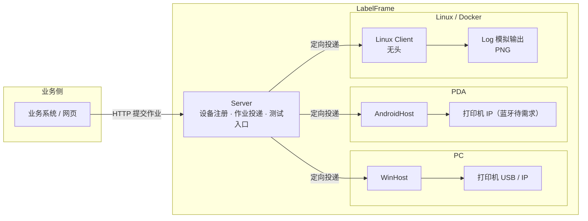

# LabelFrame 设计文档

## 1. 愿景与目标

愿景：**方便仓库完成标签打印，提高办公效率。**

目标（由愿景推导）：
- 操作工在业务动作中一键触发打印，就近出纸，零学习成本；
- 文员可在 PC 上批量打印，无需关心打印机细节；
- 管理员一次配置，多设备可复制，故障可解释；
- 业务系统通过简单契约接入，不依赖具体打印机型号。

## 2. 核心概念（术语表）

| 术语 | 含义 |
|---|---|
| 契约（LabelContract） | 一个标签场景的字段清单（Key / DisplayName / 必填 / 类型 / 格式），可版本化 |
| 版式（LabelLayout） | 标签布局：尺寸 + 元素（文本 / 条码 / 二维码 / 图片 / 线），引用契约版本，毫米坐标 |
| 标签文档（LabelDocument） | 版式 + 数据解析后的中间结果，与打印机指令无关 |
| 作业（Job） | 一次打印请求 = N 张标签，逐张状态，可挂起 / 恢复 / 取消，批内顺序 |
| 设备（Device） | 一台运行宿主的 PC 或 PDA，向 Server 注册 |
| 宿主（Host） | 设备上的打印执行服务（Windows Client / Linux Client / AndroidHost） |
| 编码器（Encoder） | LabelDocument → 打印机指令：图片模式整版位图 ZPL `^GF`（默认路径）；品牌原生指令经插件「文档编译」能力接口产出（§5.4，Zebra 首个落地待实施）；其他指令集（TSPL / CPCL）待需求 |
| 命令打印（原生指令） | 打印方式之一：插件把标签文档编译为品牌原生指令（文本 / 条码 / 二维码用打印机内置能力，非整版位图）出纸；默认图片打印不动，按连接显式切换（决策 #137） |
| 传输（Transport） | 把指令送到打印机：TCP 9100 / Windows 驱动 / Zebra SDK / 日志模拟（蓝牙待需求，可经插件接入） |
| 模板包（TemplatePackage） | 契约 + 版式 + 静态图片资源的可导入导出单元（zip） |

## 3. 总体架构



### 3.1 两种打印模式

- **路由模式（主）**：业务系统提交作业（requestId + 目标设备 + labels[]）→ Server 校验并投递到目标设备宿主 → 宿主作业队列逐张打印 → 状态可查 / 可通知。
- **直连模式**：PDA 网页或本机程序直接调用本机宿主（本地 HTTP / JS 桥），不经 Server；适合就近单张，页面有数据时可脱离服务器。

### 3.2 一次请求 = 多张

调用方一次提交 N 张标签（每张可不同），异步返回 jobId，进度与失败项可查；出库拆分、批量、补打统一为同一模型。

## 4. 关键技术决策（决策记录）

| # | 决策 | 决定 | 后果 |
|---|---|---|---|
| 1 | 契约与版式分离 | 字段契约稳定、版式易变，两者分开版本化 | 改版式不碰契约；契约升级后可软校验旧版式（Drifted） |
| 2 | 中间文档模型 + 毫米坐标 | 版式用毫米，编码器按 DPI 换算 | 同模板可跨 203/300 dpi；便于预览与多指令集 |
| 3 | 编码器抽象 | `ILabelEncoder`，ZPL 优先 | 换打印机只增加编码器 |
| 4 | 中文渲染下沉编码器 | 中文文本栅格化为位图（^GF），条码始终原生指令 | 不依赖打印机固件；条码质量不妥协 |
| 5 | 异步作业模型 | 提交即返回 jobId；逐张状态持久化；幂等 requestId；挂起 / 恢复 / 取消；批内顺序 | 大批量不阻塞调用方；不重打不漏打 |
| 6 | 设备定向投递 | 作业目标 = 发起设备；Server 维护设备目录精准投递 | 多人并发互不干扰；替代广播方案 |
| 7 | 本地服务统一入口 | 所有打印经设备宿主；直连与路由并存 | PC / PDA 同构 |
| 8 | 预览是设计期能力 | 预览渲染不进打印主链路，模板设计 / 调试用 | 正式流程零预览开销 |
| 9 | 运行平台 | .NET 10；Client Host 共用一套作业 / 路由 / 渲染代码，Windows 目标 `net10.0-windows10.0.26100`（Zebra SDK 需要 Windows SDK 投影），Linux 目标 `net10.0`；Win7/8 的 net48 版有真实需求再做 | Windows 保留完整打印能力，Linux 可作为无头容器客户端运行；兼容后置 |
| 10 | 模板管理先单机 | 单机 CRUD + 模板包导入导出；WMS 下发后置 | 「标准模板包」格式从第一天定，下发复用同一格式 |
| 11 | Server 自带测试入口 | 无业务系统也能提交打印、连接打印机验证 | 系统独立可测 |
| 12 | 迭代 1 编码器范围 | ZPL 编码器先覆盖文本 / Code128 / 图片占位；二维码 / 线元素进入模型但编码器显式报错（NotSupportedException），迭代 2 补全 ^BQ / ^GB | 迭代 1 验收聚焦 ^BC，避免范围膨胀 |
| 13 | 问题码约定 | 校验问题码统一 `LF_VAL_xxx`，消息中文可读 | 故障可解释，后续错误码沿用此约定 |
| 14 | 作业模型与 SQLite 持久化 | 一次请求 = 1 个 Job + N 个 Item（逐张）；SQLite 表 `jobs` / `job_items`，`request_id` 唯一索引实现幂等；Item 存编码后的 ZPL（不可变，避免重打） | 服务重启不丢作业；重放同一 requestId 不重复建单 |
| 15 | 本地 HTTP API（迭代 2 契约） | 提交请求自包含模板（contract + layout + labels[]），因为模板管理在迭代 4；端点：`POST /api/jobs`、`GET /api/jobs/{id}`、`POST /api/jobs/{id}/suspend / resume / cancel`、`GET /healthz` | 无模板库也能端到端打印；迭代 4 再支持模板引用 |
| 16 | 挂起 / 恢复语义 | 传输异常（如打印机离线）→ 当前 Item 记 Failed，若仍有未打 Item 则 Job 挂起；恢复后从未打印的 Pending Item 续打（不重打 Failed，失败项单独重打在迭代 6）；取消 → 剩余 Pending/Printing Item 置 Cancelled；服务重启把 in-flight（Printing）Job 置 Suspended，并把在途（Printing）Item 重置为 Pending，恢复后续打优先保证不漏打（不重打语义在真实设备联调时确认） | 符合底线「不重打、不漏打」；TCP 无法感知缺纸，以发送异常近似 |
| 17 | 中文渲染架构 | Core 定义 `LabelBitmap`（1bpp）+ ZPL `^GF` 编码；PC / Linux Client 用 Skia 把整张标签统一渲染为位图，Android 使用平台位图实现同一编码契约 | 不依赖打印机固件中文字库；各宿主打印主链路同构 |
| 18 | 传输分层 | TCP 9100 在 Core（跨平台，Android 复用）；Windows 驱动（USB）用 winspool P/Invoke raw 打印，放在 WinHost | 每台打印机串行，一台设备一次只处理一个 Item |
| 19 | WinHost 配置 | `appsettings.json` 的 `WinHost` 节 + `LABELFRAME_*` 环境变量覆盖；默认监听 127.0.0.1:53960、Log 传输（联调）、数据库 %LOCALAPPDATA%\\LabelFrame\\jobs.db | 一次配置可复制；无真实打印机时日志模拟 |
| 20 | Zebra 官方 SDK | 传输新增 Zebra 模式（`Zebra.Printer.SDK 3.0.3355`，Link-OS）：TCP / USB（自动发现）/ Windows 驱动统一连接；避开 5.x 引入的 MAUI/WinUI 依赖；轻量 TCP9100 / winspool raw 保留作备选 | 官方 USB 直连与打印机状态（迭代 6）可用；Zebra 模式要求 Win10+ |
| 21 | Server 投递采用「宿主轮询」 | WinHost 注册后周期轮询 Server 领取定向作业，完成后回报结果；不要求宿主开放入站端口 | PC / PDA 同构，天然穿透防火墙；设备在线以心跳（轮询）为准 |
| 22 | 设备离线语义 | 作业投递给离线设备时在 Server 暂存（Pending），设备上线轮询即领取；不设过期 | 符合「不丢作业」底线；后续可按需加过期/通知 |
| 23 | 模板包格式 | zip：`manifest.json`（name / group / contract / layout）+ `images/` 图片资源；模板库 SQLite（Core.Templates，按分组列表） | 两台电脑间可导入导出；WMS 下发复用同一格式 |
| 24 | 预览渲染 | `LabelDocument` → PNG（设计期）与打印位图统一使用 Skia / ZXing；图片来自模板资源；毫米 → 像素按 DPI | 预览与打印共用渲染器，避免平台渲染漂移 |
| 25 | 失败项单独重打 | Failed Item → Pending（清错误），Failed 作业自动恢复 Pending 由 Worker 续打 | 补打不重建整单；不重打已完成项 |
| 26 | 在线状态 / 测试页 | `GET /api/printer/status` + `POST /api/printer/test`；TCP 用 `~HS` 基础解析（字段映射待真实设备联调），Zebra SDK 3.x PrinterStatus 无公开字段先按「连接成功 = 在线」，驱动模式不可读回 | 故障可解释；真实设备联调确认字段语义 |
| 27 | Android 本地 HTTP | AndroidHost 用 TcpListener 极简 HTTP（仅 127.0.0.1:53970），不承载完整 ASP.NET Core | 包体小、依赖少；JS 桥同端口预留 |
| 28 | Android 中文渲染与存储 | Android.Graphics Bitmap → LabelBitmap（^GF，与 WinHost 同契约）；SQLite 用 lib.e_sqlite3.android | 跨宿主中文输出一致 |
| 29 | Studio 模板工具架构 | `LabelFrame.Studio`（WPF，net10.0-windows）作为 WinHost 的 HTTP 客户端：模板管理 / 导入导出 / 预览 / 测试打印全部复用 WinHost API；V1 不做版式可视化编辑（V2 再加画布） | 零重复逻辑，测试打印走生产同一条打印链路；V2 拖拽画布不改变模板包契约 |
| 30 | Studio V2 版式编排 | 画布用 WPF 原生元素（Canvas + TextBlock/Border/Line），mm → px 按缩放换算；条码 / 二维码在画布上为带 SourceKey 的占位框，真实效果由「刷新预览」（WinHost preview PNG）确认 | 拖拽流畅、无需本地条码渲染；编排所见即模板结构 |
| 31 | 后续规划（迭代 9/10） | Excel 导入：列 → 契约字段映射，批量生成标签数据；MSI 安装包（WiX）：安装 WinHost + Studio、生成 appsettings.json（端口 / 传输 / 打印机 / 数据库）、开始菜单快捷方式 | 交付形态完整；业务侧只传文本，模板决定条码 / 二维码 |
| 32 | Excel 读取选型（预研） | 迭代 9 采用第三方 `TemplateFrame.Excel.Simple 1.0.4`：`SimpleExcel.Read(Stream, tableName)` 读取 xlsx → 表头 + 数据行，再按列映射契约字段；底层 `DocumentFormat.OpenXml 3.3.0`；仅作依赖引用，仓库命名仍为 `LabelFrame.*` | 省去自研 xlsx 解析；列映射与批量提交逻辑由我们实现 |
| 33 | 元素样式与区域（格子）布局 | 文本元素可选 `WidthMm`（块宽）/ `TextAlign`（Left/Center/Right）/ `PaddingMm` / `BorderMm`；矩形元素可选 `BorderMm`；新增区域元素 `LabelRegionElement`（X/Y/W/H/BorderMm）；任何元素可选 `RegionId` + `RegionHAlign/RegionVAlign`（Start/Center/End）锚定到区域 | 支持「先画格子再放元素居中」的编排模式；格子保存、移动元素跟随；旧模板无新属性行为不变（向后兼容） |
| 34 | Studio 2.0 界面（迭代 8C） | 两个工作区：作业工作台（模板列表 / 预览 / 数据表单 / 打印 / 状态日志栏）+ 独立模板设计器（控件栏 / 画布 / 属性分组 / 填充 / 区域 / 实时预览 / 打印测试）；不常用功能收进菜单栏 | 文员日常打印与设计分离；画布所见即所得即实时预览 |
| 35 | 元素内容来源（填充） | 文本 / 条码 / 二维码支持两种来源：`Literal` 固定值（如标题）或 `SourceKey` 字段填充；编码与预览取值 = Literal ?? data[SourceKey] | 固定文本无需建字段；旧模板无 Literal 行为不变 |
| 36 | 容器控件（替代“画区域”） | 设计器控件栏提供「容器」（内部仍是 `LabelRegionElement`，模板包格式不变）；元素拖入容器自动锚定居中；属性面板不再暴露 RegionId / 对齐锚定 UI（后台能力保留） | 用户无需理解区域概念；画格子 → 放元素居中的编排方式不变 |
| 37 | 契约字段自动推导 | 字段集合 = 版式中「字段填充」元素的 `SourceKey` 去重（按元素顺序）；移除字段增删 / 重命名 / 显示名编辑 UI；显示名统一取 Key；加载旧模板保留契约字段顺序与元数据（IsRequired / Type），未被元素引用的字段不再保留 | 字段建立是后台逻辑，用户只负责绑定控件；工作台 / 测试表单用 Key 作标签 |
| 38 | 设计器 2.0 交互与布局（迭代 8D） | 设计 / 测试用 Tab 分开；左键选中、8 手柄拖角缩放、框选多选、Delete 删除、中键平移、Ctrl+滚轮缩放（以鼠标为中心）、标尺 + 网格、边缘 / 中心对齐吸附与右键对齐菜单；属性面板选中控件才显示（默认收起）；底部状态 + 日志栏横跨全窗口（自动滚底 + 清空）；控件栏拖拽不再重复建元素；元素属性变化实时驱动画布重绘与预览 | 用户编辑手感接近主流设计器；设计界面与打印测试界面职责分离 |
| 39 | UI 技术选型评估（2026-08-09，用户已选 A 方案） | 后端（Core / Rendering / WinHost / Server / AndroidHost）保持 .NET 10 不动；Studio UI 层评估 Web 技术栈（Tauri 2 / Blazor Hybrid / 纯浏览器），先用本地 Web 原型验证拖拽设计器体验，再决定是否重写 UI；原型直接调 WinHost API，复用全部后端能力 | UI 是纯客户端，可独立替换；原型成本低、结论直观；无论换栈与否，Excel 读取 / 批量打印等业务逻辑做成可复用服务 |
| 40 | 单机服务与前端工程化（2026-08-09，用户确认） | 单机模式 = 演进 WinHost 为单进程服务（模板库 / 作业 / 打印传输 / 静态托管 Web UI / Excel 导入 / PDA 日志）；前端另起 `web/`（Vite + React + TS + Konva），prototypes 原型冻结不改；后端 C#，前端 JS/TS；Excel 解析在后端复用 TemplateFrame.Excel.Simple | 一台 PC = 一个进程 + 浏览器；前后端并行开发，前端按 FRONTEND-SPEC.md 交付，主 agent 联调 |
| 41 | 模板测试数据 testData（契约扩展） | 模板包与模板 API 增加可选 `testData`（键 → 值字典，向后兼容）；PDA 打印测试与 PC 打印测试共用；manifest / SQLite 模板表同步扩展 | 服务端定义测试数据，PDA 点击模板即可本地测试打印 |
| 42 | PDA 测试模式（迭代 11） | AndroidHost 配置 pc_host（PC 单机服务地址）→ 本地 HTTP 增加 `GET /api/pc/templates` 与 `POST /api/pc/templates/{name}/print-test`（拉模板详情 → 服务端 testData 本地打印 → 终态日志回传 PC）；内置 PDA 测试页（浏览器打开 127.0.0.1:53970） | PDA 开箱即用测试打印；日志回传 PC 便于远程调试；Manifest 允许明文 HTTP（内网） |
| 43 | MSI 安装包方案（迭代 10，2026-08-09；2026-08-10 修复） | WiX v7 打包：WinHost 发布产物（win-x64 **framework-dependent**，含 web/dist）+ 桌面 / 开始菜单快捷方式（Target=#WinHostExe）；WinHost 为 WinExe + 自动开浏览器 + host.log + 本机优雅关闭 + **系统托盘（原生 P/Invoke，无 WinForms）**；名称统一 LabelFrame；L 型图标；自签名证书脚本；目标机需 .NET 10 Desktop Runtime（MSI 约 10MB）。2026-08-10 修复：MSI 以 `-arch x64` 构建为 **x64 包**（此前是 32 位包，`ProgramFiles64Folder` 不生效，错装到 `Program Files (x86)`）；版本升至 0.11.1 以支持覆盖已装的 0.11.0 | 干净电脑装 .NET 10 Runtime 后：安装 MSI（`C:\Program Files\LabelFrame`）→ 双击图标 → 浏览器打开即用；正式签名需商业证书 |
| 44 | MSI 运行时缺失处理（2026-08-10，用户决策；2026-08-10 修复检测） | MSI 检测 .NET Desktop Runtime（x64）：缺失时全 UI 安装显示带可点击官方下载链接的对话框（MSI Hyperlink 控件），静默 / 基础 UI 由 LaunchCondition 拦截并提示链接；**放弃 Burn 引导自动下载安装**运行时（曾尝试 WiX v7 Bal 构建 Bundle，扩展加载与依赖链复杂、收益低，用户确认不做）。检测实现改为 WiX NetFx 扩展 `DotNetCompatibilityCheck`（内置官方 NetCoreCheck 自检，检查 Microsoft.WindowsDesktop.App ≥ 10.0.0、RollForward=latestMajor、x64）：不再读取注册表（原方案读 `InstalledVersions\...\sharedfx` 默认值，而运行时版本是**命名值**，且 MSI 为 32 位视图，导致装了运行时仍误报缺失）；NetCoreCheck 实时检测，**装完运行时无需重启**即可识别 | 干净电脑需先装 .NET 10 Desktop Runtime 再装 MSI；MSI 保持约 10MB、不联网自动安装 |
| 45 | 模板预览值 + 测试默认值 + 图片打印（迭代 12，2026-08-10，后端已实施（SkiaSharp 渲染器），前端 renderLabelImage 待实施） | 元素 JSON 新增 `previewValue`（text/barcode/qrcode 字段填充模式写入，固定值仍用 literal）；保存模板时后端自动用元素预览值派生并覆盖 `testData`，作为 PC / PDA 打印测试的初始默认值（单一事实来源=元素预览值）；新增 `PrintMode`（Vector 默认 / Image）：Image 模式用 **SkiaSharp 渲染器**（canvas 类 2D，与前端同源）把整张标签渲染为 1bpp 位图经 `^GF` 直传打印机，用于评估定位与效果；`SubmitJobRequest` 增加可选 `template.name`（取模板图片资源）与 `printMode`（请求覆盖配置） | 先实验评估图片打印效果，再决定是否替代矢量 ZPL；预览值丢失 bug 由前后端契约修复 |
| 46 | 文本垂直对齐契约（迭代 12，2026-08-10） | 文本元素新增 `heightMm`（0=按字高）与 `verticalAlign`（Top/Middle/Bottom，默认 Top 兼容旧模板）；前端保存时写入元素高度与垂直对齐；Skia / GDI 渲染器按框高垂直对齐绘制，边框按框高；修复「打印比前端预览整体偏上」（此前前端框内居中、后端顶部对齐且高度未持久化） | 旧模板需在编辑器重新保存一次才带 heightMm/verticalAlign；矢量 ZPL 打印暂不区分垂直对齐 |
| 47 | 元素契约第二批字段 + 垂直对齐默认值统一（迭代 13，2026-08-10，后端已实施；前后端已完成，用户验收待执行） | 文本 `wrap / lineHeight / fitMode / fontFamily`（默认 Microsoft YaHei）、二维码 `qrEcc / qrMargin`（默认 M / 2）、条码 `displayValue`（默认 true）、通用双边内边距 `paddingH / paddingV`（`PaddingHMm / PaddingVMm`，0=未设，缺失时回退 `paddingMm`）写入版式契约；写方向非默认才写、读回默认（向后兼容，无数据库迁移）。决策 A：`VerticalAlign` 默认由 Top 改为 **Middle**（与前端一致），旧模板无 `heightMm` 时渲染器框高兜底 = `max(字高 + 2×最大内边距, 10mm)`。Skia 图片打印按这些字段真实绘制（换行 / 行距 / 溢出处理 / 字体 / QR 参数 / 条码文字 / 双边内边距）；新字段**不参与** ZPL 矢量编码 | 导入 → 保存 → 重开逐字段一致；图片打印与前端预览同源；旧模板行为 = 前端现状 |
| 48 | MSI 升级保留用户配置 appsettings.json（0.12.2，2026-08-10） | appsettings.json 从自动文件清单中剔除，改为 main.wxs 中 GUID 固定的独立组件，标记 `NeverOverwrite="yes"`（升级 / 修复不覆盖）+ `Permanent="yes"`（卸载不删除）；新装仍写入 packaging 默认配置 | 覆盖安装 / 修复不丢用户配置；卸载保留该文件（属用户数据）；后续新增默认配置项需用户手动合并或应用层兜底默认值 |
| 49 | 字体加粗契约与打印方案（迭代 14，2026-08-10，后端已实施） | 文本元素 JSON 新增 `bold?: boolean`（true 才写 / 默认 false，旧模板兼容）。ZPL 无标准加粗修饰符：方案 A（默认，可配置）粗体字体变体映射（`"0"→"1"`，`ZplEncoder` 可注入映射表，WinHost `LABELFRAME_BOLD_MODE=FontVariant`）；方案 B `WidthScale` 宽度 ×1.15 放大兜底。Skia 用 `SKFont.Embolden` 渲染且测量一致（与前端 Konva `fontStyle:bold` 同源） | 小字号打印可试加粗对比；方案 A 依赖打印机内置粗体字体编号，不同机型可能需调整映射表；矢量 ZPL 加粗为近似，Image 模式最保真 |
| 50 | 图片打印收敛 + 连接管理 + 调试出图（迭代 15，2026-08-10，后端已实施，前后端已完成，用户验收待执行） | 彻底删除矢量 ZPL（`ZplEncoder.Encode` / PrintMode / GdiTextRasterizer 等），打印统一 Skia / Android 整版位图经 `^GF`（`ZplImageEncoder`）；连接管理 `ITransportManager` + `GET/POST /api/transport`（单一连接、先测试后生效、失败回滚、持久化 `%LOCALAPPDATA%\LabelFrame\connection.json`）；调试 = 后端渲染出图下载（单张 `render-image` PNG / 批量 `render-images` zip），不建作业不改作业模型；Log 模拟打印保存 PNG | 打印所见即所得（前后端同源渲染）；连接切换免改文件重启；调试零纸张验证；ZPL 仅保留 ^GF 物理载体 |
| 51 | 迭代 15 前端：DataPrint 会话保留 + 连接管理 UI + 调试独立（2026-08-10，前端已实施） | ① 会话草稿提升 AppContext（`printDraft`：selectedName / valuesByTemplate+dirtyKeysByTemplate / debugMode / jobId），sessionStorage 持久化（刷新保留、标签页天然隔离，**禁 localStorage**）；values 加载 = testData 与用户 dirty 的 key 按 **key 存在性**合并（清空不被顶回）；Excel 数据与列映射不保留。② 连接状态全局化：`transportConfig`（GET /api/transport），切换成功立即用响应 config 更新（healthz 轮询仅兜底重启）；设置页「连接方式」分组（模式单选 / 只显当前模式参数 / testOnly 测试 / 先测试后生效失败回滚）+ DataPrint 顶部徽标与快速切换。③ 调试独立开关（默认关）：开 → 打印按钮改后端渲染出图下载（render-image 单张 PNG / render-images 批量 zip，不建作业不发驱动）、隐藏「出图预览」；关 → 正常作业 +「出图预览」即时预览 | 同标签页切视图不丢设置、标签页间不互通；调试所见 = 打印所出；旧版后端无 /api/transport 时优雅降级（徽标回退 healthz mode） |
| 52 | 服务端 / 客户端拆分（2026-08-11，用户拍板 6 项，待实施） | 拆为双安装包：Server（模板 / 作业 / 设备投递 / Web UI / 调试出图 / 日志，无打印机依赖，Windows 服务）与 Client（本机打印执行 / 作业领取 / 连接配置，托盘部署）；作业提交改 `templateName + labels`、pending 响应附带模板；调试出图在 Server（Skia 同源）、最终打印以 Client 渲染为准；保留单机模式（Server + Client 同机） | 多台打印 PC 共用一个服务端、职责清晰、部署解耦；跨端契约变更按 docs/archive/ARCHITECTURE-SPLIT.md 实施 |
| 53 | UI 归属反转（迭代 18，2026-08-11） | 修订拆分决策 1：服务端默认不提供界面（不再打包 / 托管 web/dist，仅留 /healthz 与 API）；客户端（WinHost 127.0.0.1:53960）托管完整 Web UI（模板设计 / 数据与打印 / 日志 / 设置 / 作业历史）；模板 / 作业 / 设备投递 / 调试出图仍以服务端为中心 | 用户体验回到单机形态，同时保留集中部署；跨端契约增量按 docs/archive/ITERATION-18-SPEC.md 实施 |
| 54 | 服务端 Windows 服务部署（迭代 18） | Server 以 Windows 服务 `LabelFrameServer`（LocalSystem）运行（`UseWindowsService`，控制台模式保留供开发）；安装完成弹窗含「开机自启（默认勾选）/ 立即运行（默认勾选）」，按勾选 `sc config start= auto` / `net start`；升级不触发；卸载停止并删除服务 | 部署即服务、无人值守；0.14 及以前是控制台进程，安装形态变化 |
| 55 | 服务端数据目录改 ProgramData（迭代 18） | Server 的 server.db / templates.db / logs.db 默认 `%ProgramData%\LabelFrame\server`（服务账户 LOCALAPPDATA 指向系统账户目录不可靠）；环境变量覆盖保留 | 数据机器级、可预期；卸载清理路径同步更新；当前无存量数据需迁移 |
| 56 | 历史数据定期清理（迭代 18） | Server 后台任务按 `CleanupIntervalHours`（默认 24h）删除终态（Completed / Failed）且超过 `JobRetentionDays`（默认 30 天）的作业、超过 `LogRetentionDays`（默认 90 天）的日志；非终态作业不删 | 避免历史作业 / 日志无限积累；保留期可配置 |
| 57 | 客户端机器级 ServerUrl（迭代 18） | WinHost 新增 `GET/POST /api/host/config`（返回 serverUrl + deviceId/deviceName），持久化 `%ProgramData%\LabelFrame\Client\settings.json`；前端读写机器级配置（localStorage 仅兜底，缺失 / 损坏返回默认值） | 同机任何浏览器 / 用户配置一致；符合客户端本机配置原则 |
| 58 | 客户端安装完成弹窗（迭代 18） | Client MSI 完成后弹窗含「立即打开（默认勾选）」，确认启动客户端并打开界面；升级不触发 | 装完即可使用，无需手动找入口 |
| 59 | 服务端跨平台部署（迭代 19，2026-08-11） | Rendering / Server 多目标 `net10.0;net10.0-windows`：Windows 专属代码（GDI 预览、UseWindowsService、图标、WindowsServices 包）条件编译；Server 数据目录按平台默认（Windows %ProgramData%\LabelFrame\server / Linux /var/lib/labelframe/server），环境变量优先；Linux 用 systemd（Type=simple），Windows 用 Windows 服务；Client 仍仅 Windows | Ubuntu 可部署服务端，跨机验证（服务端 Linux + 客户端 Windows）；API / 契约不变 |
| 60 | 安装包先停运行程序 + 作业完成回报独立循环（迭代 19 反馈，2026-08-11） | ① Server MSI 安装 / 卸载先 `sc stop LabelFrameServer`（StopServerService，Return=ignore），停机超时缩短为 5s；Client MSI 用 `KillWinHost`（`taskkill /F /IM LabelFrame.WinHost.exe`，序列最前）强制结束 `LabelFrame.WinHost.exe`。② `ServerRoutingWorker` 回报改为独立 1s 循环，本地作业终态后立即回报，不再等 20s 长轮询 | 覆盖更新 / 卸载不再残留运行态；「已领取 → 已完成」延迟消除；进度仍为终态跳变（逐张进度回报待后续按需扩展） |
| 61 | 设备 IP 记录与按 IP 查找（迭代 20，2026-08-11） | `devices` 表新增 `last_ip`（注册 / 心跳时记录服务端所见的来源 IP，每次刷新）；`DeviceView.lastIp`；新增 `GET /api/devices/by-ip/{ip}`；`POST /api/jobs` 支持可选 `targetIp`；WinHost `/api/host/config` 返回本机 `ips`（状态栏展示） | 业务系统可按 IP 定位设备再触发打印；IP 是便捷查找不是身份，deviceId 仍是唯一稳定键（DHCP / NAT 会变化） |
| 62 | 服务端管理界面插件形态（迭代 20，2026-08-11） | 静态前端包目录 `plugins/web-ui`（`Server.WebUiPath`，环境变量可覆盖）作为插件：中间件运行时检测目录存在即托管（放入即生效、无需重启），移除即恢复无头；默认服务端仍无头（不推翻 #53）；不含打印机相关内容；新增 `GET /api/server/info` | 按需“安装”界面、部署简单；不做 .NET 程序集插件（避免过度设计）；无鉴权（局域网） |
| 63 | 前端双构建模式（迭代 20，2026-08-11） | 同一前端工程 `VITE_UI_MODE=client 或 server`：`web/dist`（Client 包）与 `web/dist-server`（服务端 UI 插件）两产物；Server UI 菜单 = 工作台 / 设计器 / 数据与打印 / 在线设备 / 作业历史 / 设备日志，移除设置与打印机相关内容；数据与打印的目标设备改为在线设备选择器（仅在线可选） | 单一代码库双产物、避免双份维护；Server UI 无打印机概念（服务端无驱动） |- Web 设计器原型 v2 已实现（`prototypes/web-designer/`）：视口自适应 + 内容缩放、条码 / 二维码实时渲染（JsBarcode / qrcode-generator）、智能参考线吸附、文本溢出三模式、边框修正、控件精简为文本 / 条码 / 二维码。

| 64 | 发布渠道与自动化发布（迭代 21，2026-08-12） | 镜像发布到 ghcr.io（组织 `marci-labs`），安装包走 GitHub Release；推送 `v*` tag 触发 GitHub Actions 自动完成测试 / 打包 / 推镜像 / 建 Release；版本号唯一来源 = tag；Release 不含 docker 离线包（镜像在 ghcr 拉取，离线包保留本地脚本按需导出） | 无需单独申请镜像仓库、无拉取限流；发版动作收敛为打 tag；ghcr 新包首次需手动设为 Public |
| 65 | MSI 签名过渡（迭代 21，2026-08-12） | 先用自签证书 + GitHub Secret（`MSI_SIGN_CERT_BASE64` / `MSI_SIGN_PASSWORD`）走通签名链路：Secret 存在即签名、不存在则跳过；脚本不再含明文默认密码；正式对外分发再购 OV 证书 | 公开下载仍可能 SmartScreen 提示未知发布者；内网 / 域环境可推受信任根消除警告 |
| 66 | CI 测试环境确定性（迭代 21，2026-08-12） | 测试进程用 `[ModuleInitializer]` 一次性初始化 SQLitePCLRaw；SQLite 存储类自行 `EnsureInitialized()`（幂等）；测试避免依赖本机时区 / 字体 / 端口时序（设备列表日期断言改为任意 MM-dd、Skia 阈值取「有墨迹」级别、TCP 状态测试加就绪同步） | CI（UTC / 不同字体 / 高负载并行）下稳定通过；生产代码不再依赖宿主先初始化 SQLite provider |
| 67 | 传输插件统一接口与参数模型（迭代 22，2026-08-17） | `ITransportPlugin`（Id / DisplayName / Description / Parameters / Create）→ 返回 `IPrintTransport`（发送，接口不变）+ 可选 `IPrinterStatusProvider`（状态）+ 可选 `ITestableTransport`（连接测试）；参数模型 = `TransportParameterSpec`（Key / 中文标签 / 类型 String/Int/Bool/Select / 必填 / 默认 / 枚举 / 提示）+ `TransportPluginParameters`（弱类型字典强类型取值）+ `ITransportPluginContext`（宿主日志 + 数据目录）；注册表 `ITransportPluginRegistry` 按需装配 | 第三方厂商可自研插件接入（TSPL / CPCL、蓝牙、云打印）；内置四模式（log / tcp9100 / winspool / zebra）走同一接口，机制统一 |
| 68 | 传输插件加载 / 卸载 / 使用（迭代 22，2026-08-17） | 加载 = 启动扫描插件目录（默认 `%ProgramData%\LabelFrame\Client\plugins`，`LABELFRAME_PLUGINS` 可覆盖）`*.dll`，collectible AssemblyLoadContext 反射发现 `ITransportPlugin`，单个失败只记日志不影响宿主；使用 = 配置 `pluginId + params` 即启用（TransportManager 从注册表创建 / 校验 / 测试 / 持久化，作业 Worker / 状态 / 测试页链路零改动）；卸载 = 删除插件文件 + 重启生效 | 插件机制完整可测，迭代 23 接精成打印机；运行时热卸载（ALC unload）因依赖固定与线程安全问题本轮不做（记未决） |
| 69 | connection.json 兼容演进（迭代 22，2026-08-17） | 新格式 `{ "pluginId": "tcp9100", "params": { "host": "...", "port": "9100" } }`；旧 `{ Mode, TcpHost, ... }` 读取时自动映射（Log→log、Tcp→tcp9100、WindowsDriver→winspool、Zebra→zebra；TcpHost→host、TcpPort→port、PrinterName→printerName、ZebraKind→kind、ZebraUsbName→usbName）；`LABELFRAME_TRANSPORT` 环境变量同样映射 | 老配置零迁移；API 响应保留旧字段兼容旧前端 |
| 70 | 打印测试体验与权限边界（迭代 22，2026-08-17） | 「下载 Excel 模板」= `POST /api/import/excel-template`（Server 与 WinHost 都实现，生成逻辑放 Core `LabelFrame.Core.Excel`，复用 `TemplateFrame.Excel.Simple` 的 `SimpleExcel.Write`，决策 4A）；客户端仅本机打印测试（在线走服务端路由、未注册 / 离线降级本机直连并提示，决策 1A）；客户端状态栏 / DataPrint 显示本机设备名；作业历史 `GET /api/jobs?deviceId=` 过滤（客户端只看自己、服务端看全部） | 边界明确（客户端不能给其他客户端发打印测试）；测试上手更容易；作业历史按设备可见 |
| 71 | 客户端下载分发（迭代 22，2026-08-17） | 服务端 `client-packages` 目录（`LABELFRAME_SERVER_CLIENT_PACKAGES` 可覆盖）+ GET（列表）/ POST（上传）/ GET（下载）/ DELETE API（文件名路径穿越防护）；目录直放文件与页面上传都支持（决策 3A）；Server UI 新增「客户端下载」页；客户端设置「更新与安装包」默认从服务端获取；Ubuntu / Docker compose 挂载 `./client-packages:/var/lib/labelframe/server/client-packages` | 安装包集中分发、管理员可维护；客户端更新默认走服务端（不依赖外部渠道）；无鉴权（沿用局域网模型，风险记录） |
| 72 | 插件包分发闭环（迭代 23，2026-08-17） | 插件包 = zip（根 `manifest.json`：pluginId/name/version 必填 + 可选 description/author/minHostVersion）+ 插件 DLL，后缀 `.lfplugin`；服务端独立 `plugin-packages` 目录 + `/api/plugin-packages`（列表含元数据与 valid/invalid 状态、上传即校验、路径穿越防护，`LABELFRAME_SERVER_PLUGIN_PACKAGES` 可覆盖，Docker 挂载 `./plugin-packages`）；客户端安装到 `plugins/<pluginId>/` 每插件一目录（决策 3A），设置页「插件管理」卡片安装 / 卸载，与「更新与安装包」UI 并列（决策 7A）；三层校验（zip 完整性 + manifest 必填 + 临时 ALC 预检核对插件 id，内置插件 id 拒绝，决策 5A/6A）；覆盖安装允许、不做版本比较（决策 4A）；包大小上限 64MB；不做签名（局域网无鉴权模型，风险记录） | 厂商插件包可经服务端集中分发、客户端界面安装 / 卸载（重启生效），形成完整闭环；后续厂商打印机插件（如精成）可直接用该通道分发 |
| 73 | 外部插件字节加载（迭代 23，2026-08-17） | `PluginDirectoryLoader` 由 `LoadFromAssemblyPath` 改为 `LoadFromStream` 字节加载（依赖解析回退默认上下文 / 包内伴生 DLL 字节加载）——Windows 下不锁插件 DLL 文件：「卸载 = 删除插件文件 + 重启生效」与覆盖安装真正可用（LoadFromAssemblyPath 会锁文件，已加载插件无法删除）；运行中进程继续使用内存镜像，重启后按新文件装配 | 卸载 / 覆盖安装不再被文件锁卡死（联调冒烟实证）；副作用：插件 `Assembly.Location` 为空（字节加载），插件自定位资源需改用上下文数据目录（`ITransportPluginContext.DataDirectory`），文档注明 |
| 74 | 客户端批次作业（Batch Print，迭代 24，2026-08-18） | WinHost 新增批次节流：PrintSettings（默认 关 / batchSize 10 / batchIntervalMs 500；读取 Normalize 缺失 / 损坏 / 越界回默认值；保存校验 batchSize≥1、batchIntervalMs≥0）+ PrintSettingsStore（%LOCALAPPDATA%\LabelFrame\print-settings.json，原子写）+ GET/POST /api/host/print-settings（仅回环可写、保存即生效、单例 lock 跨线程可见）；JobPrintWorker「发送前暂停（claim-then-delay）」——领取下一张后、SendAsync 前按 BatchPrintPolicy.ShouldPauseBeforeSend（enabled && 已发送数满批次倍数）wait Task.Delay(batchIntervalMs)，计数内存态、跨作业全局累计、不持久化；本机 + 服务端作业统一生效，测试页直发不计入；WinHost 引入 Serilog 文件日志（Serilog.AspNetCore → %LOCALAPPDATA%\LabelFrame\logs\app-20260818.log，RollingInterval.Day）供批间间隔冒烟验证，host.log 通道不动 | 大批量控制打印节奏 / 减轻打印机压力；不拆作业、队列 / 幂等 / 挂起恢复 / 重打语义零改动；服务端进度仍为终态一次（增量进度回报未决 Q2，届时再讨论契约） |
| 75 | API 契约与端点共享库（迭代 27，2026-08-25） | 新增 `LabelFrame.Api`：Server / WinHost 重复的 DTO（SubmitJobRequest / TemplateDto / LabelDto / TemplatePackageDto / PreviewRequest / PushLogRequest / ExcelTemplate* / ErrorView）与模板 / 调试出图 / Excel / 日志端点收敛为共享实现（端点经 Options 传入各自错误码前缀，两宿主对外错误码不变）；xlsx 文本解析下沉 Core（ExcelTableReader），两宿主移除 TemplateFrame.Excel.Simple 直接引用 | 一处修复两端生效（AndroidHost 后续可复用）；共享后行为统一——WinHost 预览 DPI 取宿主配置并统一 Skia 同源渲染、数据缺省回退 testData；模板不存在错误码新增 LF_TPL_001（WinHost 原误用 LF_JOB_001，Server 保持 LF_SRV_006）；ErrorView 统一 Code / Message / FieldKey（Server 原两字段，向后兼容）；render-image(s) 图片解析 = base64 附带优先、按名回退模板库 |
| 76 | 日常 CI（迭代 27，2026-08-25） | 新增 `.github/workflows/ci.yml`：push master / PR 触发，dotnet restore / build / test + 前端 lint / 双模式测试 / 双模式构建（命令与 release.yml test job 一致）；同分支新推送取消旧运行；不改动发布流水线 | 主干回归在提交时即被发现（此前唯一工作流仅 v* tag 触发，是评审发现的最大质量关卡缺口）；AGENTS「非 CI 迭代不修改 CI 工作流」约束下，本项经用户批准的 P0 治理清单执行 |
| 77 | 数据层并发模型（迭代 28，2026-08-25） | 服务端领取 = 单条 `UPDATE ... RETURNING`（原子圈定 + 置 Claimed）；ServerService 信号量收窄到仅提交路径（requestId 幂等「查询-再插入」，DB request_id UNIQUE 兜底跨进程）；注册（单条 UPSERT）/ 领取 / 回报不再进程内串行化；WinHost 打印 Worker 空转改为 `HasPendingItemsAsync`（EXISTS）轻量探测后再走完整领取；TransportManager 配置 / 实例读写加锁、ApplyAsync 串行化 | 多设备并发操作不再全局排队；领取在多实例 / 并发下不重复（原 SELECT-后-UPDATE 无事务）；空闲时不再每 200ms 全量加载作业（含 ZPL） |
| 78 | 全局异常处理与错误契约（迭代 28，2026-08-25） | 两宿主接入共享 `GlobalExceptionHandler`：未捕获异常统一 500 + ErrorView（LF_INTERNAL_001 + 中文提示），不透出堆栈 / 内部路径；上传端点「catch(Exception)→400 且透出 ex.Message」改为确定性错误 400、意外故障 500；render 端点 base64 非法 400 + 中文原因（原裸 500 空响应体） | 状态码语义不失真（服务端故障不再误报 4xx）、不泄露内部信息；前端收到的错误形状统一（code / message / fieldKey） |
| 79 | 安全边界：局域网信任模型（迭代 28，2026-08-25） | 明确决策：定位内网部署，Server / WinHost API 不做鉴权（沿用决策 #62/#71/#72 的局域网模型）；插件包不加下载哈希校验——三层校验（zip 完整性 + manifest + ALC 预检）已覆盖传输损坏，而同信道哈希对主动篡改无防护意义，真实防护需签名 | 攻击面记录：局域网内任何主机可上传插件包 / 安装包（客户端会下载并执行插件 DLL）、可提交作业、可读日志。缓解 = 部署边界（内网 / 防火墙）+ 插件安装仍需本机界面操作 + 作业只投递到已注册设备。升级触发条件：跨网段 / 公网暴露、陌生第三方插件分发 → 先加插件包签名（manifest 加签名块 + 客户端验签），API 鉴权（token）次之 |
| 80 | 程序优化批次：SQLite WAL + 数据层基建 + 质量门禁（迭代 29，2026-08-25） | ① 全库连接启用 WAL（公共 SqliteSupport.OpenAsync 统一 PRAGMA，不可用静默回退）+ 四存储连接串 / 打开 / 时间格式化收拢公共 LabelFrame.Core.Data.SqliteSupport；② AnalysisLevel=latest-recommended + 警告即错误（AndroidHost 实验性除外），豁免逐项注明理由（CA2007/CA1031/CA1848/CA1873 + 测试目录 CA1707/CA1861）；③ 覆盖率只收集不设门禁（首份基线：Server 88% / Api 63% / WinHost 59% / Core 49% / Rendering 31%，类级均值） | WAL 下读写并发不再互阻（Server 长轮询 + 提交并发受益）；分析器清零过程顺带真修——ZPL 输出固定 InvariantCulture、三处信号量持有者实现 IDisposable、Forbid() 依赖认证设施改显式 403（原运行时 500）、UseExceptionHandler 配套 AddProblemDetails（原宿主启动即崩，集成测试发现）；死代码 LabelPreviewRenderer（GDI 预览）移除、Rendering 收敛单 TFM |
| 81 | 安装向导 UI（迭代 31，2026-08-25） | 两个 MSI 接入 `WixUI_InstallDir`（WixToolset.UI.wixext）：欢迎 / 中文许可 / 安装目录（可改，默认不变）/ 完成；品牌位图与应用图标同体系（generate-installer-branding.ps1）；ARP 元数据（图标 / 链接）补全；自定义对话框（运行时缺失 / 卸载清数据）保留并重排到向导之外、执行之前 | 从「默认裸进度窗」升级为完整品牌向导；注意点：ExecuteAction 被扩展固定在 1300，自定义对话框必须排在其前（否则属性传不进执行序列）；清理用户数据动作改为 `[INSTALLFOLDER]` 目录无关 + 尽力语义；Server 完成提示由品牌化 ExitDialog 承担，Client 完成体验 = 向导完成页可选复选框「立即打开 LabelFrame」（默认勾选，Finish 条件启动；应用侧 --install-finished 模式已移除）；RTF 字体表必须用 ASCII 字体名（Unicode 转义会被当正文渲染）；向导文案经 `-culture zh-cn` 本地化；开机自启 = 安装选项页勾选 + HKLM Run 键 + `--autostart` 托盘启动（WiX v7 条件组件用隐藏子 Feature 的 `<Level>` 元素，Condition 子元素已移除） |
| 82 | 测试体系完善策略（迭代 32，2026-08-25） | ① 端点集成测试与生产同一装配（WinHostApp.BuildAsync / Server Program）；② 时序依赖经 TimeProvider 注入（FakeTimeProvider 驱动，恢复测试并行）；③ 画布交互以 onChange 为断言边界（与画布同数据源），Konva 本体留 E2E 层；④ 安装包 UI 契约以 MSI 结构断言（COM 查表）进 CI | 两个结构性缺陷由新测试发现（RegionHAlign 失效、测试与生产 connection.json 未隔离）；WinHost 套件 17s→2s 且可并行；「测到的就是生产的」成为可验证命题 |
| 83 | 性能 / 稳定性测试体系（迭代 33，2026-08-25） | 三层：微基准（BenchmarkDotNet + MemoryDiagnoser，热路径量化）、端到端延迟（xUnit TestServer 与生产同装配，对 REQUIREMENTS 量化指标）、soak（稳态漂移：GC 堆 / WAL 界 / 吞吐 / 错误率）；Trait 隔离（Perf/Soak 不进日常 CI），nightly 每周跑；工具自建不引入 k6/NBomber（局域网规模进程内 harness 更可维护） | 两个实测发现：SQLite 单写者 20 并发 p95 尾部 2-3s（分层阈值记录）、WinHost 延迟主体为 200ms 空转轮询（信号量唤醒为已记录优化机会）；wal_autocheckpoint 显式声明并纳入 soak 断言 |
| 84 | Linux 无头客户端（迭代 34） | 现有 Client Host 多目标编译：Windows 保持完整 UI / 托盘 / winspool / Zebra / 插件能力；Linux `net10.0` 仅注册内置 `log` 传输，不加载外部传输插件，不启动浏览器或托盘。提供 Linux Client 镜像及 Server + Client Compose；测试组合默认固定稳定版 Server `0.21.0`，Linux Client 为当前迭代候选 | 作业队列、Server 轮询、Skia 渲染与结果回报共用同一代码路径，可在 Docker 中验证真实客户端闭环；首版不能连接物理打印机，不能代表 Windows 专属驱动验收 |
| 85 | SQLite provider 初始化与集成测试隔离（迭代 34 E2E 收尾） | `SqliteSupport` 只在 `raw.SetProvider` 成功后发布已初始化状态，等待中的并发调用受同一锁保护；Server 测试因多个完整宿主通过进程环境变量选择独立数据库，测试类禁止并行 | 消除并发首开数据库时读取未就绪 provider 的竞态；完整宿主测试不再互相覆盖数据库路径，代价是 Server 测试程序集串行运行 |
| 86 | Compose 打印产物验收（迭代 34 严格补证） | E2E 不以 TestServer 生成物替代容器产物：从 Linux Client 命名卷直接复制每个 Item 的 PNG，用独立命令行校验器检查非空白并解码预期 Code128；重启验收必须同时证明旧作业持久化与重启后新作业完成 | 自动化证据覆盖真实镜像、数据路径与重启后的继续领取；ZXing 解码仍是软件验证，不能替代真实打印机走纸与扫码枪验收 |
| 87 | Linux Client 发布与同制品门禁（迭代 35） | GHCR 同版本发布 Server / Linux Client 两个 `linux/amd64` 镜像；发布 job 分别构建一次本地候选镜像，先用只引用镜像的 Compose 跑 E2E，通过后对同一镜像追加版本 / `latest` 标签并推送，不在验收后重建。Server 镜像携带管理界面文件但默认无头，测试 Compose 显式启用。发布后再 pull 同版本双镜像复验 | 避免“测试的是源码临时镜像、发布的是另一次构建”造成证据漂移；稳定 Compose 可复现正式发布组合。Linux Client 的能力声明仍严格限于 Log，不能外推为物理打印能力 |
| 88 | Linux 容器中文字体基线（v0.22.1 / v0.22.2） | Ubuntu / Docker Server 镜像自 v0.22.1 起安装中文字体；v0.22.2 起 Server 与 Linux Client 容器默认改为 `fontconfig` + `fonts-wqy-microhei`，让中文字符首选匹配 `WenQuanYi Micro Hei`。Windows 单机仍依赖系统微软雅黑等本机字体 | 服务端管理界面的模板预览 / 出图预览在 Linux 容器中默认支持中文文本，Linux Log Client 测试出图同用文泉驿微米黑；镜像体积增加。应用程序仍不内嵌字体文件，裸机 Ubuntu 部署需由系统安装中文字体 |
| 89 | 服务端暂存作业 TTL 过期（迭代 37，2026-09-07 用户拍板） | 修订决策 #22 的「不设过期」：设备离线期间暂存的 Pending 作业超过 TTL 视为「目标不可达」主动放弃，进入新终态 **Expired**（过期未投递）。TTL 只对 Pending 计龄——Claimed / Completed / Failed 一律豁免（作业被领取后归客户端本地持久化队列管理，服务端不再计龄）；过期判定只以服务端时钟为准（CreatedAt + TTL，与设备在线状态无关）；设为 0 或负值 = 关闭过期（行为与现状一致）。双保险：设备领取查询按「CreatedAt + TTL」过滤，超期作业一律不下发（正确性兜底，不依赖扫描周期）；后台独立任务（与 DataCleanupService 分离，职责是状态转移而非删除数据，周期分钟级即可及时可见）把超期 Pending 批量标记为 Expired 并写入中文 ErrorMessage，Expired 随既有 30 天历史清理回收。幂等语义保持严格：同一 requestId 重放只会返回既有 Expired 作业、不重新投递，业务系统需要重打必须用新 requestId 重发 | 客户端长期离线不再积压陈旧作业、上线不被大量过期补打淹没；作业历史状态可解释；不做取消状态机 / requeue API，客户端零改动 |
| 90 | notify 挂起前积压预检（迭代 37） | `GET /api/devices/{id}/jobs/notify` 在进入长轮询等待前先查一次该设备当前是否有未过期 Pending 作业，有则立即返回 hasPending=true；「未过期」与领取过滤同一判定（CreatedAt + TTL） | 纯积压清空场景（提交脉冲早于 notify 到达已空放）不再每批空等长轮询超时，清空吞吐不再被钉在约 30 作业/分钟；hasPending 语义（有待领取作业）不变，客户端零改动 |
| 91 | 组件测试挂载链等待超时约定（迭代 38） | 组件测试中等待「多段异步挂载链」的 `findBy*` / `waitFor`（如 DataPrint：设备探测 → 模板列表 → 模板详情 → testData 预填，或页面卸载重挂后的整链重跑）显式放宽超时到 3000ms（`MOUNT_WAIT`）；testing library 默认 1000ms 在 CI 高负载（多 worker CPU 争抢）下偶发不足——实证为 ci run `34081028327`：等待语义本身无误（已是 `findBy`），是整链被拖过默认超时后误报「Unable to find display value」。单段 fetch 的等待与同步断言维持既有约定（先 `findBy` 异步锚点、再同步断言同一渲染批状态）；不改测试框架 / vitest 配置 | CI 高负载下挂载链等待不再因默认超时误报 flaky；最坏路径仍在 vitest 5s 测试预算内；本地快速回归耗时与语义零变化 |
| 92 | 性能优化批次：Worker 信号量唤醒 + SQLite 领取写合批 + SKBitmap 池（迭代 39） | ① Worker 唤醒：`LabelJobQueue` 在「产生新待打项」的存储写入提交后发唤醒信号（新提交 / 恢复 / 失败项重打 / 启动恢复中断四条路径），`JobPrintWorker` 空转等待改为 `WaitForPendingWakeAsync`（信号即时返回 + 5s 超时兜底防信号遗漏，正常路径不触发）；「EXISTS 轻量探测 → 完整领取」结构、批次节流（TimeProvider 注入保留）、挂起恢复语义零变化。信号语义 =「可能有变化」而非「一定可领取」，且必须在写入提交后发出——先信号后提交会让 Worker 探测落空且信号已被消费，错过后只能等兜底周期。「探测有 Pending 但领取落空」（挂起作业等不可领场景）保留 200ms 周期、同样可被信号提前唤醒。② SQLite 写事务合批（评估 + 实施一项）：评估结论——提交路径（INSERT OR IGNORE 单写事务 + request_id UNIQUE 兜底）与回报路径（单写事务）已是最细粒度；notify 心跳为语义独立的单写事务，保持；busy_timeout 5s 是排队上限而非延迟目标（调小把排队转化为 SQLITE_BUSY 错误、调大延长尾部，均无收益），保持。实施项 = 领取路径「Touch 心跳 + Claim 圈定」两个自动提交写事务合并为一个显式事务（20 设备并发每轮领取少一次单写锁排队；本机负载下 A/B：无合批 p95 3741ms vs 合批 2954-3422ms）；回报路径顺带移除 UPDATE 受影响后的冗余 id 回读。架构级合批（写队列串行化 / 提交缓冲 / 换存储）明确不做：当前局域网规模（≤20 设备）p50 恒 3-4ms 不受影响、无错误无丢失，尾部排队是 SQLite 单写者的可预期特征，更大规模需求出现再评估。③ SKBitmap 池：`SkiaLabelRenderer` 整版渲染中间态（SKBitmap 像素内存 + 托管像素暂存 byte[]）按「尺寸 + 暂存长度」匹配池化复用（池上限 4、lock 保护；PNG 路径归还空暂存、租用侧校验长度防误配），租用后 Clear 白底全量重置保证与上一张内容无关；输出 LabelBitmap / PNG 始终新分配，对外 API 与渲染结果不变 | 单张提交到终态 p50 205ms → 9ms（延迟主体收敛为渲染+编码与入队开销，Perf 阈值同步收紧 p50 < 20ms）；高并发领取写锁竞争下降；大批量每张托管分配约降 6 成（60×40@203 整链路 ~990KB → ~390KB，被池化的像素暂存为最大单块），Gen2 高频回收缓解；行为零变化（批内顺序 / 节流 / 挂起恢复 / 幂等 / 领取不重复语义全部不动） |
| 93 | PDA 接入边界：自研宿主与第三方集成的关系（迭代 25，2026-09-08 用户拍板） | AndroidHost 是 PDA 上**唯一打印执行宿主**（队列 / 渲染 / TCP9100 传输 / Server 注册轮询 / 保活都在宿主内）；第三方 PDA 程序不嵌入 LabelFrame 代码，统一经**既有 HTTP 公共契约**集成——路由模式（主）：`POST /api/jobs` + targetDeviceId 指 PDA，零耦合；直连模式（就近单张）：与 PDA 同机的程序 / WebView / 浏览器页面直接调 `http://127.0.0.1:53970`（即「JS 桥」，本地 HTTP 已补宽松 CORS + OPTIONS 预检，与 WinHost 迭代 11 同策略）。**不做** Android SDK / AAR / Intent / 广播 / ContentProvider 等新契约形态——出现真实需求再讨论并更新文档后实施 | 零跨端契约变更（本轮仅给本地 HTTP 补 CORS 响应头）；第三方只拿 jobId + 状态 + 错误码，升级解耦；宿主打印链路单点可控（与决策 #7「本地服务统一入口」一脉相承） |
| 94 | SQLitePCLRaw 原生库 Android 打包（迭代 25，2026-09-08） | ① 版本定界：`SQLitePCLRaw.lib.e_sqlite3.android` 定版 **2.1.11**——2.1.12/2.1.13 的 android 包误装 glibc 构建的 so（DT_NEEDED 含 `libc.so.6` / `ld-linux-aarch64.so.1`，Android 上 dlopen 即 LinkageError；这也解释了其 64KB 对齐的假象——是 Linux 二进制）；2.1.11 为 NDK 构建（依赖 liblog/libc/libm/libstdc++/libdl）且 LOAD 段 16KB 对齐。② 原生包下沉：桌面版 `SQLitePCLRaw.lib.e_sqlite3` 从 Core 移除、由各可执行项目自引（WinHost / Server / 各测试项目 / AndroidHost 只引 android 包）——Core 引用时经 RID 回退图（android-arm64 → linux-arm64）会把桌面 glibc so 打进 APK 且先于 AAR 的 NDK so（XA4301 先到先得），ExcludeAssets 无法拦截该路径。③ AndroidHost 服务启动先 `JavaSystem.LoadLibrary("e_sqlite3")`（Android 链接器命名空间要求，否则 `DllImport("e_sqlite3")` 抛 DllNotFoundException）。④ AndroidHost 构建关闭 Fast Deployment（`-p:AndroidFastDeployment=false`，Release 天然满足）——默认 Debug 产物程序集不在 APK 内，脱离开发环境纯 `adb install` 后启动即 abort | 真机可运行（DT50 实测 SQLite 首开正常）；16KB 构建级验证通过（全部 so 段对齐 ≥ 16KB + zipalign -P 16）；桌面宿主零变化（原生包仍经各自项目图解析）；后续升级 SQLitePCLRaw 前必须核对 android 包的 so 是否回归 glibc 构建 |
| 95 | PDA 宿主定位与配置面（迭代 40，2026-09-08 用户定稿） | **AndroidHost 定位 = 后台打印执行服务**（打印入口在业务系统侧：Server 路由或第三方程序经 JS 桥，承接 #93），宿主自身只提供最小配置面 + 测试。① 唯一 UI = 原生配置 Activity（点 App 图标打开，替代此前启动即 Finish 的无界面行为）：服务端地址 +「测试连接」；打印机按「品牌（默认 Zebra，当前唯一）→ 连接类型（默认网口 TCP，当前唯一）→ IP + 端口（默认 9100）」两级结构——**品牌 / 连接类型是未来传输插件的路由键**，配置存储为结构化 `{ brand, connectionType, host, port }`（与 WinHost connection.json 的 `{pluginId, params}` 同构思想），AndroidHost 接入 `.lfplugin` 插件机制时品牌选项卡由已装插件扩展、配置格式不再变更。② **设备号 = `Settings.Secure.ANDROID_ID` 自动生成，不可配置**（2026-09-09 用户决定直接用原值、不加 `pda-` 前缀；多台设备天然不撞号；卸载重装不变、恢复出厂变 = 视为新设备；Android 8 前著名坏值 `9774d56d682e25f8` 与取不到时本地随机码兜底）；设备名称可选编辑，默认 `PDA-<码后 4 位>`，注册 Server 时随 `name` 上报（设备目录 / 目标设备选择器 / 业务系统 `GET /api/devices` 可读）。③ 「保存并应用」= 写 SharedPreferences + 自动重启宿主服务（同进程 stop/start，免 force-stop）；运行状态经进程内 `HostStatus` 不可变快照供配置页 / 状态页 / 通知读取。④ 常驻通知点击打开配置页、文案随服务端连接 / 打印机端点状态刷新。⑤ 内置浏览器页收敛为轻量状态页（配置概览 + 打印机探测 + 测试打印），**移除 pc_host 测试模式**（#42 废止：状态页收敛后失去唯一消费方；WinHost `/api/logs` 接收端点保留，PDA 不再自动回传日志）。⑥ 测试打印 = 本地提交内置测试标签（60×40）走完整链路（校验 → Android 渲染 → `^GF` → TCP 发送 → 终态），与 `/api/printer/test`（固定 ZPL，仅通讯验证）并存。⑦ 构建脚本改用 `-p:EmbedAssembliesIntoApk=true`——.NET Android 36.1.x 起 `AndroidFastDeployment` 属性失效（决策 #94 ④ 的开关换名），Debug 产物一度退化为 Fast Deployment 壳（纯 `adb install` 启动即 abort） | 宿主配置一次到位（改地址 → 保存 → 自动生效，无需 adb / force-stop）；设备号零配置消除多台 PDA 互相领作业的风险；PDA 业务打印界面（扫码即打 / 模板列表 / 字段表单）明确不做——将来有需求由第三方程序经 JS 桥或路由承接，宿主零改动；跨端公共契约零变更（仅 AndroidHost 本地 HTTP 扩展） |
| 96 | PDA 配置界面信息架构与文案原则（迭代 41，2026-09-08 用户定稿） | ① 信息架构 =「主页 + 三子页」：主页仅状态卡（语义色摘要 + 服务器 / 打印机明细）与三个设置入口（① 连接服务器 / ② 连接打印机 / ③ 本机信息，行内带当前值摘要），每屏一个任务；子页各自「编辑 → 测试 → 保存并重启服务」，**不设全局草稿**——保存动作紧贴修改处，无「改了忘保存」心智负担（改多处需多次保存重启，约 1 秒/次，作业持久化不丢）。② 文案原则（面向不懂技术的仓库用户）：禁用专业术语（宿主 / 路由 / 契约 / 渲染 / 编码 / 终态 / 生效配置；「服务端」统一改称「服务器」）；每个位置只说三件事之一（这里填什么 / 点按钮会发生什么 / 状态意味着什么 + 下一步怎么办）；按钮动词短语；错误转可行动提示、原始异常缩为小字附注仅供排障；引导句从简——**描述能力而非行动的话不说**（用户定稿指令，如品牌支持说明整句删除）。③ 实现路线 = 保留原生 Activity + C# 代码布局 + 轻量设计系统（圆角卡片 / 语义色：绿正常红异常蓝主操作 / 触达 ≥48dp / 等宽设备号），同 Activity 内视图切换零新依赖——调研结论：跨端框架（Kotlin/Compose、Flutter、uni-app）失去与 Core C# 打印链路的代码共享；MAUI 包体与低端机代价对一个配置页不值（社区证据：裁剪后仍难低于 ~18MB、低端真机卡顿议题活跃；纯 .NET Android 为 MAUI 团队认可的正式路径）；**重新评估触发条件 = PDA 业务打印界面立项时**（届时评估 MAUI，或按 #93 由第三方 Web 经 JS 桥承接、宿主零改动）。④ 测试打印诚实性：测试打印走已保存地址（既有行为），输入未保存时提示「先保存再测试」而非打到旧地址（仅 UI 提示，链路零改动）；本地 HTTP API 错误消息面向开发者保持现状，不做人话转译 | 配置页从开发者措辞 + 单页长滚动，转为仓库用户可用的「一屏一任务」结构；后台链路 / 配置模型 / 本地 HTTP 契约零变更 |
| 97 | 工作流模型：Issue 驱动迭代 + PR 门禁（迭代 42，2026-09-09 用户定稿） | 迭代任务全面迁移 GitHub Issue（「迭代任务」模板立项，AC-xx 编号验收；单一事实源：本轮需求 / 范围 / 决议 / 进度 / 验收都在 Issue）；变更走短主题分支 + PR + **squash** 合并（PR 标题 = Conventional Commits 中文）；`master` ruleset 门禁 = 必须 PR + 双必需检查（「构建与测试（dotnet + 前端）」「MSI 结构断言（安装包 UI 契约）」，strict 要求目标分支新鲜度）+ 禁强推，**管理员无豁免名单**；验收滞后用 `待验收` 标签（PR 用 `#N` 普通关联、禁 Closes/Fixes 关闭关键词，代码合并不等于结项）；ROADMAP 降级为状态索引（历史详情归档 archive/ROADMAP-ITERATIONS.md，结项只更新一行）；流程细则 = docs/WORKFLOW.md；未启用选配：Issue 自动巡检 / 合并队列 / Projects 看板 / 多会话 worktree / 规格驱动 | CI 从推送后事后发现变为合并前拦截（master 不再有破损窗口）；Issue 链接即任意新会话的接续入口；仓库状态类 docs 提交减少（进度记在 Issue 而非 ROADMAP）；发布机制不变（`v*` tag → release.yml）；对外部通用工作流资料 v1.1 做了实例化裁剪，仓库运行不依赖该资料 |
| 98 | Claimed 作业超时回收（迭代 43，2026-09-09 用户拍板） | 宿主失联的 Claimed 作业按「领取时间 + 超时时长」回收为终态 **Failed（原因 = 宿主失联超时，错误码 `LF_SRV_009`）**。超时默认 **30 分钟**（`Server.ClaimedJobTimeoutMinutes` / `LABELFRAME_SERVER_CLAIMED_TIMEOUT_MINUTES`，0 或负值 = 关闭回收、沿用现状）；只以服务端时钟与 `claimed_at` 计龄、**与设备在线状态无关**（宿主重启后照常注册心跳，「在线」无法区分映射丢失与正常打印，心跳不能作为超时信号）；后台独立扫描任务（复用 `ExpirationScanIntervalMinutes` 周期，与 Pending 过期扫描同构）批量转移并写中文 ErrorMessage（含「结果未知，可能已实际打印；需重打请用新 requestId 重发」）。**禁止自动重新投递**（作业可能已实际打出，重投会重复打印）；终态即最终——迟到的真实回报按既有幂等重放返回既有终态视图（200），不覆盖超时判定；Failed 随既有 30 天历史清理回收 | 宿主崩溃 / 重启后作业不再停留 Claimed 30 天，进度查询与失败项重打恢复可用；误判权衡：宿主活着但长时间未回报（如打印机离线挂起数小时）也会被回收，业务系统据此重发可能与本地恢复续打叠加成重复打印——30 分钟余量对正常批量（分钟级完成）充足，长挂起场景可调大配置规避，原因文案明确「结果未知」提示重发风险；「客户端持久化映射 + 重启补报」备选方向不做（见未决问题收敛） |
| 99 | Windows 客户端界面壳：WebView2 嵌入窗口（迭代 44，2026-09-09 用户拍板 D1=A / D2=C / D3=A / D4=A） | ① 形态 = **WinHost 内嵌 WebView2 窗口**（WinForms 宿主、独立 STA UI 线程先例承接 TrayIconService；前端零改动、全部能力复用；Evergreen 运行时 Win10/11 绝大多数预装）——替代「启动自动弹默认浏览器」；窗口属性：标题 LabelFrame / 应用图标 / 1280×800 起步；本机地址（回环 + 监听来源）窗口内导航，外链走系统浏览器（防误导航）；WebView2 用户数据目录 `%LOCALAPPDATA%\LabelFrame\webview2`。② 关窗 = **隐藏到托盘、服务常驻**（D3；托盘右键「退出」才真正退出；LABELFRAME_TRAY=0 无托盘时关窗即退出）；托盘双击 /「打开界面」与单实例二次启动共用「显示并前置」路径（互斥锁 `Global\` + 激活事件；二次启动不再走到端口监听，消除端口占用报错）。③ 启动语义（D4）：`OpenBrowser` 配置语义演进为「启动时显示界面」（默认开），`--autostart` 仅托盘不弹窗；`Application.Run` 不挂 MainForm（会自动显示窗口，与 autostart 冲突），FormClosed 手动 ExitThread。④ WebView2 运行时缺失（D2=C）：MSI 检测 EdgeUpdate Clients 产品键（per-machine WOW6432Node / per-user 双视图）——全 UI 显示带官方下载链接的中文对话框（含「重新检测」，注册表键随运行时安装即写入、装完无需重启安装程序；重新检测为外部 VBScript 立时自定义动作，WiX v7 移除内联脚本；VBScript 已弃用组件、仅此按钮依赖）；静默 / 基础 UI 由 LaunchCondition 拦截；应用启动时初始化失败（含装后被卸载）回退默认浏览器 + host.log 记录原因，功能不受损。⑤ 可见性补强：HTTP 监听失败（端口占用等）以中文消息框提示（此前只写 host.log 用户无感知）；WebView2Loader.dll 随 framework-dependent 发布产物进 MSI。⑥ 冒烟实证的三个坑已固化注释：UI 线程须显式 `SetApartmentState(STA)`（.NET 默认 MTA，WebView2 报 RPC_E_CHANGED_MODE）；UI 线程须显式安装 WinForms 同步上下文且窗口经消息队列投递显示（泵启动前 Show 会让 await 续体落到线程池，WebView2 报 UI-thread-only）；首显须重申 ClientSize（WebView2 初始化与布局竞态下窗口可能停在未展开尺寸） | 用户操作「一个客户端程序」：自有窗口 / 图标 / 任务栏项，入口稳定，关窗不退服务；安装 / 快捷方式 / 托盘 / 自启四入口统一到窗口壳；跨端公共契约零变更（`/api/*` 不动、前端零改动）；Linux 无头客户端不受影响（窗口壳文件不参与 net10.0 编译）；代价：MSI 增加约百 KB 级 WebView2 管线文件 + 运行时检测分支；窗口层交互（托盘菜单视觉 / 多显示器位置 / 全功能冒烟）留人工验收 |
| 100 | 批次节流计数按作业重置（迭代 45，2026-09-10 用户定稿；修正 #74 的计数语义） | `JobPrintWorker` 批间计数由「跨作业全局累计、仅重启清零」改为**按作业重置**：领取到与上一次发送不同的作业时计数归零（内存态记录 `_lastSentJobId`），保证**每个作业的首张立即发送、不等待批间间隔**；作业内节流语义不变（发满 batchSize 整数倍后、下一张发送前暂停 batchIntervalMs，`BatchPrintPolicy` 纯函数判定与「已发送数 > 0」守卫均不动——变化的只是计数口径）。动机：原累计语义使任何历史发送都会让下一作业首张触发暂停（batchSize=1 / 间隔 5s 时每个新作业首张前白等 5s），与「首张立即出纸」预期不符；自然推论「连续紧接的作业之间不再有批间停顿」已讨论并接受。范围仅 WinHost 打印循环，公共契约零变更（PrintSettingsDto / API / 模板包不动）；AndroidHost / PDA 如存在同类行为另行评估 | 每个作业首张即时出纸；跨作业「攒批」效应消失（两个连续小作业不再合并计数触发暂停）；既有「跨作业累计」集成测试断言改写为按作业重置语义（含 B 作业从 0 重新计数的口径证明） |
| 101 | 作业进度增量上报 progress 端点（迭代 47，2026-09-10；三项待决议按 Issue 建议采纳——无时间戳 / max 单调 / 1s 变化才发，PR 评审可推翻） | 新增 `POST /api/devices/{deviceId}/jobs/{jobId}/progress`，请求体 `{ completedItems, failedItems }`（复用 ServerJob 既有计数字段；**不带宿主时间戳**——服务端时钟为唯一权威，避免宿主时钟漂移）。语义：仅 `Claimed` 接受；计数**按字段取 max 单调递增**（乱序 / 迟到 / 重复上报取较大值，天然幂等不回退）；**只增不改终态**——不写 status / finished_at / error_message，也不刷新 claimed_at（与决策 #98 超时回收正交：进度流不能给作业「延寿」，失联超时仍按领取时间计）；终态（Completed / Failed / Expired）收到 progress = 幂等 no-op 返回当前视图 200、`Pending` 409、作业不存在 404 / 非领取设备 403（错误语义与 result 端点完全一致）；result 端点仍是**唯一终态写入者**、绝对值覆盖（progress 只描述过程，终态计数以 result 为准）。宿主侧在回报循环节流上报：默认 1s 间隔 + **计数有变化才发**（无变化零流量），`LABELFRAME_PROGRESS_INTERVAL_MS` 可调；Server 不可达静默降级——progress 失败不告警刷屏、不阻塞打印主链路，下一轮自然重试；作业终态后 progress 停发（终态只走 result）。WinHost / Linux Client / AndroidHost 同迭代接入（Android 为同构内联实现） | 打印中查询 `GET /api/jobs/{jobId}` / 作业历史可见 completedItems 逐步增长（不再终态跳变）；既有查询契约零改动；幂等 / 挂起恢复 / 终态语义零变化 |
| 102 | WinHost 日志装配修复与级别可配置（迭代 47，2026-09-10；修复缺陷 #14；日志配置面待决议按 Issue 建议采纳——仅环境变量 / appsettings，PR 评审可推翻） | ① **缺陷 #14 根因**：装配抽取后 `UseSerilog` 留在 `Main` 中只用于配置绑定、从不 Build 的 builder 上——迭代 32（2026-08-25）起文件日志配置即死代码（08-25～09-03 的 `app-*.log` 由更旧版本写入，此后机器换装含缺陷的构建即停写）；修复 = Serilog 配置收拢为 `SerilogSetup.Apply(builder, options)`，经 `WinHostApp.BuildAsync` 的 `configureBuilder` 扩展点挂到**真实 builder**，并启用 SelfLog 落盘（同目录 `serilog-self.log`，sink 失败可见化）+ 启动自检事件（经 ILogger 写入，成功即文件存在）。② **级别可配置**：`WinHost:LogLevel`（appsettings）+ `LABELFRAME_LOG_LEVEL`（环境变量，优先），默认 Information，启动读取生效（不做热切换、不做界面配置）；Server 沿用 ASP.NET 标准 `Logging:LogLevel` 配置节，不新造轮子。③ **失败上下文结构化**：发送失败日志在作业 / 项索引 / 原因之外补传输插件 ID / 打印目标端点 / 错误码字段（WinHost 与 AndroidHost 同步） | `app-*.log` 恢复落盘且有回归测试锚定（同一装配 helper 构建应用 → 写事件 → 断言文件创建且含事件，结构性防止「配置挂在错误的 builder 上」复发）；排障可按级别放大 / 收细；失败项日志字段齐备可直接检索 |
| 103 | 工作台信息架构 + 作业历史轮询（迭代 48，2026-09-10 用户定稿：形态 A / 建议组合） | ① 工作台 = **卡片网格（缩略图主视觉）**：自适应多列卡片（`repeat(auto-fill, minmax(196px, 1fr))`），名称 / 分组 / 日期 / 操作收于卡片下部；既有能力（搜索、分组过滤、缩略图缓存与灯箱、双击编辑、新建 / 导入 / 导出 / 删除）全部保留；「卡片网格 vs 列表+详情面板」双形态在沙箱实现并截图征求后用户拍板 A，未采纳形态不保留。② 作业历史 = **自动轮询（建议组合）**：存在进行中（非终态）作业时 1.5s 轮询（对齐 DataPrint useJobPolling），列表全终态即停（新提交作业不自动出现、手动刷新可见）；页面隐藏暂停、`visibilitychange` 恢复立即拉取一次；轮询失败保留既有列表、2s 退避重试 | 模板选择以视觉识别为主路径（缩略图升为卡片主视觉）；作业历史停留即见进度（迭代 47 增量上报的查询侧受益）；全终态停轮询避免无谓请求，代价是新提交作业需手动刷新（用户接受）；纯前端零契约变更 |
| 104 | PDA 宿主自动化构建与品牌化（迭代 49，2026-09-10 三项待决议用户拍板：自签 keystore / 直接第三必需 / 配置页 + 本地 HTTP） | ① CI 新增「Android 构建（PDA 宿主）」job（ubuntu；JDK 17 + Android SDK 36 + .NET Android workload；Release 配置 + `EmbedAssembliesIntoApk=true`，对齐 #95⑦），用户拍板**直接设为第三必需检查**——落地顺序：先合入 job 的 PR 自身验证全绿，合并后立即补进门禁 ruleset（避免 job 未入库时必需检查自锁；既有两项必需检查名称与语义不变）；AndroidHost 仍不进 `LabelFrame.slnx`（CI 单独构建该工程，不拖慢日常全仓构建）。② release.yml 随 `v*` tag 构建 Release APK 上传 GitHub Release 附件（`LabelFrame-AndroidHost-<版本>.apk`；`ApplicationDisplayVersion` / versionCode 由 tag 注入，csproj 默认 `1.0`/`1` 兜底）。③ 签名 = 专用自签 keystore + GitHub Secrets（`ANDROID_KEYSTORE_BASE64` / `ANDROID_KEYSTORE_PASSWORD` / `ANDROID_KEY_ALIAS` / `ANDROID_KEY_PASSWORD`；`create-android-keystore.ps1` 生成并可选写入 Secrets）——Secret 存在即正式签名、缺失回退 debug 签名并告警（对齐 MSI 自签过渡 #65 思路）；签名变更影响：已装设备需卸载重装，卸载清 SharedPreferences 配置（服务器 / 打印机 / 设备名称需重填），且 Android 8+ 的 ANDROID_ID 绑定签名密钥 → **设备号变化**（Server 设备目录出现新条目、旧条目停留显示离线）。④ 品牌化：沿用 L 型图标体系（主蓝 #1668DC + 白 L，与 MSI / 桌面图标同源）生成各密度启动器位图（`generate-android-icons.ps1`）+ API 26+ 自适应图标（矢量前景）+ 常驻通知小图标（白色单色矢量）；Manifest 补 `icon` / `roundIcon`。⑤ 版本透出：「本机信息」子页 + `GET /healthz` + `GET /api/host/config` 加只读 `version`（向后兼容的宿主本地契约增量） | PDA 侧产物不再依赖单机手工构建（发版漏项风险消除）；master 门禁由双必需升三必需；对外分发通道第一次有正式签名的 APK；本地 HTTP 契约仅增量（旧调用方无感） |
| 105 | PDA 可观测性：logcat + 崩溃捕获 + 本地滚动日志（迭代 53，2026-09-11 两项待决议用户确认：崩溃摘要不回传 / logcat 同步落本地文件——后者为用户追加交付） | ① 轻量静态日志门面 `HostLog`：logcat（tag = `LabelFrame.` 前缀 + 区域名）与**本地滚动文件**（`{FilesDir}/logs/host-yyyyMMdd-NNN.log`，512KB/ 文件滚动、目录保留 6 个）同一封装，Info / Warn / Error 三级，零新依赖、写失败静默（日志设施不影响业务）；轮转按「当天日期 + 递增序号」命名，名字序即时间序，超限删最旧。② 关键路径埋点：本地 HTTP 请求失败（method / path / 异常消息 + 完整堆栈；请求行未解析出的对端断开 / 畸形请求记 Warn 防噪，处理期失败记 Error；`/api/printer/test` 5xx 自身原因补 Error）、打印循环（发送失败含作业 / 项 / 打印机目标 / 原因；领取失败含原因）、Server 轮询与回报失败（含目标地址与原因）、前台服务生命周期（启动一行含版本 / 设备 / 服务器 / 打印机 / 端口、停止、开机自启广播）。③ 全局崩溃捕获 `CrashGuard`：Java 层 `Thread.DefaultUncaughtExceptionHandler`（记录后交回原处理器，保持系统崩溃流程）+ .NET `AppDomain.UnhandledException` 双通道 → logcat 完整堆栈（Error，长堆栈分片）+ 崩溃摘要 `{FilesDir}/crash/crash-<时间戳>.txt`（保留 3 份；双通道只落一份摘要）；注册时机 = `HostApplication`（新增 `[Application]` 子类，进程创建首行、早于一切组件）+ 服务 OnCreate 首行幂等兜底；服务启动时检测上次崩溃摘要并记录 Warn。④ **请求级吞错语义保持**：`EmbeddedHttpServer` 每请求 catch 仍吞掉异常保证服务不中断，只加日志。⑤ 崩溃摘要与本地日志**不回传服务端**（回传管道登记「风险与未决问题」，涉跨端契约需另行立项） | PDA 现场故障可经 adb logcat 或本地滚动文件定位（无需 adb 也可取证）；启动失败 / 进程消失留完整堆栈；请求级 5xx 故障不再不可见；行为零变化（吞错语义、循环重试节奏、打印链路全部不动）；进度上报失败仍静默（沿用 #101「不告警刷屏」，仅主轮询与终态回报记 Warn） |
| 106 | 客户端设备日志链路与前端可观测（迭代 51，2026-09-11 两项待决议用户确认：ErrorBoundary 错误页仅文案 + 重新加载按钮 / 历史「合并行」数据不迁移） | ① **WinHost 补挂共享 `MapLogApi`**（2026-09-11 审计发现装配了 `SqliteLogStore` 却从未映射端点——客户端实例 `GET/POST /api/logs` 命中 SPA 回退返回 `index.html`（HTTP 200 + HTML）；错误码用 `LF_API_001`，与宿主其他共享端点一致，Server 侧仍为自有前缀 `LF_SRV_002`），`/api/logs` 在客户端实例返回 JSON。**与决策 #79 局域网信任模型的关系**：补挂后客户端 53960 开放日志写入接口，无新增攻击面——该端点本就是决策 #75 既定的 Server / WinHost 共享实现；Windows 客户端默认仅监听 `127.0.0.1:53960`（回环，局域网主机本就不可直达），Linux 容器 `0.0.0.0` 与 Server 同暴露面；「局域网内可读 / 可写日志」已在 #79 攻击面记录（缓解 = 部署边界，不变）。② **`SqliteLogStore.AppendAsync` 按行拆分入库**（`/api/logs` 存储语义调整，共享契约先文档后代码）：多行提交（`lines` 多元素或元素内含换行符）按物理行拆为**独立记录**——每行一条、同一提交共用同一时间戳、单事务原子写入（全成全败）、空白行不落库；**既有 logs.db 历史「合并行」数据不迁移**（旧记录仍为含换行符的单条 line，前端 `whiteSpace: pre-wrap` 原样多行呈现，只读不损）。Server 与 WinHost 同源共享实现，一处修复两端生效。③ **前端可观测兜底**：`ErrorBoundary` 错误页**仅文案 + 重新加载按钮**（不附错误摘要——避免透出内部细节；开发线索由 console.error 承担）挂应用根（main.tsx 最外层）；`window.onerror` / `unhandledrejection` 统一 `console.error` 留痕，**不做后端上报**；日志页查询失败（非 2xx / 解析失败——如旧版客户端 SPA 回退返回 HTML 的 200）显示明确错误条并保持自动刷新，不再静默「暂无日志」 | 客户端 / 单机场景日志页行为与 Server 模式一致；前端渲染异常有兜底错误页（非白屏）与控制台线索；按行入库只影响新写入数据（`received` 计数仍按请求行数返回，与存储行数不再必然相等——含空行 / 内嵌换行时拆分后行数多于请求行数），历史数据零迁移成本 |
| 107 | 错误响应分类修正（迭代 50，2026-09-11；三项待决议按 Issue #33 评论用户确认——新增 `LF_TRANSPORT_TEST_FAILED` / 新增 `LF_API_BAD_BODY` / 插件四类具体中文 + 其余通用回退） | ① **请求体反序列化失败分类**：共享层 `AddLabelFrameExceptionHandler` 固定开启 `RouteHandlerOptions.ThrowOnBadRequest`（框架默认仅 Development 开启，Production 下参数绑定失败被短路为「400 空 body」，无法给出统一 ErrorView）——非法 JSON / 非 UTF-8 / 类型不匹配 / 简单参数解析失败统一抛 `BadHttpRequestException` 交给共享 `GlobalExceptionHandler`，返回 **400 + ErrorView（`LF_API_BAD_BODY` + 中文可行动消息）**，不再落入 500 兜底误导业务方排查服务端，也不再有环境相关的空 body 400；原始解析异常（含行 / 列位置）记 Warning 日志供排障，不透出客户端。Server / WinHost 双宿主经共享层 `LabelFrame.Api` 自动一致。② **测试页传输错误分类**：`POST /api/printer/test` 发送失败（连接不可达 / 超时等传输故障）→ **400 + `LF_TRANSPORT_TEST_FAILED`**，消息含打印目标（host:port / 打印机名 / USB 名，取自当前连接配置）与失败原因，口径对齐 `/api/printer/status` 的降级信息；客户端经 ILogger 留痕（目标 / 插件 / 原因）。③ **403 补 ErrorView**：result / progress 端点 `NotJobOwner`（LF_SRV_004）由空 body 403 改为 **403 + ErrorView**，全系统错误响应契约统一为 `{ code, message }`。④ **`LF_INTERNAL_001` 常量化**：入 `ApiErrorCodes.InternalError`，全仓仅注册表一处字面量。⑤ **插件包无效消息中文化**：Core 侧业务性校验失败统一抛 `PluginPackageException`（`Exception` 子类，消息全中文可行动），四类高频（非 zip / zip 损坏 / manifest 缺失或非法 / DLL 无效）给具体中文消息（DLL 无经由 `PluginProbe` 逐 DLL 失败原因区分）；其余框架抛出的 `InvalidDataException` 在 API 边界（WinHost install / uninstall、Server plugin-packages 上传）转通用中文提示，不直出英文框架原话 | 客户端错误不再误报 500（4xx/5xx 分类可信，业务方定位问题归属不再被误导）；错误码全部入注册表、前端可编程分支；ErrorView 全端一致（403 / 绑定失败不再空 body）；新增码均为向后兼容增量（前端对未知码回退展示 message，无需同步改前端） |
| 108 | 日志基础设施加固：轮转 / 保留 / 启动防护 / 业务事件（迭代 52，2026-09-11；三项待决议按 Issue #35 评论用户确认——app-\*.log 保留默认 31 天/个 / server.log + host.log 按日轮转 / 业务事件默认 INFO） | ① **FileLoggerProvider 启动防护**：`LABELFRAME_SERVER_LOG_FILE` 指向无效路径（目录不存在且不可创建 / 磁盘不可用）不再启动即崩——构造不抛异常、调用方输出中文告警（含配置项名与降级事实）后跳过文件通道，宿主正常启动；运行中同样防护：每日轮转开新文件失败继续写旧文件（下次写入再试），实际写入失败自我禁用文件通道并告警一次，`Log` 永不抛出（不打断请求路径）。② **轮转与保留统一口径「按日轮转 + 默认保留 31 个」**：客户端 Serilog `app-*.log` 显式接线 `retainedFileCountLimit`（`LABELFRAME_APP_LOG_RETENTION_DAYS`，≤0 = 不清理；Serilog 包默认本为 31，此前未显式声明未开放配置）；服务端 `server.log` 与客户端 `host.log` 改按日轮转——实际文件 `<名>-<yyyyMMdd>.log`（`LABELFRAME_SERVER_LOG_FILE` / `HostLogPath` 为基准路径），保留上限 `LABELFRAME_SERVER_LOG_FILE_RETENTION_DAYS` / `LABELFRAME_HOST_LOG_RETENTION_DAYS`（默认 31，≤0 = 不清理）；超期清理在启动与每日轮转时执行；历史单名 `server.log` / `host.log` 不迁移不删除。③ **服务端业务事件日志**：作业创建（requestId → jobId / 目标设备 / 标签数）、认领（设备 / 作业）、回报终态（状态 / 计数 / 原因）三条 INFO——`[LoggerMessage]` 源生成、作业粒度（批量作业不逐张一行）；默认 INFO，经标准 `Logging:LogLevel` 配置降级（`Logging__LogLevel__LabelFrame.Server.ServerService=Warning`，沿用 #102「不新造轮子」）。④ **杂项吞错留痕**：connection.json 读取 / 解析失败回退默认连接时写 host.log（原因 + 回退目标）；TCP 连接测试失败原因透传（`TestAsync` 返回具体原因——连接被拒 / 超时 / ~HS 无响应等，不再泛化失败）；无界面壳（`LABELFRAME_OPEN_BROWSER=0` 且 `LABELFRAME_TRAY=0`）启动失败提示同时写控制台 / stderr | 服务端文本日志由「单文件追加」变为「按日多文件」——部署侧 tail 需带日期（DEPLOY 已同步）；日志基础设施故障不再阻断启动（Windows 服务「起不来」只剩配置类且可见中文告警）；作业生命周期正向事件可在 server.log 追溯（对照客户端双 ID 行）；三通道磁盘占用有界（默认 31 天）；跨组件关联 ID（TraceId / Activity）本轮不做，登记「风险与未决问题」 |
| 109 | Zebra 状态映射修正：~HS 官方字段表 + SDK GetCurrentStatus + 无响应一等异常态（迭代 55，2026-09-11；两项待决议按 Issue #45 评论用户确认——SDK 路径用 `GetCurrentStatus()`（替代原建议的 ~HS 复用）/ Message 最小口径只报缺纸与暂停） | ① **TCP 9100 `~HS` 按官方 ZPL 指南字段表修正**：响应为三行逗号分隔字段（每行 `<STX>…<ETX><CR><LF>`），**缺纸 = 首行第 2 字段、暂停 = 首行第 3 字段**——修正迭代 6 的盲写映射（原「第 2 字段=暂停、第 5 字段=缺纸」两处皆错：真缺纸被误读为暂停、接收缓冲格式数被误读为缺纸）；解析剥离 STX / ETX / CR 控制字符，解析为纯函数（`Tcp9100PrintTransport.ParseHostStatus`），PDA 与 WinHost 共用 Core 一处生效。② **「无响应 / 超时 / 响应不完整」一等异常态**：官方声明 MEDIA OUT / RIBBON OUT / HEAD OPEN / 回卷器满 / 打印头过热状态下打印机可能完全不响应 `~HS`——超时、空响应、字段不足（截断）、标志位非 0/1 一律返回 `IsOnline=false` + 中文原因（含目标地址与超时秒数），**绝不映射为正常**（原实现超时返回 `IsOnline=true`）。③ **WinHost SDK 路径细状态**：`ZebraPrinterFactory.GetInstance(connection).GetCurrentStatus()`，`isPaperOut` / `isPaused` 官方布尔属性（字段映射由 SDK 维护，消除自猜环节；既有依赖 Zebra.Printer.SDK **3.0.3355 已具备该 API**，与 5.0.3685 同构，无需升级——原「3.x 无公开状态字段」判断有误）；winspool 驱动路径维持「默认在线」（不在范围）；连接 / 状态读取失败返回 `IsOnline=false` + 含目标与原因的中文消息（对齐 #108 不泛化）。④ **Message 最小口径**：只报缺纸 / 暂停，`PrinterStatusInfo` 契约不动（其他异常位不纳入文案，如需扩字段先走强化路径）；⑤ **验证路径**：模拟报文单测矩阵（正常 / 缺纸 / 暂停 / 截断 / 空响应 / 无响应超时）随代码合入，真机三场景（正常 / 人工缺纸 / 人工暂停）转待验收 | 状态展示从「盲写猜测」转为官方规范实现，缺纸 / 暂停两处误报消除；缺纸等不响应场景不再被误报为「在线正常」（排障不再被误导）；SDK 路径兑现「详细状态待联调」欠账；真机实证（AC-01~04）滞后至验收阶段（192.168.2.121），Issue #45 转 `待验收` |
| 110 | 区域水平锚定修正：自动宽度文本按实测宽度对齐（迭代 54，2026-09-11；三项待决议按 Issue #44 评论用户确认——方案 A / 度量经字宽度量接口注入 / 兼容护栏全部生效。与迭代 55 并行开发、后合并，决策号让位重排：#109 归迭代 55） | ① **方案 A**：文本无显式 `WidthMm` 且锚定区域时，`LabelLayoutResolver.ResolveBounds` 的水平锚定偏移按**实测文本宽度**计算——锚定宽度 = 实测单行宽度 + 2×有效水平内边距（与显式宽度块「内边距在框内」语义一致），夹取到 [0, 区域宽]；`x = 区域 X +（区域宽 − 锚定宽）× 对齐因子`。**块宽仍为区域全宽（减单值内边距），块内 `TextAlign` / 边框 / 裁剪 / 缩小适应语义不变**（渲染器按块内排版的逻辑零改动；`TextAlign=Left` 时锚定直接决定文本位置，`TextAlign=Center/Right` 仍以块内对齐为主——块随锚定偏移移动，属决议 ③ 接受的渲染漂移）。② **字宽度量接口** `ITextWidthMeasurer`（Core.Layout，毫米口径、与渲染 DPI 无关——矢量度量线性换算）注入解析器：解析器保持纯几何层、不直接依赖 Skia；默认实现 `SkiaTextWidthMeasurer`（LabelFrame.Rendering：字型查找与渲染器同源（`SkiaTypefaceLookup` 共享，含中文回退）、Embolden 与加粗渲染一致），AndroidHost 提供 `AndroidTextWidthMeasurer`（Android.Graphics Paint，与 PDA 渲染同一文本管线）。设计意图：**解析几何（含锚定偏移）与渲染方式解耦**——未来命令直发打印插件（ZPL 原生指令、无预览图）提供打印机内置字体度量的接口实现即可复用同一解析几何、不动解析器；此缝由后续插件模块重构迭代承接。③ **兼容护栏全部生效**（含 `RegionHAlign` 缺省 Center 的已发布模板，用户拍板接受渲染漂移风险）：无显式宽度的已锚定文本位置随锚定语义修正而变化；垂直锚定（按字高）与显式宽度路径零变化；未注入度量器（纯几何调用方）回退既有行为（块宽 = 区域宽 → 偏移 ≈ 0），API 向后兼容 | 区域内「自动宽度文本 × Start/Center/End」三端一致可区分（Web 预览 / ZPL 图片打印走 Skia 渲染器、PDA 走 Android 渲染器，同一解析结果驱动）；三端字体度量实现不同存在极小宽度差异（同一端内预览 = 打印完全一致）；迭代 32 测试发现的「区域水平锚定被抵消」缺陷清账（原「暂不做」条目移除） |
| 111 | 双端复用 Zebra 官方 SDK 5.0.3685：AndroidHost 接入 + WinHost 升级统一（迭代 56，2026-09-11；三项待决议按 Issue #49 评论预授权——蓝牙 = MAC 地址手输（首版最简）/ USB = 自动发现锁定第一台 Zebra 设备（无可选设备给可行动中文错误）/ PDA 状态与连接测试直接切 SDK `PrinterStatus` 语义替换 `~HS` 手撕、**不保留双轨**；用户补充确认：tcp 是默认且一级交付路径，蓝牙 / USB 不得挤占） | ① **AndroidHost 传输切换官方 SDK**：`ZebraSdkTransport`（实现 `IPrintTransport` / `IPrinterStatusProvider` / `ITestableTransport` 三接口，对齐 Core 传输契约）替换裸 socket `Tcp9100PrintTransport`；连接类型 `tcp`（**默认**，SDK `TcpConnection`）/ `bluetooth`（SPP `BluetoothConnection` 按 MAC 手输）/ `usb`（OTG `UsbDiscoverer` 自动发现锁定第一台，超时 3 秒、无可选设备给可行动中文错误）；每次发送 / 测试 / 状态查询独立建连（与裸 socket 时代行为一致）。**存量 `tcp_host` / `tcp_port` 配置键沿用**——已装设备升级后零操作直入 SDK TCP 路径（AC-03 无感迁移）。② **PDA 状态 / 连接测试直接切 SDK 语义**：`ZebraPrinterFactory.GetInstance(connection).GetCurrentStatus()` 官方布尔属性（`isPaperOut` / `isPaused`），不保留 `~HS` 手撕双轨；缺纸 / 暂停口径与迭代 55（#109）实证结论对齐，Message 最小口径只报缺纸与暂停，不回退其 AC。③ **WinHost 升级 3.0.3355 → 5.0.3685**：`GetInstance` / `GetCurrentStatus` / `UsbDiscoverer.GetZebraUsbPrinters` 在 5.x 均保留，`ZebraPrinterTransport` / `ZebraTransportPlugin` 适配面极小，四模式（log / tcp9100 / winspool / zebra）行为不回退；双端 SDK 版本统一。④ **偏离官方支持矩阵声明**：官方声明非 MAUI .NET 10 的 Android 不受支持，实测成因是依赖链毒化（`System.Drawing.Common` 夹带 `System.Private.Windows.Core.dll` 致 Android AOT 失败；MAUI 链经 buildTransitive 注入 AOT profile），毒丸排除后原生 `net10.0-android` Release + `EmbedAssembliesIntoApk` 构建打包全绿；**SDK 升级时毒丸清单需复查，疑难问题官方支持渠道可能不受理**。⑤ **毒丸引用清单（全部 `ExcludeAssets="all"`，随 csproj 注释入库；ExcludeAssets 不裁剪传递闭包，须逐包显式排除）**——Android 实证版：`System.Drawing.Common 10.0.7`、`SkiaSharp.Views.Maui.Controls` / `SkiaSharp.Views` / `SkiaSharp.Views.Maui.Core`（3.119.2）、`Microsoft.Maui.Controls` / `.Controls.Core` / `.Controls.Xaml` / `.Core` / `.Essentials` / `.Graphics` / `.Controls.Build.Tasks`（8.0.82）；保留 `SkiaSharp` + `SkiaSharp.NativeAssets.Android`（SDK 图形工具引用）。Windows 本轮验证版：MAUI 链同 Android 清单**另加** `SkiaSharp.Views.WinUI` / `SkiaSharp.NativeAssets.WinUI`（3.119.2）、`Microsoft.Maui.Graphics.Win2D.WinUI.Desktop` / `.Resizetizer`（8.0.82）、`Microsoft.Graphics.Win2D 1.2.0`、`Microsoft.WindowsAppSDK 1.5.240627000`、`Microsoft.Windows.SDK.BuildTools 10.0.22621.756`（后两者 buildTransitive 注入 win10-* RID 图，win-x64 framework-dependent 工程不识别即 NETSDK1083；不排除则 MAUI 程序集混入编译——WinForms `Label` 与 MAUI `Label` 二义、`Microsoft.WinUI` 与 WebView2 投影类型冲突）；`System.Drawing.Common` Windows 可用不排除。⑥ **SkiaSharp 原生 pdb 发布清理**（Windows）：`SkiaSharp.NativeAssets.Win32` 的 runtimes 资产附带 81MB `libSkiaSharp.pdb`（非编译产物，`-p:DebugType=None` 不影响），WinHost csproj 加 Publish 后 Delete 目标，发布产物回到基线量级。⑦ **AndroidHost 收敛单 arm64 ABI**：引入 SDK 后多 ABI（arm64/arm/x64）APK 约 53MB 超出「不劣于现状量级」，收敛 `RuntimeIdentifiers` 为 `android-arm64`（现役 PDA UROVO DT50 均为 arm64）后 21.7MB < 现状 24.8MB（预研 19MB 同量级）；32 位 arm 与 x64 模拟器不再覆盖，有需要恢复多 ABI。⑧ **许可证分发依据**：Development Tool License §3.3.3 允许以目标码形式随 Licensee Application 集成分发、禁止单独分发 SDK 本体（§3.4）——**SDK 包本体不得进任何 GitHub Release 附件**。⑨ Core 的 `Tcp9100PrintTransport` **保留为跨平台兜底**（Linux 客户端 log / tcp9100 现状不变，不删除）。⑩ **AndroidManifest 蓝牙权限**：API 31+ `BLUETOOTH_CONNECT`（选蓝牙保存时请求运行时权限，拒绝不阻塞保存、打印 / 测试时再给可行动提示）；legacy `BLUETOOTH` / `BLUETOOTH_ADMIN` 限 maxSdk 30；USB 无需静态权限，首次连接由 SDK 触发系统授权弹窗（重新插拔后需再次允许） | PDA 传输从自研协议实现收敛到官方 SDK（TCP / 蓝牙 / USB 三形态 + 官方状态语义），蓝牙 / USB 真机验收滞后转待验收；APK 体积 +无感迁移达成（21.7MB / 存量 tcp 配置零操作）；WinHost / PDA 双端 SDK 版本统一，后续 SDK 升级单点验证；代价：偏离官方支持矩阵（毒丸清单是我们的维护责任）、APK 不再覆盖 32 位 arm 与 x64 模拟器；传输 / 状态公共契约零变更（`PrinterStatusInfo` 等不动，超出范围） |
| 112 | WinHost 退出路径统一：优雅停止 + 限时兜底强退 + 托盘清理（缺陷 #58，2026-09-11；修复方向按 Issue #58 证据链实施——根因 = `RunAsync` 在托盘 / 界面消息循环在场时不自然返回，托盘退出回调只调 `StopApplication()` 无强退兜底，Main 的 `finally`（含 `Environment.Exit`）永不执行致进程僵死 + 幽灵图标） | ① **统一退出协调器 `HostExitCoordinator`**（WinHost 装配注册、`Bind(app.Lifetime)`）：托盘菜单「退出」与 `/api/host/shutdown` 共用同一「优雅停止 + 限时兜底强退」序列——`StopApplication` → 有限等待（默认 **2.5 秒**）主流程自然退出（`MarkNaturalExitCompleted` 由 Main 的 finally 在清理完成后置位）→ 超时执行注册清理后 `Environment.Exit(0)`；两条入口不再有强弱退差异（HTTP 路径保留 200ms 响应送达缓冲），重复退出请求幂等记账忽略。② **退出清理单入口 `RunCleanup`**（幂等 + 并发串行）：自然路径（Main finally）与强退兜底共用——托盘 `Dispose`（投递 `WM_QUIT` + 限时 Join 2 秒，消息循环退出后在**托盘线程内**执行 `Shell_NotifyIcon(NIM_DELETE)`，消除幽灵图标）+ `uiShell?.Dispose()`；清理异常记账后继续退出。③ **托盘退出信号器 `TrayQuitSignaler`**：从 `TrayIconService` 抽出 WM_QUIT 投递逻辑（线程登记 / 幂等投递 / 限时 Join），线程消息投递函数可注入供单测替代 Win32 调用；托盘线程在 `NIM_ADD` 完成后才登记（登记即可退出语义）。④ **退出链路记账**：收到退出请求（来源：托盘 / HTTP）→ StopApplication 发起（异常续走兜底）→ 优雅等待超时与否 → 清理执行 / 完成 → 最终退出方式（自然完成 / 强制 `Environment.Exit(0)`），host.log 可定位「点了退出没反应」的具体阶段。⑤ **Linux 无头端不受影响**：协调器为纯 BCL 装配（无 Windows 依赖），Linux 上 `RunAsync` 自然返回、看门狗收手，行为同现状 | 托盘退出后进程 ≤5 秒退出（AC-01，强退最坏 = 2.5 秒宽限 + 清理限时，典型 2.6 秒内）；退出即 NIM_DELETE 托盘图标不残留（AC-03）；`/api/host/shutdown` 响应契约不变（`{ shuttingDown: true }`）且同享清理（AC-04）；真机项（AC-01 / AC-03）转待验收由用户按 Issue #58 复现步骤复核；已知边界：强退清理的 Join 为限时等待（菜单模态循环极端吞掉 WM_QUIT 时到时即退出，进程终止后 Explorer 悬停刷新即清图标）；⑹**演进补记（2026-09-11，#64）**：固定 2.5s 宽限升级为事件驱动——订阅 `ApplicationStopped`（先挂回调再查已置位，覆盖订阅时已停止竞态），宿主已停止而 `RunAsync` 未返回时留 500ms 稳定窗即清理强退；托盘卡死路径体感 2~3s → <1s（沙箱无头实例 HTTP 触发实测 238/247ms）；自然返回场景稳定窗内收手不强杀；2.5s 宽限保留为宿主停止挂死兜底；2026-09-12 迭代 57 验收（#64）：带托盘拓扑进程级实测 775/899ms（HTTP 触发→进程退出，「稳定窗提前退出」路径记账实证，PR #68） |
| 113 | 服务端按 IP 解析设备「最近活跃优先」（缺陷 #46，2026-09-11；Issue 候选方向 A / B / A+B 中评估取 **A**，径行小决策） | `ServerDb.FindDeviceByIpAsync` 由「`WHERE last_ip = $ip COLLATE NOCASE LIMIT 1`（**无 ORDER BY**——SQLite 无索引全表扫描按 rowid 序，稳定命中**先注册的旧行**；缺陷复现：同 IP 旧行 stale / 新行活跃，by-ip 与 targetIp 投递均解析到旧设备号）」改为 **`ORDER BY last_seen_at DESC, registered_at DESC, id LIMIT 1`**：同 IP 多行并存时命中**最近活跃**设备——设备号变更（重装 / 配置重置 / ANDROID_ID 变）后新行活跃、旧行 `last_seen_at` 停滞，必命中新行；`registered_at DESC` + `id` 为确定性平手序（两列均存 UTC 往返 "O" 格式文本，字典序即时间序）。**不取 B（注册 / 心跳写入时清除同 IP 其他行）**：NAT 共网出口下多台真机合法共用一个出口 IP，B 会让每次心跳抹掉其他设备的 `last_ip`（设备目录 IP 显示丢失、by-ip 退化为「最后写者」）且每次心跳多一次写放大；A 在多设备同 IP 且都活跃时跟随最近一次心跳，尽力而为且不破坏目录数据。排查佐证：全仓仅 `ServerDb` 三处写 devices（注册 upsert / notify 心跳 / 领取事务），均单行更新，**无任何跨行清理 `last_ip` 的补偿路径** | 消费方 `GET /api/devices/by-ip/{ip}` 与 `SubmitJobAsync` 的 targetIp 解析共用该方法一并修复——按 IP 投递不再路由到已停用的旧设备号（长期 Pending 收不到）；行为变化仅在「同 IP 多行」场景（先注册行 → 最近活跃行），单行场景零变化；无需数据迁移（旧行保留，仅在解析时被最近活跃行压过） |
| 114 |安装引导程序形态与技术选型（迭代 57，2026-09-11 用户确认——自研 .NET 轻量向导；设计细节见 §6.1） | 自研 `LabelFrame.Bootstrapper`：WinForms 分步向导（欢迎 → 拓扑预设 → 品牌多选 → 管理界面开关 → 确认 / 进度 / 完成），**self-contained win-x64 单文件发布**（目标机可能是裸机，不假设 .NET 在位；体积量级目标 ≤ 20MB）；UI 选 WinForms（向导交互简单、依赖最少，与界面壳 #99 同栈）。**WiX Burn 不采用**：迭代 10（#44）已因 Bal 扩展加载与依赖链复杂、收益低放弃过一次；本专项核心（manifest 解析 / 拓扑编排 / 多源回退 / 中文问卷 / 品牌一致 UI）无论如何自研，Burn 只省「下载 + msiexec 封装」一小段，换来 UI 定制与长期维护成本。**Velopack 不用于引导程序**（专项评估）：模型错位——其为「单应用安装器 + 应用内增量自更新」框架，无多组件拓扑编排层（没有「按问卷选组件集合」概念）；核心卖点增量自更新是第一期明确不做项（#118）；采用即更换整套安装 / 打包契约，与既有 WiX / MSI 体系冲突大——**记为未来「客户端应用内自更新」立项时的首选候选**（届时 delta 更新收益直接、GitHub Releases 源开箱即用） | 引导程序不受安装引擎框架约束（拓扑预设 / 开关问卷自由实现）；下载 / 安装编排自研成本可控（#54 / #55 承接）；Velopack 不进本期依赖，未来自更新立项有现成评估结论 |
| 115 |安装清单（install manifest）格式（迭代 57，2026-09-11；schema 与约束见 §6.2） | 版本化 JSON（`schemaVersion` 首版 1；不兼容变更递增，引导程序超支持范围 fail-closed 拒绝并提示升级自身）；组件条目：id / type（`msi` / `lfplugin` / `webui-zip` / `apk` / `runtime` / `archive`）/ version / dependsOn / **urls 多源数组（顺序即优先级、逐源回退）** / **sha256 强制（小写 hex，CI 实测；引导程序下载后逐源强制校验，不符即停）** / sizeBytes / silentArgs / topologies 拓扑标记。**由 CI 发版流水线从当次真实产物计算生成并随 Release 发布，禁止人工维护**（workflow 字段完整性断言：缺产物 / 缺哈希 / schema 不符 = 构建失败）；当版无对应产物的条目不出现。runtime 条目 urls 指向厂商官方直链、哈希由 CI 锁定（厂商轮转固定 URL 背后文件 → 校验失败 fail-closed，重发版修复）。Docker 镜像不进首版条目（完整性由 registry digest 机制保证，server-docker 预设 = compose 生成 + 拉取指引）。随发版同步生成 `latest.json` 最新版本指针（供升级检查，是否生成属 #51 待决议） | 发布产物之间首次有机器可读关联（对标 VS channel manifest 模式）；镜像源追加零信任成本（哈希即背书，见 #117）；专项 2/8（#51）按此 schema 生成、4/8（#53）按此解析；runtime 引导器哈希漂移 fail-closed 属安全方向失效，接受 |
| 116 |安装引导拓扑预设与组件组装（迭代 57，2026-09-11；映射表见 §6.3） | 预设有限枚举：单机一体（standalone）/ 服务端 · Windows 服务（server-win）/ 服务端 · Docker（server-docker，**无下载组件**——生成 compose 文件 + ghcr 镜像拉取指引，管理界面开关 = compose 启用镜像内置 web-ui）/ 服务端 · Linux systemd（server-linux，归档 + 部署指引）/ 追加打印客户端（client）/ **离线全量包（offline，一等形态——工厂内网现实：单 zip 全组件 + 内嵌 manifest，sha256 校验同样强制）**。**自由开关仅两项**：打印机品牌多选（品牌 → `plugin-<brand>` 映射；首版 Zebra 内置 WinHost、manifest 无该条目，选项在 #56 外置化后生效）、是否带管理界面（webui-zip 落位服务端 `plugins/web-ui`；standalone 默认关，分离部署建议开）；**不提供任意组件勾选**（防组合爆炸与未测试组合）。「预设 + 开关 → 组件集合」解析器契约（`ITopologyResolver`）入 §6.3，为 #53（实现）/ #54 / #55 的公共契约 | 问卷三问（拓扑 / 品牌 / 管理界面）即全部决策面；组合空间有限可全矩阵测试（#53 AC-02）；离线场景从特权需求升为一等预设；后续新增预设 / 插件条目只需扩 manifest 与映射表，不动开关模型 |
| 117 |安装引导信任模型与分发源（迭代 57，2026-09-11；与决策 #79 边界关系的显式结论，见 §6.4） | **manifest sha256 强制校验 = 公网分发完整性背书基线**：哈希由 CI 在受控流水线从当次真实产物计算、与产物同 Release 发布，引导程序逐源强制校验（fail-closed）——镜像 / 代理 / 传输链对产物的替换与损坏一律拦截，**镜像位因此不需要自己的信任背书（哈希即背书）**。**不推翻决策 #79**（局域网信任、插件不签名）：公网经引导程序分发的 `.lfplugin`（含未来官方插件 #56）受 manifest sha256 背书，**强于** #79 的局域网三层校验（后者不含哈希）；局域网 #72 分发通道维持不签名；引导程序把已装服务端设为下载源时组件哈希校验同样强制（等于给该通道补上哈希层）。**签名升级触发条件显式衔接 #79**：出现「公网分发的陌生第三方插件生态」时先加 manifest 签名或插件包签名（强化路径：先改 DESIGN 再实施）。manifest 自身真实性残余风险显式记录：与产物同信道分发，对「源被整体接管」（GitHub 账号失陷）无密码学防护——信任根 = GitHub 账号安全 + TLS + 发版 tag 不可变；首期不引入 manifest 签名（证书决策 #118）。**分发源**：GitHub Release 主源（首期唯一）+ urls 数组镜像位预留（国内镜像 / 自托管另行排期，落地零 schema 变更）；已装服务端（#71 client-packages / #72 plugin-packages）可作局域网优先源（追加客户端预设探测到内网服务端时插入 urls 首位，内网多台装机不重复走公网） | 引导分发通道在 #79 局域网模型之外有显式边界与升级条件（AC-03 结论落账）；镜像位预留使源扩展零返工；服务端集中分发能力复用为引导下载源；不购证书不阻塞完整性保障 |
| 118 |安装引导更新策略与代码签名（迭代 57，2026-09-11 用户确认——「检查新版本 + 重跑引导」/ 首期不购证书；见 §6.5 / §6.6） | **更新策略**：第一期 = 引导程序按 `latest.json` 指针比对已装版本（Windows 卸载信息 / 本地安装记录，#57 实现定案），有新版提示**重跑引导程序升级**——重走问卷 → 下载新版组件 → MSI 覆盖升级（既有语义不变：appsettings.json 不覆盖 #48、服务升级不弹完成窗 #54；重跑幂等口径归 #55）。**明确不做**：无人值守静默更新、服务端进程内自更新、Velopack 增量更新（#57 收尾确认同口径）；依据：局域网部署 + 低频发版 + 升级应由管理员在场选择打印低峰窗口。客户端「应用内自更新」为未来独立立项（Velopack 首选候选，#114）。**代码签名**：首期不购证书；现状盘点（构建配置实证）——MSI 自签证书过渡（#65：Secret 在即 signtool 签名、缺失跳过；SmartScreen「未知发布者」仍在）、APK 专用自签 keystore（#104 ③：Android 生态常态，风险在签名变更致设备号变化）、引导 EXE 首期无签名（SmartScreen / 杀软拦截风险最高，自签可复用 MSI 通道）；**缓解 = manifest sha256 强制校验（完整性不依赖签名）+ 发布页哈希与「未知发布者」绕过说明**（内网 / 域环境可推自签证书入受信任根，#65 既有口径）；证书采购（OV / EV）另行决策（未决登记，触发：公开分发量增长或拦截反馈集中） | 升级路径零新机制（复用 MSI 覆盖升级 + 引导重跑）；签名不阻塞专项推进；SmartScreen 风险如实入表并有缓解路径；购证书后引导 EXE / MSI 同链签名、manifest 签名为自然增强位 |
| 119 | PDA 签名稳定化 + 服务端下载中心扫码下载（迭代 59 安装引导专项 3/8，2026-09-11；三项待决议按 Issue #52 评论用户确认——新增 `pda-packages` 目录 + API / MSI 与 APK 并入统一「下载中心」页 / 版本标记以页面内时间排序先行） | ① **`pda-packages` 目录 + API（与 client-packages 模式对称）**：服务端数据目录下新增 `pda-packages`（Windows `%ProgramData%\LabelFrame\server\pda-packages`；Linux `/var/lib/labelframe/server/pda-packages`；`LABELFRAME_SERVER_PDA_PACKAGES` 可覆盖），`GET/POST /api/pda-packages`、`GET/DELETE /api/pda-packages/{file}` 列表 / 上传 / 下载 / 删除——路径穿越防护共享 `FilePackageService` / `SafeFileName`；**上传仅接受 `.apk` 文件**（目录直放不限制扩展名，列表照常列出）；**APK 下载响应 MIME 固定 `application/vnd.android.package-archive`**（客户端安装包维持 `application/octet-stream` 不变），供 Android 浏览器识别为安装包直接拉起安装。错误码增量 `LF_SRV_010`（PDA 安装包不存在，404）。② **统一「下载中心」页（Server UI，原「客户端下载」页升级）**：客户端安装包（client-packages）与 PDA 安装包（pda-packages）同页分区展示，条目按修改时间**倒序（最新在上）**；**每条目旁展示二维码**，内容 = 管理界面页面 origin（即管理员浏览器正在访问的局域网地址）+ 该条目下载路径——PDA 与服务器同网扫码即得局域网下载 URL；页面常驻 Android「未知来源 / 安装未知应用」授权步骤文案。**client-packages 既有行为不动**：客户端设置页「更新与安装包」卡片与 `GET /api/client-packages` 等端点零变更，仅并入下载中心展示。③ **release.yml 签名稳定化**：移除 debug 签名回退——Release 构建前逐项校验四个签名 Secrets（`ANDROID_KEYSTORE_BASE64` / `ANDROID_KEYSTORE_PASSWORD` / `ANDROID_KEY_ALIAS` / `ANDROID_KEY_PASSWORD`），任一缺失即 `::error::` + 构建失败，**绝不静默降级**（对决策 #104③ 的「缺失回退 debug 签名并告警」路径收口：回退路径存在 = 两次构建可能签名不一致，用户无法覆盖升级且换签名重置 ANDROID_ID 致设备号漂移）；日常 CI 的 Android 构建检查（ci.yml 第三必需检查）仍用 debug 签名（仅验证可构建可打包，不对外分发），名称与语义不变。证书管理与换签名影响记录于 docs/DEPLOY.md §7 与 AndroidHost README（keystore 托管 = GitHub Secrets + 生成方离线备份，丢失即无法再发同签名升级包；换签名 = 卸载重装 + ANDROID_ID 变 → 设备号变，对齐 #104 口径） | PDA 装机链路从「GitHub Release 手动下载 + adb install」简化为「同网扫下载中心二维码 → 浏览器下载 → 安装」（真机验收 AC-02/03 转待验收）；对外分发的 Release APK 签名输出稳定可预期（同签名互相可覆盖升级）；API 属服务端本体（无头服务端同样可直放文件分发，管理界面只是操作入口）；新目录 / 端点为增量约定，旧部署零迁移 |
| 120 | 安装清单 CI 生成落地：latest.json 同步生成 + 断言粒度（迭代 58 安装引导专项 2/8，2026-09-14；两项待决议按 Issue #51 评论用户确认——同步生成 latest.json / 断言 = 字段完整性 + 产物存在性 + 哈希抽验） | ① **生成点 = release workflow 的 release job**（下载当版全部产物后、创建 Release 前）调用 `scripts/generate-install-manifest.ps1`：对五类产物（Server / Client MSI、管理界面插件 zip、Linux 归档、PDA APK）实测 sha256（小写 hex）与 sizeBytes，生成 `install-manifest.json`（schemaVersion=1；urls 多源数组首期仅 GitHub Release 主源一个元素，镜像位按数组形态预留）与 `latest.json`（最新版本号 + 当版 manifest URL），二者随 Release 附件发布。runtime / `plugin-*` 条目无产物不出现，dependsOn 首版全部留空（只引用同集合内条目；runtime 条目随 #55 落地时补 `server-msi → runtime-desktop`、`client-msi → runtime-desktop + runtime-webview2`）。② **断言粒度 = schema 字段完整性 + 产物存在性 + 哈希抽验**（逐条目重算比对，覆盖且强于抽样）：生成阶段缺产物即失败（空哈希 / 空条目不可能落盘），独立断言步骤（`-VerifyOnly`）重读落盘清单复核——缺产物 / 缺哈希 / schema 不符任一命中即非零退出、job 失败、不创建 Release（#51 AC-03）。③ 脚本兼容 Windows PowerShell 5.1（本地自验）与 PowerShell 7（CI runner），JSON 手写序列化 + UTF-8 无 BOM 落盘保证跨版本输出一致 | manifest 及 latest.json 与产物同 Release 全自动生成（「禁止人工维护」由 workflow 强制——人工编辑会被哈希复核拦截）；后续新增组件条目（runtime #55 / 官方插件 #56）只扩脚本组件表；引导程序（#53 起）与升级检查（#57）获得稳定数据源；端到端真实发版验证（Release 附件含清单、下载复核 sha256）随下一次 `v*` tag（AC-01 / AC-02 待发版验证） |
| 121 | 引导程序骨架落地：ITopologyResolver 形状细化、dry-run 契约与构建接入（迭代 60 安装引导专项 4/8，2026-09-14；两项待决议按 Issue #53 评论用户确认——离线入口 = 欢迎页给离线全量包下载链接与说明（方案 A，断网自动切换离线引导后置 #75）/ 品牌预选 = 仅 Zebra，读 Windows 已装打印机驱动名 ZDesigner → zebra，完整品牌映射归 #56） | ① **接口形状细化（强化路径：先改 §6.3 再写代码）**：`ITopologyResolver.Resolve` 返回值由「裸组件清单」升级为 `TopologyPlan`（预设 + 按依赖序的 `PlannedComponent` 列表 + 总体积 + server-docker 专属 compose 指引）——compose 产物描述与确认页安装位置不是 `ManifestComponent` 字段，裸 `IReadOnlyList<ManifestComponent>` 无法承载；映射语义与 #116 映射表不变（核心组件 = topologies 命中预设即纳入；`webui` 与 `plugin-<brand>` 为开关组件且仍受 topologies 过滤；dependsOn 闭包纳入 + 拓扑序输出）。② **dry-run 契约（AC-03）**：引导会话全程只读——manifest 获取 = 本地文件读或单次 HTTP GET，无下载 / 写入 / 系统改动代码路径（下载归 #54、安装归 #55，本轮未引入）；确认页 UI 明示「仅预览：尚未下载、尚未安装」。③ **品牌选项与预选**：选项来源仅为 manifest 已有 `plugin-<brand>` 条目（无条目时品牌页说明、勾选不添加组件——映射语义 7/8 完整化）；预选规则本轮仅 ZDesigner → zebra。④ **构建接入**：加入 `LabelFrame.slnx` 走日常 CI PR 构建验证；是否随 Release 附件发布引导 EXE 未定（后续迭代定案），release.yml 本轮不动。⑤ 引导 EXE self-contained win-x64 单文件发布实测体积见 CHANGELOG 当期条目（AC-04 对照 #114 ≤ 20MB 量级，实测超标如实记录） | #54 / #55 获得结构化组件清单接口（含安装位置与 compose 指引）；dry-run 边界由测试锚定（无网络写请求 / 无文件系统改动断言）；品牌映射只有一个规则、扩表零契约变更；Release 附件决策后置不阻塞骨架交付 |
| 122 | 引导程序形态修订：改用 WiX Burn Bundle + 托管 BA（迭代 60 返工，2026-09-14 用户决议见 Issue #53 决议评论；技术细节实施侧调研定案，见 §6.1 修订） | **修订 #114 形态结论**：自研 WinForms self-contained 向导 → WiX Burn Bundle + 托管 BA。① 起因 = AC-04 体积实测：self-contained WinForms 单文件 51.7MB 超 ≤ 20MB 量级（框架体积下限 + WinForms 裁剪被 SDK 阻断 NETSDK1175）；用户权衡「买引擎」（现成下载 / 校验 / 链装 / 回滚 / 升级 + MB 级体积）后拍板；**AC-04 口径替换为 Burn Bundle EXE 实测体积（MB 级）**。② **BA 形态 = out-of-proc 托管 EXE**（WiX v5.4+ 模型，v7 现役）：`WixToolset.BootstrapperApplicationApi` 7.0.0 + `ManagedBootstrapperApplication.Run` 握手；**目标框架 net48 WinForms**（.NET Framework 4.8 = Win10 1809+ OS 组件，裸机免装运行时；.NET 10 SCD 在 bundle 内复现 51.7MB、FDD 裸机不可用，均不取）。③ 职责重划：拓扑编排 / manifest 解析 / 中文问卷仍自研（核心库 `net48;net10.0-windows` 多目标，`ITopologyResolver` 契约与测试全量复用）；下载 / 校验 / 链装 / 回滚 / 升级改由 Burn 引擎承担——**迭代 61（#54）/ 62（#55）/ 64（#57）大半自研内容可被 Burn 吸收，各 Issue 拾取时重审范围**。④ dry-run = BA 设置 Burn 变量 + `Engine.Plan` 只计划不执行（绝不 Apply）；变量契约 `InstallPreset` / `InstallServer` / `InstallClient` / `InstallWebUi` / `InstallPluginZebra`（§6.3）。⑤ 构建接入：核心库 + BA 工程入 slnx 走 CI；Bundle 由 `scripts/build-bundle.ps1` 构建（需真实 MSI 提取元数据，不能进 slnx），release.yml 不动 | 引导程序体积问题从「换 UI 栈」转为「买引擎」消解（Bundle EXE = 引擎 ~2.5MB + 压缩 BA 载荷数 MB）；专项后半程（#54 / #55 / #57）范围重审有明确契约锚点（Burn 能力清单 + 变量契约）；#44（迭代 10 放弃 Burn）的历史顾虑由 v5.4+ out-of-proc 模型消解；代价 = 问卷 UI 定制受 Burn 进程模型约束 + 维护栈引入原生引擎 |
| 123 | 品牌传输插件外置化与官方插件体系（迭代 63 安装引导专项 7/8，2026-09-14；两项待决议按 Issue #56 评论用户确认——内置兜底去留 = **彻底外置**（未装则该品牌不可用，达成瘦身目标）/ 官方插件 id 与版本流 = **官方前缀 + 随主版本演进 + 覆盖安装率先支持版本比较**；策略细节见 §6.8） | ① **zebra 传输外置化（WinHost windows 目标）**：`ZebraTransportPlugin` / `ZebraPrinterTransport` 从 WinHost 移入独立插件工程 `src/LabelFrame.TransportPlugin.Zebra`（net10.0-windows10.0.26100），构建为官方 `.lfplugin` 包随 Release 发布；WinHost 不再引用 Zebra.Printer.SDK（客户端瘦身，SDK 依赖随插件包分发；毒丸引用清单随插件工程迁移）。② **官方插件 id**：前缀 `labelframe-`；zebra = `labelframe-transport-zebra`（连接配置 pluginId 同此）；**版本随主版本演进**（发版流水线以当版主版本构建）；旧内置时代 id `zebra`（≤0.26）为读取别名——connection.json 读取时映射为官方 id，不落盘迁移。③ **存量升级兼容（决议 1，AC-04）**：客户端 MSI 附带 `plugin-packages\labelframe-transport-zebra-<版本>.lfplugin`（随升级包附带，零新下载机制——下载链归 #54/#55）；启动时检测「已用 zebra 配置」且插件未装 → 自动从附带包安装（复用 PluginInstaller 三层校验），本次启动即完成装配；无附带包（开发目录裸跑）则 host.log 中文提示、不阻断启动。④ **覆盖安装版本比较（决议 2，官方插件率先）**：新版本覆盖旧版本、同版本幂等跳过、降级拒绝（提示先卸载）；第三方插件维持「覆盖安装不做版本比较」（#72 4A）；比较语义 = 双方可解析 System.Version 按其比较，否则字符串 Ordinal。⑤ **服务端放行策略**：`plugin-packages` 上传校验新增内置传输保留 id（log / tcp9100 / winspool）拒绝，官方 id 放行——官方插件可经服务端集中分发。⑥ **manifest 收录与品牌映射**：install manifest 收录 `plugin-zebra`（type=lfplugin，version=主版本，topologies=standalone/client/offline）；brand → 组件 id → 插件包 pluginId 三段映射表入 §6.8；引导 `InstallPluginZebra` 变量接线生效（BundleVariableMap 既有映射），Bundle 链安装归 #54/#55 | 品牌传输从「客户端全量内置」转为「按品牌组装」（#67 / #95 路线落地首例）；客户端二进制与 SDK 依赖解耦（瘦身 + SDK 升级单点在插件工程）；升级路径无断裂（已用 zebra 配置自动迁移装配）；官方插件覆盖安装有明确版本语义（为引导升级铺路）；后续新品牌（TSPL / CPCL）按同构映射表扩展零契约变更 |
| 124 | 安装执行链与失败处置：Apply 启用 + 运行时前置链 + 非 MSI 落位（迭代 62 安装引导专项 6/8，2026-09-14；范围 = Issue #55「范围修订 v2」——Burn 已吸收大半自研编排，细节见 §6.9） | ① **Apply 启用边界**：问卷阶段保持 #53 只读契约（清单获取外零网络 / 零系统改动），执行边界 = 确认页「安装」→ 写变量 + `Engine.Plan` + **`Engine.Apply`**；#53「绝不 Apply」修订为「确认前绝不 Apply」。② **链序**：runtime-desktop → runtime-webview2 → ServerMsi → ClientMsi → WebUiPlacement → ZebraPluginPlacement（单一回滚边界；运行时 / 落位包 `Permanent="yes"`）。③ **运行时检测口径**：.NET = 文件版本探测（`dotnet\shared\Microsoft.WindowsDesktop.App` 版本目录枚举 ≥ 10.0.0，latestMajor 前滚对齐 MSI NetCoreCheck；注册表 sharedfx 实证不可靠）；WebView2 = EdgeUpdate Clients `pv` 注册表（对齐 MSI 先例，HKLM+HKCU）；探测入核心库 `RuntimeProbe`（委托注入可测），BA 于 Detect 前写 Burn 探测变量，链内 `DetectCondition` 消费（真 = 已装跳过 = AC-02）。④ **非 MSI 落位机制定案 = ExePackage 包装解压工具**（`LabelFrame.Bootstrapper.PayloadTool.exe` 内嵌 + zip / `.lfplugin` 作子 Payload 远程下载）：Burn 自定义动作被否决（无包获取语义、引擎进程内加载约束）；插件落位版本语义 = #123（覆盖 / 同版幂等 / 降级拒绝）；落位包 Permanent（卸载编排归 #57）。⑤ **失败处置引用 Burn 引擎内建回滚语义（不自造）**：包失败 → 停链 + 逆序回滚本次已执行包，`ApplyComplete.Status` 非零 → BA 失败报告（步骤 / Burn 日志位置 / 建议动作）。⑥ **重跑幂等**：MSI 已装跳过 + 覆盖升级（appsettings.json 不覆盖 = #48）；runtime DetectCondition 跳过；webui 覆盖重写；插件 #123 版本比较；重跑改选 = Burn Modify 语义（条件假即卸载）——版本升级细节归 #57。⑦ **manifest runtime 条目消费（#115 落地）**：`generate-install-manifest.ps1` 随发版生成 runtime 条目（厂商直链 + CI 下载实测哈希；webview2 version=evergreen；MSI dependsOn 补齐）；`build-bundle.ps1` 按 manifest 下载 runtime 安装器并 sha256 校验后交 wix build 内嵌摘要——厂商轮转 = bundle 构建失败（fail-closed） | 引导程序从「预览」进入「可真装」：链序 / 检测 / 落位 / 失败 / 幂等五项口径齐备（VM 取证 = AC-01/AC-03 待验收欠账）；非 MSI 组件复用 Burn 下载 / 校验 / 缓存能力（零自研下载链）；runtime 厂商直链风险以 manifest 哈希 + 构建校验双锚收口；#54（下载体验）与 #57（升级 / 卸载）接手点清晰 |
| 125 | 引导下载体验补全：多源回退与下载行为测试覆盖（迭代 61 安装引导专项 5/8，2026-09-14；范围 = Issue #54「范围修订 v2（缩编重报）」——自研下载器被 Burn 吸收，细节见 §6.10） | ① **多源回退 = BA 消费 manifest `urls`（#115 顺序即优先级）**：v3 `ResolveSource` 在 v7 的后继 = `CacheAcquireBegin`/`Complete` 内 `IEngine.SetDownloadSource` + 事件返回 `Retry`；决策核心入核心库 `CacheSourceFallback`（每链包失败计数逐源推进、源耗尽停止干预；运行时清单是源顺序权威，每轮 Apply 重建、重试归零）；获取失败与坏哈希同样换源；仅远程载荷（`PayloadContainerId` 空）参与；重试驱动有界（无源不空转）。② **下载侧 UI 细化**：单包下载百分比（`CacheAcquireProgress` Progress/Total）+ 源序号 i/N + 换源提示 + 缓存命中标注（「已缓存（跳过下载）」）。③ **失败分类口径**：HRESULT → 源不可达 / 网络中断 / 校验失败（0x80091007）/ 未分类，差异化中文提示（含镜像源部署指引）双通道呈现（失败报告 + Burn 日志）。④ **测试矩阵**：`scripts/test-bundle-download-matrix.ps1`（本地脚本化验证不进 CI）——per-user 测试 Bundle + 真实 BA 七页向导 UI 自动化 + 双 TcpListener 路由源（ok/404/hang/corrupt/truncate），七场景三通道断言（Burn 日志 / 退出码 / 访问日志）；**Burn 载体下「续传」语义 = 失败后重试 / 换源重新获取**（无 HTTP Range 断点）；**缓存命中 + 断网续装前提 = 进程中断**（缓存阶段失败会被引擎回滚清缓存） | 镜像位预留（#117）从 schema 形态兑现为**消费链路**：单源清单零变更退化为「失败即耗尽」，镜像源落地只填 urls 数组；国内可达性风险（专项最大现实风险）出现对策路径；下载失败可诊断性（分类 + 源耗尽 + 日志双通道）；#57（升级收尾）为专项剩余唯一迭代 |
| 126 | 升级路径（BA 升级清单 + 客户端检查更新提示闭环）（迭代 64 安装引导专项 8/8，2026-09-14；范围 = Issue #57「范围修订 v2（缩编重报）」——原「自研升级编排」被 Burn RelatedBundle + 固定 UpgradeCode 既有语义吸收，本轮只做「看」的部分与客户端提示；契约细节见 §6.11） | ① **BA 升级模式（看）**：Detect 本机已装组件版本（核心库 `LocalInstallProbe`，只读——MSI 注册表 `MsiEnumRelatedProducts` + `MsiGetProductInfo` 按 MSI UpgradeCode 枚举（同族多产品取最高版本）；官方插件读落位目录 manifest.json；runtime 复用 `RuntimeProbe`）→ 与当轮 manifest 组件版本对比（`UpgradeAssessment` 纯函数）→ 欢迎页「可升级清单」摘要 + 确认页「本机版本」列；全部已装组件 = 清单版本 → 明示「已是最新」（继续执行按幂等口径跳过，AC-02）。② **版本比较语义（组件级 / 包级，§6.11）**：统一比较器 = 双方可解析 System.Version（容忍 v 前缀、缺失段视为 0）按其比较，否则字符串 Ordinal——与 #123 插件比较同源，实现收敛单一（`VersionSemantics`）；组件级按「已装 vs manifest 条目版本」、包级（Bundle 自身）按 RelatedBundle 检测版本 + `latest.json` 指针。③ **升级执行零新机制**：确认后复用现成 Apply 链——Burn 固定 UpgradeCode 的 RelatedBundle 覆盖升级（新 Bundle 版本 > 已装 → 计划移除旧 Bundle + 安装新）+ MSI MajorUpgrade（appsettings.json 不覆盖 = #48）+ 插件 #123 版本比较 + webui 覆盖重写；BA 不新增执行代码路径。④ **latest.json 消费**：清单来源为稳定通道（URL）或本地目录时顺带解析 `latest.json`（#51 生成），manifest 版本 < 通道最新 → 欢迎页提示「清单非最新」（清单新鲜度，不阻断）。⑤ **客户端检查更新提示闭环（#71/#72 分发之上）**：WinHost `/api/host/config` 响应新增只读 `version`（程序集 InformationalVersion，对齐 AndroidHost #104 ⑤ 先例，向后兼容增量）；客户端设置页「更新与安装包」从 client-packages 文件名解析客户端 MSI 版本（`LabelFrame-Client-<版本>.msi` 发版命名事实）取最高与本机比较——有新版 → 「到服务端下载新版安装包 / 由 IT 重跑安装引导程序」（**不做应用内自动下载安装**）；无新版 → 「已是最新」；解析不到版本号不比较不误导 | 「重跑引导完成升级」闭环补上「检查」半边：用户与 IT 在装机外可判断是否需要升级；升级执行语义维持 Burn / MSI 既有口径（#118 更新策略不变，无人值守静默更新仍明确不做）；客户端零自动更新（提示 + 入口，决策 #71/#72 维持）；版本比较全系统单一语义（#123 同源收敛），后续新组件按 §6.11 表扩展零契约变更 |
| 127 | 外置插件加载 ALC 生命周期（迭代 63 返修，2026-09-15；来源 = #56 AC-02 真机回归不通过回流——外置 zebra 首用连接测试抛 `FileLoadException: Could not load 'SdkApi.Core' → InvalidOperationException(VerifyIsAlive)`，此后全部回退 log 模拟；契约细节见 §6.8「加载生命周期」） | **根因（宿主级复现器 100% 实证 + 引用相等取证）**：逐 DLL 独立 collectible ALC 扫描 + 依赖惰性 Resolving 字节加载的组合——插件主体 ALC 对象在扫描后被加载器丢弃（无任何托管强引用），GC 对 collectible ALC **发起卸载**（状态进入 unloading）；存活实例使卸载**无法完成**（程序集与代码持续可用），但状态机已破坏——首用惰性解析经 `Resolving → LoadFromStream → VerifyIsAlive` 命中卸载态上下文即抛。**定案 = 三方向组合（③ 骨架 + ② 消窗口 + ① 断根）**：① **注册表显式强持有插件 ALC**——加载器发现结果携带 `AssemblyLoadContext` 根，`TransportPluginRegistry` 随插件实例存根（宿主生命周期不卸载；静态强引用对照实验证实持根后惰性解析成功）；② **包目录装配期预载全部伴生依赖进插件 ALC**——首用零惰性解析窗口；③ **按包目录单 ALC 整体加载探测**——安装包子目录 = 原子单元（一个 collectible ALC + 全部 DLL 字节加载 + 跨程序集发现 `ITransportPlugin`），无插件产出的目录显式 `Unload()` 丢弃——消灭 29 个抛弃型扫描 ALC 与卸载竞态环境（伴生闭包内存只驻留一份）。平铺手动 DLL 维持逐 DLL ALC（同居互不污染），ALC 根同样经注册表持有；`PluginProbe`（安装预检）同构收敛为单目录单 ALC + 预检完显式 `Unload`。**生命周期契约**：字节加载不锁文件（#73），卸载 / 覆盖升级 = 删目录 + 重启生效（#68）不变；运行时热卸载维持不做（#68 未决不变）——collectible 保留用于注册表弃置后的 GC 回收（升级重装重启后旧 ALC 随旧进程消亡，无泄漏路径） | AC-02 缺陷根断：首用加载路径恢复与内置等价（复现用例转绿 + 生命周期回归测试锚定「扫描后多轮 GC + 延迟首用不抛」）；外置插件加载从「逐 DLL 试探」收敛为「包原子装配」，启动扫描内存占用与抛弃型 ALC 数量双降；平铺 / 安装包两条加载路径与预检共用一套生命周期口径，后续品牌插件（TSPL 等）零契约变更继承 |
| 128 | 前置链 AspNetCore 运行时补齐（迭代 62 返修，2026-09-15；来源 = #55 AC-01 干净 VM 验收不通过回流——Server 组件为 `Microsoft.NET.Sdk.Web`（隐式 FrameworkReference `Microsoft.AspNetCore.App`），前置链 `runtime-desktop` 只装 windowsdesktop-runtime（不含 AspNetCore）且 Server MSI 检测 `RuntimeType="desktop"` 放行，干净机 `LabelFrameServer` 服务启动 30 秒超时（MSI 1920 → 1603 → Burn 全链回滚）；验收已实证手动补装 aspnetcore-runtime 后重跑引导全链成功、终态五项全绿） | ① **前置链补齐定案 = 新增 `runtime-aspnetcore` 条目（厂商直链 + CI 锁哈希，机制同 #115 / runtime-desktop）**；「改用涵盖两者的安装器」否决——微软无「WindowsDesktop + AspNetCore 合一」安装器（Hosting Bundle 只含 AspNetCore 不含 WindowsDesktop 且面向 IIS；SDK 安装器含开发工具体积不可接受）。条目口径：钉定与 runtime-desktop 同一 .NET 补丁列车版本（`generate-install-manifest.ps1` 单参数统管两条目）、直链 `builds.dotnet.microsoft.com/dotnet/aspnetcore/Runtime/<版本>/aspnetcore-runtime-<版本>-win-x64.exe`（**Runtime 路径段大写**，与 WindowsDesktop 直链风格同源不同段）、topologies = standalone / server-win / offline（仅含服务端的预设需要）；`server-msi` dependsOn 补齐 = runtime-desktop + runtime-aspnetcore。② **Bundle 链序扩为七包（§6.9）**：`DotNetDesktopRuntime` → `DotNetAspNetCoreRuntime` → `WebView2Runtime` → 双 MSI → 双落位；新包 DetectCondition = `AspNetCoreRuntimeInstalled`（文件版本探测 `dotnet\shared\Microsoft.AspNetCore.App` ≥ 10.0.0，机制同 desktop）+ InstallCondition = `InstallServer`，`Permanent="yes"`。③ **Server MSI 检测修正**：`main-server.wxs` NetCoreCheck `RuntimeType` desktop → **aspnet**（Server 实际框架需求；客户端 MSI 维持 desktop 正确——WiX netfx 扩展 RuntimeType 合法枚举 aspnet / desktop / core，构建实测 WIX0021，aspnet 对应 ASP.NET Core Runtime）——只装 Desktop 的机器在 MSI 检测阶段即被拦截（LaunchCondition + RuntimeMissingDlg），而非装完服务起不来 1920。④ **观察项裁定（AC-01 验收评论观察 ①，不修代码）**：「品牌页未选 Zebra 时 InstallPluginZebra 仍为 true」非解析器缺陷——standalone 默认集合不含 plugin-zebra（契约测试锚定）；实证机制 = **ZDesigner 驱动名预选**（`SelectedBrands` 仅两处写入路径：驱动名预选与复选框勾选；验收自动化脚本品牌页只点「下一步」未碰复选框，而 Burn 日志「品牌 [zebra]」→ 复选框进入页面时即已勾选），品牌页提示文案已声明「已检测到本机安装的打印机驱动时会预选对应品牌」；AC-01 重验若要不装品牌插件，在品牌页取消勾选即可 | 干净机「引导即装齐」闭环补全：Server / Client 框架需求与前置链一一对应（desktop / aspnetcore / webview2 三条目全覆盖），MSI 静默直装场景的检测拦截与实际框架需求一致；#115 runtime 条目机制零新概念扩展（第四条 runtime 条目按同构口径追加）；AC-01 + AC-03 交回验收轮值（恢复条件 = 干净 VM 快照还原后重跑） |
| 129 | 前置链 AspNetCore 补 client 链腿（迭代 62 二次返修，2026-09-15；来源 = #55 AC-03 预设 B「追加打印客户端」验收不通过回流——#87 / 决策 #128 的同型缺陷在 Client 链腿复发：WinHost 同为 `Microsoft.NET.Sdk.Web`（隐式 FrameworkReference `Microsoft.AspNetCore.App`），client 预设下引导链不装 AspNetCore（`runtime-aspnetcore` topologies 不含 `client`、Bundle `DotNetAspNetCoreRuntime` `InstallCondition="InstallServer"`、`client-msi` dependsOn 缺该条目），干净机装完客户端进程启动即挂（.NET Runtime 1023：No frameworks were found）；验收已实证手动补装 aspnetcore-runtime 后客户端即正常（53960 监听 + 本地 UI 200）） | ① **client 链腿补齐（三处同步）**：`runtime-aspnetcore` 条目 topologies 补 `client`（= standalone / server-win / client / offline，**含客户端的预设都需要**——WinHost 亦 Sdk.Web）；`client-msi` dependsOn 补齐 = runtime-desktop + runtime-aspnetcore + runtime-webview2（§6.2 口径与示例、`generate-install-manifest.ps1` 同步）；Bundle `DotNetAspNetCoreRuntime` `InstallCondition` 扩为 `InstallServer OR InstallClient`（对齐 `DotNetDesktopRuntime` 双预设条件，§6.9 链表）。② **Client MSI 检测修正（同 #128 Server 侧手法）**：`main.wxs` NetCoreCheck `RuntimeType` desktop → **aspnet**（WinHost = Web SDK，隐式主依赖 AspNetCore.App）——只装 Desktop 的机器在 Client MSI 检测阶段即被拦截（LaunchCondition + RuntimeMissingDlg），而非装完进程起不来；取舍如实记录：NetCoreCheck 单检测单 RuntimeType，WinHost 实际双框架需求（WinForms 的 WindowsDesktop + Web 托管的 AspNetCore）中 Desktop 腿由引导链 `runtime-desktop` 补装承载，MSI 静默直装场景以 AspNetCore 口径为拦截锚点。③ **观察项①小修（文案按组件集合过滤，AC-03 预设 B 验收观察）**：BA 确认页「确认安装计划」日志的运行时三腿（Desktop / AspNetCore / WebView2「未装（将安装）」）此前无条件统一输出，与引擎 `execute: None` 计划矛盾（client 预设实证 AspNetCore 文案偏差）——改为按当轮计划集合过滤输出（计划不含的运行时不出现「将安装」表述）；顺带补齐完成页 runtime-aspnetcore 的展示名与探测腿映射（#87 遗留缺口：误落 WebView2 探测腿、展示为裸 id）。④ **观察项②不修（排期提示）**：client 预设装后 `ServerUrl` 默认 `127.0.0.1:53961`（问卷无服务端地址采集项）与装后自启体验涉 #88 未决问题（客户端装后自启），另行排期复核 | 干净机「引导即装齐」对 client 预设闭环（与 #128 对 server 预设闭环对称）：Server / Client 双链腿框架需求与前置链一一对应；Client MSI 静默直装检测拦截与实际框架需求一致；确认页文案与引擎计划一致（不再出现「未装（将安装）」与 `execute: None` 矛盾）；AC-03 预设 B 干净 VM 重跑交回验收轮值（恢复条件 = client 链腿补齐后干净 VM 重跑「追加打印客户端」全流程，客户端进程 + 53960 随链内补装直接可用） |
| 130 | 发布工件依赖版本固化与降版回归断言（迭代 64 返修，2026-09-16；来源 = #57 AC-01 真实公网覆盖升级走查不通过回流——v0.27.0 Client 发布工件较 v0.26.0 依赖降版（SkiaSharp.dll 3.119.2.0→3.119.1.0、Microsoft.Extensions.DependencyModel.dll 10.0.726.21808→8.0.23.53103），叠加确定性组件 GUID 跨版本复用触发 Windows Installer 组件规则拒装降版 keyfile（Client MSI 日志 6 处 `Disallowing installation of component … since the same component with higher versioned keyfile exists`），同次 MajorUpgrade 卸载旧产品又删旧文件 → 覆盖升级后两文件净缺失、WinHost 首启即崩（`FileNotFoundException: SkiaSharp`）；全新安装不受影响，仅覆盖升级路径命中；证据链 `artifacts/accept-upgrade-027/`） | ① **根因定案（v0.26.0 与 v0.27.0 还原图对称 diff 实证）**：0.26 的高版本并非本仓显式选择，而是 WinHost 当时引用的 Zebra.Printer.SDK 5.0.3685 传递钉定（SkiaSharp 3.119.2 / Microsoft.Extensions.DependencyModel 10.0.7）；迭代 63（决策 #123）将 SDK 外置移出 WinHost 闭包后，剩余引用即闭包下限——Rendering 直接引用 SkiaSharp 3.119.1、Serilog.Settings.Configuration 8.0.0 传递 DependencyModel `>= 8.0.0`（NuGet 范围解析取满足下限的最低版 8.0.0）——静默回落降版。非「浮动升」，是「传递下限消失暴露自钉低版」。全闭包 diff 实证降版仅三件（SkiaSharp、SkiaSharp.NativeAssets.Win32、Microsoft.Extensions.DependencyModel；原生 libSkiaSharp.dll 在 MSI File 表无版本列，不触发组件版本规则，0.27 覆盖升级实际成功——验收 6 处 Disallowing 全落两托管组件），无其他隐藏降版。② **版本固化定案**：Rendering `SkiaSharp` / `SkiaSharp.NativeAssets.Linux` 3.119.1→3.119.2（WinHost / Server 闭包随升，与 AndroidHost / Zebra 插件工程 / WinHost.Tests 毒丸清单本就引用的 3.119.2 全仓统一）；WinHost 显式钉 `Microsoft.Extensions.DependencyModel` 10.0.7（闭包内唯一传递来源为 Serilog 范围引用，显式钉抬下限）；`tools/LabelFrame.PrintImageVerifier` 同步 3.119.2（不入 MSI 闭包，纯仓库一致性防漂移）。**钉至 0.26 实测值而非更高最新版**：与上一发版工件同版本号，0.26→新版与坏 0.27→新版两条升级路径的组件版本语义最干净（≥ 与 == 均放行，零新增版本差异面）；确定性可复现——全仓直接引用均为精确钉版，NuGet 范围解析取最低满足版，无浮动上界。③ **降版回归防线定案 = `scripts/assert-client-deps-baseline.ps1`**：对 Client 发布目录（`-PublishDir`，FileVersionInfo）或 MSI File 表（`-MsiPath`，Windows Installer COM 查询，FileName 短名\|长名取长名）断言关键程序集不低于上一发版基线——基线 = v0.26.0 Release 实测：SkiaSharp.dll ≥ 3.119.2.0、Microsoft.Extensions.DependencyModel.dll ≥ 10.0.726.21808、libSkiaSharp.dll 按在表断言（File 表无版本列）；文件缺失（被移出闭包）同样判失败。挂接 `build-msi.ps1`（wix build 后、签名前）——CI「MSI 结构断言」必需检查与 release.yml 发版链共用该入口，**降版即构建失败，无法再静默出包**。基线维护口径：每次发版后按当版实测只升不降同步上调（`-Snapshot` 打印当前值便于抄录）；基线禁止下调（组件规则硬约束）。本机正反用例双模式实测：未修复工件（SkiaSharp 3.119.1.0 / DependencyModel 8.0.23.53103）MSI 与发布目录两模式均被拦（exit 1，两项降版全列）；固化重建后通过（3.119.2.0 / 10.0.726.21808 / libSkiaSharp 在表）。④ **WiX 组件 GUID 策略评估结论 = 维持不变（不改 packaging/*.wxs 与 generate-files.ps1）**：按「相对路径 + GuidSalt」生成确定性 GUID（同名文件跨版本同 GUID）是 MSI 升级 / 引用计数 / Repair 语义的正确标准做法（组件 = 最小安装升级单元，GUID 是其跨产品身份；改为每版本新 GUID 会使旧组件成孤儿、卸载残留）；「同组件 keyfile 版本只升不降」是该模型下的硬约束，正解是版本单调性（②固化 + ③断言）而非改 GUID 策略。如未来确需降版（依赖被替换），须显式处理旧文件清理与重装语义（旧组件移除 + 新组件新路径 / 重大变更另行立项走决策）；appsettings.json 的 NeverOverwrite 独立组件（#48）不受影响 | 覆盖升级链依赖降版缺陷根除：发布工件版本下限显式化（不再依赖传递闭包顺带）+ CI / 发版双入口自动拦截；依赖升级流程新增一道「发版后上调基线」记账（发版检查项）；修复后真实公网覆盖升级走查交回验收轮值（恢复条件 = 下次 `v*` 发版后真机重跑引导升级，含 0.26 直升与坏 0.27 修复升级两条路径） |
| 131 | release.yml 步骤序修复：Client MSI 附带官方插件包 + 发版链 fail-closed 断言（迭代 67 流程治理，2026-09-16；来源 = #97 立项，取证自 #57 AC-01 + #56 AC-04 合并升级走查——v0.27.0 公网 Client MSI 不含 `plugin-packages\*.lfplugin`（File 表 48 文件 0 命中），存量升级的 zebra 自动安装（决策 #123 迁移机制）不可能发生；对照实验已证附带包在位时迁移功能完全正常，缺陷仅在流水线步骤序） | ① **根因**：release.yml（PR #80 引入）「构建 Zebra 官方插件包（.lfplugin）」步骤物理位置在「打包 Client MSI」**之后**，而其注释自称"先于 Client MSI 构建"——`build-msi.ps1` 打包时检测不到 `artifacts\labelframe-transport-zebra-*.lfplugin` 即按设计静默跳过附带（该跳过行为服务于本地裸构建与 CI「MSI 结构断言」必需检查——两者本就无插件包产物，**必须保留**，CI 结构断言依赖裸 MSI 形态）。② **修复**：插件包构建步骤整步上移至「打包 Client MSI」之前（注释与实际顺序对齐）；「打包 Client MSI」后新增显式断言步骤调用 `scripts/assert-msi-plugin-package.ps1`（新增脚本，Windows Installer COM 查 File / Component / Directory 三表——断言 `labelframe-transport-zebra-*.lfplugin` 落在 `plugin-packages` 目录，手法同 `assert-client-deps-baseline.ps1` / 决策 #130），缺失即构建失败——**fail-closed 由 release.yml 显式步骤承担，`build-msi.ps1` 的缺包跳过行为不动**。③ **验证口径**：三项必需检查不执行 release.yml（仅 `v*` tag 触发），复核 = 本地同构演练（AC-01 正向：插件包 → Client MSI → 断言通过，File 表命中行留证；AC-02 反向：移走 `.lfplugin` 重建 → 断言 exit 1 拦截 → 恢复重跑通过）+ YAML 解析自检 + diff 自查；真实发版复核（v0.27.1 补丁）由用户推 tag 触发后走查 | 公网发版 Client MSI 恢复携带官方插件包（存量升级 zebra 自动安装链修复）；发版链对「MSI 缺插件包」从静默出包变为构建失败（fail-closed）；本地裸构建 / CI「MSI 结构断言」必需检查行为零变化；范围约束：仅动 release.yml 与 `scripts/`，其余 `.github/` 文件（ci.yml / ruleset / 模板）不动 |
| 132 | 引导 EXE 随 Release 发布：release.yml 接线 bundle job + manifest 分阶段生成与一致性断言 + 引导 EXE 签名复用 MSI 自签通道（迭代 68 流程治理，2026-09-17；来源 = #101 立项，用户 2026-09-16 会话——要在测试 Windows 环境直接下载引导 EXE 测安装；收口决策 #121 ④「是否随 Release 发布后续迭代定案」与 #122 ⑤「release.yml 未接线」两项后置；两项待决议用户拍板：签名复用 MSI 自签通道 a / 文档入口引导 EXE 为推荐、MSI 降高级路径 a） | ① **bundle job 形态**：release.yml 新增独立 Windows job（needs = package + android——bundle 消费的 manifest 需五类产物在场，缺产物即生成失败），链路 = 下载 release-assets + android-apk → 调 `generate-install-manifest.ps1` 按与 release job 完全相同参数生成当版 manifest（`-RuntimeDownloadDir` 与 `build-bundle.ps1 -RuntimeCacheDir` 共享 `artifacts/runtimes`，同 job 内 runtime 只下载一次——generate 实测哈希落 manifest、build-bundle 缓存命中直接消费，新参数默认空 = 既有临时目录行为不变）→ `build-bundle.ps1 -ManifestSource release/install-manifest.json` 构建 `LabelFrame-Bootstrapper-<版本>.exe`（Secrets 在场时 `-Sign` 复用 `MSI_SIGN_CERT_BASE64` / `MSI_SIGN_PASSWORD`，signtool 定位与签名参数与 `build-msi.ps1` 完全对齐）→ fail-closed 断言 EXE 在场 + 提取 runtime 三条目 sha256 作 job outputs → 上传 bundle-exe artifact；release job needs 增 bundle、下载 EXE 后把 `release/LabelFrame-Bootstrapper-*.exe` 纳入 Release files。② **manifest 同源机制 = 分阶段生成 + 跨 job 一致性断言**（Issue 点名的首要风险：bundle 构建期就要消费 runtime 条目，而发布 manifest 原本在 release job 才生成）：两阶段各自生成（同产物集、同脚本、同参数——本仓产物哈希输入确定性一致；runtime 哈希各自从厂商直链实测），release job 生成后与 bundle job outputs 逐条比对 runtime 三条目 sha256，**不一致即整次发版失败**（防厂商在两次生成之间轮转直链文件导致「发布 manifest 哈希 ≠ 引导 EXE 内嵌摘要」的错位），重跑流水线自愈；既有「生成安装清单」「断言安装清单」两步骤 YAML 零变化（fail-closed 语义不动，一致性断言为追加步骤）。③ **发版时长评估（Actions 缓存不加）**：runtime 安装器共约 120MB（两个 .NET runtime；WebView2 为 ~2MB 引导器），bundle job 与 release job 各下载一次；发版为低频人工触发动作，缓存需维护 .NET 补丁版本联动的 key 且 webview2 轮转使 key 无法按内容寻址，收益不抵复杂度——结论维持直连下载，如发版时长成为实际痛点再评估。④ **文档口径**：DEPLOY.md 新增「安装引导程序（推荐安装入口）」章节（下载入口 / 七页向导与拓扑预设 / 运行时前置链 / SmartScreen 说明 / Burn 日志位置 `%TEMP%\LabelFrame*.log`），原 MSI 章节降为高级路径（章节顺延 §3~§10，README / workflow 注释 / AndroidHost README / InstallTargets.cs 交叉引用同步）；README 快速开始与部署形态对照的安装入口改为引导 EXE 推荐。⑤ **验证口径（同 #97 / #131 先例）**：三项必需检查不执行 release.yml，复核 = 本地同构演练（AC-01：四件套在场跑 manifest 生成 + bundle 构建全链，步骤序 / 一致性断言逻辑复核）+ YAML 解析自检；真实发版走查（Release 附件含引导 EXE）与干净 Windows 环境下载运行（AC-02 / AC-03）转 `待验收` | 引导 Bundle 从「只能本机 `build-bundle.ps1` 构建」变为随发版自动构建发布——用户 / IT 从 GitHub Release 直接下载引导 EXE 走七页向导完成安装（本迭代立项动机）；发布 manifest 与引导 EXE 内嵌 runtime 摘要的一致性由 CI 断言保证（错位即发版失败）；引导 EXE 签名与 MSI 同通道（内网可信任一致体验；公网 SmartScreen 维持 #118 口径——自签无实质消除，缓解 = manifest sha256 + 发布页说明）；离线布局目录（#89）与 Linux install.sh（#91）未来消费 Release 引导 EXE 的分发基础就位 |
| 133 | Bundle 卸载清理落位目录：安装 / 卸载收尾对称化（迭代 69，2026-09-17；两项决议按 Issue #93 用户拍板——清理边界 = 只清 Bundle 落位的目录、用户手动放置的第三方 DLL 不动（用户资产）；实现载体 = 按 Burn 机制评估后由执行会话定案，即本行） | ① **缺陷**：Bundle 卸载只清 web-ui 落位目录（且依赖 Server MSI「清除用户数据」rmdir 的附带效应，非 Bundle 自身编排），zebra 插件落位目录（约 10MB / 29 DLL 含 SDK 伴生依赖）残留——卸载 → 重装不选 Zebra 的机器上客户端扫描仍加载残留目录、品牌依然可用，违背 #123「彻底外置」与问卷组件集合口径。② **实现载体定案（Burn 机制评估，构建实证 WIX0408 后收敛）= 成对清理包**：**落位包维持 `Permanent` 与既有语义零改动**——非 Permanent ExePackage 必须有 DetectCondition（WiX v7 构建错误 WIX0408），而引擎级 Present 跳过会改写「webui 同版重跑覆盖重写 / 插件 #123 版本比较在工具内执行」两条既定语义（§6.11 的「重跑覆盖更新」承诺与升级重落位都依赖落位包每次安装会话执行）；**清理由链内新增的非 Permanent 清理包承担**（`WebUiPlacementCleanup` / `ZebraPluginPlacementCleanup`：install = PayloadTool 无参空操作（登记包已装），`UninstallArguments` = `-clean -target [落位目标变量]`）——卸载 / Modify 改选（InstallCondition 假）/ 失败回滚由 Burn 按包已装状态驱动（提权、链序、日志内建）。**否决 BA 卸载路径显式清理**：无包状态机（需自记落位清单）、引擎事务外执行（无回滚语义、与 MSI 卸载时序竞争），违背 #122「引擎负责链装 / 回滚 / 提权 / 日志」立场。③ **落位凭据 = 清理边界的技术保证**：落位成功时 PayloadTool 在落位目录根写 `.labelframe-bundle-placement`（内容 = Bundle 版本，`-version` 参数）；BA 启动期（Detect 前）读凭据比对 `WixBundleVersion` 写入 Burn 变量，清理包 DetectCondition 消费——**只有 Bundle 落位的目录携带凭据**（客户端 PluginInstaller 通道安装的官方插件与手动资产无此文件，永不被 Bundle 卸载清理）；凭据随目录消亡，无记账漂移。④ **升级序健壮性**：旧清理包判定在旧 Bundle 自己的探测期完成且带版本匹配——新链先落位（凭据 = 新版本）→ 旧清理包条件假不清理；旧链先清理 → 新落位包照常执行（其语义未变）重落位——RelatedBundle 移除与安装的引擎执行序无论先后均正确。⑤ **容错**：目录不存在 = 成功（幂等）；清理失败日志留痕不阻断卸载主链；清理只删落位目标目录，父目录已空才移除（非空即保留用户资产）。⑥ **与既有口径关系**：落位包零改动 → webui 重跑覆盖重写、插件 #123 版本比较、降级拒绝全部维持（AC-04 零回归）；#68「删目录 + 重启生效」运行时口径与 #127 加载生命周期不动（仅安装器侧编排，客户端零改动）；机制通用——后续品牌落位包按同构成对扩展 | 卸载后系统与装前等价（落位组件全部清理）、重装组件集合与问卷一致（残留缺陷根除）、Modify 改选（问卷改组件集合）即时生效；链扩为九包（双清理包为空操作安装 + 卸载清理，体积增量 = PayloadTool 复用）；落位目录新增凭据文件（`.lfplugin` 目录内多一个非 DLL 文件——加载器按 DLL 扫描不受影响；webui 根多一个隐藏文件）；失败回滚由「留落位内容」变为「清理」（更对称）；真机卸载走查（ARP / 升级链）证据由本地 per-user 走查脚本 + 待验收真机项分担 |
| 134 | Linux 服务端一键安装：install.sh（manifest 消费 + systemd + 离线布局）与 compose 随发版分发（迭代 71，2026-09-17；来源 = #91 立项，用户 2026-09-15 会话定案「脚本 + compose 分发都做」；三项待决议用户拍板：self-contained 归档为默认（免 runtime 前置，对齐 Windows 侧 #128/#129 教训）/ 离线模式本轮支持 `--manifest` 本地路径与布局目录（衔接 #89）/ runtime 缺失明确报错并给官方直链、不自动安装；契约细节见 §6.12） | ① **`scripts/install-server-linux.sh` = Linux 服务端的「安装程序」**（`server-linux` 预设在 Linux 侧的承接——Windows 侧为 Burn 引导，Linux 侧为脚本；契约假设 Linux 操作者具备 IT 能力，图形 / CLI 向导不做，#50 边界维持）：消费 install-manifest.json（`schemaVersion`=1 超范围 fail-closed；sha256 逐源强制 + urls 多源回退，#115/#117 口径）→ 拉取并校验 Linux 归档 → 解包部署 `/opt/labelframe/server`（staging 解包校验后整体替换，陈旧文件不残留）→ systemd 单元安装 / 启用 / 重启（`labelframe-server` 服务，用户 / 数据目录约定不变）→ 管理界面 zip 解压落位 `/var/lib/labelframe/server/plugins/web-ui`（默认装——分离部署建议开，`--no-webui` 关闭）→ 输出服务状态、`/healthz` + `/api/server/info` 版本核对与管理界面地址。② **归档形态默认 self-contained**：`publish-server-linux.ps1` 默认翻转（`-FrameworkDependent` 成为可选项），Release 附件 `linux-server` 归档不再要求目标机预装 .NET 10；framework-dependent 归档（本地构建 / ≤ v0.27.1 旧附件）仍可安装——脚本按归档内容探测形态（self-contained 含运行时文件 `System.Private.CoreLib.dll`），FDD 时检测 `dotnet` 与 `Microsoft.AspNetCore.App ≥ 10`，**缺失即明确报错 + 官方下载页直链，不自动安装**（发行版包管理器差异，不做）。③ **离线模式**：`--manifest` 接受本地文件 / 布局目录 / URL——本地清单所在目录即布局目录（#89 同款源解析：**本地文件优先、urls 回退**，sha256 本地源同样强制、不符同样换源）；布局内文件名 = `urls[0]` 末段（Release 附件名）。④ **compose 随发版分发**：release job 新增步骤生成 `compose.yml`（与 `packaging/ubuntu/docker-compose.yml` 同源复制）+ `.env`（`LABELFRAME_VERSION` 钉定当版）随 Release 附件发布；compose / .env **不进 manifest**（非安装组件——#116 `server-docker` 预设「无下载组件」口径维持）。⑤ **幂等（升级 = 重跑覆盖）**：app 目录整体替换但 **appsettings.json 保留**（对齐 Windows #48 NeverOverwrite 语义）、`/var/lib/labelframe` 数据与日志目录不动、systemd 单元重写 + 服务重启、webui 目录覆盖解压 | Linux 侧「一条命令部署」补齐（脚本即 Linux 的安装程序）；公网 Linux 归档免 .NET 前置（干净 Ubuntu 直装）；内网 / 离线 Linux 复用 #89 布局目录形态；compose 使用者不再手抄仓库文件（Release 直接下载、版本钉定）；随迭代修复 `deploy-server-ubuntu.sh` 两处字面 `\n` 编码缺陷（`DATA_DIR`/`LOGS_DIR` 拼行、systemd 单元 LOG_FILE 行粘连——`set -u` 下重跑必挂） |
| 135 | 离线布局目录与本地源无网首装（迭代 70，2026-09-17；两项待决议按 Issue #89 用户拍板——布局生成形态 = c) 脚本与引导 `--layout` 双形态都做 / 本地源语义 = a) 布局目录作为隐式优先源目录（manifest schema 零修改）；目录契约见 §6.2、源解析顺序见 §6.10） | ① **布局目录形态 = 目录（VS layout 式），非单 zip / 单 EXE 全内嵌**：目录 = 全部 manifest 组件文件 + `install-manifest.json`（官方原样字节）+ `latest.json` + 引导 EXE；组件文件名约定 = urls[0] 路径末段（须含扩展名）+ 查询型直链固定名兜底表（`runtime-webview2` → `MicrosoftEdgeWebView2RuntimeInstallerSimpleX64.exe`，核心库 `OfflineLayoutNaming` 单点，生成与消费共用；Linux install.sh 同款约定，#134）；单 EXE 全内嵌（attached container）不做——布局目录满足首装需求，登记 §7 开放点。② **生成双形态**：`scripts/make-offline-layout.ps1`（IT；EXE 来源 = `-BootstrapperPath` 本地产物，本地缺省时按 `-BootstrapperUrl` 从 Release 下载——引导 EXE 已随 Release 发布，#132）与引导 `--layout <目录>`（产品化；EXE 自复制 `WixBundleOriginalSource`；`--manifest <路径|URL>` 可覆写生成清单源，默认稳定通道）；生成语义 = 逐组件按 urls 顺序下载、sha256 与 manifest 逐字节一致才落位（全源失败即非零退出，fail-closed），重复生成幂等（哈希一致跳过 / 不符重下）；引擎原生单横线 `-layout`（`LaunchAction.Layout`）由 BA 路由进同一生成流程（`IBootstrapperCommand.LayoutDirectory`），双横线 `--layout` 为透传 BA 的产品化参数（引擎单横线开关不冲突）。③ **源解析顺序契约（#115 联动）**：清单来源为本地路径 → 所在目录 = 隐式优先源目录；每链包有效源序 = [布局文件（在位时）] ++ urls，失败推进 / 源耗尽语义不变；BA 以 `IEngine.SetLocalSource` 注入本地文件，引擎对本地源副本按包内嵌摘要强制校验（= manifest sha256，#117 口径，篡改 fail-closed：有 urls 换源重取、断网源耗尽失败，篡改内容绝不落装）；布局不在位 / URL 清单 → 纯 urls，行为与现状一致（AC-03 回归锚点）。④ **离线首装入口（隐式检测）**：引导 EXE 同目录存在 `install-manifest.json` → 欢迎页默认该本地清单（`WixBundleOriginalSourceFolder` 探测），拷目录双击即零网络起步；无邻接清单 → 默认稳定通道（现状不变）。⑤ **走查载体**：`scripts/test-bundle-offline-layout.ps1`（矩阵脚本同构：本地测试源 + per-user 测试 Bundle + 真实 BA）——生成（G）/ 零外网首装（I1：访问日志零命中 + 本地源命中日志）/ 篡改拦截（I2：fail-closed 失败与在线换源重取双口径） | 内网 / 无外网机器首装从「手工拼目录高级用法」升为产品化路径：IT 一键生成 + 目标机双击离线首装；manifest schema 零修改兑现 #116 离线一等形态；镜像位 / 多源回退（#125）与本地源优先组成完整源解析契约（Linux 侧 #134 install.sh 同款语义对齐）；断网实机取证（AC-02 实机口径）转待验收（恢复条件 = 断网 VM / 实机从布局目录首装 + 抓包 / 日志断言零外网） |
| 136 | 模拟打印出图目录保留清理（迭代 72，2026-09-17；两项待决议按 Issue #107 用户拍板，均取建议项——按天保留默认 31 天（判龄 = 作业子目录 LastWriteTime）/ 环境变量 `LABELFRAME_PRINT_IMAGE_RETENTION_DAYS`（与 `LABELFRAME_APP_LOG_RETENTION_DAYS` 同构）；非公共契约变更，客户端本地行为） | ① **范围**：Log 传输（模拟打印）出图目录 `print\<jobId>\label-N.png`（`HostOptions.PrintOutputPath`，默认 `%LOCALAPPDATA%\LabelFrame\print`；Windows 窗口与 Linux 无头客户端共用路径）此前无任何清理机制、无限累积——新增超期作业子目录（递归含内部 PNG）自动删除。② **口径对齐 #108 保留先例**：按天保留、默认 **31 天**，`LABELFRAME_PRINT_IMAGE_RETENTION_DAYS` 可调，**≤0 = 不清理**（关闭语义）；判龄 = 作业子目录 **LastWriteTime**（与 jobs.db 解耦——删除只影响 Log 模式「查看出图」`EnrichPrintInfo` 的目录 / 张数展示，作业历史记录本体不受影响；作业目录内每次落盘都刷新 LastWriteTime，当日新打天然在保留期内）。③ **触发时机 = 客户端启动时 + 每次模拟打印落盘后顺带执行**（`PrintImageRetentionCleaner`：启动一次于 `Program`，落盘后一次经 `WinHostApp` 注入 `JobSubmissionService` Log 分支）——**不新增常驻后台任务**（对齐 #108「启动与轮转时顺带执行」轻量口径）；非 Log 模式落盘后清理不触发（调用点位于 Log 分支内），启动清理为目录维护、与传输模式无关。④ **失败防护**：清理整体永不抛出——遇目录被占用 / 权限失败降级留痕（宿主日志一行）后继续其余目录，不影响启动、打印与出图主链路（下次触发再试）；清理摘要（删除个数）记宿主日志一行 | 出图目录磁盘占用有界（默认 31 天，长期联调 / 演示机器不再无限累积）；超期出图按立项假设视为无保留价值（需长期留存走既有出图导出端点 render-image / render-images）；服务端 `DataCleanupService`、三条文本日志通道保留策略（#108）、PDA AndroidHost、客户端 jobs.db 作业历史清理、出图手动清理 UI 均不在范围（现状不动，另行立项）；长期行为（跨月目录滚动删除）随部署观察 |
| 137 | 插件命令打印契约：文档编译能力接口 + 连接级打印方式参数（迭代 76 纯文档，2026-09-17；三项待决议按 Issue #113 会话用户确认——编译失败 = 显式失败不自动回退图片 / 切换粒度 = 仅连接级参数（不做作业级覆盖）/ 接口形态 = 提交时编译并持久化（否决发送时文档直发）；契约细节见 §5.4） | ① **能力接口（capability）**：插件可选实现 `ILabelCommandCompiler`（先例 `ITestableTransport` / `IPrinterStatusProvider`）——输入 `LabelDocument` + `LabelCommandCompileOptions`（DPI + 插件上下文），输出整页自包含品牌原生指令文本或失败结果（`LF_ENC` 新码 + 中文原因 + 可选字段键；预期内失败走结果不走异常）；能力实现于插件对象（品牌级，与连接实例无关），编译为纯函数性质（不访问打印机）；版式解析（区域锚定 #110）由编译器以品牌内置字体度量驱动。② **打印方式 = 连接级参数**（决议 2）：有能力的插件经 `TransportParameterSpec` 声明 Select `printMode`（`image` 默认 / `native`），随 connection.json 走、先测试后生效；不设全局开关、不做作业级请求覆盖（#45 printMode 教训）；descriptor 增能力位透出前端，未实现插件的界面不出现打印方式项；`native` + 无能力插件 = 保存校验拒绝 + 提交显式失败兜底，**不静默按图片打**。③ **提交时编译并持久化**（决议 3）：宿主提交链路（本地直连与 Server 路由领取共用 `JobSubmissionService`）逐张编译，产物写 `LabelJobItem.Zpl`（字段与 DB 列不改名，语义泛化为「持久化的打印机指令」）；Worker 发送 / 重启续打 / 失败项重打 / requestId 幂等（重放不重新编译）/ 挂起恢复 / 批次节流全部继承；Server 作业载荷零感知（打印方式是客户端连接属性，同一作业投给不同客户端按各自连接方式出纸）。④ **编译失败 = 显式失败**（决议 1）：任一标签失败整体拒绝（直连不建作业 / 路由回报 Server Failed），不自动回退图片（避免「以为在用指令实际是图片」的效果混淆与缺陷掩盖）；首版不做元素级混合模式（无法原生表示的元素——如内置字体无中文——按编译失败拒绝，混合模式待真机效果验收后评估）。⑤ **效果验收口径**：真机双模式并排对比（文本 / 条码 / 二维码 / 区域锚定三态 #110 不回归 + 出纸速度记录），参照迭代 55 三场景真机取证先例；单测先行（编译输出为确定性文本，指令文本断言不依赖真机）。⑥ **功能裁剪原则与排版对齐降级（2026-09-17 用户补充）**：图片模式 = **全功能基准模式**（模板全部能力以图片渲染为实现基准）；原生指令模式 = 按品牌官方命令支持范围**裁剪的子集**，功能差异属预期行为而非缺陷。自动换行（`wrap`）/ 缩小适应（`fitMode`）/ 行距（`lineHeight`）等排版增强（#47）一律不实现（指令语法通常不支持，不模拟）——文本超长溢出为预期常态，不因此编译失败、不做溢出校验；对齐类能力（块内 `TextAlign` / 区域锚定 / 垂直对齐）无指令原生等价（ZPL 基本模型 = 定起始坐标后绘制元素），编译器可按内置字体度量编译期换算起始坐标作**尽力近似**（#110 机制），不强求等价、实现不了的一律裁剪（按起始坐标直接输出）；溢出与对齐差异均不列为验收缺陷（§5.4.5 同步） | 品牌插件获得原生指令路径（出纸速度 / 文本质量 / 耗材收益）而宿主作业模型与发送链路零改动；效果风险（#45 / #50 当年矢量翻车根因）三重隔离——默认图片 + 连接显式切换 + 真机对比验收；Zebra 首个落地兑现 #110 度量接口预留（SDK 内置字体度量接 `ITextWidthMeasurer`）；PDA 侧待 Windows 验证后评估（§5.4.7 边界）；实现迭代按 §5.4.8 拆分（宿主链路 → Zebra 文本 → 条码二维码 → 验收收口） |
| 138 | Web 前端界面文案用户化原则与连接配置低频收纳（迭代 73，2026-09-17；两项待决议按 Issue #108 用户拍板——收纳形态 = 默认折叠 / 技术信息去处 = 直接删除（非提示气泡 / 折叠段收纳）；纯前端文案与布局调整，无契约变更；汇合备注：迭代 76 先合入占用 #137，本行顺延 #138） | ① **文案原则**：面向普通用户的界面正文不直出开发者向技术细节，四类逐一处理——英文模式名（用户化：`Log（模拟）`→「模拟打印」、`TCP`→「网络打印机（TCP）」、徽标摘要同步，如 `LOG`→「模拟打印」、`WindowsDriver 打印机名`→「Windows 打印机 打印机名」）；系统路径（删除，如服务端地址说明中的 `%ProgramData%\LabelFrame\Client\settings.json`）；文件扩展名与技术参数（删除，如 `.lfpkg` / `.lfplugin` / `MSI / zip` / 测试页字节数——下载文件的真实文件名与文件选择框 accept 属性不算文案）；内部机制术语（删除或用户语：端点 / 联调 / 后端渲染 / 心跳 / WinHost / Skia / `POST /api/logs` 手动验证示例等）。技术信息**直接删除、不设收纳形态**（信息在 DEPLOY 文档有记载）。「调试模式」更名「模拟出图」，保留「模拟打印」专业语义（不牺牲正确性换通俗）。② **连接配置低频收纳**：设置页「连接方式」面板默认折叠为当前连接摘要一行（数据源 = 既有 `formatTransport`——新后端 displayText 优先，旧后端按 mode 用户语格式化）+ 展开箭头，点击面板头一步展开完整编辑区；切换 / 测试 / 保存的交互与 API 请求行为零变化。③ **范围约束**：后端插件 displayName 为后端数据（本轮不可动，前端仅回退标签用户化，两者措辞差异容忍）；开发者模式全局开关（用户已提、另行立项）、信息架构 / 视觉重设计（待双视角评审）、后端日志 / API 错误文案均不在范围 | 主要页面（设置 / 数据与打印 / 作业历史 / 工作台 / Server UI 各页）正文无开发者术语直出；连接配置不再常驻占据设置页主要篇幅（≤2 步进入编辑）；提示 / 错误文案可行动化（说清做什么、点了会发生什么、出错怎么办）；后续新增界面文案遵循同一口径（对齐 PDA 侧决策 #96 先例，两端文案原则一致） |
| 139 | 模拟打印作业数据留痕——记录模板名与传入数据集合（迭代 74，2026-09-17；两项待决议按 Issue #109 用户拍板，均取建议项——① 多张标签记录形态 = 去重（相同数据集合记一条 + 重复张数）/ ② 单条数据截断上限 ≈ 2KB（2048 字符，超限截断并标注完整长度）；非公共契约变更，客户端本地日志行为，记录点沿 #74 PNG 出图同判定点） | ① **记录点 = 宿主层 `JobSubmissionService` 判定 Log 模式处**（`created && Mode == Log`，与 PNG 出图同分支、互不干扰）——插件层 `SendAsync` 只拿到编码后 ^GF 指令字符串、拿不到文档数据（设计约束）；写宿主日志既有通道（`host-<yyyyMMdd>.log`，随 #108 按日保留），每次新建作业记**作业 ID、模板名、标签张数、数据集合**；模板名解析序 = 请求级 `templateName`（Server 引用路径）→ 自包含 `template.name`（本机 / 认领透传路径）→ 「未命名」占位。② **去重形态（决议 ①）**：多张标签按数据集合去重——紧凑文本（键 Ordinal 排序，键序无关）相等即同一集合，相同记一条 + 重复张数（批量打印不刷屏），不同数据集合各自记录（首次出现顺序）；null 与空数据集合同口径占位「（无字段数据）」；分隔符「; 」/「=」不转义（紧凑形式优先，极端值理论可碰撞，仅影响重复张数统计不影响留痕内容）。③ **有界保护（决议 ②）**：单条上限 **2048 字符（≈2KB，含前缀与截断标注）**，超限截断数据文本并标注完整长度（`…（数据已截断，完整 N 字符）`，防异常大数据刷爆日志）；值内换行转义 `\n` 保单行。④ **防护口径**：格式化 = 纯函数 `JobDataLogFormatter` 单点（去重 / 截断 / 转义可单测固定）；留痕失败只记一行原因、不影响打印链路（与出图同一防护口径）；幂等重放（同 requestId，`created=false`）不重复留痕；非 Log 模式（tcp9100 / winspool / zebra）不触发该记录，行为零变化（AC-04） | 模拟打印（log 传输）联调 / 排障获得作业原始输入对照物（此前 PNG 出图只有渲染结果）；发送指令（^GF ZPL）摘要留痕明确不做（完整指令已持久化作业库 `LabelJobItem.Zpl`，用户裁定原始数据才是关注点）；日志保留口径与既有作业日志一致（#108 默认 31 天）、不额外加密（数据集合可能含业务字段，与 `LabelJobItem.Zpl` 同暴露面）；作业详情页数据可视化、PDA AndroidHost 均不在范围（现状不动） |
| 140 | 「PDA 日志 / 设备日志」页面下线：回传链路不存在前的界面收敛（迭代 75，2026-09-17；两项待决议按 Issue #112 用户拍板，均取建议项——下线范围 = 双形态一起下线（客户端「PDA 日志」+ Server「设备日志」，同源组件 `web/src/pages/PdaLogs.tsx`）/ 代码处置 = 直接删除组件与测试（git 历史可找回，未来回传立项时按新需求重写，不保留腐化文件）） | ① **下线依据**：两个形态均无写入方、页面永远为空——PDA 自动回传随迭代 40 移除（决策 #95，pc_host 测试模式废止），WinHost 亦无向 Server 回传日志的调用（仅有本地接收端点，决策 #106）；空态文案面向开发者（教手动 POST）且与事实不符（2026-09-17 用户真机验证：打印成功、日志页无内容）。② **前端处置**：双形态导航入口（`App.tsx` 两个 TABS 数组）+ 页面挂载 + `TabId` 的 `'logs'` 一并移除，组件与测试文件删除；前端 API client `getLogs` / `LogEntry` 保留（描述既有端点契约，与端点同寿命）。③ **后端零改动**：`/api/logs` 接收 / 查询端点（Server 与 WinHost 共享实现，#106）与 logs.db 存储维持现状——未来回传能力的既有地基；服务端既有测试一律不动。④ **恢复路径**：未来 PDA 支持主动上报（用户 2026-09-17 定方向：PDA 上点按钮触发一次上报）时另行立项，届时按新需求重写界面（非简单恢复旧组件）；回传管道在「风险与未决问题」登记不变 | 界面不再呈现永远为空且文案失实的页面（用户预期与事实一致）；后端地基无损（端点 / 存储原样保留，恢复成本 = 前端界面重写）；状态栏「日志」抽屉（本机运行日志）与文本日志通道 / 排障口径（DEPLOY §9）、PDA 本地取证（#105）均不在范围（现状不动） |

| 141 | 服务端地址切换「保存即生效」与客户端连接状态「三名义」（迭代 80，2026-09-17；评审 #114 高优先项 C-2（含数据正确性风险）/ B-9 / C-3 同根修复，决议按 #114 终版用户拍板——① 修复形态 = 机制热切换（保存新地址后不重启进程即完成切换，不接受仅文案兜底）② 状态命名 = 三名义：本机打印服务 / 服务端地址 / 已加入服务端，各义一名不再一词三义） | ① **路由热切换形态 = 保存成功后重建路由 worker 并重新注册（含旧连接清理）**：WinHost 新增 `ServerRoutingCoordinator` 持有当前路由独占资源（服务端地址 + HttpClient 连接池 + poller + `ServerRoutingWorker`），`POST /api/host/config` 保存成功后热切换——先按新地址重建并立即注册（最小化设备不可用窗口），再停旧路由（取消在途长轮询 → 等待收尾 → 释放旧 HttpClient 连接池）；地址未变化幂等无动作；未配置地址空转、首次保存即开启（覆盖「启动无地址 → 保存后开启」转换）。否决「poller 每轮读取配置」形态：无法覆盖无地址启动转换（worker 未创建）且切换时延受长轮询挂起（最长 20s）影响不确定；重建形态在保存请求内确定性完成、旧连接生命周期独占。协调器不注册为 IHostedService（测试装配移除后台 Worker 后仍可经端点热切换），生命周期 = `WinHostApp` 启动接线 + `IHostApplicationLifetime` 停机联动清理。② **三名义**：状态栏（client 构建）=「本机打印服务：运行中 / 未运行」（`AppContext.localServiceUp`，页面来源 `/healthz` 独立探测 10s 周期；本机 IP / 设备名随其显示）；设置页 =「服务端地址」维持（远程 Server 连通）；数据与打印 =「已加入 / 未加入服务端」（设备注册，`hostInList`）——「连接服务端」字样仅保留于含义②语境（安装包 / 插件分发、作业历史数据源提示）。③ **加入状态周期刷新**：数据与打印页设备列表 / routeMode / hostInList 由进入页面取一次改为随探测周期刷新（client 构建 10s；server 构建维持进入拉取一次 + 提交前现拉校验既有契约），后台注册状态变化（含热切换）页面在探测周期内自动更新无需切页，周期刷新保留已选目标设备 | 「保存并生效」承诺兑现（打印记录不再发往旧服务器）；同屏状态矛盾消除（三义三名各自独立探测，互不顶替）；`LABELFRAME_SERVER_URL` 环境变量优先级语义不变（仅启动期决定初始路由，运行期以保存的机器级配置热切换为准）；服务端地址输入校验 / 历史地址管理等表单增强与 WinHost 单实例互斥 / 托盘等宿主行为不在范围（现状不动） |

| 142 | 「图片预览」页内弹层与下载入口分离（迭代 81，2026-09-17；评审 #114 高优先项 C-1 复核确认——数据与打印页按钮名为「预览」实为下载（页面无任何预览节点，`label-print.png` 直接进下载目录），用户预期「看一眼打出来什么样」得到的是要去下载文件夹找的文件；决议按 Issue #129 用户拍板：落地形态 = 页内预览弹层 + 弹层内显式「下载」按钮，预览与下载彻底分离，否决「仅改名下载」方案） | 「图片预览」点击后**页内弹层呈现当前字段值的渲染图**：复用既有 `POST /api/print/render-image` 端点实时取图（请求形态不变——自包含 template + 当前表单值；不建作业、不自动下载），弹层与工作台缩略图灯箱（迭代 46）同交互——居中大图 / 透明底衬浅格、Esc / 点背景 / 点 × 关闭、点卡片本体不关闭（复用 `preview-modal*` 样式，新增操作行样式）；**下载 = 弹层内显式「下载图片」按钮**（复用弹层已持有的 blob，不重复请求；下载后弹层保持打开）；blob URL 生命周期 = 关闭即释放 + 在途请求按代数作废（防关闭后结果回来自动重开「幽灵弹层」）+ 页面卸载兜底释放；「模拟出图」（单张直接下载 / 批量 zip）与工作台缩略图预览现状保留零回归；客户端 / 服务端管理界面双形态同源组件行为一致 | 预览语义诚实（点「预览」看到预览，无需离开页面或去下载文件夹）；下载能力保留但需显式触发（多一步点击，换取预览 / 下载两个动作不再混用）；render-image 端点响应维持 `Content-Disposition: attachment`（前端 fetch 取 blob 后经 objectURL 呈现与显式下载，端点契约零改动） |

| 143 | 打印机连接文案用户化收尾（迭代 82，2026-09-17；评审 #114 高优先项 B-1 / A-1 / B-5 / B-2 同源收尾——迭代 73（决策 #138）用户化的漏网回归：插件路径 `Describe()` 直出「LOG」绕过前端 MODE_LABELS 映射、插件说明文含开发者用语「联调」且前端无参数时追加「（无参数）。」拼接残句、TCP 选项在列表层无解释；决议按 Issue #130 用户拍板 = 命名组合 A，无独立待决议） | ① **Log 显示名 =「模拟打印」**：改后端 `LogTransportPlugin.Describe`（`"LOG"` → `"模拟打印"`）——三处徽标（设置页连接方式摘要 / 数据与打印图例 / 测试打印说明）经既有 `formatTransport` displayText 优先自动覆盖插件路径，旧后端回退路径（MODE_LABELS 本地格式化）迭代 73 已是「模拟打印」，两条路径一致；连接测试 / 切换成功消息（`TransportManager` 内嵌 Describe）随之用户语。**displayText 契约字段本身不变**（字段与取值优先级维持迭代 22 口径，仅 Log 取值用户化）。② **说明文修正**：Log 插件 Description =「模拟打印：不连接真实打印机，作业按打印成功处理；图片模式的标签图片会保存到本机，便于先确认打印效果。」（去「联调」、句读完整）；前端无参数插件说明直出 Description，不追加「（无参数）。」残句。③ **TCP 选项列表标签 =「网口打印机（TCP 9100）」**（`Tcp9100TransportPlugin.DisplayName`），选中态说明与参数表单保持现状；Log 选项名「Log（模拟打印）」保留（评审认定已含中文说明，不属直出） | 连接方式三处徽标与状态消息无「LOG」直出（不懂打印 / 网络术语的用户可读）；displayText 对外 API 兼容（字段与结构零变化，新旧客户端 / 后端互读正常）；参数表单 / 测试连接行为零变化；Zebra / Windows 驱动插件既有文案不在范围（复核发现问题另行立项） |
| 144 | 模板字段显示名与设计器术语用户化（迭代 83，2026-09-17；评审 #114 高优先项 B-3 / B-4（同源）/ A-2 后半——「契约」内部架构概念直出、英文键名原样成为打印页字段标签（契约本就有 displayName 且 Excel 模板导出已按 `displayName || key` 取表头，唯独打印表单未用）、固定值模式下显示字段填充提示；决议按 Issue #131 用户拍板：显示名可选 + 回退（否决必填），术语「契约字段 / 键名称」→「打印字段 / 字段名」） | ① **显示名可选 + 回退**：设计器字段填充分支提供可选「显示名」输入（文本 / 条码 / 二维码内部模型 `displayName`），**显示处一律 `displayName || key` 回退**（数据与打印页表单标签 / 占位符、设计器侧栏「打印字段」列表、测试默认值）。② **持久化路径 = 契约 fields（格式零变化）**：保存时显示名只进契约 `fields[].displayName`（既有字段，`toContract` 改收键 + 显示名列表，空 / 空白回退键）；版式元素 JSON **不加**显示名字段——加载时按 sourceKey 匹配回填元素（`applyContractDisplayNames`），设计器往返（保存 → 读取）不丢显示名；同键多元素显示名取**首个非空**（与字段推导首现去重语义一致）。③ **存量兼容**：旧口径模板（displayName = 键，决策 #37）不回填、显示处回退键名，零迁移零报错；打印数据提交仍按字段名（键）绑定（显示名只影响展示，不影响数据键）。④ **属性面板提示归位**：字段填充提示移入「字段填充」分支（固定值模式不显示）；切回固定值同步清空显示名（与清空字段名一致） | 打印页字段标签可读（中文显示名），快速用法不受阻（不填显示名回退键名）；模板包契约格式零变化（displayName 既有字段复用，新旧客户端 / 后端互读正常）；设计 JSON 导入导出（剪贴板）随内部模型自然携带显示名；Excel 导入映射界面已用 displayName||key（迭代 22）现状零回归；映射下拉旧口径模板显示「键（键）」叠字的既有瑕疵不在本轮范围（后续按需另行立项） |
| 145 | 打印页称谓与作业信息可读性（迭代 84，2026-09-17；评审 #114 中优先项 A-3 / B-6 / B-7——数据与打印页副标题自称「测试数据」（本页是日常主打印入口，用户会疑惑「正式打印在哪里」）、同一设备两种叫法（作业进度 / 作业历史「目标设备」直出裸设备 ID，在线设备页 / 目标设备下拉显示设备名）、作业历史两个十六进制编号并列（报障不知该引哪个）；决议按 Issue #132 用户拍板：副标题「填写数据并打印 / Excel 批量打印」（决议 1，用户拟词）+ 编号收敛（决议 2），无独立待决议） | ① **副标题 =「填写数据并打印 / Excel 批量打印」**（双形态同组件同文案，无「测试」字样）。② **目标设备显示口径 = 设备名优先、无可解析名称回退设备 ID**：共享助手 `deviceDisplayName`（名称去空白后非空即用，否则回退 ID），名称来源与在线设备页 / 目标设备下拉同源（`GET /api/devices` 的 `name`）——作业进度复用数据与打印页已拉取的设备列表解析；作业历史在服务端模式拉取一次设备名映射（作业轮询不重复拉，拉取失败**静默回退 ID**、不阻断列表不出错误横幅——名称解析属辅助显示）；单机降级无设备列表恒回退 ID（本机作业无 targetDeviceId 显示「本机」不变）。③ **编号收敛 = 列表仅「作业编号」可见可一键复制、「请求编号」悬停可达**：删「请求编号」列；「作业编号」列显示前 8 位 + 复制图标按钮，点击复制**完整作业编号**（复用 `copyText`：Clipboard API → execCommand 降级，成功 / 失败均状态栏反馈）；按钮 title 携带完整「作业编号 + 请求编号」两行提示——**报障口径统一为作业编号**（请求编号仍可达但不再引导引用） | 同一设备全系统一种叫法（设备名，含回退规则统一）；报障引用编号唯一化（作业编号完整值一键复制，避免两个截断 ID 并列误导）；后端零改动（JobView 不加字段，设备名解析在前端，作业 API 契约零变化）；作业进度面板头部的作业 ID 摘要（前 8 位）维持现状（本轮只收敛作业历史编号列）；作业历史行明细与打印图片查看已立 #133（迭代 85）、作业列表筛选 / 分页不在范围 |
| 147 | 设置页「服务端已连接」徽标空地址谎报修复（迭代 86，2026-09-18；#128 陪验走查观察项——未配置服务端地址（单机安装形态）时 `GET /api/host/config` 返回 `serverUrl:""`，前端 `setServerBaseUrl('')` 使 serverApi base 落同源，探测与业务请求实际打到本机 WinHost（`/healthz` 200）：设置页徽标谎报「服务端已连接」而同页「更新与安装包」「插件管理」区因接口 404 报错同屏矛盾；且模块初始化探测（默认 127.0.0.1:53961）与机器级配置加载后的探测（空串同源）交错形成竞态双态；决议按 Issue #142 用户拍板 **a 案：空地址不做网络探测，徽标直接判「服务端未连接（单机模式可用）」**，否决 b 案回退默认地址探测——空地址本就无目标可探，语义最诚实） | ① **空地址语义（仅 client 构建）**：`AppContext.checkConnection` 生效地址（baseUrlRef 同步镜像）为空 → 不发 healthz，直接 connected=false / serverMode=standalone（业务走本机 localApi 单机降级，安装包 / 插件区不拉服务端列表）；设置页「测试连接」同口径（`probeHealthz` 空串 / 空白 / 纯斜杠直接判失败，不落同源）。② **探测按配置就绪串行化 + 序号后发优先**：机器级配置加载完成（成功读取，或旧客户端回退 localStorage 兜底）前不发起服务端探测（首次探测在配置就绪后串行发起，配置未决期间不呈现终态）；探测结果按序号后发优先——地址保存 / 判空后，在途旧探测结果作废不覆盖新终态，保存即按新地址重探测。③ **server 构建与后端零改动**：server 构建同源相对路径探测语义本就正确（不适用空地址分支）；WinHost / Server API 行为不动（前端语义修复），机器级配置存储与路由热切换（决策 #141）不受影响（空地址空转语义与后端一致） | 未配置服务端的单机形态下界面如实呈现（徽标 / 安装包 / 插件区同屏一致无矛盾）；探测目标语义唯一（始终按生效地址、配置就绪后串行），竞态双态消除；「三名义」与迭代 80/82 既有套件零回归；服务端地址表单校验 / 历史地址管理等增强不在范围（现状不动） |
| 146 | 锚定文本垂直坐标语义统一——锚定盒文字穿底边修复（迭代 89，2026-09-18；#147 缺陷修复，真机陪验 #120 取证：区域锚定（`regionId` + Center）自动宽度 + 自动高度文本穿出锚定盒底边约 1.5–2 字高，非锚定文字正常。**定位结论（执行会话定案）**：`LabelLayoutResolver.ResolveBounds` 锚定分支按**字高框**计算 y（格顶语义，与 Zebra 原生 ^FO 格顶一致、本就居中——真机「原生略偏上部」即图片模式下沉的对照）；缺陷在图片模式渲染器——自动高度文本绘制框用决策 A 兜底 `max(字高 + 2×最大双边内边距, 10mm)`（≥10mm）却以锚定 y 为框顶，再按缺省 VerticalAlign=Middle 在框内居中，字形中心比区域中心下沉 `(兜底框高 − 字高)/2`，小字号时约 1.5–2 字高） | ① **锚定框 = 绘制框（同框原则）**：`ResolveBounds` 返回的锚定框（自动高度时 = 字高框，显式高度时 = 块高框）就是渲染方的绘制框——`SkiaLabelRenderer` / `AndroidLabelRenderer` 对锚定自动高度文本改用 `bounds.HeightMm` 作框高（VerticalAlign / 边框 / 裁剪都在该框内）；非锚定自动高度文本维持决策 A 兜底框（与前端读回兜底一致，元素 y 即设计位置，零变化）。② **原生指令模式零改动**：Zebra 编译器按字高格顶落笔本就与锚定语义一致（图片模式修复后两模式同框同位）；迭代 78 的 Start↔End 起点偏移断言（`^FO80,260`/`^FO637,260`，y=260 建立在字高格顶语义上）口径正确无需修正。③ 排版增强（wrap / fitMode / lineHeight）维持 §5.4.1 裁剪口径不实现 | 图片模式（PC Skia / PDA Android）锚定文本垂直居中落盒内、不再穿底；显式高度锚定与非锚定路径零变化（单测 pin）；锚定自动高度文本的边框随锚定框收紧（原为 ≥10mm 兜底框、常越出区域）；水平锚定（`regionHAlign` 实测宽度偏移路径）本轮不动——复核未见同源缺陷（该路径无「更高兜底框」参与）；模板包契约零变化（纯渲染语义修复） |
| 148 | 前端请求层健壮性——业务请求超时分档与错误通道归一（迭代 91，2026-09-18；前端评审 2026-09-18 F-01 / F-09 / F-12 / F-13（Issue #149 立项前逐条核验属实）——请求原语 `makeRequest` / `makeFetchBlob` 均未挂超时 signal，后端挂起（接了不回）时提交 / 出图 / 上传类操作永久「处理中…」无恢复路径；`exportTemplate` 绕开统一 `fetchBlob` 自写 fetch，失败固定 `EXPORT_FAILED` 吞掉后端 ErrorView 真实原因；DataPrint 模板详情加载无竞态守卫（同文件预览弹层有 `previewGenRef` 防护，标准不一）；Designer 加载 effect 缺 `serverMode === 'unknown'` 守卫（Workbench 有），启动早期以 `localApi` 误发请求；决议按 Issue #149 用户拍板 **a 案：普通请求 30s + 出图 / 上传类放宽至 120s**，否决 b 案全部统一 60s） | ① **超时分档（F-01）**：请求原语统一挂默认超时中止信号（手动 AbortController + 计时器 + 闭包超时标志，非 `AbortSignal.timeout`——可被单测注入秒级短超时验证且结束时即清理计时器），超时归一化为 `ApiError('TIMEOUT', 中文文案)` 走既有错误通道（`NETWORK_ERROR` 语义不变——非超时的传输层失败仍原语义）；分档 = normal 30s（列表 / 保存 / 提交等）+ heavy 120s（出图 renderImage / renderImages / previewTemplate、导入导出 exportTemplate / importTemplate / importExcel / excelTemplate、安装包上传下载与插件安装——大负载端点按 API 语义归类）；fetchBlob 的超时覆盖整个下载过程（含 `res.blob()` 响应体读取）；既有 healthz / probeHealthz 5s 独立超时与迭代 86 空地址短路语义零变化。② **导出错误通道（F-09）**：`exportTemplate` 改走 `makeFetchBlob` 同构——失败解析后端 ErrorView 呈现真实 code / message（无 JSON 体回退既有「导出失败（HTTP xxx）。」文案），Content-Disposition 解析收敛到 fetchBlob 一处。③ **详情竞态守卫（F-12）**：DataPrint 模板详情 effect 加 `cancelled` 守卫（cleanup 置位，过期响应不 setPkg / setError / setLoading），与预览弹层 `previewGenRef` 同一竞态标准。④ **serverMode 守卫（F-13）**：Designer 加载 effect 把 `serverMode`（原始值，无 context 无限循环问题）纳入依赖并守卫 unknown 不发请求，模式解析后按正确 base 加载；initedRef 单次闩锁——模式中途翻转（10s 周期探测）不重拉 / 不重置编辑中状态 | 后端挂起时操作在 30s / 120s 内以中文超时错误终止、按钮恢复，不再永久「处理中…」；导出失败可看到后端真实原因；快速切换模板字段表单不错位；设计器启动早期无误发请求（与 Workbench 行为一致）；请求自动重试明确不做（局域网 + 10s 周期健康探测已构成恢复通道）、API 层更大重构（拦截器化）不在范围；后端零改动（纯前端语义修复） |
| 149 | 设计器未保存离开保护——dirty 判定口径与三选离开确认（迭代 92，2026-09-18；前端评审 2026-09-18 F-02（P1）/ F-03（P1）（Issue #150 立项前逐条核验属实）——设计器三处离开路径（Shell 导航切 tab、顶栏返回按钮、加载失败返回）均直接卸载组件，`stateRef` / `historyRef` 全部丢弃，任一误触丢失整段排版工作（设计器属低频高成本操作）；决议按 Issue #150 用户拍板 **a 案：dirty = 历史栈有任一已提交更改即 dirty（`undoCount > 0`，`lib/design/history.ts` 现成计数）**，否决 b 案与初始快照深比较（语义更精确但实现重）；编入历史即视为编辑，撤销回起点 = 不 dirty 自然放行） | ① **拦截范围**：Shell 层导航 tab 切换统一经 `switchTab` 入口——设计器通过 `registerLeaveGuard` prop 向 Shell 注册守卫（挂载注册 / 卸载自动注销），dirty 时本次切换交守卫挂起（弹三选确认后再切换，非 dirty 守卫直接放行）；设计器返回按钮（含加载失败返回）同经守卫。② **三选 Modal**：复用既有 `components/Modal.tsx`（不新造弹窗组件）——「保存并离开 / 放弃更改 / 继续编辑」，Esc / 点遮罩 / 右上角关闭 = 继续编辑（默认安全侧）；「保存并离开」走既有保存链路（空名校验 / 同名覆盖确认），成功后执行挂起的离开动作（保存成功自然复位 dirty——组件随离开卸载），失败停留显示错误不丢编辑；挂起离开动作在各终止路径（继续编辑 / 保存失败 / 覆盖取消 / 名称缺失）就地作废（`pendingLeaveRef`），防陈旧动作误触发后续普通保存；普通保存成功回工作台的既有行为零变化。③ **dirty 口径边界**：名称 / 分组文本修改不入历史栈（不构成 dirty）、画布拖拽在途未提交（`applyElements` 未 `commitNow`）不构成 dirty——按 a 案口径接受，与撤销栈语义一致 | 误触离开不再丢失排版工作（dirty 必经三选确认，无编辑直接离开零打扰）；浏览器 `beforeunload` / 窗口关闭拦截明确不在范围（WebView2 壳关闭场景，如需要另行立项）；Konva 画布交互测试维持决策 #82③ 断言边界（页级测试 mock `biz` 覆盖装配链路，画布留 E2E 层）；后端 / 模板包契约零改动（纯前端行为） |
| 150 | release.yml 前端产物自检特征过时修复与 v0.28.0 恢复出库路径（迭代 94 流程治理，2026-09-18；来源 = v0.28.0 发版实证 run 35326712703——「前端产物自检（双模式区分，迭代 22 修复）」client 特征断言依赖的「PDA 日志」随迭代 75（#118）页面下线从 client 产物消失，断言恒失败（fail-closed 拦截、未创建 Release）；反标记「本机未注册到服务端」自迭代 80「三名义」改名后已无出处、断言空转恒真；PR 必需检查不执行 release 专属自检步骤，记账 PR #165 三项全绿未拦截——发布链专属断言只能在发版时暴露） | ① **特征选型以本地双构建取证为准**（不依赖折叠理论）：client 特征与反标记统一改用「本机打印服务」（`App.tsx` 状态栏 client 分支文案，迭代 80 三名义①——一串双职责：client 必含 + server 必不含；实证 client 在场 / server 不在场，两形态均单 chunk、`First 1` 取样有效）；server 特征「客户端下载」维持。② **v0.28.0 恢复出库走 `workflow_dispatch`（version=0.28.0，ref=master）**：不删不重推 tag v0.28.0（无强推语义）；产物源 master 与 tag 仅差本 workflow 修复、产物内容一致；修复合入后尽快 dispatch 避免 master 漂移。③ **验证口径**：本地双构建 grep 在场性取证 + YAML 解析自检；真实出库复核 = dispatch run 全绿 + Release 附件核验（同发版检查单） | 发版链自检三断言全部恢复有效防护（消除一空转 + 修复一恒失败）；特征串绑定现存 client 专属文案，对后续「页面下线 / 文案改名」类前端内容变更仍可能过时——属机制固有边界（自检目的即拦截形态混装，特征失效表现为发版失败而非静默错发）；tag / Release 历史零改写；范围约束：仅动 release.yml 自检步骤与注释，ci.yml / 三项必需检查口径不动 |
| 151 | 安装引导体验收敛——两层问卷、清单自动加载与形态精简（迭代 95，2026-09-20；来源 = Issue #175 用户三轮产品讨论拍板：引导界面第一受众是非技术用户，默认零技术细节，技术细节经显式「高级选项」触达） | ① **问卷收敛为本机角色三选（§6.3 表同步改写）**：`仅打印客户端`（基础模式默认，= 既有 `client`）/ `本机作为服务端 + 同机打印客户端`（= `standalone`）/ `本机作为服务端`（= `server-win`）——standalone 与 server-win 在问卷面合并为「服务端角色 + 是否同机装客户端」语义，manifest `topologies` 标记与 schema **零修改**（角色映射到既有 topology id）。② **server-docker / server-linux 移出问卷**（不藏进高级模式）：Docker 形态为空组件集死胡同（确认页拦截 + 指引文字）、Linux 形态为纯展示（`linux-server` 归档不在 Burn 链、实际不下载，且 server-linux + webui 显示 Linux 路径实际落位本机 Windows 的矛盾随移除消失）；Linux 承接 = `install.sh`（#134）、Docker 承接 = Release `compose.yml`（#134），文档指路；两 topology id 保留在 manifest 标记集合（`install.sh` 消费 `linux-server` / `webui` 条目）。③ **清单自动加载**：进入向导即按已定来源（命令行 `--manifest` 显式覆写 > 邻接布局清单 → 本地；否则稳定通道 URL——`--manifest` 自本迭代起同时作用于交互安装路径，原仅布局生成用，测试注入与指定版本安装共用）自动获取，成功自动进问卷——**口径变化：打开向导即访问稳定通道 URL**（原为手动点「加载清单」触发，语义差异小、立项时明示）；加载失败给一句可行动提示并展开手动来源区（浏览 / 重试 / 高级选项），#75 断网自动切换离线流程维持独立 Issue 不并入。④ **服务端地址采集与落位**：含客户端角色（client / standalone）在问卷内采集服务端地址（client 必填、standalone 预填 `127.0.0.1:53961` 可改；已装机器从 `settings.json` 预填）；落位机制 = BA 在 Apply 成功后写 `%ProgramData%\LabelFrame\Client\settings.json`（`{"serverUrl": …}`，与 WinHost `HostConfigStore` 同一事实源，客户端设置页直接可读——机制等价于「Burn 变量 → MSI property」链且避免 MSI 内 JSON 改写；写动作归 BA，`WizardSession` 只读契约不变）。⑤ **两层呈现**：基础流程 = 打印机品牌 → 服务端地址 → 简版确认（三行内 + 「显示明细」折叠区，D2 用户拍板按钮名）；高级选项 = 就绪页角落链接（D3）进入角色页 + 管理界面开关（仅服务端角色）+ 明细区（组件来源 URL、清单来源覆写、离线安装说明）；升级摘要 / 新鲜度横幅移至确认页（自动加载后用户不再停留就绪页）精简措辞、语义保留（#124「确认前只读」承诺不变，测试锚点同步）。⑥ **后续登记**：「下载中心提供带服务端地址的客户端安装包」（zip = 引导 EXE + 地址配置文件，引导程序读同目录配置自动预填——#135 同目录隐式检测同款手法）独立迭代；「局域网自动发现服务端」入 §7 未决问题 | 非技术用户全流程 = 双击 → 确认打印机 → 填 / 确认服务端地址 → 安装（装完即连上服务端，无需进设置页）；问卷枚举与真实安装能力一致（不再展示零功能形态）；「打开即联网」与「装后写 settings.json」两处行为变化如实记录；布局目录离线首装（#135）与升级链（#126）行为回归不受影响 |
| 152 | 模板直达打印与作业明细查看（迭代 85，2026-09-20；来源 = 界面评审 #114 C-4 / C-5，Issue #133 用户 2026-09-17 拍板决议） | ① **打印入口 = 工作台卡片操作区「打印」按钮**（主色列首）——点击经 `App.setDraftSelected(name)` 写打印草稿（与数据与打印页手动下拉选择同一入口，字段值 / 调试开关等草稿行为天然一致）后切「数据与打印」页；双击卡片仍进设计器。② **作业历史行展开明细按数据形态分支**：`JobView.items` 有值（WinHost 列表端点本就返回逐张明细，前端此前未展示——后端零改动）→ 逐张表（状态徽标 / 失败原因，`errorMessage` 优先回退 `errorCode`，Log 模拟打印附出图目录附注）；无值（Server 不返回 items）→ 汇总（状态 / 完成失败张数 / 失败原因全文）＋如实占位「逐张明细仅本机直接打印的作业提供，服务端下发作业显示汇总」。③ **数据与打印进度区的「作业历史」指引改行内链接式按钮**（`.link-like`：视觉为链接、语义为按钮）点击切页；本机直连可重试作业维持「下方列表逐张重试」不跳转。④ **出图在线查看不做**：图片在本机 `print\` 目录，浏览器无法直达本地路径，需 WinHost 新增文件服务端点（超出本轮「已有字段透传缺口」的最小后端配合边界，且属打印 API 公共契约扩展）——明细以目录路径附注，设备侧出图回传维持不在范围 | 模板到打印两步直达（卡片 → 预选好的打印页）；作业逐张成败可核（本机直连路径零后端成本，服务端形态不伪装有逐张数据）；纯前端改动面（web/），作业 API 契约零变化；出图在线查看留待未来独立立项（如 `GET /api/jobs/{id}/print-images/{index}` 类端点） |
| 153 | 引导器 evergreen 载荷校验改微软 Authenticode 发布者验签 + 已装（Present）跳过 acquire（2026-09-20，Issue #173 用户拍板——修复方向 = 验签治本（不发 v0.28.1 止血），校验落点由执行会话按 Burn 机制评估定案 = ExePackage 包装 PayloadTool（获取内移至包执行）；配套「WebView2 已装跳过 acquire」同迭代交付；契约细节见 §6.2 / §6.9 / §6.10） | ① **根因**：`runtime-webview2` 条目使用无版本 evergreen fwlink 直链且钉死 SHA-256——微软每轮换直链背后文件（#173 实测同日四哈希），所有历史版本引导器全新装机 / 清缓存重装 fail-closed 失败（v0.28.0 发版两天后即触发）；恒变直链 × 内容哈希钉死 = 必然过期。② **校验策略变更（evergreen 载荷专项，#115 修订）**：`runtime-desktop` / `runtime-aspnetcore` 为版本化直链（不轮换），维持构建期实测哈希钉死 + 引擎摘要校验不变；`runtime-webview2`（version = `evergreen`）改**微软 Authenticode 发布者验签**——WinVerifyTrust 验证签名与链完整 + 签名者主体 CN = Microsoft Corporation 双条件，任一不满足 fail-closed 拒装（对轮换免疫、仍防投毒：伪造微软签名非可行攻击）；manifest 的 sha256 / sizeBytes 对 evergreen 条目降为**信息性观测值**（CI 生成时实测记录，不作安装 / 布局生成期校验依据），schema 零修改。③ **校验落点定案 = ExePackage 包装 PayloadTool（获取内移至包执行）**：`WebView2Runtime` 链包载体改内嵌 PayloadTool（`-install-webview2 -source [WebView2Source]`），evergreen 文件的下载 / 验签 / 执行全部发生在包执行期（引擎提权上下文内，链位仍居 ClientMsi 前满足其 LaunchCondition）；`WebView2Source` 变量由 BA 写入（布局目录本地文件在位优先，否则 manifest urls 顺序拼接，缺省兜底官方 fwlink）。**否决 BA 侧下载后验签交引擎**：引擎对远程与本地源副本一律按构建期内嵌摘要强制校验（`SetLocalSource` 不豁免，迭代 70 实证），轮换照旧失败；**否决构建期内嵌 evergreen 安装器**（Compressed=yes）：固化快照有违 evergreen 语义且体积进 EXE。④ **已装跳过 acquire（配套）**：三个 runtime 包（Permanent，永不随 Bundle 卸载）`Cache` 由默认 keep 改 **remove**——WiX v4+ 计划语义「请求状态 Present × keep ⇒ 引擎尝试缓存」是已装机器陪跑下载的机制根源（wixtoolset/issues#7021 维护者口径：永不卸载的包 remove 才正确）；执行才缓存、结束即清——已装（Present）/ 未选组件不再产生任何获取；WebView2 因获取内移本就零引擎获取。MSI 与落位包缓存策略不动（MSI 修复需驻留缓存；落位包每次安装会话都执行）。⑤ **布局链路同策略**：布局生成（`OfflineLayoutBuilder` / `make-offline-layout.ps1`）对 evergreen 条目的落位 / 复用校验由 sha256 改 Authenticode 验签（微软轮换后重新生成布局不再因哈希漂移失败）；安装期布局本地文件经 `WebView2Source` 交包装工具验签执行。⑥ **兼容影响与回退**：旧引导器（≤ v0.28.0）内嵌构建期哈希照旧，轮换后其全新装机仍失败（无法事后修复，只能升级引导器）；新引导器对旧 manifest 兼容（urls / version 字段语义不变，sha256 降信息性为宽容方向）；回退方式 = revert 本变更（哈希钉死语义随提交一并回滚）；发版链两阶段 evergreen 哈希跨 job 断言在轮换窗口可能误拦（fail-closed 方向，重跑即过）——出库链排查归 #169 后续处理 | evergreen 轮换从「每次轮换全体历史版本装机失败 + 重新发版」降为「无影响」（验签通过即装）；防投毒强度等价（微软发布者验证）；已装机器不再陪跑 runtime 下载（.NET 双运行时约 70MB）；沙箱实证（mock / 本地演练）随 PR，真机全新装机走查转待验收（AC-4）；发版链两阶段哈希断言的轮换误拦残余风险记 #169 |

| 154 | 打印任务终态回调 webhook（迭代 98，2026-09-21；来源 = #190 用户提出、同日设计评估会话确认方向并经用户采纳——四项设计取舍：① Completed / Failed / Expired 三终态均回调（仅成功回调会让失联任务的调用方永久悬挂）② 异步至少一次投递（不内联宿主回报路径）③ 安全边界本轮收敛为 scheme 白名单 + 10s 超时 + 不跟随重定向 + 响应读弃，HMAC 后续迭代 ④ 直连模式接受字段但忽略） | ① **契约字段**：`SubmitJobRequest` 增可选可空 `CallbackUrl`（JSON `callbackUrl`，camelCase，缺省 / null = 无回调，三端共用契约向后兼容）；callbackUrl 只落 Server 侧作业表（`server_jobs.callback_url` 新列，旧库自动补列），**不进投递载荷**（`JobPayload` = 模板 + labels 不变，宿主零感知）。② **载荷 schema**（POST JSON，camelCase）：`{ jobId, requestId, status（Completed / Failed / Expired）, completedAt（= 作业终态时间）, totalItems, completedItems, failedItems, errorMessage（可空，Failed / Expired 时带原因）}`；**幂等键口径 = requestId**——至少一次语义下回调可能重复 POST，调用方按 requestId（或 jobId）去重。③ **至少一次投递语义**：终态判定三处汇聚点（`ReportResultAsync` 宿主回报、`ClaimedJobTimeoutService` 失联回收、`PendingJobExpirationService` 超 TTL 置 Expired）经统一出口登记投递任务（按作业 ID 幂等 `INSERT OR IGNORE`）；任务落 SQLite `job_callbacks` 表（job_id 主键、request_id、url、状态、尝试次数、next_retry_at、末次错误）；`JobCallbackDeliveryService` 后台扫描（周期 5 秒）异步投递——外部端点慢 / 挂不拖住打印回报路径；**指数退避**（基值 30 秒、按失败次数翻倍：30s / 1m / 2m / 4m）、**至多 5 次尝试**、超限置**死信**（DeadLetter，不再重试）；成功判据 = HTTP 2xx；投递状态持久化，进程重启后未完成任务继续投递；作业历史清理（30 天）时投递行随作业一并删除。④ **安全边界**：回调 URL 仅允许 http/https（绝对 URI，大小写不敏感）——提交即校验拒绝（400 + `LF_SRV_002` 中文错误，空串 / 纯空白 / 裸字符串 / `file://` 等一律拒，作业不入队）；投递超时 10 秒；不跟随重定向（3xx 视为失败进重试）；响应体读弃不落地；重试上限 / 超时 / 退避基值 / 扫描周期集中为常量类 `JobCallbackDeliveryPolicy`（便于后续调参）。⑤ **直连模式**：WinHost（53960）与 AndroidHost（53970）接受 `callbackUrl` 字段但忽略——宿主不产生任何出站回调（本轮不提供宿主侧回调能力，PDA / 本机直连调用方仍走作业查询） | 外部系统从轮询 `GET /api/jobs/{jobId}` 升为终态主动通知，三种终态无漏报（失联回收与超期放弃同样通知，调用方不悬挂）；至少一次 = 极端情况（重启 / 超时边界）可能重复 POST，契约明示调用方按 requestId 幂等消费；投递状态（Pending / Delivered / DeadLetter、尝试次数、末次错误）在 `GET /api/jobs/{jobId}` 视图随作业透出（无回调时字段为 null）；安全敞口如实记录：局域网内任意调用方可驱动 Server 发起出站 HTTP（决策 #79 局域网无鉴权信任模型），本轮以 scheme 白名单 + 10s 超时 + 不跟随重定向 + 响应读弃收敛，接受的风险与升级触发条件（跨网段 / 公网暴露须先做回调签名）记 §7 未决问题；「打印成功」沿用既有语义 = 数据成功送达打印机（不保证物理出纸），契约文档明示以管理调用方预期 |
| 155 | nightly-perf 判定口径分环境与步骤失败语义（迭代 99 流程治理，2026-09-22；来源 = #198 nightly 连续两周失败排查——同代码本机复跑全达标、GitHub 共享宿主 p50 轮间抖动 10-300 倍无判别力，且 Perf 步骤多行 pwsh 块退出码只取末条命令，Server 断言失败自首轮即被掩盖） | ① **阈值分环境**：Perf 延迟测试按 `GITHUB_ACTIONS` 环境变量区分——本地（开发机）保留严格口径（Routing p50 < 50ms + p95 分层 ≤5 设备 < 2s / 20 设备 < 5s；WinHost 单张 p50 < 20ms / p99 < 500ms）；GitHub 共享宿主只判可跨环境稳定的信号——Routing「无错误 + p95 分层」（≤5 设备 < 5s、20 设备 < 10s），p50 转观测输出不判定；WinHost 单张 p50 < 100ms / p99 < 1s（4 轮 CI 实测极值留 ≥3 倍余量，数据与事故记录见 PERF-BASELINE.md 环境说明）。② **步骤失败语义**：nightly-perf Perf 段拆「Server Perf」「WinHost 单张 Perf」两个独立步骤，失败独立显红；教训入库——多命令合写一个 pwsh 步骤时退出码只取末条命令，先失败者会被静默吞掉（掩盖两周）。③ **恢复 CI 硬 p50 阈值的触发条件**：换自托管 / 独占宿主 runner，或 CI p50 分布连续 4 轮稳定（变异 < 2 倍）再评估 | nightly 恢复「绿=真健康、红=真回归」的信号价值；p50 回归捕捉主责移至本地严格口径 + 微基准趋势，CI 上「无错误 + p95 分层」继续承担锁竞争 / 丢作业类回归哨兵；步骤级失败让 soak / 微基准不再被 Perf 假失败连带跳过（也不再有假成功） |

| 156 | 升级链获取阶段三重缺陷返修——落位 / 清理包 CacheId 版本化、附加容器获取本地源注入、BA 缓存重试退避与终止（#171 返修，2026-09-22；来源 = Issue #171 真机验收走查不通过（v0.28.0 → v0.29.0 覆盖升级三次尝试均无法越过获取阶段 + `e346` 重试热循环次生缺陷）；引擎行为考证 = WiX Burn v7.0.0 源码（wixtoolset/wix v7.0.0 `src/burn/engine`：apply.cpp / cache.cpp / section.cpp / container.cpp / core.cpp / elevation.cpp / registration.cpp）+ 本仓合成版本双 Bundle 沙箱取证（含包缓存截断桩重跑会话复现-验证）；关联决策 #133（成对清理包与缓存记账）、#153（缓存策略与 PayloadTool 内嵌）） | ① **缺陷机制一（缓存目录跨版本共享 → 升级必触发哈希冲突）**：四个落位 / 清理包 `CacheId` 为常量（`WebUiPlacement` / `WebUiPlacementCleanup` / `ZebraPluginPlacement` / `ZebraPluginPlacementCleanup`），Burn 以 CacheId 为 `%ProgramData%\Package Cache\` 子目录名，安装期对缓存副本按构建期内嵌摘要强制校验——PayloadTool.exe 每版本随构建变化（哈希必不同），旧版本缓存副本 × 新版本期望哈希 = 升级会话必 `0x80091007` 哈希不符 → 引擎删缓存副本 → 转向重新获取（#171 真机实测入口）。**修复 = CacheId 版本化**（`<包名>.<BundleVersion>`，如 `WebUiPlacement.0.29.0`）：每版本独立缓存目录，升级零冲突；旧版本目录按旧 Bundle 缓存记账由引擎处置（升级链移除旧 Bundle 时），未及清理亦无害（目录名隔离，遗留约 3MB/版本）。`WebView2Runtime` CacheId 不动（`Cache="remove"` 会话结束即清，无驻留冲突面）。**否决备选**：`Cache="remove"`（落位包每次会话都执行、缓存即执行载体，#153 口径维持）；MSI 式 GUID CacheId（无跨会话稳定性诉求，版本号即隔离键）。② **缺陷机制二（附加容器 × 引擎桩副本——0x80070002 引擎级定论）**：WiX v4+ 把 `Compressed="yes"` 载荷收入 `WixAttachedContainer`（EXE 尾部附加容器，偏移 = `cbEngineSize`）；引擎按**运行中 EXE 的实测尺寸**判定容器是否随行（section.cpp `SectionGetAttachedContainerInfo`：偏移+尺寸 ≤ 文件尺寸 → `fActuallyAttached`），而 Burn 存在两类**设计上不含附加容器**的「引擎桩副本」——(a) 提权工作副本（`.be` 目录，`CopyEngineWithSignatureFixup` 只复制 `cbEngineSize` 字节；ShellExecuteEx 无法继承文件句柄，elevation.cpp 明注），(b) 包缓存中的 Bundle EXE 本体（提权会话的缓存调用链全在引擎桩源上取材：apply.cpp `ApplyRegister` 以 `CacheCalculateBundleWorkingPath`（= `.be` 工作副本）计算引擎工作路径 → `ElevationSessionBegin` → 提权进程 elevation.cpp `OnSessionBegin` 反序列化后调 registration.cpp `RegistrationSessionBegin(wzEngineWorkingPath)` → cache.cpp `CacheCompleteBundle` 自该工作路径复制——#171 真机实测 0.28.0 缓存 EXE 1,576,024B < 原件 2,032,368B 即此设计而非传输损坏）。桩会话取内嵌载荷必须走源解析搜索路径（apply.cpp `AcquireContainerOrPayload` → cache.cpp `CacheGetLocalSourcePaths`：BA `SetLocalSource` 绝对路径 → 未校验目标 → 运行目录 → 最近源 / 原始源目录 → 布局目录；附加容器无 DownloadUrl → 无下载兜底），而默认搜索序对附加容器是**结构性死路**（v7.0.0 源码考证两条）：(i) **附加容器的内嵌文件名 = `bundle-attached.cab`**（构建器 Compiler_Bundle.cs 对默认附加容器固定 `Name="bundle-attached.cab"`）——构建中间产物名，分发机器的任何目录都不存在该文件，所有「搜索目录 + 相对名」路径**永不命中**（引擎按候选文件尺寸 ≥ 偏移+容器尺寸探测校验）；(ii) **运行自包缓存的会话不派生 `WixBundleOriginalSourceFolder`**（cache.cpp `CacheInitializeSources` 仅非缓存会话设置；命令行 `-burn.originalsource` 建立的原始源也只设变量不派生目录——core.cpp 命令行解析明证）——最近源 / 原始源目录兜底同样拿不到有效目录。结果即 `Failed to resolve source … container: WixAttachedContainer` → `E_FILENOTFOUND 0x80070002`（e054，apply.cpp `AcquireContainerOrPayload` 默认分支——本地源全未命中且无下载 URL）获取永不能完成（#171 三次尝试确定性复现——e054 只可能出自桩形态会话，交互首装获取发生在完整 EXE 进程内、容器随行可解，差异与真机「首装成功 / 重跑三连败」观测一致）。**分水岭 = 原始源可用性（沙箱实测补强）**：v7.0.0 对附加容器另有一条原生自救——`WixBundleOriginalSource` / 最近源目录可用且原件在位时，引擎直接以「目录 + 引导 EXE 名」为候选解析容器（日志征象 `i336: Acquiring container: WixAttachedContainer, copy from: <原始源>`，S5 取证）；原件不在位（临时目录清理 / 用户删除下载件 / 布局目录移除）或 per-machine 提权子进程内原始源变量不可用（真机三连败形态）即落入上述结构性死路。**修复 = BA 附加容器获取本地源注入**：容器获取事件（`CacheAcquireBegin` 的容器形态——payload id 为空（托管事件取 `string.Empty` 而非 null）、包 / 容器 id = `WixAttachedContainer`）时 `SetLocalSource("WixAttachedContainer", null, <WixBundleOriginalSource>)`——注入即容器 `sczSourcePath` 置绝对路径，成为引擎搜索路径**首项**（绕开默认序对附加容器的结构性死路；引擎自身仍按尺寸探测 + 容器内嵌摘要校验，注入路径失效无害自动落回既有搜索序）；BA 运行于非提权进程，全新运行会话（含 per-machine 升级链——获取在提权子进程、事件经管道回 BA）读到的 `WixBundleOriginalSource` = 真实完整 EXE 路径，注入跨提权边界成立；**边界如实记录**：裸重跑包缓存桩且原始源变量未建立的形态（ARP 维护会话直击缓存副本）注入不生效——引擎边界、非生产升级路径（卸载会话消费缓存载荷不触发容器获取）；同时补容器获取诊断日志（原始源路径与在位性），消除此类故障取证盲区。**否决备选**：容器分离（PayloadTool 独立 cab + DownloadUrl——无稳定公网分发位，需发版链配合，超本轮）；BA 侧自行解压附加容器——绕过引擎校验 / 缓存 / 回滚语义，违背 #122「链装由引擎负责」立场。③ **缺陷机制三（重试无界热循环）**：BA 包级缓存重试驱动（`CachePackageComplete` 失败且清单仍有未试源 → `Action=Retry`）只判「有无未试源」、不判「重试间是否推进」——内嵌容器载荷的获取失败不进多源回退失败计数（无源可换），未试源集合永不消耗 → 无退避无终止热循环（#171 实测 5 分钟 92,993 次重试、Burn 日志 219–240MB、向导滞留进度页永不出现失败页）。**修复 = 缓存重试策略收敛 `CacheRetryPolicy`**（决策逻辑净类入 LabelFrame.Bootstrapper 供 net10 测试锚定，BA 事件层薄接线，与 `CacheSourceFallback` 同构）：三个重试点（包级 `CachePackageComplete` Retry / 载荷获取 `CacheAcquireComplete` Retry / 校验 `CacheVerifyComplete` RetryAcquisition）共用每包预算——**指数退避**（500ms × 2^(n-1)，上限 30s，事件回调内阻塞引擎缓存线程即节流）+ **连续无进展次数终止**（上限 3 次；「进展」= 多源回退失败计数前进——合法换源重试不衰减，纯热循环三轮即断）+ **终止即失败呈现**（不再驱动 Retry → 引擎按失败回滚 → ApplyComplete 非零 → 既有失败报告页与「重试」按钮（= 全新 Plan+Apply，§6.9 口径））。④ **组合关系**：①消除升级会话哈希冲突触发（新版本零冲突缓存）；②兜底任何引擎桩副本会话的容器获取（缓存 EXE 卸载 / 升级链移除旧 Bundle / 原始源失效重跑）；③保证任何残余获取失败有界且可达失败页——三层独立生效，共同构成升级获取阶段闭环（①为主治、②为兜底、③为安全网）。⑤ **兼容与回退**：CacheId 版本化对已装机器首次表现为新目录全量重取一次（一次性开销）；旧引导器（≤ v0.29.0）行为不变（升级失败无法事后修复，只能运行新引导器——与 #153 同口径）；回退 = revert 本决策对应提交（三处修复相互独立，可分别回退）；沙箱证据（合成 0.90.1 → 0.90.2 双 Bundle + 本地 http 载荷，`-UserScope` 用户态形态（per-user Bundle / MSI + `%LocalAppData%` 包缓存 + HKCU 注册——引擎获取 / 缓存 / RelatedBundle 语义与 per-machine 同构，落位目标经测试链变量重定向到 staging 用户可写目录；per-machine 全量提权形态复跑留验收侧真机）——**基线（常量 CacheId + 未修 BA）三征象**：S2 升级会话四载荷 `0x80091007` 哈希冲突删缓存转重取；S4 桩会话裸重跑（预删载荷缓存 + 原始源让路）`WixAttachedContainer 0x80070002` + `e346` 热循环 30 秒采样 17,661 次 / 日志增量 41.87MB；S5 原始源在位时引擎原生 `i336` 自救——分水岭直接证据；**修复后（版本化 CacheId + 修复 BA）23 项断言全绿**：S2 升级全链路（RelatedBundle 检测并移除旧链（子会话非交互执行）→ 重落位 → 凭据 0.90.2 → exit 0，全程零哈希冲突、新版本独立缓存目录在位）；S4 有限退避（500ms → 1s → 2s）后连续无进展终止进失败报告页、日志有界；S5 注入生效（BA 日志「在位，已注入为容器本地源」+ 容器经注入路径解析）；S3 不可达源快速失败页、日志 0.02MB）随 PR；真机复跑走查由验收侧执行（#171 维持待验收） | 升级链从「获取阶段确定性死循环（杀进程脱困 + 悬挂 InProgress 注册 + 219MB 日志）」恢复为「完成或有限失败」；缓存目录按版本隔离（升级零哈希冲突）；附加容器获取从「依赖引擎隐式源解析」收紧为「显式注入运行中 EXE + 引擎探测校验」；任何获取失败数十秒内呈现失败页；日志新增容器源诊断行，同类故障可定位；遗留面如实记录：旧版本缓存目录可能残留约 3MB/版本（无害，随旧 Bundle 记账处置） |

| 157 | PDA 插件机制——双档模型与 `.lfplugin` 跨端格式（迭代 96，2026-09-22；来源 = #185 用户 2026-09-21 产品讨论定稿 + 2026-09-22 四项待决议拍板：① 跨端格式 = manifest `platforms` 可选字段 + 单包单端起步 ② 插件管理 = 配置页新增子页 ③ Spike 失败 = fail-fast 中止机制开发转用户评估 ④ Android 安装目录由执行会话定并记账） | ① **双档模型**：PDA 传输能力分两档——**SDK 档（Zebra）维持内置**（Link-OS SDK 编译进 APK，决策 #111 口径不变：官方 SDK 依赖 JNI / Android 资源与毒丸引用清单，外置化须在插件构建侧复刻全套清单并重验 AOT / 动态加载边界，收益低不做）；**轻量档 = 纯托管插件运行时动态加载**（`net10.0` 纯托管 DLL 经 `.lfplugin` 包外置，含 Java binding / 原生 so 的厂商 SDK 插件**不可行**——JNI 类型注册是构建时机制，技术边界结论不重验）。新增品牌（TSPL / CPCL 等）一律走轻量档，「默认只有 Zebra、未来按需新增」；「一个品牌一个 APK」构建变体为兜底手段非主路线（仅当某品牌 SDK 无法动态加载且需求确凿时再议）。**前提假设**：Release AOT 构建下动态加载的程序集走 MonoVM interpreter 解释执行，PDA 打印链路（IO 密集传输 + 字符串指令生成）性能可接受——以 Spike 实证（AC-02，真机转待验收），假设被推翻则 fail-fast 重估机制段。② **`.lfplugin` 跨端格式**：manifest 新增**可选字段 `platforms`**（字符串数组，取值 `windows` / `android`，小写）；**单包单端起步**（一个包只含一个平台的程序集，未来如需多端共包按 RID 子目录或分端出包再演进）；**向后兼容**：无该字段的既有包按 **Windows 端**解释（存量 zebra 官方包不受影响），`platforms: []` 空数组视为非法拒绝；安装侧平台门（三层校验第 ② 层新增子校验）：宿主平台不在 manifest 声明集合内 → 拒绝安装并给中文原因（Windows 拒 `android` 包 / PDA 拒 `windows` 包与未标记平台包）。**RID 约定**：平台标记用平台 id 而非 RID；包内程序集目标框架由插件作者按端选择（Windows 端 `net10.0-windows10.0.26100` 先例，Android 端纯托管 `net10.0` 即可、需 Android API 时 `net10.0-android`）——加载器按字节加载进 ALC 不依赖 RID 元数据，平台门只认 `platforms` 声明。③ **三层校验 / 版本比较跨端语义**：三层校验（zip 完整性 + manifest 必填与平台门 / 内置 id 拒绝 / 临时 ALC 预检核对插件 id）双端同构共享 Core 实现；内置 id 拒绝按宿主注册表动态判定（PDA 侧内置 id = `zebra`（SDK 档）+ Core 保留 id，Windows 侧 = log / tcp9100 / winspool）；官方插件版本比较（#123 ④：新版覆盖 / 同版幂等 / 降级拒绝）语义双端一致，PDA 同样适用；包大小上限 64MB 与不做签名（#72）维持。④ **服务端分发通道跨端语义**：`plugin-packages` 目录与 `/api/plugin-packages` 双端共用——服务端不做平台过滤（两种平台的包都可托管分发，列表视图透出 `platforms` 供端侧识别），平台门设在**安装端**；PDA「插件管理」子页浏览该列表 → 下载 → 本地 HTTP 安装端点（`POST /api/plugins/install`）三层校验后落盘。⑤ **Android 侧安装目录与生命周期**（待决议 ④ 执行会话定）：`{FilesDir}/plugins/<pluginId>/` 一插件一目录（应用私有目录，不用外部存储），语义对齐 Windows `%ProgramData%\LabelFrame\Client\plugins`——卸载 = 删目录 + 重启生效、覆盖升级 = 替换目录 + 重启生效、运行时热卸载不做（#68 口径跨端一致）；加载生命周期完全继承决策 #127（包目录单 collectible ALC 整体字节加载 + 预载伴生依赖 + 注册表强持有 ALC 根），单插件加载失败留痕（HostLog + 已装列表 loadError）不阻断宿主启动。⑥ **UI 形态**（待决议 ②）：配置页新增**「插件管理」子页**（对齐 Windows 心智：已装列表 + 浏览服务端安装 + 卸载 + 重启生效提示）；已装插件自动扩展「连接打印机」子页品牌选项（决策 #95 预埋兑现：品牌 / 连接类型是路由键，配置 `{ brand, connectionType, host, port }` 结构化存储**零变更**，插件品牌 brand = 插件 id、连接类型固定 tcp 起步）；品牌路由失败（配置引用未安装插件）回退内置 Zebra + HostLog 中文留痕（对齐 Windows「彻底外置」回退语义）。⑦ **指令集分级登记**（讨论结论记账）：**PostScript 不做**——A4 办公打印由 Windows `winspool`（已内置）/ Android 平台打印 API（远期）承接，无原生指令编译的产品场景；**CPCL / ESC-POS 需求触发占位**——按同构能力接口（#137 `ILabelCommandCompiler`）+ 轻量档插件扩展，出现真实需求再立项；**ESC 语义待用户确认**（ESC/POS 小票 vs 针打 ESC/P2，且小票场景是否在产品定位内未定），立项前须先确认；ZPL 已落地（Windows 端官方插件）、TSPL = 迭代 97（#186） | PDA 接入新品牌打印机 = 管理员服务端上传插件包 + PDA 在线安装重启，无需发 APK 或等宿主发版；Zebra 内置路径行为零变更（SDK 档不动，AC-05）；`.lfplugin` 契约向后兼容演进（存量包零迁移）；Zebra SDK 外置化维持不做（评估结论入库，后续 SDK 升级仍单点在宿主工程）；Spike 真机实证与「插件管理」真机走查转待验收（恢复条件 = PDA 真机 UROVO DT50 同级可得） |

| 158 | 依赖升级 TemplateFrame.Excel.Simple 2.0.0 → 2.4.1——Excel 导入容错与读性能（迭代 100，2026-09-23；来源 = #210 用户提出升级评估（2026-09-22 评估完成、2026-09-23 立项）；全仓唯一引用点 `src/LabelFrame.Core/LabelFrame.Core.csproj`，Server / WinHost 管理界面 Excel 导入与模板下载共用 Core 的 `SimpleExcel.Write` / `SimpleExcel.Read`，产品代码零改动） | ① **升级收益（与本仓相关的上游变更）**：2.2.0 修复「表头不在 A 列起始的第三方表格错读（前几列恒空、末列静默丢弃）」与「zip 有效但 XML 损坏时漏裸 `XmlException`」——直接命中第三方 Excel 导入场景；2.4.0 读性能优化（行 / 单元格索引复用，上游 5000 行样本 1690ms → 199ms）；2.4.1 文档与包描述修正（直接上 2.4.1，不停留 2.4.0）。② **兼容性定论（升级前评估实证 + 升级后断言复核）**：上游全系列钉死 `DocumentFormat.OpenXml 3.3.0`（无传递依赖冲突）；2.1.0 破坏性变更（`ITemplateEngine` 移除 DIM 成员）不涉及本仓（只用 `SimpleExcel` 静态类，不实现引擎接口）；传输插件包 `HostProvided` 排除清单按 DLL 文件名匹配，文件名不变无影响；用户手中 2.0.0 生成的存量模板（命名区域 `TF_Table` + inline string 形态）升级后读取实证不回退。③ **回归测试锚定（防上游回退，随升级补强）**：两场景入 `test/LabelFrame.Core.Tests/Excel/ExcelTableReaderRegressionTests.cs`——续填行识别（2.0.0 修复场景）：模板生成 → OpenXml 模拟用户在命名区域下方续填（inline string）→ 全部数据行识别；非 A 列起始表头（2.2.0 修复场景）：第三方表格无前导空列、无末列丢失；测试项目显式引用 `DocumentFormat.OpenXml 3.3.0` 与 Core 传递依赖同钉。④ **升级节奏约束**：上游后续版本按需跟进（评估先行，跨版本兼容实证随评估），不追新常态 | Excel 导入对第三方表格形态（表头起始列、命名区域外续填、损坏包）的容错性提升、大表读取延迟显著下降；产品行为与公共契约零变化（纯依赖升级）；上游新能力（`ParseDetailed` / `ConversionFailed` 告警 / 服务层并发与映射缓存）**不接入**（出现真实诉求另行立项）；真机「下载模板 → 续填 → 导入」冒烟转待验收（#210 AC-05） |
| 159 | 插件 API 面约束（方案 A）——PDA 轻量档插件限定保守 API 面（#185 验收收口，2026-09-23；来源 = #185 Spike 真机 fail-fast 取证（UROVO DT50 Release AOT 全链路：安装 → 重启装配 → 动态加载发现 → 品牌路由四段真机通过，发送段失败 `Method not found: string System.String.ReplaceLineEndings(string)`）+ 用户 2026-09-23 拍板：interpreter 可用面策略取方案 A 先行，方案 B 记 §7 未决；决策号 rebase 撞号自 #158 顺延为 #159——#211 依赖升级已占用 #158） | ① **实证背景（interpreter 可用面）**：Release AOT 宿主内动态加载的程序集走 MonoVM interpreter 解释执行，其 BCL 可解析面**不含宿主 AOT 图未引用的 API**——插件方法体引用 .NET 6+ 新增 BCL API（如 `String.ReplaceLineEndings`）即方法体解析期 `MissingMethodException`，且异常从调用处直接外抛（插件内 try/catch 捕不到，方法编译失败先于其执行）；任意纯托管插件不保证可运行，缺口仅在插件方法体引用的 BCL API 面（通道四段——加载 → 发现 → 路由 → 传输创建与调用——真机全部成立）。② **约束清单（方案 A）**：PDA 轻量档插件（含未来 TSPL 编译器等）**限定保守 API 面——近似 netstandard2.0 级老牌 API**（`String.Replace` / `StringBuilder` / `File.*` / `Path.*` / `Encoding.*` 等），**禁用 .NET 6+ 新增 BCL API**（`ReplaceLineEndings` / `ArgumentNullException.ThrowIfNull` 类）；等价改写例：换行折叠 `Replace("\r\n"," ").Replace("\r"," ").Replace("\n"," ")`、空判用 `if (x is null) throw new ArgumentNullException(nameof(x))`。约束为**编写纪律**——插件 TFM 维持 `net10.0`（须引用宿主 Core 接口，`netstandard2.0` 引用不了宿主程序集，故非编译器强制面），靠评审与门槛用例把关。③ **门槛用例口径**：`LabelFrame.TransportPlugin.Fake` 为约束面版本（发送路径全部落在保守 API 面内）——其 PDA 真机打印链路跑通 = 约束面可用性下限成立；未来新增插件发送路径按此自检（不引入约束面外 API，无法回避时如实记录缺口 API 转 §7 方案 B 评估）。④ **方案 B（未决，§7 登记）**：调宿主 AOT 配置扩大 interpreter 可解析面（扩大 AOT 图 / 评估 interpreter 兜底完整性）——插件自由度增强项、非阻塞，后续评估。⑤ **AC 口径（用户拍板 ③）**：#185 AC-02 按「fail-fast 形态达成」记账——机制四段真机实证通过 + 发送段缺口如实记录（双出口语义第二出口） | 插件作者有明确 API 选型边界（迭代 97 TSPL 插件 #186 直接受益：避免装机后才发现缺 API）；机制段与宿主 AOT 配置零改动；fake 插件从 Spike 资产升格为约束面门槛用例（单测矩阵 + 真机走查双锚点）；缺口 API 清单可随真机走查增量沉淀 |
| 159 | Linux 离线部署包——发版单附件自带镜像 tar + 同源 compose + 分发产物（迭代 101，2026-09-23；来源 = #213 用户提出（2026-09-23 方案讨论定稿），四项立项决议用户拍板：①不带 linux-client 镜像（E2E / 日志客户端场景，带则体积近乎翻倍）②带 packages/ ③带极简 install.sh ④真离线自验进发版流水线；**修订决策 #64**「Release 不含 docker 离线包（镜像在 ghcr 拉取，离线包保留本地脚本按需导出）」——本地导出从未产品化，且与 DEPLOY「Docker 为推荐服务端形态 / 离线仅有 systemd 裸机」的形态倒挂） | 发版新增单附件 `labelframe-offline-<版本>-linux-x64.tar.gz`（`offline-bundle` job 组装，`scripts/make-offline-bundle.sh` 可本地复用）：① **镜像 tag 沿用 ghcr 全名**（`docker save` 原样保留）——load 后本地命中 tag、compose 默认 pull=missing 不再联网拉取，包内 `compose.yml` 与 `packaging/ubuntu/docker-compose.yml` **逐字节同源**复制（cmp 复核防漂移，对齐迭代 71 compose 分发附件口径）、`.env` 仅钉定 `LABELFRAME_VERSION`，离线在线一份 compose 零分叉；② **packages/ 三件**（Client MSI / PDA APK / zebra `.lfplugin` 当版产物）——拷入挂载目录即经下载中心分发（#119 / #123 既有机制），离线环境客户端 / PDA / 插件安装包分发闭环；③ **管理界面 zip 预解压**至 `plugins/web-ui/`（compose 默认挂载路径 = 服务端默认 WebUiPath，管理界面开箱可用，免用户手工解压）；④ **SHA256SUMS**（镜像 + packages 全件）由包内 `install.sh` 强制校验后部署（fail-closed，对齐布局目录逐组件哈希先例）；⑤ **真离线自验**：offline-bundle job 与 docker job 不同 runner 天然无本地镜像，解压最终 tar.gz 后以包内 `install.sh` 走用户路径全链（校验 → load → up → `/healthz` 就绪），失败即整次发版失败；⑥ 整包**不进 install-manifest**（自足分发单元而非可安装产物，与 compose 分发附件同口径 #116 / #134），Windows 布局目录（#135）与本包各管各平台离线形态 | 离线 / 内网 Linux 服务器获得与在线同级的 Docker 部署路径（解压 → `install.sh` 一键，幂等；升级 = 新包目录重跑，数据在命名卷不动）；发版链多一个 fail-closed 质量闸（离线包不可用即发版失败）；Release 附件体积增加约 150–250MB（镜像 tar gzip + 分发产物，附件上限内）；linux-client 镜像 / arm64 / 与 Windows 布局目录整合不在范围（真实需求另立项）；流水线全链实证（AC-04）与用户离线环境走查（AC-06）随下一版 `v*` 发版与验收侧执行（#213 转待验收） |


## 5. API 概览

错误响应统一为 `{ code, message, fieldKey? }`（问题码约定：`LF_API_xxx` 通用请求 / `LF_JOB_xxx` 作业 / `LF_ENC_xxx` 编码 / `LF_IO_xxx` 传输 / `LF_TPL_xxx` 模板 / `LF_SRV_xxx` 服务端 / `LF_VAL_xxx` 校验 / `LF_TRANSPORT_xxx`、`LF_PLUGIN_xxx` 连接与插件）；未捕获异常统一 500 + `LF_INTERNAL_001`（常量定义于 `ApiErrorCodes.InternalError`，全仓仅此一处字面量）。分类修正（决策 #107）：请求体反序列化失败（非法 JSON / 非 UTF-8 / 类型不匹配）→ 400 + `LF_API_BAD_BODY`（中文消息，原始解析异常详情只进服务端日志）；`POST /api/printer/test` 发送失败 → 400 + `LF_TRANSPORT_TEST_FAILED`（消息含目标地址与原因）；403（非归属设备回报 / 进度）同样返回 ErrorView——错误响应不存在空 body 形态。

### 5.1 Server（默认 0.0.0.0:53961，无鉴权——局域网信任模型见决策 #79）

| 分组 | 端点 |
|---|---|
| 设备 | `POST /api/devices`（注册 / 心跳）、`GET /api/devices`（目录）、`GET /api/devices/by-ip/{ip}` |
| 作业 | `POST /api/jobs`（requestId 幂等；templateName 引用模板库或自包含 template；targetDeviceId / targetIp 定向；callbackUrl 终态回调——决策 #154，仅 http/https）、`GET /api/jobs?deviceId=`（历史，按设备过滤）、`GET /api/jobs/{jobId}`（视图含回调投递状态） |
| 投递 | `GET /api/devices/{id}/jobs/notify?timeout=`（长轮询通知 + 心跳保活；挂起前积压预检见决策 #90）、`GET /api/devices/{id}/jobs/pending`（领取，Pending → Claimed 原子；按 CreatedAt + TTL 过滤超期作业，见决策 #89）、`POST /api/devices/{id}/jobs/{jobId}/result`（回报终态）、`POST /api/devices/{id}/jobs/{jobId}/progress`（进度增量上报，见决策 #101） |
| 模板 | `POST/GET /api/templates`、`GET/DELETE /api/templates/{name}`、`GET /api/templates/{name}/export`、`POST /api/templates/import`、`POST /api/templates/{name}/preview` |
| 调试出图 | `POST /api/print/render-image`（单张 PNG）、`POST /api/print/render-images`（批量 zip） |
| 分发 | `/api/client-packages`（列表 / 上传 / 下载 / 删除）、`/api/pda-packages`（同前，PDA APK 专用——下载 MIME `application/vnd.android.package-archive`、上传仅接受 .apk，迭代 59 决策 #119）、`/api/plugin-packages`（同前，含 manifest 元数据与 valid 状态） |
| Excel / 日志 | `POST /api/import/excel-template`（按契约生成模板）、`POST /api/import/excel`（解析表头 + 数据行）、`POST/GET /api/logs` |
| 其他 | `GET /api/server/info`、`GET /healthz` |

投递方式：宿主轮询（决策 #21）；设备离线作业暂存（决策 #22），Pending 超过 TTL 视为「目标不可达」主动放弃（决策 #89）。

服务端作业状态机：`Pending`（暂存待领取）→ `Claimed`（已领取打印中）→ `Completed` / `Failed`（回报终态）；`Pending` 超过 TTL（`Server.PendingJobTtlHours`，默认 12 小时，0 或负值 = 关闭）→ `Expired`（服务端主动放弃的终态）。TTL 只对 Pending 计龄（Claimed / Completed / Failed 豁免），判定只以服务端时钟为准；Expired 作业仍按 30 天历史清理回收。幂等是严格的：同一 requestId 重放只会返回既有作业（含 Expired），不会重新投递——超期放弃后如需重打，业务系统必须用新 requestId 重发。

`Claimed` 超时回收（迭代 43，决策 #98）：`Claimed` 超过 `Server.ClaimedJobTimeoutMinutes`（默认 **30 分钟**，0 或负值 = 关闭回收、沿用现状）未回报终态 → **Failed**（服务端按「宿主失联超时」回收的终态：`ErrorMessage` 含错误码 `LF_SRV_009` 与中文原因「领取后超过 N 分钟未回报，结果未知，可能已实际打印；需重打请用新 requestId 重发」）。判定只以 `claimed_at` + 服务端时钟为准，与设备在线状态无关；超时判定不自动重新投递（同一 requestId 重放仍只返回既有作业）；迟到的真实回报按幂等重放返回既有 Failed 终态，不覆盖超时判定。

进度增量上报（迭代 47，决策 #101）：`POST /api/devices/{deviceId}/jobs/{jobId}/progress`，请求体 `{ "completedItems": int, "failedItems": int }`——宿主在打印过程中节流上报（默认 1s 且计数有变化才发），让作业查询视图的计数逐步增长而非终态一次跳变。语义边界：仅 `Claimed` 接受；计数按字段取 max 单调递增（乱序 / 迟到 / 重复上报不回退）；只更新计数，不改 status / finished_at / error_message、不刷新 claimed_at（不干预决策 #98 的超时计龄）；终态收到 progress 幂等 no-op 返回当前视图 200、`Pending` 409（LF_SRV_005 InvalidTransition）、不存在 404 / 非领取设备 403——错误语义与 result 端点一致；result 仍是唯一终态写入者、绝对值覆盖。

终态回调 webhook（迭代 98，决策 #154）：`POST /api/jobs` 可附带 `callbackUrl`（可选可空，仅 http/https 绝对地址，提交即校验拒绝、作业不入队）；作业到达终态（Completed / Failed / Expired——含宿主回报、失联回收、超期放弃三条路径）后，Server 异步向该地址 POST 回调载荷 `{ jobId, requestId, status, completedAt, totalItems, completedItems, failedItems, errorMessage? }`（requestId 即幂等键，至少一次语义下重复 POST 由调用方去重）；投递指数退避（30s 起翻倍）至多 5 次、超限死信，10 秒超时、不跟随重定向、响应读弃；投递状态（Pending / Delivered / DeadLetter、尝试次数、末次错误）随 `GET /api/jobs/{jobId}` 视图透出（无回调时为 null）。直连模式（WinHost 53960 / AndroidHost 53970）接受字段但忽略，不产生出站回调。

服务端业务事件日志（迭代 52，决策 #108）：作业创建（requestId → jobId / 目标设备 / 标签数）、设备认领、回报终态三条 INFO（作业粒度，批量作业不逐张），经 `[LoggerMessage]` 源生成写入标准 ILogger（控制台 + 文本日志通道均可见）；默认 INFO，可经标准 `Logging:LogLevel` 配置降级（如 `Logging__LogLevel__LabelFrame.Server.ServerService=Warning`）。文本日志（`LABELFRAME_SERVER_LOG_FILE` 为基准路径）按日轮转写入 `<名>-<yyyyMMdd>.log`，默认保留 31 个（`LABELFRAME_SERVER_LOG_FILE_RETENTION_DAYS`）；路径无效时跳过文件通道、控制台中文告警，宿主正常启动。

### 5.2 Client Host（Windows 默认 127.0.0.1:53960；Linux 容器内默认 0.0.0.0:53960）

模板 / 调试出图 / Excel / 日志端点与 Server 完全一致（共享实现 `LabelFrame.Api`，宿主前缀错误码除外）。宿主专属：

| 分组 | 端点 |
|---|---|
| 作业 | `POST /api/jobs`（自包含模板，本地打印）、`GET /api/jobs?limit=`、`GET /api/jobs/{id}`、`POST /api/jobs/{id}/suspend / resume / cancel`、`POST /api/jobs/{id}/items/{index}/retry`（失败项重打） |
| 连接 | `GET /api/transport`（当前连接 + 可用插件）、`POST /api/transport`（切换 / 测试，先测试后生效）、`GET /api/transport/plugins` |
| 插件 | `GET /api/plugins/installed`、`POST /api/plugins/install`、`POST /api/plugins/uninstall`（安装 / 卸载重启生效） |
| 机器级 | `GET/POST /api/host/config`（ServerUrl；GET 响应含只读 `version` = 客户端版本，迭代 64 决策 #126；仅回环可写）、`GET/POST /api/host/print-settings`（批次节流；仅回环可写）、`POST /api/host/shutdown`（仅回环） |
| 打印机 | `GET /api/printer/status`、`POST /api/printer/test` |
| 其他 | `GET /healthz`（含当前连接插件信息） |

Linux 首版只注册 `log`，因此连接查询只返回 Log；插件安装端点、外部插件扫描、Web UI、托盘与浏览器拉起均不启用。运行参数由 `LABELFRAME_*` 环境变量提供，主要用于 Compose 中的发布候选端到端测试。

配置 ServerUrl 后，宿主与 Server 的交互 = 注册心跳 / 长轮询领取 / **进度增量上报（决策 #101，节流间隔 `LABELFRAME_PROGRESS_INTERVAL_MS`，默认 1000ms）** / 终态回报。**ServerUrl 保存即热切换（迭代 80，决策 #141）**：`POST /api/host/config` 保存成功后不重启进程即重建路由（新服务端注册 + 旧连接清理），重启保持。宿主自身日志：Serilog 文件通道（`%LOCALAPPDATA%\LabelFrame\logs\app-*.log`）级别由 `LABELFRAME_LOG_LEVEL` / `WinHost:LogLevel` 配置（决策 #102，默认 Information），按日轮转默认保留 31 个（`LABELFRAME_APP_LOG_RETENTION_DAYS`，决策 #108）；`host.log` 同口径按日轮转（`host-<yyyyMMdd>.log`，保留 `LABELFRAME_HOST_LOG_RETENTION_DAYS` 默认 31）。

### 5.3 AndroidHost 本地 HTTP（PDA，默认 127.0.0.1:53970，TcpListener 极简实现）

第三方 PDA 程序集成入口（决策 #93）：同机 App / WebView / 浏览器页面直接调用（宽松 CORS + OPTIONS 预检，即「JS 桥」）；与 WinHost 作业端点同构但为独立实现。配置 ServerUrl 后的注册 / 领取 / **进度增量上报（决策 #101，同 WinHost 语义）** / 终态回报为独立内联实现（`ServerPoller`）。

| 分组 | 端点 |
|---|---|
| 作业 | `POST /api/jobs`（自包含模板直连打印）、`GET /api/jobs?limit=`、`GET /api/jobs/{id}`、`POST /api/jobs/{id}/suspend / resume / cancel`、`POST /api/jobs/{id}/items/{index}/retry` |
| 打印机 | `GET /api/printer/status`、`POST /api/printer/test`（固定 ZPL 通讯验证） |
| 配置 | `GET/POST /api/host/config`（serverUrl / printerBrand / connectionType / tcpHost / tcpPort / bluetoothMac / deviceName；deviceId 只读自动生成；version 只读——构建时注入的应用版本，POST 不可改；printerAddress 只读——按连接类型生成的连接摘要；持久化 SharedPreferences，重启宿主生效） |
| 插件 | `GET /api/plugins/installed`（已装列表，含加载状态与失败原因）、`POST /api/plugins/install`（请求体 = `.lfplugin` 包原始字节，三层校验含平台门——决策 #157）、`POST /api/plugins/uninstall`（JSON `{ pluginId }`；与 WinHost 同构，安装 / 卸载重启生效）——迭代 96 起 |
| 测试 | `POST /api/host/test-print`（内置测试标签走完整链路：校验 → 渲染 → `^GF` → TCP 发送，返回作业供轮询终态） |
| 其他 | `GET /healthz`（含 `version` 应用版本）、`GET /`（内置宿主状态页：配置概览 + 打印机探测 + 测试打印） |

宿主配置 UI（决策 #95 / #96；迭代 96 / 决策 #157 增「插件管理」子页）：原生配置 Activity 为唯一界面，组织为「主页 + 四子页」（主页 = 状态卡 + 四个设置入口；服务器 / 打印机 / 本机信息 / 插件管理子页各自「编辑 → 测试 → 保存并重启服务」或「安装 / 卸载 → 重启生效」）；文案面向不懂技术的仓库用户（禁专业术语、错误转可行动提示，见决策 #96）；运行状态、通知文案与状态页同源（进程内 `HostStatus` 快照）。打印机子页连接方式自迭代 56（决策 #111）扩展为三选一：网线（IP + 端口，默认）/ 蓝牙（MAC 地址手输，API 31+ 选蓝牙保存时请求「附近的设备」运行时权限）/ USB 数据线（自动识别第一台 Zebra 打印机，首次连接系统授权弹窗）——参数随类型切换，配置存储仍是决策 #95 的 `{ brand, connectionType, ... }` 结构（增量 `bluetooth_mac` 键）。打印机子页自迭代 96 顶部增**品牌选择**（默认 Zebra 内置；已装外置插件各占一项，选项由已装插件动态扩展——决策 #95 预埋兑现，配置结构零变更；插件品牌连接类型固定网口 tcp 起步）。「插件管理」子页：已装列表（加载状态 / 失败原因）+ 浏览服务端 `plugin-packages` 安装（下载 → 本地 `POST /api/plugins/install` 三层校验）+ 卸载（删目录）；安装 / 卸载后自动重启打印服务生效。

打印传输（迭代 56，决策 #111）：AndroidHost 经 Zebra 官方 Link-OS SDK 5.0.3685 出纸与查状态（`ZebraSdkTransport`：tcp `TcpConnection` / bluetooth SPP `BluetoothConnection` / usb `UsbDiscoverer` 自动发现；状态与连接测试 = SDK `GetCurrentStatus()` 官方语义，不保留 `~HS` 双轨）；Core 的 `Tcp9100PrintTransport` 保留为跨平台兜底（Linux 客户端）。

版本透出（迭代 49，决策 #104）：应用版本（`android:versionName`）由构建注入——CI 发版按 `v*` tag（`ApplicationDisplayVersion`），本地 / 日常 CI 构建用 csproj 默认值 `1.0` 兜底；「本机信息」子页与 `GET /healthz`、`GET /api/host/config`（`version` 字段，只读）对外可见，供升级确认与第三方排障。

可观测性（迭代 53，决策 #105）：轻量静态日志门面 `HostLog`（logcat，tag 前缀 `LabelFrame.` + 区域名 Host / Http / Print / Server / Ui / Crash）+ 同一封装同步落**本地滚动文件**（应用私有目录 `{FilesDir}/logs/host-yyyyMMdd-NNN.log`，单文件 512KB 上限滚动、目录保留最近 6 个；现场无法 adb 时取证）。关键路径埋点：本地 HTTP 请求失败（method / path / 异常消息——请求行未解析出的读失败记 Warn、处理期失败记 Error，「单请求失败不影响服务」语义不变）、打印循环发送失败（作业 / 项 / 打印机目标 / 原因）、Server 轮询与回报失败（目标地址 / 原因）、前台服务生命周期（启动参数一行、停止、开机自启广播）。全局崩溃捕获 `CrashGuard`：Java 层 `SetDefaultUncaughtExceptionHandler` + .NET `AppDomain.UnhandledException` → logcat 完整堆栈（Error）+ 崩溃摘要落 `{FilesDir}/crash/crash-<时间戳>.txt`（保留最近 3 份，下次启动服务时检测并记录提示）；注册时机 = 应用进程创建首行（`HostApplication`，早于一切组件）+ 服务 OnCreate 首行幂等兜底；崩溃摘要**不回传服务端**（回传管道见「风险与未决问题」）。

### 5.4 插件命令打印契约（迭代 76，决策 #137）

> 状态：**契约定稿、未实施**（纯文档迭代 [#113](https://github.com/marci-labs/LabelFrame/issues/113)；跨端公共契约走强化路径——先改文档再动代码）。产品代码由后续实现迭代按本节口径承接（拆分建议见 §5.4.8）。**默认图片打印不动**（决策 #50 口径维持）——命令打印是按连接显式切换的第二条可选路径，不是替代。

**动机与定位**：需要原生指令打印效果（出纸速度 / 文本质量 / 耗材）的 Zebra 用户，以及未来其他品牌指令集（TSPL / CPCL，待需求）的接入方。插件以品牌为单位提供「标签文档 → 品牌原生指令」的编译能力；宿主**提交时编译并持久化**，作业模型与发送链路零改动。历史包袱显式记账：矢量 ZPL 编译曾随 #45 引入、因效果问题随 #50 删除——本契约**不复活宿主内置矢量编码器**，编译能力归属品牌插件（对打印机内置字体 / 指令集的了解是品牌知识）；效果风险以「默认图片 + 连接显式切换 + 真机对比验收」三重隔离（§5.4.5）。

#### 5.4.1 能力接口（capability）

插件**可选实现**文档编译能力接口（先例：`ITestableTransport` / `IPrinterStatusProvider` 的可选能力模式——未实现的插件，宿主与界面不出现命令打印相关项）：

```csharp
namespace LabelFrame.Core.Transport.Plugins;

/// <summary>文档编译能力：把标签文档编译为品牌原生指令（可选实现于 ITransportPlugin 同一插件对象）。</summary>
public interface ILabelCommandCompiler
{
    /// <summary>编译一张标签：成功返回整页自包含指令文本；预期内失败以结果返回（不抛异常）。</summary>
    Task<LabelCommandCompileResult> CompileAsync(
        LabelDocument document,
        LabelCommandCompileOptions options,
        CancellationToken cancellationToken = default);
}

/// <summary>编译输入选项（首版 = DPI + 插件上下文；后续扩展只加字段，接口签名不动）。</summary>
public sealed record LabelCommandCompileOptions(int Dpi, ITransportPluginContext Context);

/// <summary>编译结果：成功（Command 非空）或失败（ErrorCode + ErrorMessage，FieldKey 可选）。</summary>
public sealed record LabelCommandCompileResult(
    string? Command,
    string? ErrorCode,
    string? ErrorMessage,
    string? FieldKey);
```

口径约定：

- **实现归属**：能力实现于 `ITransportPlugin` **插件对象**（品牌级能力，与连接实例 / 传输形态无关——同一品牌 TCP / USB / 驱动连接共用一份编译器），不是 `Create()` 返回的传输实例。探测 = 注册表装配期判定 `plugin is ILabelCommandCompiler`。
- **输入**：`LabelDocument`（版式 + 数据 + 图片资源，`LabelFrame.Core.Documents`——插件本就引用 Core，无新增依赖方向）；DPI = 宿主打印配置（`HostOptions.Dpi` / `LABELFRAME_DPI`，默认 203，与图片渲染同源）；上下文（宿主日志 / 数据目录）经 `LabelCommandCompileOptions.Context` 提供（与 `Create` 收到的 `ITransportPluginContext` 同构）。
- **输出**：指令为**文本字符串**，与 `LabelJobItem.Zpl`（string）和 `IPrintTransport.SendAsync(string)` 同型；**整页自包含**——格式开始 / 结束、页面尺寸（ZPL `^PW` / `^LL` 同类）、打印份数等格式级指令由编译器负责，宿主不再包装追加。二进制指令流（未来品牌协议若非文本）不在首版契约，出现需求先扩本节再实施。
- **功能裁剪原则与排版降级（2026-09-17 用户补充口径）**：**图片模式是全功能基准模式**——模板全部能力（排版 / 对齐 / 换行 / 缩放等）以图片渲染为实现基准；原生指令模式是**按品牌官方命令支持范围裁剪的子集**，与图片模式的功能差异属预期行为而非缺陷。具体口径：
  - 自动换行（`wrap`）、缩小适应 / 缩放（`fitMode`）、行距（`lineHeight`）等排版增强（#47）**一律不实现**——指令语法通常不支持等效语义，编译器不模拟；文本超长溢出为预期常态，不因此编译失败、不做溢出校验；
  - 对齐类能力（块内 `TextAlign`、区域锚定 `RegionHAlign` / `RegionVAlign`、垂直对齐）**无指令原生等价**——ZPL 基本模型 = 定起始坐标（`^FO` / `^FT`）后绘制元素；编译器**可**按内置字体度量在编译期换算起始坐标作**尽力近似**（#110 度量机制的用武之地），但不强求：近似到什么程度以官方命令能力与度量精度为准，无法等价实现的一律裁剪（按元素起始坐标直接输出）；
  - 总原则：**实现不了的不强求实现**；需要完整排版 / 对齐效果时使用图片模式（连接级切换）。
- **预期内失败走结果、不走异常**：元素不被品牌指令集支持、字段值含指令集无法表示的字符等**预期内**编译失败以结果（ErrorCode / ErrorMessage / FieldKey）返回；宿主对意外异常按既有口径捕获并映射为同一失败语义（不透出堆栈）。错误码用 `LF_ENC_xxx` 前缀（编码类问题码既定段，现仅有 `LF_ENC_001`），具体编号随实现迭代入注册表。
- **编译为纯函数性质**：同输入同输出、无副作用、不访问打印机——「文档 → 指令」的确定性变换；连接测试 / 状态查询仍走既有 `ITestableTransport` / `IPrinterStatusProvider`，与编译无关。
- **解析几何（#110 衔接）**：编译器接收**原始** `LabelDocument`，**内部**完成版式解析——区域水平锚定偏移以**该品牌打印机内置字体的度量实现**（`ITextWidthMeasurer`）驱动 `LabelLayoutResolver`（宿主不做预解析：宿主无从得知品牌字体度量）。锚定宽度按实际打印字体的实测宽度计算，#110「解析几何与渲染方式解耦」的预留缝由编译器兑现；Zebra 首个落地 = SDK 内置字体度量接 `ITextWidthMeasurer`。锚定 / 对齐在原生模式属**尽力近似**（见上「功能裁剪原则」）——度量换算可用则近似，不可用即按起始坐标直接输出，不强求与图片模式等价。

#### 5.4.2 能力探测与界面联动

- **注册表能力位**：`TransportPluginDescriptor` 增量字段 `SupportsDocumentCompile`（bool，默认 false；装配期 `plugin is ILabelCommandCompiler` 判定）——`GET /api/transport`（可用插件列表）透出该位（`TransportPluginDescriptorDto` 同步增量，向后兼容）。
- **打印方式参数（决议 2：仅连接级）**：实现编译能力的插件在 `Parameters` 声明 Select 参数——Key `printMode`、Label「打印方式」、必填、默认值 `image`、Options `image`（图片（默认））/ `native`（原生指令）。参数随 connection.json 走（`{ pluginId, params }` 既有格式零变更）、先测试后生效；**不设全局开关、不做作业级请求覆盖**（#45 的 printMode 请求覆盖因「配置与请求双口径」混乱被删，不恢复）。
- **未实现插件的表现**：不声明 `printMode`（参数归插件所有——内置 log / tcp9100 / winspool 永不出现该参数）；能力位 false；连接表单不出现「打印方式」项。前端零品牌硬编码，全部按 descriptor 动态渲染（既有 `TransportParameterSpec` 动态表单机制零改动，Select 类型已支持）。
- **配置合法性两层校验**：① 保存连接时——`printMode=native` 仅对能力位为真的插件合法，否则保存校验失败（中文提示，`TransportManager` 既有校验位）；② 存量异常配置兜底（手改 connection.json / 插件降级后能力消失）——提交时**显式失败**（错误码 + 中文提示「当前打印方式为原生指令，但连接的插件不支持，请切回图片或更换插件」），**不静默按图片打印**（对齐决议 1 的不混淆立场）。
- **读取容错**：`printMode` 缺失 / 非法值 = 按 `image`（默认值语义，#69 connection.json 兼容演进风格）；「缺省回默认」与「显式选了 native 但能力不在」是两个分支，后者显式失败。
- **不受打印方式影响的链路**：连接测试（`ITestableTransport.TestAsync`，通讯验证）；`POST /api/printer/test`（固定 ZPL 测试页）；调试出图（render-image / render-images，永远图片渲染）；Web 预览（Skia 渲染，永远图片口径——原生指令**无指令级预览**，界面以文案说明「原生指令模式无预览，效果以真机为准」，指令级预览超出首版范围）。

#### 5.4.3 编译时序与持久化语义（决议 3：提交时编译并持久化）

- **时序**：宿主提交链路（WinHost `JobSubmissionService`——本地直连 `POST /api/jobs` 与 Server 路由领取 `HandleClaimedJobAsync` 共用同一入口）在契约校验之后、入队之前按**当前连接**分派：`printMode=image`（或缺省）→ 既有 Skia 整版渲染 → `^GF`；`printMode=native` → 插件编译器逐张编译。每张标签编译一次，产物即该 Item 的最终指令。
- **持久化**：编译产物写入 `LabelJobItem.Zpl`——**字段与 SQLite 列不改名**（`zpl`，零迁移），语义泛化为「持久化的打印机指令」（图片模式 = `^GF` 位图 ZPL；原生指令模式 = 品牌原生指令）；代码注释与文档同步泛化。
- **继承的作业语义（零改动）**：指令不可变持久化 → 服务重启续打（in-flight 重置 Pending）、失败项重打（retry）、requestId 幂等（重放返回既有作业，**不重新编译**——模板后续修改不影响已入队作业，与图片模式行为一致）、挂起 / 恢复 / 取消、批内顺序、批次节流（#74 / #100）全部继承；Worker 只回放字符串（`SendAsync(string)`），**发送路径零改动**。
- **逐张编译的失败粒度**：任一标签编译失败 → **整体拒绝**（对齐校验 / 渲染失败「缺数据不打半张」的既有语义）：直连提交 = 请求失败（不建本地作业，错误响应 `{ code, message, fieldKey? }`）；Server 路由 = 宿主回报 Server 作业 Failed（既有 `HandleClaimedJobAsync` 失败回报路径，错误消息含问题码与中文原因）。
- **Server 侧零感知**：打印方式是**客户端连接属性**——Server 作业载荷（template + labels）与状态机不变、不新增字段；同一 Server 作业投递到不同客户端时，各客户端按本机当前连接的打印方式出纸（设备级生效，符合连接级切换的语义）。

#### 5.4.4 失败与回退语义（决议 1：显式失败）

- **显式失败，不自动回退图片**：编译失败（元素不支持 / 字符不可表示 / 配置异常兜底）一律显式暴露——错误码（`LF_ENC_xxx` 新码）+ 中文原因（含插件 id）+ 可行动建议（「将打印方式切回图片后重试」/「更换连接的插件」）。理由：自动回退会造成「以为在用指令、实际是图片」的效果混淆，并掩盖插件缺陷。
- **不做部分成功（首版口径）**：不做「个别元素回退位图、其余原生指令」的元素级混合模式——编译器无法原生表示的元素按编译失败显式拒绝（如 Zebra 内置字体无法覆盖的中文文本，除非该机装有中文字库且编译器支持）；混合模式待真机效果验收后按需评估（届时先改本节再实施）。

#### 5.4.5 效果验收口径

参照迭代 55 三场景真机取证先例，实现迭代的真机验收方向（单测先行；真机项转 `待验收` 机制沿用）：

- **对比载体**：同一模板 + 同一数据，图片模式与原生指令模式各打一份，真机（Zebra）并排取证。
- **尽力项与溢出口径（§5.4.1 功能裁剪原则，不作阻断）**：原生指令模式下文本超长溢出**不列为验收缺陷**（自动换行 / 缩放不实现是既定口径）；区域锚定 / 对齐按内置字体度量换算起点坐标的**近似效果以观察记录为准**（#110 机制），不要求与图片模式等价、不要求三态严格可区分（无法近似即按起始坐标直接输出）——验收关注打印内容正确与可读，不要求与图片模式排版保真一致。
- **必查项**：① 文本（字号阶梯可读性、加粗近似、中英文混排）；② 条码（Code128 扫码枪可扫、`displayValue` 人眼可读）；③ 二维码（QR 可扫，ECC / 边距观感与图片模式一致）；④ **出纸速度对比**（原生指令的预期收益项，记录量级、不设硬阈值）。
- **单测口径**：编译输出为确定性文本 → 指令文本断言（结构 / 关键指令 / DPI 换算 / 非默认样式字段映射）随实现迭代合入，不依赖真机。

#### 5.4.6 与既有决策的关系

| 决策 | 关系 |
|---|---|
| #45（PrintMode Vector 引入）/ #50（矢量 ZPL 删除、图片收敛） | 教训承接：#45 全局 Vector 默认翻车 → 本契约默认图片不动、切换仅连接级显式；#50 删除的是**宿主内置**矢量 ZPL 编码器，本契约把编译能力移交**品牌插件**（品牌知识归属品牌），图片路径维持默认与兜底地位 |
| #110（ITextWidthMeasurer 度量接口化） | 直接兑现预留的缝：编译路径以品牌内置字体度量驱动同一解析几何，区域锚定语义跨渲染方式一致 |
| #67（传输插件统一接口与参数模型） | 能力接口沿用可选能力模式（`ITestableTransport` / `IPrinterStatusProvider` 先例）；打印方式参数即 `TransportParameterSpec`，前端动态表单零改动 |
| #123（官方插件外置化） | Zebra 编译能力随官方插件 `labelframe-transport-zebra` 分发；编译器与传输同包（同一品牌插件对象的两个能力面） |
| #93（PDA 接入边界） | AndroidHost 不在本契约（见 §5.4.7）；PDA 第三方集成仍走既有 HTTP 公共契约 |

#### 5.4.7 边界（不在本契约内）

- **PDA / AndroidHost 命令打印**：AndroidHost 自迭代 96（决策 #157）已具备外置插件通道（轻量档纯托管插件），但**命令打印能力不在该通道首版范围**（PDA 打印链路维持图片模式 `^GF`）；`ILabelCommandCompiler` 能力接口面向双端插件契约（Core 共享），PDA 侧是否接入待 Windows 端真机效果验证后另行评估（届时按强化路径更新本节）。
- **其他品牌指令集**（TSPL / CPCL / ESC）：待需求；按同构能力接口扩展（先例 #67 品牌扩展路线），不改宿主。分级登记（决策 #157 ⑦）：TSPL = 迭代 97（#186）轻量档插件；CPCL / ESC-POS 为需求触发占位（**ESC 语义待用户确认**：ESC/POS 小票 vs 针打 ESC/P2，且小票场景是否在产品定位内未定，立项前先确认）；**PostScript 不做**（A4 办公打印由 Windows `winspool` / Android 平台打印 API 远期承接）。
- **二进制指令流 / 元素级混合模式 / 指令级预览**：分别见 §5.4.1 / §5.4.4 / §5.4.2 的「不在首版」口径，出现需求先扩本节再实施。

#### 5.4.8 后续实现迭代拆分建议（Issue 级粒度，可作为立项依据）

| 序 | 建议迭代 | 范围 | 关键验收方向 |
|---|---|---|---|
| 1 | 宿主链路：能力接口与提交分支落码 | Core `ILabelCommandCompiler` / `LabelCommandCompileResult` / `LabelCommandCompileOptions` + descriptor 能力位（含 DTO）+ `printMode` 校验（保存层 + 提交兜底）+ `JobSubmissionService` 编译分派 + `LabelJobItem.Zpl` 语义泛化 + `LF_ENC` 新码 + fake 编译器单测（成功入队 / 失败整体拒绝 / 路由回报 Failed / 幂等不重编译 / 异常配置显式失败） | 纯单测锚定，无真机依赖 |
| 2 | Zebra 编译器·文本 | 插件实现 `ILabelCommandCompiler`：SDK 内置字体度量 `ITextWidthMeasurer` + 版式解析（区域锚定）+ 文本元素编译（`^A` / `^CI` / 加粗近似）+ `printMode` 参数声明 | 指令文本单测 + 真机文本对比（§5.4.5 ①④，转待验收） |
| 3 | Zebra 编译器·条码与二维码 | Code128 `^BC`（含 `displayValue`）/ QR `^BQ`（ECC / 边距字段映射）编译 | 指令文本单测 + 真机扫码对比（§5.4.5 ②③，转待验收） |
| 4 | 效果验收收口（可选） | §5.4.5 全项并排取证 + 出纸速度记录 | 若步 2 / 3 的真机 AC 已各自取证则并入结项，不强制独立立项 |

拆分原则：每步可独立合入（步 1 不依赖任何品牌插件，fake 编译器即可全链路验证；步 2 / 3 依赖步 1）；公共契约变更集中在步 1——本节已定稿，实现只落码不再改契约，若落码中发现契约缺口，先回本节修订再继续。

## 6. 安装引导（Bootstrapper）

> 来源：安装引导专项（迭代 57~64，Issue [#50](https://github.com/marci-labs/LabelFrame/issues/50) 起拆 8 个迭代，清单见 §6.7）；本节是专项公共契约（AGENTS 强化路径：跨迭代契约先入 DESIGN 再改代码），专项 2/8 起的实现（#51 CI 生成 manifest、#53~#57 引导程序本体）以本节为准，与实现有出入先回本节补决策。决策记账：#114（形态与选型）/ #115（manifest 格式）/ #116（拓扑预设）/ #117（信任模型与分发源）/ #118（更新策略与签名）/ #122（形态修订：WiX Burn Bundle + 托管 BA）/ #123（官方插件体系与品牌映射，§6.8）/ #124（安装执行链与失败处置，§6.9）/ #125（下载体验与多源回退，§6.10）/ #126（升级模式与版本比较，§6.11）/ #127（外置插件加载 ALC 生命周期，§6.8——迭代 63 返修）/ #128（前置链 AspNetCore 运行时补齐，§6.2 / §6.9——迭代 62 返修）/ #129（前置链 AspNetCore 补 client 链腿，§6.2 / §6.3 / §6.9——迭代 62 二次返修）/ #134（Linux 服务端一键安装 install.sh 与 compose 分发，§6.12——迭代 71）/ #135（离线布局目录与本地源首装，§6.2 / §6.10——迭代 70）/ #151（引导体验收敛：两层问卷 + 清单自动加载 + 角色三选，§6.3——迭代 95）/ #153（evergreen 载荷校验改微软 Authenticode 发布者验签 + 已装跳过 acquire，§6.2 / §6.9 / §6.10——Issue #173）/ #156（升级链获取阶段三重缺陷返修：落位 / 清理包 CacheId 版本化 + 附加容器获取本地源注入 + BA 缓存重试退避与终止，§6.9 / §6.10——Issue #171）。

定位：**安装引导程序（setup）**——首次接触 LabelFrame 的部署者运行一个小 EXE，回答少量问题（部署拓扑、打印机品牌、是否带管理界面），程序解析安装清单（install manifest）、按需下载组件并完成静默安装 / 落位；PDA 不进 PC 引导（经服务端下载中心扫码下载，专项 3/8 #52）。目标：把「装什么、怎么装」从「读懂 DEPLOY 文档 + 手工排组件」降为「回答三个问题」。语言边界：引导问卷与向导文案**中文单语**，i18n 不进 setup 问卷（REQUIREMENTS §7「多语言」边界不变）。

### 6.1 引导程序形态与技术选型（决策 #114；**迭代 60 返工修订 = 决策 #122：改用 WiX Burn Bundle + 托管 BA**）

- **当前形态（决策 #122，2026-09-14 用户决议，#53 决议评论）= WiX Burn Bundle + 托管 BA（out-of-proc）**：`packaging/bootstrapper/Bundle.wxs`（Bundle 链引用 Server / Client MSI）+ `src/LabelFrame.Bootstrapper.Ba`（五步问卷 UI）。**修订起因 = AC-04 体积实测**：#114 原定「自研 .NET 轻量向导 + self-contained win-x64 单文件 ≤ 20MB」在迭代 60 首版实测 51.7MB 超标（self-contained WinForms 框架体积下限，`PublishTrimmed` 被 SDK 对 WinForms 硬阻断 NETSDK1175，非官方逃生阀 16.2MB 不具可交付性）；WinForms / WPF 同级无解、Avalonia 需换栈 spike，用户权衡 Burn 利弊（现成下载 / 校验 / 链装 / 回滚 / 升级引擎 + 原生 MB 级体积，代价为问卷 UI 定制与维护栈错位）后接受「买引擎」路线。**AC-04 口径随形态替换：Burn Bundle EXE 实测体积（MB 级）**。
- **BA 技术形态（调研定案，WiX v7 = 仓库现役工具链）**：WiX v5.4+（v6 / v7 延续）BA 为 **out-of-proc 独立 EXE 进程**——引用 `WixToolset.BootstrapperApplicationApi`（7.0.0，支持 net462+ / netstandard2.0；v3 时代工厂模型已废弃），入口 `ManagedBootstrapperApplication.Run(new …)` 与引擎握手，`BootstrapperApplication` 基类提供 `engine`（IEngine：SetVariableString / SetVariableNumeric / `Plan(LaunchAction, BundleScope)` / Quit 等）与全事件流（Detect / Plan / Apply / Cache…）。**BA 目标框架 = net48 WinForms**：.NET Framework 4.8 是 Win10 1809+ / Win11 的 OS 组件，裸机免装运行时（规避「首个 EXE 依赖 runtime」死循环），BA 载荷仅数 MB；备选 .NET 10 self-contained BA = 51.7MB 问题在 bundle 内原样复现、framework-dependent 裸机不可用，均不取。迭代 10（决策 #44）曾因 Bal 扩展复杂度放弃 Burn——v5.4+ out-of-proc 模型 + net48 托管 BA 消解了当时的复杂度顾虑。
- **职责边界**：拓扑编排（manifest 解析 / 预设→组件集合 / 中文问卷 UI）仍自研（核心逻辑库 `src/LabelFrame.Bootstrapper` 多目标 `net48;net10.0-windows`，BA 与测试 / #54 / #55 共用）；下载 / 校验 / 链装 / 回滚 / 升级引擎职责改由 Burn 承担——**连锁影响**：迭代 61（#54 下载引擎）、62（#55 安装编排）、64（#57 升级路径）大半自研内容可被 Burn 吸收，各 Issue 拾取时重审范围、必要时回立项侧重报（#53 决议登记）。bundle 链 MsiPackage 采用 `Compressed="no"` + `DownloadUrl`（web bundle：安装时按需下载，产物不进 EXE）。
- **Velopack 不用于引导程序**（专项评估结论维持）：模型错位——它是「单应用安装器 + 应用内增量自更新」框架，无多组件拓扑编排层（没有「按问卷选组件集合」概念）；核心卖点增量自更新是第一期明确不做项（§6.5）；采用即更换整套安装 / 打包契约，与既有 WiX / MSI 体系冲突大。**结论：Velopack 记为未来「客户端应用内自更新」立项时的首选候选**（届时 delta 更新收益直接、GitHub Releases 源开箱即用；见 §7 开放点）。

### 6.2 安装清单（install manifest，决策 #115）

文件 `install-manifest.json`，随每次发版（`v*` tag）由 release workflow 生成并作为 Release 附件发布（**已实现（迭代 58，#51）**：生成点 = release job 调用 [`scripts/generate-install-manifest.ps1`](../scripts/generate-install-manifest.ps1)——生成与断言一体，断言粒度见决策 #120；**迭代 68（#101，决策 #132）起分阶段生成**：bundle job 先按相同参数生成一份当版 manifest 供建引导 EXE 消费（runtime 直链 + 哈希来源），release job 仍生成发布清单，两阶段 runtime 哈希由 workflow 内跨 job 断言逐条比对、不一致即发版失败）；稳定通道 URL = `https://github.com/marci-labs/LabelFrame/releases/latest/download/install-manifest.json`（GitHub latest 语义），具体版本 URL 随各 Release。

**顶层字段**：

| 字段 | 类型 | 说明 |
|---|---|---|
| `schemaVersion` | int | schema 版本，首版 `1`（演进规则见下） |
| `labelframeVersion` | string | 对应 LabelFrame 版本（= 发版 tag 去 `v`） |
| `generatedAt` | string | CI 生成时间（ISO 8601 UTC） |
| `components` | array | 组件条目（下表） |

**组件条目字段**：

| 字段 | 类型 | 必填 | 说明 |
|---|---|---|---|
| `id` | string | ✅ | 组件稳定 id：`server-msi` / `client-msi` / `webui` / `linux-server` / `pda-apk` / `runtime-desktop` / `runtime-aspnetcore` / `runtime-webview2` / `plugin-<brand>` |
| `type` | string | ✅ | `msi` / `lfplugin` / `webui-zip` / `apk` / `runtime` / `archive` |
| `version` | string | ✅ | 组件版本（对齐产物版本；runtime 为自身版本；官方插件版本随主版本演进——§6.8） |
| `dependsOn` | string[] | — | 依赖组件 id 列表（只约束**同集合内**组件的安装顺序，如 `client-msi` → `runtime-desktop`；跨形态互斥组件如 `server-msi` / `linux-server` 不会同集合出现） |
| `urls` | string[] | ✅ | **多源 URL 数组，顺序即优先级、逐源回退**；首期仅 GitHub Release 主源，镜像位预留（§6.4） |
| `sha256` | string | ✅ | 文件 SHA-256（小写 hex）。**强制**：CI 从当次真实产物实测；引导程序下载后**逐源强制校验**，不符即停（fail-closed，不装不明文件）。**例外（决策 #153）**：evergreen 直链条目（version = `evergreen`，如 `runtime-webview2`）为**信息性观测值**——安装 / 布局生成期改按微软 Authenticode 发布者验签（§6.2 runtime 条目特殊语义），哈希不作校验依据 |
| `sizeBytes` | long | ✅ | 文件字节数（进度估算 / 磁盘预检） |
| `silentArgs` | string | — | 静默安装参数：`msi` = msiexec 属性串（如 `INSTALLDIR=...`，语义由 #55 编排定案）；`runtime` = 官方引导器参数（`/install /quiet /norestart`） |
| `topologies` | string[] | ✅ | 拓扑标记（预设 id 集合，见 §6.3）：核心组件 = 命中预设即默认纳入；开关组件（`webui`、`plugin-<brand>`）= 标记适用预设，由开关决定是否纳入 |
| `notes` | string | — | 中文展示备注（确认页可显示） |

**生成约束：manifest 由 CI 生成、禁止人工维护**——哈希与体积是构建产物事实，人工编辑必然漂移；workflow 对字段完整性断言（缺产物 / 缺哈希 / schema 不符 = 构建失败，#51 AC-03）。当版无对应产物的条目不出现（首版无官方插件产物则无 `plugin-*` 条目，问卷对应选项不出现）。

**官方插件条目（迭代 63 起，决策 #123）**：`plugin-zebra`（type=`lfplugin`，version=主版本，topologies=`standalone` / `client` / `offline`）随发版流水线从当版 `.lfplugin` 产物生成（`labelframe-transport-zebra-<版本>.lfplugin` Release 附件）；品牌 → 组件 id → 插件包 pluginId 的三段映射表见 §6.8。

**runtime 条目特殊语义**：`runtime-desktop`（.NET 10 Desktop Runtime x64）/ `runtime-aspnetcore`（ASP.NET Core Runtime x64，**迭代 62 返修新增，决策 #128；二次返修补 client 预设，决策 #129**——Server 与打印客户端（WinHost）同为 Sdk.Web 隐式 FrameworkReference AspNetCore.App，与客户端 WinForms 需要的 Desktop Runtime 互不包含）/ `runtime-webview2`（WebView2 Evergreen 引导器）的 `urls` 指向**厂商官方直链**；sha256 / sizeBytes 由 CI 生成时对当次下载实测记录（版本化直链 = 校验钉死依据；evergreen 直链 = 信息性观测值，见下）（**已实现（迭代 62，#55）**：`generate-install-manifest.ps1` 随发版生成 runtime 条目——直链下载实测哈希与体积，`runtime-webview2` version = `evergreen`（固定直链轮转无可钉版本）；MSI 条目 `dependsOn` 同步补齐：`server-msi → runtime-desktop + runtime-aspnetcore`、`client-msi → runtime-desktop + runtime-aspnetcore + runtime-webview2`（决策 #129））。`runtime-desktop` / `runtime-aspnetcore` 钉定**同一 .NET 补丁列车版本**（脚本单参数统管，版本天然同进退）；`runtime-aspnetcore` 直链 = `builds.dotnet.microsoft.com/dotnet/aspnetcore/Runtime/<版本>/aspnetcore-runtime-<版本>-win-x64.exe`（**Runtime 路径段大写**），topologies = standalone / server-win / client / offline（**含客户端的预设都需要**，决策 #129）。厂商可能轮转固定 URL 背后的文件——**校验策略按直链形态二分（决策 #153，Issue #173：v0.28.0 实证恒变 evergreen fwlink × 哈希钉死 = 每次轮换全体历史版本全新装机 fail-closed 失败）**：

- **版本化直链（`runtime-desktop` / `runtime-aspnetcore`）维持哈希钉死**：URL 含钉定版本、字节不轮换——`build-bundle.ps1` 构建期下载后逐字节 sha256 比对 manifest 值（不符即构建失败），Burn 从校验过的本地产物内嵌包摘要，安装期下载校验由引擎执行（fail-closed）。
- **evergreen 直链（`runtime-webview2`，version = `evergreen`）改**微软 Authenticode 发布者验签（免疫轮换、仍防投毒）：**不进引擎获取**——链包载体为内嵌 PayloadTool 包装（获取 / 验签 / 执行内移至包执行期，机制见 §6.9），安装期对下载或布局目录本地的安装器做 WinVerifyTrust 签名链验证 + 签名者主体 CN = Microsoft Corporation 双条件校验，任一不满足 fail-closed 拒装；manifest 的 sha256 / sizeBytes 对 evergreen 条目**降为信息性观测值**（CI 生成时实测记录，不作安装 / 布局生成期校验依据——布局生成期 evergreen 条目同样按 Authenticode 验签落位 / 复用，微软轮换后重新生成布局不再因哈希漂移失败，§6.10）。

runtime 无本仓产物，不进 Release 附件。**兼容影响与回退（决策 #153）**：旧引导器（≤ v0.28.0）内嵌构建期哈希照旧、轮换后其全新装机仍失败（无法事后修复，只能升级引导器）；新引导器对旧 manifest 兼容（urls / version 字段语义不变，sha256 降信息性为宽容方向）；回退方式 = revert 该决策对应提交（哈希钉死语义随提交回滚）；发版链两阶段 evergreen 哈希跨 job 断言在轮换窗口可能误拦（fail-closed 方向，重跑即过），出库链排查归 #169。

**Docker 镜像不进首版条目**：镜像无独立可哈希文件产物（完整性由 registry digest 机制保证）；`server-docker` 预设的下载组件集合为空（§6.3），引导程序生成 compose 文件与镜像拉取指引。digest 收录按需再议（§7 开放点）。

**最新版本指针 `latest.json`**：随发版生成（内容 = 最新版本号 + 该版 manifest URL），供升级检查消费（§6.5、#57）；**已实现（迭代 58，#51 待决议 1 用户确认同步生成）**，随 Release 附件发布，稳定通道 URL = `https://github.com/marci-labs/LabelFrame/releases/latest/download/latest.json`（GitHub latest 语义）。

**离线布局目录（offline layout，迭代 70 / #89，决策 #135；§6.3 `offline` 一等形态的落地形态）**：内网 / 无外网机器首装的产品化预下载路径（对标 VS 安装器 layout 模式）——IT 在有网机器把当版全部组件预下载汇集到一个目录，拷贝（U 盘 / 内网共享）分发后，目标机**用同一个引导程序**从该目录无外网完成首装。

- **目录内容与命名约定**：`install-manifest.json`（官方原样字节，不重序列化）+ `latest.json`（可选）+ 引导 EXE + 按 manifest 条目的全部组件文件（Server / Client MSI、webui zip、官方插件 `.lfplugin`、runtime 安装器，含 `linux-server` / `pda-apk` 等指引条目对应的附件）。组件文件名 = **urls[0] URL 路径末段（须含扩展名）**；URL 不含可辨识文件名（查询型直链，如 WebView2 fwlink）按**固定名兜底表**（核心库 `OfflineLayoutNaming` 单点实现）：`runtime-webview2` → `MicrosoftEdgeWebView2RuntimeInstallerSimpleX64.exe`；生成（脚本与引导 `--layout`）与消费（本地源解析）共用同一约定。
- **生成双形态（用户 2026-09-17 拍板：两者都做）**：① `scripts/make-offline-layout.ps1`（IT 手段）——按 manifest 逐组件下载（urls 顺序回退），sha256 与 manifest 逐字节一致才落位（不符即换下一源，全源失败即退出非零，fail-closed），引导 EXE 来源 = `-BootstrapperPath` 本地产物，本地缺省时按 `-BootstrapperUrl` 从 Release 下载（引导 EXE 已随 Release 发布，决策 #132）；② 引导程序 `--layout <目录>` 参数（产品化）——同一套生成语义（核心库 `OfflineLayoutBuilder`），引导 EXE 自复制（`WixBundleOriginalSource`）；支持 `--manifest <路径|URL>` 覆写生成用清单来源（默认稳定通道；测试与指定版本场景用）。重复生成幂等：已存在且校验一致的组件文件跳过下载，校验不符（篡改 / 旧版残留）重新下载。**落位 / 复用校验按条目形态二分（决策 #151）**：常规条目 = sha256 与 manifest 逐字节一致；evergreen 条目（version = `evergreen`，如 `runtime-webview2`）= 微软 Authenticode 发布者验签（微软轮换直链文件后重新生成布局不再因哈希漂移失败）。
- **`--layout` 用双横线，与 Burn 引擎原生开关区分**：引擎自身解析单横线 `-layout [目录]`（`CoreParseCommandLine` → `LaunchAction.Layout` + `WixBundleLayoutDirectory`，引擎级「下载全部载荷到目录」语义）；本仓产品化语义用双横线 `--layout <目录>`（引擎按未知参数透传 BA，`IBootstrapperCommand.CommandLine`）。BA 对 `LaunchAction.Layout`（单横线）同样路由进自家生成流程（`IBootstrapperCommand.LayoutDirectory` 为目标目录）——两种拼写同一语义，不落到引擎布局动作的半适配状态。
- **源解析顺序（本地源语义，用户拍板：a) 布局目录作为隐式优先源目录，manifest schema 零修改）**：见 §6.10——清单来源为本地路径时，其所在目录即隐式优先源目录；每链包有效源序 = [布局目录本地文件（在位时）] ++ `urls`，sha256 校验本地源同样强制（#117 口径）。
- **离线首装入口（隐式检测）**：引导 EXE 同目录存在 `install-manifest.json` 时，欢迎页清单来源默认为该本地文件（`WixBundleOriginalSourceFolder` 探测）——拷贝布局目录后直接双击 EXE 即进入离线首装，全程零网络起步；EXE 从别处运行（无邻接清单）时默认稳定通道 URL，行为与现状一致（回归边界，AC-03）。

**schema 演进规则**：新增可选字段 = 兼容（旧引导程序忽略未知字段）；修改 / 删除既有字段语义、新增必填字段 = 不兼容 → `schemaVersion` 递增；引导程序声明支持的 schemaVersion 上限，遇到更照新清单即拒绝并提示「先升级引导程序」（fail-closed）。

**示例 JSON**（首版 schema 形态；URL / sha256 / sizeBytes 为占位示意，实际由 CI 从真实产物填充）：

```json
{
  "schemaVersion": 1,
  "labelframeVersion": "0.26.0",
  "generatedAt": "2026-09-12T03:00:00Z",
  "components": [
    {
      "id": "runtime-desktop",
      "type": "runtime",
      "version": "10.0.1",
      "dependsOn": [],
      "urls": [
        "https://builds.dotnet.microsoft.com/dotnet/WindowsDesktop/10.0.1/windowsdesktop-runtime-10.0.1-win-x64.exe"
      ],
      "sha256": "18f6d4b2907e5c3a18f6d4b2907e5c3a18f6d4b2907e5c3a18f6d4b2907e5c3a",
      "sizeBytes": 58396456,
      "silentArgs": "/install /quiet /norestart",
      "topologies": ["standalone", "server-win", "client", "offline"],
      "notes": ".NET 10 Desktop Runtime（x64），缺失时由引导程序补装"
    },
    {
      "id": "runtime-aspnetcore",
      "type": "runtime",
      "version": "10.0.1",
      "dependsOn": [],
      "urls": [
        "https://builds.dotnet.microsoft.com/dotnet/aspnetcore/Runtime/10.0.1/aspnetcore-runtime-10.0.1-win-x64.exe"
      ],
      "sha256": "a18f6d4b2907e5c3a18f6d4b2907e5c3a18f6d4b2907e5c3a18f6d4b2907e5",
      "sizeBytes": 11262864,
      "silentArgs": "/install /quiet /norestart",
      "topologies": ["standalone", "server-win", "client", "offline"],
      "notes": "ASP.NET Core Runtime（x64，服务端与打印客户端依赖；不含 Desktop Runtime，二者互不包含），缺失时由引导程序补装"
    },
    {
      "id": "runtime-webview2",
      "type": "runtime",
      "version": "1.0.2903.40",
      "dependsOn": [],
      "urls": [
        "https://go.microsoft.com/fwlink/p/?LinkId=2124703"
      ],
      "sha256": "2907e5c3a18f6d4b2907e5c3a18f6d4b2907e5c3a18f6d4b2907e5c3a18f6d4b",
      "sizeBytes": 22020096,
      "silentArgs": "/silent /install",
      "topologies": ["standalone", "client", "offline"],
      "notes": "WebView2 Evergreen 引导器（客户端界面壳依赖，缺失时补装）"
    },
    {
      "id": "server-msi",
      "type": "msi",
      "version": "0.26.0",
      "dependsOn": ["runtime-desktop", "runtime-aspnetcore"],
      "urls": [
        "https://github.com/marci-labs/LabelFrame/releases/download/v0.26.0/LabelFrame-Server-0.26.0.msi"
      ],
      "sha256": "3a18f6d4b2907e5c3a18f6d4b2907e5c3a18f6d4b2907e5c3a18f6d4b2907e5c",
      "sizeBytes": 11534336,
      "silentArgs": "",
      "topologies": ["standalone", "server-win", "offline"],
      "notes": "服务端（Windows 服务 LabelFrameServer）"
    },
    {
      "id": "client-msi",
      "type": "msi",
      "version": "0.26.0",
      "dependsOn": ["runtime-desktop", "runtime-aspnetcore", "runtime-webview2"],
      "urls": [
        "https://github.com/marci-labs/LabelFrame/releases/download/v0.26.0/LabelFrame-Client-0.26.0.msi"
      ],
      "sha256": "4b2907e5c3a18f6d4b2907e5c3a18f6d4b2907e5c3a18f6d4b2907e5c3a18f6d",
      "sizeBytes": 12582912,
      "silentArgs": "",
      "topologies": ["standalone", "client", "offline"],
      "notes": "打印客户端（Web UI 托管 + 界面壳 + 托盘）"
    },
    {
      "id": "webui",
      "type": "webui-zip",
      "version": "0.26.0",
      "dependsOn": [],
      "urls": [
        "https://github.com/marci-labs/LabelFrame/releases/download/v0.26.0/labelframe-server-webui-0.26.0.zip"
      ],
      "sha256": "5c3a18f6d4b2907e5c3a18f6d4b2907e5c3a18f6d4b2907e5c3a18f6d4b2907e",
      "sizeBytes": 4194304,
      "silentArgs": "",
      "topologies": ["standalone", "server-win", "server-linux", "offline"],
      "notes": "服务端管理界面插件（开关组件，落位 plugins/web-ui）"
    },
    {
      "id": "linux-server",
      "type": "archive",
      "version": "0.26.0",
      "dependsOn": [],
      "urls": [
        "https://github.com/marci-labs/LabelFrame/releases/download/v0.26.0/labelframe-server-0.26.0-linux-x64.tar.gz"
      ],
      "sha256": "6d4b2907e5c3a18f6d4b2907e5c3a18f6d4b2907e5c3a18f6d4b2907e5c3a18f",
      "sizeBytes": 78643200,
      "silentArgs": "",
      "topologies": ["server-linux", "offline"],
      "notes": "Linux 服务端归档（systemd 部署）"
    },
    {
      "id": "pda-apk",
      "type": "apk",
      "version": "0.26.0",
      "dependsOn": [],
      "urls": [
        "https://github.com/marci-labs/LabelFrame/releases/download/v0.26.0/LabelFrame-AndroidHost-0.26.0.apk"
      ],
      "sha256": "7e5c3a18f6d4b2907e5c3a18f6d4b2907e5c3a18f6d4b2907e5c3a18f6d4b290",
      "sizeBytes": 22754918,
      "silentArgs": "",
      "topologies": ["pda", "offline"],
      "notes": "PDA 宿主 APK（拓扑标记 pda：经服务端下载中心扫码下载，不进 PC 引导预设）"
    }
  ]
}
```

### 6.3 拓扑预设（决策 #116；**迭代 95 / 决策 #151 问卷面收敛为本机角色**）

预设 = 有限枚举 + 仅两项自由开关；**不提供任意组件勾选**（防组合爆炸与未测试组合）。迭代 95 起问卷**两层呈现**：基础模式（默认）零技术细节，直接按「仅打印客户端」角色走三步问卷；「高级选项」（就绪页角落链接，D3）进入角色选择与技术细节。

**问卷枚举（迭代 95 起 = 本机角色三选，决策 #151）**：

| 角色（问卷呈现） | 对应 topology id | 场景 | 核心组件（默认纳入） | 开关适用性 |
|---|---|---|---|---|
| 仅打印客户端（基础模式默认，无需选择） | `client` | 已有服务端的网络追加一台打印 PC | `runtime-desktop`、`runtime-aspnetcore`、`runtime-webview2`、`client-msi`（**aspnetcore 条目补 client，决策 #129**——WinHost 亦 Sdk.Web 隐式依赖） | 品牌插件（多选）；服务端地址必填（决策 #151 ④，从已装 `settings.json` 预填） |
| 本机作为服务端 + 同机打印客户端 | `standalone` | 一台 Windows PC 承载全部（Server 服务 + Client 同机，客户端托管 Web UI） | `runtime-desktop`、`runtime-aspnetcore`、`runtime-webview2`、`server-msi`、`client-msi` | 管理界面（默认关）/ 品牌插件；服务端地址预填 `127.0.0.1:53961` 可改 |
| 本机作为服务端 | `server-win` | 分离部署：Windows 服务器跑服务，其他电脑走「仅打印客户端」 | `runtime-desktop`、`runtime-aspnetcore`、`server-msi` | 管理界面（建议开） |

**不在问卷枚举的 topology id**（manifest 标记集合保留，schema 零修改——仅问卷不再产出这些预设）：

- `server-docker`：Docker 形态为空组件集（镜像完整性由 registry digest 保证），曾以「compose 指引」形态占问卷一项但无实际功能——迭代 95 移出（决策 #151 ②），承接 = Release `compose.yml`（§6.12）。
- `server-linux`：`linux-server` 归档不在 Burn 链（纯展示条目、实际不下载），Linux 侧承接 = `install.sh` 一键安装（§6.12 / 决策 #134）。
- `offline`：一等离线形态，经布局目录隐式检测进入（§6.2 / 决策 #135），不进问卷枚举；`pda` 仅用于 `pda-apk` 条目（服务端下载中心 #52 消费）。

**仅有的两项自由开关**（迭代 95 起品牌开关仅在含客户端角色出现、管理界面开关仅在服务端角色出现，不适用的问卷页自动跳过）：

1. **打印机品牌多选**：品牌 → `plugin-<brand>` 组件映射（**已完整化（迭代 63，决策 #123）：Zebra → `plugin-zebra`，manifest 已有条目，选项生效；brand → 组件 id → 插件包 pluginId 完整映射表见 §6.8**）；适用于含客户端的角色（`standalone` / `client`）。**品牌勾选只有两条置位路径**：驱动名预选（清单加载时按已装打印机名预勾选，如 ZDesigner → zebra——页面提示已声明该语义）与用户勾选 / 取消勾选；角色默认集合**不含**品牌插件（AC-01 验收观察 ① 裁定见决策 #128 ④）。
2. **是否带管理界面**：`webui`（webui-zip）落位服务端 `plugins/web-ui`（放入即生效，决策 #62）；`standalone` 默认关（客户端本机 UI 已完整），`server-win` 建议开。

**「预设 + 开关 → 组件集合」解析契约**（专项 4/8 #53 实现；输出是 #54 下载引擎 / #55 安装编排的公共契约。**形状细化（迭代 60，#53 实现，决策 #121）**：返回值由「裸组件清单」升级为 `TopologyPlan`——server-docker 的 compose 产物描述、确认页 / 编排所需的安装位置不是 `ManifestComponent` 的字段，裸 `IReadOnlyList<ManifestComponent>` 无法承载；映射语义与上表不变）：

```csharp
// LabelFrame.Bootstrapper；#53 实现，#54 / #55 消费——接口形状先契约后实现（强化路径）
// 迭代 95 / 决策 #151：问卷枚举收敛为本机角色三选（server-docker / server-linux 移出，DockerComposeGuidance 字段移除）
public enum TopologyPreset { Standalone, ServerWin, Client }

// 仅两项自由开关：品牌多选（brand id，如 "zebra"，映射 manifest 的 plugin-<brand> 条目）+ 是否带管理界面
// （形状微调 #122：ISet<string>——net48 BA 复用约束，net48 无 IReadOnlySet<T>；集合成员资格语义不变）
public sealed record TopologyOptions(ISet<string> SelectedBrands, bool IncludeWebUi);

// 组件 + 目标安装位置描述（目录约定对齐 DEPLOY；实际落位 / 修改语义由 #55 定案）
public sealed record PlannedComponent(ManifestComponent Component, string InstallTarget);

public sealed record TopologyPlan(
    TopologyPreset Preset,
    IReadOnlyList<PlannedComponent> Components,   // 按依赖序排列（含依赖闭包；同层按清单声明序）
    long TotalSizeBytes);

public interface ITopologyResolver
{
    TopologyPlan Resolve(InstallManifest manifest, TopologyPreset preset, TopologyOptions options);
}
```

**实现要点（迭代 60，#53 骨架落地）**：

- **纳入规则**：核心组件 = `topologies` 命中预设即默认纳入；开关组件 `webui`（id）与 `plugin-<brand>`（id 前缀）由开关决定，且**仍受 `topologies` 过滤**（如 `webui` 未标记 `client`，追加客户端预设开开关也不纳入）；`dependsOn` 闭包递归纳入（仅同 manifest 内条目，缺引用 = 清单非法拒绝），输出按拓扑序（同层按清单声明序，环状依赖拒绝）。
- **品牌选项来源仅为 manifest 已有 `plugin-<brand>` 条目**（品牌 → 组件映射已完整化：映射表见 §6.8；条目 id → 实际安装目录用插件包 pluginId，如 `plugin-zebra` → `plugins\labelframe-transport-zebra`）；清单无品牌条目时品牌页展示说明而非报错，勾选不添加组件。**预选规则（Issue #53 决议 2）**：读 Windows 已装打印机驱动名，`ZDesigner` → `zebra` 预勾选，其余品牌从零勾选——当前唯一规则，后续品牌扩表零契约变更。
- **问卷只读契约（#53 AC-03；#124 修订执行边界；#151 增补自动加载口径）**：问卷阶段（就绪（自动加载）→ 角色（高级）→ 打印机 → 服务端地址 → 管理界面 → 确认页展示）保持只读——manifest 获取 = 本地文件读取或单次 HTTP GET（**迭代 95 起进入向导即自动触发**，成功自动进问卷；失败给可行动提示并展开手动来源区），无任何下载、写入、系统改动的代码路径（下载 / 安装能力归 Burn 引擎，问卷阶段不触发）；**执行边界 = 确认页「安装」**——BA 写入问卷变量与运行时探测变量后调用 `Engine.Plan(LaunchAction.Install, BundleScope.Default)`，Plan 成功即 `Engine.Apply(向导窗口句柄)` 真装（#53 的「绝不 Apply」口径由 #124 修订为「**确认前绝不 Apply**」；确认页 UI 明示「确认前不下载、不安装、不改动系统」）。**唯一装后写入（#151 ④）**：Apply 成功后 BA 把问卷确认的服务端地址写入 `%ProgramData%\LabelFrame\Client\settings.json`（与 WinHost `HostConfigStore` 同一事实源；写动作归 BA 侧编排，`WizardSession` 只读契约不变）。
- **Burn 变量契约（BA ↔ Bundle 链）**：`InstallPreset`（string：预设 manifest id）+ `InstallServer` / `InstallClient` / `InstallWebUi` / `InstallPluginZebra`（numeric 0/1，按解析结果中 `server-msi` / `client-msi` / `webui` / `plugin-zebra` 是否在集合内置位）——映射为纯函数入核心库（net10 测试锚定），Bundle 链内包以 `InstallCondition` 消费；**运行时探测变量（#124）**：`DesktopRuntimeInstalled` / `WebView2Installed`（numeric 0/1，BA 在 `engine.Detect()` 前按 §6.9 检测口径写入，链内 runtime ExePackage 以 `DetectCondition` 消费）；**落位目标变量（#124）**：`WebUiTargetDir` / `PluginZebraTargetDir`（string，BA 计算的绝对路径，链内落位包 `InstallArguments` 以 `[变量]` 引用）；后续新增品牌插件时按 `InstallPlugin<Brand>` / `<Brand>TargetDir` 同构扩展（映射表 §6.8）。
- **Burn 变量契约（BA ↔ Bundle 链）**：`InstallPreset`（string：预设 manifest id）+ `InstallServer` / `InstallClient` / `InstallWebUi` / `InstallPluginZebra`（numeric 0/1，按解析结果中 `server-msi` / `client-msi` / `webui` / `plugin-zebra` 是否在集合内置位）——映射为纯函数入核心库（net10 测试锚定），Bundle 链内 `MsiPackage` 以 `<Condition>` 消费；后续新增品牌插件时按 `InstallPlugin<Brand>` 同构扩展（映射表 §6.8；Bundle 链内 `.lfplugin` 的下载与安装归 #54 / #55）。
- **构建接入（Issue #53 范围 3 fallback，#122 修订）**：核心逻辑库与 BA 工程加入 `LabelFrame.slnx` 由日常 CI 做 PR 构建验证；**Bundle 本体**（`wix build`，构建时需真实 MSI 提取包元数据，无法在 slnx 解决方案构建阶段获得 MSI）由 `scripts/build-bundle.ps1` 本地 / 发版时构建——按 #53 fallback「仅 PR 构建验证」口径如实记录，release.yml 本轮不动（是否随 Release 附件发布引导 EXE 未定）。

（缓存路径、安装记录等实现细节归 #54~#55；本节锁定映射语义、开关边界与解析器接口形状。）

### 6.4 信任模型与分发源（决策 #117）

**基线结论：manifest sha256 强制校验 = 公网分发完整性背书；不推翻决策 #79（局域网信任、插件不签名）；插件 / manifest 签名的升级触发条件显式衔接 #79。**

1. **sha256 防护「传输损坏与产物篡改」**：哈希由 CI 在受控流水线从当次真实产物计算、与产物同 Release 发布；引导程序逐源强制校验（fail-closed）——镜像源 / 代理 / 传输链对产物的替换与损坏一律拦截（多源回退每源同一哈希）。由此**镜像位不需要自己的信任背书，哈希即背书**。
2. **与决策 #79 的边界关系（显式结论）**：#79 是局域网信任模型（插件包经服务端通道分发不签名、三层校验兜传输损坏）。公网引导分发**不推翻**该结论——
   - 公网经引导程序分发的 `.lfplugin`（含未来官方插件，#56）：受 manifest sha256 背书，**强于** #79 的局域网三层校验（后者不含哈希）；不额外引入插件签名；
   - 局域网 #72 分发通道维持现状不签名；引导程序把已装服务端设为下载源时，组件哈希校验同样强制——等于给该通道补上哈希层；
   - **签名升级触发条件**（衔接 #79）：出现「公网分发的陌生第三方插件生态」（非官方、非用户自行上传）时，先加 manifest 签名或插件包签名（强化路径：先改 DESIGN 再实施）；此前 sha256 + 部署边界是接受的基线。
3. **manifest 自身的真实性（残余风险，显式记录）**：manifest 与产物同信道（GitHub Release）分发，对「源被整体接管」（GitHub 账号失陷、产物 + manifest 一并替换）无密码学防护——实际信任根 = GitHub 账号安全 + TLS + 发版 tag 不可变。首期不引入 manifest 签名（不购证书，决策 #118）；购证书后 manifest 签名是自然增强位。
4. **evergreen 厂商载荷的信任背书 = 发布者签名（决策 #153，#117 修订）**：恒变直链（无版本 evergreen fwlink）无法钉哈希——其完整性背书从「manifest sha256」改为「微软 Authenticode 发布者验签」（WinVerifyTrust 链验证 + 签名者 CN = Microsoft Corporation，fail-closed）：防投毒强度等价（伪造微软签名非可行攻击），且对厂商轮换免疫；版本化直链与本仓产物维持哈希背书不变（更强且无轮换问题）。

**分发源策略**：

- **主源**：GitHub Release（首期 `urls` 仅此一项）；
- **镜像位**：`urls` 数组预留——国内镜像 / 自托管源落地另行排期（专项最大现实风险，不允许「默认直连、无对策」的空档由 §7 开放点追踪），落地即追加源，零 schema 变更、零信任成本（哈希即背书；**多源回退消费链路已实现（迭代 61，§6.10）——BA 按数组顺序逐源回退，落地只需填数组**）；
- **已装服务端作为局域网优先源**：服务端已有 `client-packages` / `plugin-packages` 集中分发能力（决策 #71 / #72）；「追加打印客户端」预设探测到内网服务端时，把其地址插入 `urls` 首位（管理员预先上传组件，内网多台装机不重复走公网）。定位：优先源，非必选；
- **离线布局目录 = 一等形态落地**（工厂内网现实，迭代 70 / 决策 #135——#116「离线一等形态」的产品化收口）：布局目录收录当版全部组件 + `install-manifest.json`（+ `latest.json`）+ 引导 EXE（目录契约见 §6.2）；引导程序从本地文件读清单、以清单所在目录为隐式优先源（源解析顺序见 §6.10），sha256 校验本地源同样强制；制作双形态（脚本 `make-offline-layout.ps1` / 引导 `--layout`）与分发（拷目录 / 内网共享）均产品化，目标机双击目录内 EXE 即无外网首装。

### 6.5 更新策略（决策 #118 前半）

第一期 = **「检查新版本 + 重跑引导程序升级」**：引导程序按 `latest.json` 指针比对已装版本（Windows 卸载信息 / 本地安装记录），有新版即提示重跑引导程序；升级 = 重走问卷（预设默认记住上次选择，属 #53 / #57 实现细节）→ 下载新版组件 → MSI 覆盖升级（既有语义不变：`appsettings.json` 不覆盖（决策 #48）、服务升级不弹完成窗（决策 #54）；重跑幂等口径归 #55）。

**检查与呈现的实现契约已随迭代 64（#57）落地**：本机已装版本探测、「可升级清单」呈现、组件级 / 包级版本比较语义见 **§6.11（决策 #126）**；升级执行 = Burn RelatedBundle + 固定 UpgradeCode + MSI MajorUpgrade 既有语义（§6.9），无自研升级编排。客户端侧「检查更新」提示闭环（设置页查所连服务端 `client-packages`，#71/#72 分发通道）同见 §6.11 ⑤。

**明确不做**：无人值守静默更新、服务端进程内自更新、Velopack 增量更新（专项 8/8 #57 收尾确认同口径）。依据：局域网部署、发版频率低、升级应由管理员在场选择打印低峰窗口。客户端「应用内自更新」（打开客户端直接提示 / 自下载升级）为未来独立立项——届时 Velopack 为首选候选（决策 #114）。

### 6.6 代码签名现状与策略（决策 #118 后半）

**首期不购证书**；现状盘点（构建配置实证，2026-09-11）与缓解措施如下。

| 产物 | 签名现状 | 公开分发风险 |
|---|---|---|
| Server / Client MSI | 自签证书过渡（决策 #65）：Secret `MSI_SIGN_CERT_BASE64` / `MSI_SIGN_PASSWORD` 在即 signtool 签名（openssl 自签 `/CN=LabelFrame`，RSA 2048 / 1095 天），缺失跳过 | 自签不在公共信任链——SmartScreen「未知发布者」（可「仍要运行」绕过）；杀软启发式可能拦 |
| PDA APK | 专用自签 keystore（决策 #104 ③）：4 个 `ANDROID_*` Secret 在即正式签名，缺失回退 debug 签名并告警 | Android 生态自签常态、无 SmartScreen 等价物；真实风险在**签名变更**（卸载重装 + ANDROID_ID 设备号变化，#104 已录） |
| 引导程序 EXE（新增） | 首期无签名；自签可复用 MSI 通道（Secret 在即签） | **风险最高**：未知发布者 EXE + 低 prevalence，SmartScreen / 杀软拦截概率大，直接打击「降低尝试成本」目标 |

**缓解措施（首期）**：① manifest sha256 强制校验——完整性不依赖签名；② 发布页（Release 说明 / README）公布当版产物哈希 + 「未知发布者」提示的绕过说明；内网 / 域环境可把自签证书推入受信任根消除警告（决策 #65 既有口径）。**证书采购（OV / EV）另行决策**（§7 开放点登记）：购入后引导 EXE 与 MSI 同链签名（EV 兼即时 SmartScreen 信誉）；触发条件 = 公开分发量增长或拦截反馈集中。

### 6.7 专项迭代与依赖（8 迭代清单）

依赖链总览（全部已立项，Issue 链接即执行会话接续入口）：

```
#50 契约 ──► #51 CI manifest ──► #53 引导骨架 ──► #54 下载引擎 ──► #55 安装编排 ──► #57 升级收尾
   │                │                   │
   │                │                   └──► #56 品牌插件外置化（与 #54/#55 可并行，最终联调）
   └────────────────┴──（无前置，可随时先行）#52 PDA 签名稳定化 + 下载中心
```

| 顺序 | Issue | 迭代 | 主题 | 前置 |
|---|---|---|---|---|
| 1 | [#50](https://github.com/marci-labs/LabelFrame/issues/50) | 迭代 57 | 设计契约：安装清单格式、拓扑预设与信任模型（本节） | 无（专项起点） |
| 2 | [#51](https://github.com/marci-labs/LabelFrame/issues/51) | 迭代 58 | CI 自动生成 install-manifest.json（+ latest.json 指针待决议） | #50 |
| 3 | [#52](https://github.com/marci-labs/LabelFrame/issues/52) | 迭代 59 | PDA 签名稳定化 + 服务端下载中心（扫码下载） | 无（可先行、价值独立） |
| 4 | [#53](https://github.com/marci-labs/LabelFrame/issues/53) | 迭代 60 | 引导程序骨架：问卷与预设→组件集合（dry-run） | #50、#51 |
| 5 | [#54](https://github.com/marci-labs/LabelFrame/issues/54) | 迭代 61 | 下载引擎：多源回退、sha256 校验、续传、缓存 | #53、#51 |
| 6 | [#55](https://github.com/marci-labs/LabelFrame/issues/55) | 迭代 62 | 安装编排：运行时前置补装 + MSI 静默链 + 组件落位 | #54 |
| 7 | [#56](https://github.com/marci-labs/LabelFrame/issues/56) | 迭代 63 | 品牌传输插件外置化与按需组装（官方插件 manifest 条目） | #50、#53；与 #54 / #55 可并行 |
| 8 | [#57](https://github.com/marci-labs/LabelFrame/issues/57) | 迭代 64 | 升级路径（检查新版本 + 重跑引导）+ 专项收尾记账 | #53~#55、#51 |

**专项回看（8/8 收尾，迭代 64 / #57 记账）——8 个迭代关键决策串讲与 Burn Pivot 脉络**：

| 顺序 | Issue / 迭代 | 关键决策 | 一句话结论 |
|---|---|---|---|
| 1 | #50 / 迭代 57 | #114~#118 | 契约基线：manifest schema（sha256 强制 / 多源数组）、六拓扑预设 + 两开关、信任模型（哈希即背书、不推翻 #79）、「检查新版本 + 重跑引导」更新策略、首期不购证书 |
| 2 | #51 / 迭代 58 | #115 / #120 | manifest 由 CI 生成禁止人工维护；latest.json 指针随发版同步生成；断言 = 字段完整性 + 产物存在性 + 哈希全量复核 |
| 3 | #52 / 迭代 59 | #119 | PDA 签名稳定化（回退路径收口）+ 服务端下载中心扫码下载（pda-packages 目录与 API） |
| 4 | #53 / 迭代 60 | #114 → **#122** | 骨架立项时定自研 WinForms 向导（#114，≤ 20MB 量级）→ **AC-04 体积实测 51.7MB 超标**，用户权衡「买引擎」后**形态 Pivot 为 WiX Burn Bundle + net48 托管 BA（#122）**；连锁修订：#54（下载引擎）/ #55（安装编排）/ #57（升级路径）大半自研内容被 Burn 既有语义吸收，各 Issue 拾取时按「范围修订 v2」缩编重报 |
| 5 | #54 / 迭代 61 | #125 | 缩编后交付多源回退消费（`SetDownloadSource` + 事件 Retry）与下载侧失败分类 / 换源提示；本地矩阵七场景三通道断言全绿 |
| 6 | #55 / 迭代 62 | #124 | 缩编后交付 Apply 启用边界（确认前绝不 Apply）、六包链序、运行时文件版本探测、非 MSI 落位（ExePackage 包装 PayloadTool）、引用引擎内建回滚 |
| 7 | #56 / 迭代 63 | #123 | Zebra 传输外置化为官方 `.lfplugin`（客户端瘦身）；brand → 组件 id → pluginId 三段映射；官方插件率先版本比较（覆盖 / 幂等 / 降级拒绝） |
| 8 | #57 / 迭代 64 | #126 | 收尾：BA 升级清单（「看」的部分，§6.11）+ 客户端检查更新提示闭环 + 专项记账；升级执行零新机制（RelatedBundle + MajorUpgrade 既有语义） |

**Burn Pivot 脉络完整呈现**：#114（迭代 57 立项时）基于「拓扑编排 / manifest 解析 / 中文问卷无论如何自研，Burn 只省下载 + msiexec 封装一小段」判断自研向导，并援引迭代 10（#44）放弃 Burn 的历史顾虑（Bal 扩展复杂度）；迭代 60 首版实测 self-contained WinForms 单文件 **51.7MB**（框架体积下限 + WinForms 裁剪被 SDK 阻断 NETSDK1175）超 ≤ 20MB 量级——AC-04 的体积实证触发了形态重审：WiX v5.4+ 的 out-of-proc 托管 BA 模型消解了 #44 的复杂度顾虑，Burn 引擎换来「下载 / 校验 / 链装 / 回滚 / 升级」全套现成能力与 MB 级体积（Bundle EXE 实测 1.48MB），代价为问卷 UI 定制受引擎进程模型约束；**Pivot 的连锁影响**由 #122 显式登记——#54 / #55 / #57 三个后续迭代以「范围修订 v2（缩编重报）」承接（自研编排范围收缩为「Burn 未覆盖的消费与呈现面」），各自仍保住了 AC 场景语义（载体替换、口径如实记录）。

### 6.8 官方传输插件体系（决策 #123，迭代 63 / #56；迭代 96 / 决策 #157 扩展跨端——`.lfplugin` 跨端格式与 PDA 外置插件通道见本节末「跨端格式与 PDA 通道」）

品牌传输插件从客户端内置拆为官方 `.lfplugin` 外置包——首例 Zebra（WinHost windows 目标）；log / tcp9100 / winspool 三内置模式维持内置（跨平台兜底与测试通道，不外置）。AndroidHost 自迭代 96（决策 #157）接入同一 `.lfplugin` 机制——PDA 双档模型：Zebra SDK 档维持内置 APK、轻量档纯托管插件外置动态加载（见本节末「跨端格式与 PDA 通道」）。

**官方插件 id 与版本流（决议 2）**：

- 官方前缀 **`labelframe-`**；Zebra 插件 id = **`labelframe-transport-zebra`**（`.lfplugin` manifest.pluginId、DLL `ITransportPlugin.Id`、连接配置 pluginId 三处一致）；后续官方插件按 `labelframe-transport-<brand>` / `labelframe-<功能>` 同构扩展。
- **版本随主版本演进**：发版流水线以当版主版本构建官方插件（`labelframe-transport-zebra-<主版本>.lfplugin` 随 Release 附件发布）——升级客户端时官方插件与新主版本同步重发，不存在独立版本流。
- **旧内置时代 id `zebra`（≤0.26）为读取别名**：connection.json 读取时映射为官方 id（内存态，不落盘迁移；用户重新保存连接时自然写新 id）。

**品牌映射表**（brand → install manifest 组件 id → 插件包 pluginId；引导品牌页选项 / 预选 / Burn 变量沿此映射，后续品牌按同构扩展）：

| brand | manifest 组件 id（type=lfplugin） | 插件包 pluginId（安装目录 `plugins\<pluginId>`） | 驱动名预选关键词 |
|---|---|---|---|
| `zebra` | `plugin-zebra` | `labelframe-transport-zebra` | `ZDesigner` |

**彻底外置（决议 1，AC-01）**：客户端核心不保留内置 zebra 兜底——未装外置包时该品牌不可用（传输插件列表无此选项；连接配置引用该插件时回退默认连接 + host.log 中文留痕，不崩溃）；WinHost 不再引用 Zebra.Printer.SDK，SDK 依赖随插件包分发（包体积须守 `.lfplugin` 64MB 上限，构建脚本实测断言）。SDK 许可证口径不变（#111 ⑧：SDK 以目标码随应用集成分发——`.lfplugin` 属 LabelFrame 应用集成形态，非单独分发 SDK 本体）。

**存量升级兼容（决议 1，AC-04——升级路径无断裂）**：

- 获取渠道 = **随升级包附带**（现状能力，零新下载机制——下载链归 #54 / #55）：客户端 MSI 附带 `plugin-packages\labelframe-transport-zebra-<版本>.lfplugin`（安装目录下，随 MSI 升级自动更新）。
- 启动时自动迁移：检测「已用 zebra 配置」——connection.json 引用官方 id / 旧别名 `zebra` / 旧 `Mode=Zebra`，或 appsettings / 环境变量 `Transport=Zebra`——且插件未安装时，自动从附带包安装（复用 `PluginInstaller` 三层校验：zip + manifest / 内置 id 拒绝 / 临时 ALC 预检），**本次启动即完成装配**（迁移先于外部插件目录扫描执行）。
- 无附带包（开发目录裸跑 / 自定义部署）时 host.log 中文提示引导安装（服务端 `plugin-packages` 下载或 Release 附件），不阻断启动。

**覆盖安装版本比较（决议 2，官方插件率先）**：官方前缀插件安装时与已装版本比较——**新版本 > 旧版本：覆盖安装**（既有覆盖语义）；**相同版本：幂等跳过**（不重复解压，日志留痕，返回已装视图）；**旧版本（降级）：拒绝**（明确提示先卸载再安装）。第三方插件维持「覆盖安装不做版本比较」（决策 #72 4A）。比较语义：双方可解析为 `System.Version` 则按其比较，否则按字符串 Ordinal 比较。

**服务端分发与放行策略（AC-05）**：服务端 `plugin-packages` 上传校验新增**内置传输保留 id 拒绝**——`log` / `tcp9100` / `winspool` 拒绝上传（防「客户端安装与内置冲突的包」，与客户端安装侧「注册表内置即拒绝」动态判定互为纵深）；**官方插件 id（`labelframe-` 前缀）放行**，官方插件可经服务端集中分发（客户端「插件管理」安装）。信任模型不引入插件签名（#117：公网 `.lfplugin` 受 manifest sha256 背书；局域网 #72 通道维持三层校验）。

**加载生命周期（决策 #127，迭代 63 返修——AC-02 真机回归不通过回流）**：

- **缺陷与根因**：外置 zebra 装好后首次实际使用（连接测试）抛 `FileLoadException: Could not load 'SdkApi.Core' → InvalidOperationException: AssemblyLoadContext is unloading or was already unloaded`，此后打印 / 状态 / 测试全部被装配护栏回退 log 模拟。根因（宿主级复现器 100% 实证 + 程序集→ALC 归属转储 + Resolving 处理器内引用相等取证）：旧加载器「逐 DLL 独立 collectible ALC 扫描 + 依赖惰性 `Resolving` 字节加载」组合下，**插件主体 ALC 对象在扫描结束后无任何托管强引用**——GC 对 collectible ALC 发起卸载（进入 unloading 态）；存活插件实例使卸载无法完成（程序集 / 代码持续可用），但 ALC 状态机已破坏，首用惰性解析 `LoadFromStream → VerifyIsAlive` 命中卸载态上下文即抛。静态强引用对照实验证实：**持根后同一惰性解析路径完全正常**。
- **加载口径（三方向组合定案）**：
  1. **安装包子目录 = 原子单元，单 collectible ALC 整体加载**：`plugins/<pluginId>/` 目录内全部 DLL 字节加载进同一 ALC，跨程序集发现 `ITransportPlugin`（单个 DLL 无效 / 类型加载失败只记逐 DLL error，不阻断包内其他程序集与插件发现）；无插件产出的包目录显式 `Unload()` 丢弃（确定性释放，替代抛弃型 ALC 等 GC）。
  2. **装配期预载全部伴生依赖**：包内 DLL 预载进插件 ALC，首用零惰性解析窗口；`Resolving` 兜底保留（宿主默认上下文已装程序集优先 → 包内伴生 DLL 字节加载）。
  3. **注册表显式强持有插件 ALC**：加载器发现结果携带 `AssemblyLoadContext` 根（`PluginDirectoryLoadResult.Plugins` 元素含 ALC），`TransportPluginRegistry` 随插件实例存根——宿主生命周期内不卸载；结构性根断「GC 发起卸载后 ALC 状态机破坏」类缺陷（不依赖调用方自觉）。
- **路径差异**：平铺手动 DLL（向后兼容路径）维持逐 DLL 独立 ALC（同居目录的多插件互不污染），其 ALC 根同样经注册表持有（同款竞态根断，伴生依赖仍惰性解析）；`PluginProbe`（安装预检三层校验之一）同构收敛为「单目录单 ALC + 预载 + 预检完显式 `Unload`」，预检粒度（逐 DLL `LoadErrors`、`BadImageFormatException` 可行动消息）不变。
- **生命周期契约（不变项）**：字节加载不锁插件文件（#73）——卸载 = 删目录、覆盖升级 = 替换目录，重启生效（#68）；运行时热卸载（ALC unload 卸已装插件）维持不做（#68 未决不变）。collectible 语义保留但用途收窄：注册表弃置插件（如同 id 重新注册 / 未来扩展点）后旧 ALC 随根释放可被 GC 回收；升级重装走「重启后按新文件装配」，旧 ALC 随旧进程消亡，无泄漏路径。
- **观察项结论（不修，记录）**：① 扫描期 WinRT `Windows.Storage.ApplicationData.get_Current` FirstChance InvalidOperationException = CsWinRT 在非打包进程的回退路径探测，模块初始化内部捕获、不影响加载结果，与本缺陷无关；② 包内 `System.Private.Windows.Core.dll` 的 `GetTypes` 需要宿主框架件 `System.Formats.Nrbf`（Default 上下文未加载时无候选）——按逐程序集容错记 error 不阻断包装配（TCP / USB / 驱动路径均不触及该类型链），真实命中时按「逐 DLL 加载失败」既有 UI 语义透出。

**卸载清理（迭代 69，决策 #133——安装 / 卸载收尾对称化）**：

- **缺陷与动机**：Bundle 卸载只清 web-ui 落位目录（且依赖 Server MSI「清除用户数据」rmdir 的附带效应，非自身编排），zebra 插件落位目录（约 10MB / 29 DLL 含 SDK 伴生依赖）残留——卸载 → 重装不选 Zebra 的机器上客户端扫描仍加载残留目录，品牌依然可用，违背「彻底外置」与问卷组件集合口径。
- **实现载体（按 Burn 机制评估定案）= 成对清理包**：落位包（`WebUiPlacement` / `ZebraPluginPlacement`）**维持 `Permanent` 与既有语义零改动**——Burn 约束（WiX v7 构建错误 WIX0408）：非 `Permanent` 的 ExePackage 必须有 `DetectCondition`（否则引擎无法判定其卸载时机），而引擎级 Present 跳过会改写落位包两条既定语义（webui 同版重跑覆盖重写、插件 #123 版本比较在工具内执行）；清理由链内**新增的非 Permanent 清理包** `WebUiPlacementCleanup` / `ZebraPluginPlacementCleanup` 承担（机制通用：凡品牌变量驱动的落位包按同构成对扩展）：install 命令 = PayloadTool 无参空操作（作用 = 在 Bundle 注册表登记包已装——Burn 的卸载规划由包已装状态驱动），`UninstallArguments` = `-clean -target [落位目标变量]`。**否决 BA 卸载路径显式清理**：无包状态机（需自记落位清单）、在引擎事务外执行（无回滚语义、时序与 MSI 卸载竞争），违背 #122「链装 / 回滚 / 提权 / 日志由引擎负责」立场。
- **落位凭据（清理边界的技术保证）**：落位成功时 PayloadTool 在落位目录根写凭据文件 `.labelframe-bundle-placement`（内容 = Bundle 版本，经 `-version` 参数传入）——「Bundle 落位清单」的凭据形态：**只有 Bundle 落位的目录携带该文件**；用户经客户端「插件管理」（`PluginInstaller` 通道）安装的官方插件与一切手动放置资产无此文件 → 永不被 Bundle 卸载清理。清理动作删整个落位目录（凭据随目录消亡，无记账漂移）。
- **检测语义（清理包 `DetectCondition`）**：BA 启动期（Detect 前）读落位目录凭据文件与引擎 `WixBundleVersion` 比对，写入 Burn 变量 `WebUiPlacementPresent` / `ZebraPluginPlacementPresent`（净文件探测，交互 / 非交互路径全覆盖——ARP 卸载会话同样可判定）；清理包条件消费该变量——「本版本 Bundle 落位在位」才 Present。
- **清理时机（Burn 包生命周期驱动）**：Bundle 卸载（清理包 Present → `-clean`）／Modify 改选（`InstallCondition` 假 → `-clean`——问卷改组件集合即时生效）／首次安装失败回滚（清理包已装 → 回滚执行 `-clean`，失败后系统回到装前状态）。同版重跑：清理包 Present + 条件真 → 跳过（无动作）。
- **升级序健壮性（与 #123 覆盖安装的关系）**：覆盖升级（RelatedBundle 移除旧 Bundle）**无论引擎先移除旧链还是先装新链均正确**——旧清理包的判定在旧 Bundle 自己的探测期完成且带版本匹配：新链已落位（凭据 = 新版本）→ 旧清理包条件假 → 不清理；旧链先清理 → 新落位包照常执行（其每次安装会话都运行的语义未变），新链重落位。同版重跑维持「webui 覆盖重写 + 插件 #123 版本比较」既有行为，无回归（落位包零改动）。
- **清理边界（用户拍板）**：**只清 Bundle 落位的目录，用户手动放置的第三方插件资产不动**——清理动作只接收安装时同一落位目标（`plugins\<pluginId>` / `plugins\web-ui`，目录名按包名约定推导），永不枚举或删除 `plugins` 父目录内的其他内容（平铺手动 DLL、第三方插件子目录）；落位目录清理后父目录**仅在已空时**一并移除（非空即保留 = 有用户资产在则留）。
- **幂等与容错**：目标目录不存在 = 清理成功（幂等）；清理失败（文件占用等）日志中文留痕、**不阻断卸载主链**（MSI 组件卸载优先完成，残留目录重装覆盖 / 手动清理兜底）。
- **与 #68 / #127 的关系**：客户端侧「卸载 / 覆盖升级 = 删目录 + 重启生效，不做运行时热卸载」口径**不变**——本轮只动安装器侧卸载编排，不改客户端加载机制；安装器清理与客户端重启生效语义互补（清理后残留目录不再被扫描）。

**跨端格式与 PDA 通道（迭代 96，决策 #157——双档模型 + AndroidHost 外置插件）**：

- **`.lfplugin` 跨端格式（强化路径契约，向后兼容）**：manifest（zip 根 `manifest.json`）新增可选字段 **`platforms`**——字符串数组、小写平台 id（`windows` / `android`）、**单包单端起步**（一包只含一个平台的程序集；多端共包按 RID 子目录 / 分端出包演进，出现需求先回本节修订）；**无该字段的既有包按 Windows 端解释**（存量 zebra 官方包零迁移），`platforms: []` 空数组非法拒绝；平台 id 用平台名而非 RID，包内程序集目标框架由插件作者按端选择（Android 轻量档 = `net10.0` 纯托管即可，需 Android API 时 `net10.0-android`；Windows 端维持 `net10.0-windows10.0.26100` 先例），加载按字节进 ALC 不依赖 RID 元数据。
- **三层校验 / 版本比较 / 分发的跨端语义**：三层校验双端同构共享 Core 实现（① zip 完整性 + manifest 必填与**平台门**；② 内置 id 拒绝——按宿主注册表动态判定（PDA 内置 = `zebra`（SDK 档）+ Core 保留 id；Windows = log / tcp9100 / winspool）；③ 临时 ALC 预检核对插件 id）；**平台门** = 宿主平台不在 `platforms` 声明集合内拒绝安装（Windows 拒 `android` 包、PDA 拒 `windows` 包与未标记平台的存量包）——平台门设在安装端，服务端 `plugin-packages` 不做平台过滤（双端包都可托管，列表视图透出 `platforms` 字段供端侧识别，`GET /api/plugin-packages` 视图为增量可选字段）。官方插件版本比较（#123 ④）语义双端一致；包上限 64MB 与不签名（#72）跨端维持。
- **PDA 双档模型**：**SDK 档 = Zebra Link-OS 维持内置 APK**（决策 #111 口径不变；SDK 外置化评估结论 = 不做：毒丸引用清单须在插件构建侧复刻 + AOT / 动态加载边界全部重验，收益低）；**轻量档 = 纯托管插件外置动态加载**（含 Java binding / 原生 so 的厂商 SDK 插件不可行——JNI 类型注册是构建时机制）。品牌映射表扩展：PDA 侧 `zebra` → 内置 SDK 档（注册表内置插件 id `zebra`），插件品牌 = 外置插件 id（`{ brand, connectionType, host, port }` 配置结构零变更，决策 #95 预埋兑现）；配置引用未安装插件时回退内置 Zebra + HostLog 中文留痕（对齐 Windows「彻底外置」回退语义）。
- **Android 安装目录与生命周期（待决议 ④ 执行会话定案）**：`{FilesDir}/plugins/<pluginId>/` 一插件一目录（应用私有目录，不用外部存储），语义对齐 Windows `%ProgramData%\LabelFrame\Client\plugins`——卸载 = 删目录 + 重启生效、覆盖升级 = 替换目录 + 重启生效、运行时热卸载不做（#68 跨端一致）；加载生命周期完全继承决策 #127（包目录单 collectible ALC 整体字节加载 + 预载伴生依赖 + 注册表强持有 ALC 根），单插件加载失败留痕（HostLog + 已装列表 loadError）不阻断宿主启动。
- **PDA 界面与端点（待决议 ②）**：配置页新增「插件管理」子页（已装列表 / 浏览服务端 `plugin-packages` 安装 / 卸载 / 重启生效提示）；AndroidHost 本地 HTTP 新增插件端点（与 WinHost 同构，见 §5.3）；已装插件自动扩展「连接打印机」子页品牌选项。
- **AOT 动态加载（Spike 实证，AC-02）**：Release AOT 构建下动态加载程序集走 interpreter 解释执行——#185 真机（UROVO DT50）实证：机制四段（安装 → 重启装配 → 动态加载发现 → 品牌路由，含删目录卸载语义）全部通过；发送段存在 **interpreter BCL 可解析面缺口**（宿主 AOT 图未引用的 .NET 6+ API 解析失败，`MissingMethodException` 先于插件自身异常处理）——按用户 2026-09-23 拍板以**插件 API 面约束（决策 #159，下条）**承接；Spike 假设「性能可接受」无反证（真机走查未观察到性能异常）。
- **插件 API 面约束（决策 #159，方案 A——#185 Spike 实证后用户 2026-09-23 拍板）**：PDA 轻量档插件（含未来 TSPL 编译器等）限定**保守 API 面**——近似 netstandard2.0 级老牌 API（`String.Replace` / `StringBuilder` 等），**禁用 .NET 6+ 新增 BCL API**（`ReplaceLineEndings` / `ArgumentNullException.ThrowIfNull` 类）；约束为编写纪律（插件 TFM 维持 `net10.0` 引用宿主 Core 接口，非编译器强制面）。**门槛用例口径**：`LabelFrame.TransportPlugin.Fake`（约束面版本）PDA 打印链路跑通 = 约束面可用性下限成立，新插件发送路径按此自检；无法回避约束面外 API 时如实记录缺口转 §7 方案 B 评估。**方案 B（调宿主 AOT 配置扩大 interpreter 可解析面）**记 §7 未决问题后续评估（插件自由度增强项、非阻塞）。

### 6.9 安装执行链与失败处置（决策 #124，迭代 62 / #55）

> 范围基线 = Issue #55「范围修订 v2」（Apply 启用缩编重报）：MSI 静默链、失败回滚、UAC 提权、msiexec 日志、重跑恢复由 Burn 引擎内建（#122 立场），本节只定案**链序 / 检测口径 / 非 MSI 落位机制 / 失败与幂等口径 / UI 事件映射**五项自研边界。卸载编排、升级版本比较 UI、多源回退与缓存策略不在本轮（归 #54 修订 / #57）——**卸载清理编排已由迭代 69 / #93 补全（§6.8「卸载清理」+ 决策 #133，本节落位包行与失败处置同步修订）**。

**链序（Bundle Chain，单一回滚边界；迭代 62 返修扩为七包，决策 #128；迭代 69 扩为九包——补双清理包，决策 #133）**：

| 序 | 包 id | 类型 | 条件 | 说明 |
|---|---|---|---|---|
| 1 | `DotNetDesktopRuntime` | ExePackage | InstallCondition = `InstallServer OR InstallClient`；DetectCondition = `DesktopRuntimeInstalled` | .NET 10 Desktop Runtime x64（版本化厂商直链 + 构建期哈希钉死，`Permanent="yes"`，`Cache="remove"`——决策 #151） |
| 2 | `DotNetAspNetCoreRuntime` | ExePackage | InstallCondition = `InstallServer OR InstallClient`；DetectCondition = `AspNetCoreRuntimeInstalled` | ASP.NET Core Runtime x64（版本化厂商直链 + 哈希钉死，`Permanent="yes"`，`Cache="remove"`；Server 与 Client（WinHost）组件均 Sdk.Web 隐式 FrameworkReference 所需，**迭代 62 返修新增、二次返修补 client 预设（决策 #128 / #129）**） |
| 3 | `WebView2Runtime` | ExePackage（包装 PayloadTool，`-install-webview2`） | InstallCondition = `InstallClient`；DetectCondition = `WebView2Installed` | WebView2 Evergreen 引导器——**载体改内嵌 PayloadTool（决策 #151）**：evergreen 文件的下载 / Authenticode 验签 / 执行内移至包执行期（`[WebView2Source]` = 布局本地文件优先 / manifest urls，机制见下「evergreen 获取」），引擎零远程载荷（免疫轮换；已装 Present → 计划跳过 = 零获取零执行） |
| 4 | `ServerMsi` | MsiPackage | InstallCondition = `InstallServer` | 已有（#53） |
| 5 | `ClientMsi` | MsiPackage | InstallCondition = `InstallClient` | 已有（#53） |
| 6 | `WebUiPlacement` | ExePackage（包装 PayloadTool） | InstallCondition = `InstallWebUi` | 管理界面 zip → `%ProgramData%\LabelFrame\server\plugins\web-ui`；落位时写凭据文件（迭代 69，决策 #133） |
| 7 | `WebUiPlacementCleanup` | ExePackage（空操作登记 + `-clean`） | DetectCondition = `WebUiPlacementPresent`；InstallCondition = `InstallWebUi` | 成对清理包（决策 #133）：install = 空操作（登记已装）；卸载 / Modify 改选 / 回滚执行 `-clean` 清理落位目录 |
| 8 | `ZebraPluginPlacement` | ExePackage（包装 PayloadTool） | InstallCondition = `InstallPluginZebra` | `.lfplugin` → `%ProgramData%\LabelFrame\Client\plugins\labelframe-transport-zebra`；写凭据文件同上（机制通用：凡品牌变量驱动的落位包同构扩展） |
| 9 | `ZebraPluginPlacementCleanup` | ExePackage（空操作登记 + `-clean`） | DetectCondition = `ZebraPluginPlacementPresent`；InstallCondition = `InstallPluginZebra` | 成对清理包同 7 |

运行时置链首（MSI 的 NetCoreCheck / WebView2 LaunchCondition 前置满足，避免「MSI 检测拦截提示手工装」的断链体验）；落位包在 MSI 之后（目标目录由 MSI 创建，ACL 与 MSI 一致）。MSI / 落位包 `Compressed="no"` + `DownloadUrl`（web bundle 产物不进 EXE）；.NET 双 runtime 同（版本化厂商直链）；**WebView2 例外（决策 #153）**：链包本体 = PayloadTool `Compressed="yes"` 内嵌，evergreen 文件不进引擎获取（见下）。

**缓存策略（决策 #153，已装（Present）跳过 acquire；#171 返修补 CacheId 版本化，决策 #156）**：三个 runtime 包 `Cache="remove"`——WiX v4+ 计划语义「请求状态 Present × keep（默认）⇒ 引擎尝试缓存」，即已装机器也会在 Apply 前下载 + 校验（v0.28.0 实证「已装 WebView2 陪跑注定失败的哈希校验」的机制根源；wixtoolset/issues#7021 维护者口径：永不卸载的包 remove 才正确）；Permanent 包改 remove 后**执行才缓存、结束即清**——已装（Present）/ 未选（InstallCondition 假）的 runtime 包不再产生任何获取。MSI 与落位包缓存策略不动（MSI 修复需驻留缓存；落位包每次安装会话都执行、其缓存即执行载体）。**落位 / 清理包 `CacheId` 按版本隔离（决策 #156 ①）**：`<包名>.<BundleVersion>`（如 `WebUiPlacement.0.29.0`）——常量 CacheId 使新旧版本共享 `%ProgramData%\Package Cache\` 子目录，PayloadTool.exe 每版本哈希必变 → 升级会话缓存校验必冲突（`0x80091007` 删缓存转重取，#171 真机实测）；版本化后每版本独立目录，升级零冲突（旧版本目录随旧 Bundle 缓存记账由引擎处置，未及清理亦无害）。

**evergreen 获取与验签机制（决策 #153，WebView2 落地）**：`WebView2Runtime` 包执行时 PayloadTool 以 `-install-webview2 -source [WebView2Source]` 运行（引擎提权上下文内）——① 源解析：`[WebView2Source]` 为本地路径且文件在位 → 直接使用（离线布局首装零外网）；否则按 `;` 拆分为 URL 序列逐源下载（布局本地文件验签失败同样按序落回 urls，与 §6.10 换源语义一致）；变量为空 / 非交互缺省 → 官方 fwlink 兜底。② 验签：WinVerifyTrust（签名与链完整）+ 签名者主体 CN = `Microsoft Corporation` 双条件，任一不满足 fail-closed 非零退出（不装不明文件），多源场景验签失败换下一源、全源耗尽即失败。③ 执行：以官方静默参数运行验签后的安装器，退出码透传（3010 → Burn `scheduleReboot` 既有映射）。**否决备选**：BA 侧下载后验签交引擎——引擎对远程与本地源副本一律按构建期内嵌摘要强制校验（`SetLocalSource` 不豁免，迭代 70 实证），轮换照旧失败；构建期内嵌 evergreen 安装器（Compressed=yes）——固化快照有违 evergreen 语义且体积进 EXE。**BA 侧 `WebView2Source` 变量写入时机**：交互路径随确认页变量（ExecuteInstallAsync，清单已加载）；非交互安装（passive）清单未加载 → 变量空 → 工具走 fwlink 兜底；卸载 / 升级链移除会话不进安装路径（execute None，变量不消费）。

**运行时检测口径（AC-02：缺失才装、已装跳过）**：

- **.NET 运行时（Desktop / AspNetCore）= 文件版本探测**：枚举 `%ProgramFiles%\dotnet\shared\Microsoft.WindowsDesktop.App\`（Desktop）或 `%ProgramFiles%\dotnet\shared\Microsoft.AspNetCore.App\`（AspNetCore）下版本目录名，按 `System.Version` 解析后取最大值与最低版本（10.0.0）比较——对齐 MSI 侧 NetCoreCheck 口径（desktop / aspnet 各自条目 / 10.0.0 / latestMajor 前滚）。**不采用注册表 `dotnet\Setup\InstalledVersions\...\sharedfx`**：实证（2026-09-14 开发机）运行时已装而该键不存在（本仓 MSI 注释亦记录「版本号是命名值而非默认值，注册表搜索读不到」）；文件枚举是微软官方《How to check that .NET is installed》口径。
- **WebView2 = 注册表探测**：`HKLM\SOFTWARE\WOW6432Node\Microsoft\EdgeUpdate\Clients\{F3017226-FE2A-4295-8BDF-00C3A9A7E4C5}` 值 `pv`，或 HKCU 同键（per-user 安装）——对齐 MSI 侧 `WEBVIEW2_HKLM` / `WEBVIEW2_HKCU` 先例；Evergreen 自更新，只判存在不比版本。
- 探测实现于核心库（`RuntimeProbe`，net48 / net10 双腿；目录枚举与注册表读取以委托注入可单测），BA 启动时（`engine.Detect()` 前）写入 Burn 探测变量；Burn 语义：`DetectCondition` 真 = 已装（Present）→ 计划跳过，假 = 缺失 → 计划安装。运行时包 `Permanent="yes"`（共享系统组件，不随 bundle 卸载 / 升级移除）。

**非 MSI 落位机制（定案：ExePackage 包装解压工具；备选 Burn 自定义动作否决）**：

- **否决理由（自定义动作）**：Burn 的 DllCustomAction 在引擎进程内执行（native / 托管加载形态受限，与 net48 out-of-proc BA 栈错位），且自定义动作**没有包获取语义**——zip 的下载 / 哈希校验 / 缓存仍需另行自研通道，等于放弃 Burn 对非 MSI 文件的全部既有能力；ExePackage 包装路线天然获得下载、哈希校验、缓存、链序、进度事件与退出码语义，代价仅为一个 net48 小工具 EXE（数十 KB，随 bundle 压缩内嵌）。
- **机制**：`LabelFrame.Bootstrapper.PayloadTool.exe`（net48 控制台，核心库 `Placement` 逻辑复用，随 bundle 内嵌 `Compressed="yes"`）作为落位包载体；被落位文件（webui zip / `.lfplugin`）为其子 `Payload`（`Compressed="no"` + `DownloadUrl`，构建时以本仓产物为 SourceFile，Burn 内嵌摘要 → 安装期下载校验）。Burn 将包与伴生 Payload 缓存于同一包缓存目录，工具以 `-archive <文件名>` 定位伴生包、`-target <绝对路径>`（来自 Burn 落位目标变量）解压落位。**机制复用扩展（决策 #151）**：evergreen runtime（`WebView2Runtime`）同样以 PayloadTool 为包载体，但 evergreen 文件**不作子 Payload**（无构建期摘要可钉）——获取 / 验签 / 执行内移至工具内（见上「evergreen 获取与验签机制」），这是「ExePackage 包装工具」机制对无摘要可钉载荷的延伸形态。**内嵌载荷的附加容器获取（#171 返修，决策 #156 ②）**：`Compressed="yes"` 载荷收入 `WixAttachedContainer`，而 Burn 的提权工作副本与包缓存 Bundle EXE 均为仅含引擎桩的截断副本（无附加容器）——此类会话取内嵌载荷须经引擎源解析搜索路径，失效即 `0x80070002`；BA 在容器获取事件以 `SetLocalSource("WixAttachedContainer", null, <WixBundleOriginalSource>)` 注入运行中引导 EXE 为首搜索路径（引擎仍按最小尺寸探测校验），并留容器源诊断日志。
- **幂等与版本语义（AC-05 插件覆盖口径 = #123）**：webui = 覆盖解压（无独立版本概念，重跑重写同内容）；`.lfplugin` = 包内 manifest.json 版本与已装目录版本比较——新版本覆盖、**同版本幂等跳过**（Burn 日志留痕）、**降级拒绝**（非零退出 → 链失败，失败报告提示先卸载）。迭代 69 起落位成功同时写凭据文件（`-version` 参数，§6.8「落位凭据」）。
- **卸载清理载体（迭代 69 定案，决策 #133）= 成对清理包**：落位包维持 `Permanent` 与既有语义零改动（Burn 约束 WIX0408：非 Permanent ExePackage 必须有 DetectCondition，引擎级 Present 跳过会改写「webui 重跑覆盖重写 / 插件 #123 版本比较在工具内」两条既定语义——构建实证后定案）；链内新增非 Permanent 清理包（`WebUiPlacementCleanup` / `ZebraPluginPlacementCleanup`）：install = PayloadTool 无参空操作（登记包已装，供 Burn 卸载规划），`UninstallArguments` = `-clean -target [落位目标变量]`——Burn 在卸载 / Modify 条件假 / 回滚时机按包已装状态驱动执行（提权、链序、日志内建）；检测 / 凭据 / 边界 / 升级序口径见 §6.8「卸载清理」。**否决 BA 卸载路径显式清理**：无包状态机（需自记落位清单）、在引擎事务外执行（无回滚语义、时序与 MSI 卸载竞争）——违背 #122「链装 / 回滚 / 提权 / 日志由引擎负责，BA 只呈现」立场。落位目标变量改由 BA 启动期写入（交互 / 非交互路径全覆盖，ARP 卸载会话同样可解析 `[变量]`）。

**进度 / 失败 / 完成 UI（BA 事件映射；多源下载体验完整消费见 §6.10，迭代 61 已落地）**：

- 进度页：`CacheAcquireProgress`（下载）与 `ExecuteProgress`（执行）的 OverallPercentage 映射总进度条；`CachePackageBegin/Complete`、`ExecutePackageBegin/Complete` 映射分组件状态（下载中 / 安装中 / 成功 / 跳过 / 失败）；执行期间禁用「上一步 / 取消」。
- 失败报告：失败步骤（阶段 + 包 + 错误码与消息）、Burn 日志位置（`WixBundleLog` 变量读取，兜底 `%TEMP%\LabelFrame*.log` 通配说明）、建议动作（重试（重新 Plan+Apply）/ 查看日志 / 重新以管理员运行引导程序）。
- 完成页：装了什么（包 + 版本 + 跳过项）、服务状态（`LabelFrameServer` 查询，尽力而为）、管理界面地址（装 webui 时 `http://127.0.0.1:53961/`）、下一步指引（打开客户端 / 打开管理界面 / **PDA 到管理界面「下载中心」扫码装机**——衔接 #52）与重启提示（`ApplyComplete.Restart` 非空时）。

**失败处置与重跑幂等（AC-05）**：

- **失败即停 + 回滚 = 引用 Burn 引擎内建语义（不自造）**：Execute 阶段任一包失败 → 引擎停止后续包并逆序回滚本次 Apply 已执行的包（runtime 与落位包因 `Permanent="yes"` 不卸载，MSI 回滚卸载；**清理包回滚执行 `-clean` 清理落位目录**——失败后回到装前状态，迭代 69，决策 #133）；`ApplyComplete.Status` 非零 → BA 失败报告页。#122 立场维持：链装 / 回滚 / 提权 / 日志由引擎负责，BA 只呈现。
- **重跑引导程序（幂等口径）**：MSI = Burn 检测已装（Present）→ 计划跳过（同版重跑零动作）；覆盖升级 = MSI 既有语义（**appsettings.json 不覆盖 = 决策 #48**，MSI 独立用户配置组件）；版本升级 = Bundle related-bundle 升级 + MSI MajorUpgrade（「看」的检查与清单口径已落地 §6.11 / 决策 #126）。runtime = DetectCondition 已装跳过（AC-02）。落位 = webui 覆盖重写；插件按 #123 版本比较（同版幂等 / 降级拒绝）；清理包 Present + 条件真 → 跳过（无动作）。**重跑改变问卷选择 = Burn Modify 语义**：`InstallCondition` 假的包被计划卸载（如从 standalone 改选 client-only → ServerMsi 卸载；**落位清理包同语义 → 落位目录随之清理**，决策 #133）——标准 Burn 行为，显式接受。

### 6.10 下载体验与多源回退（决策 #125，迭代 61 / #54）

> 范围基线 = Issue #54「范围修订 v2（缩编重报）」：下载 / 校验 / 断点续传 / 包缓存 / 回滚已由 Burn 引擎内建（#122），本轮补**多源回退消费、下载侧进度 / 失败分类的 UI 映射、下载行为测试覆盖**；镜像源部署、P2P / 增量下载不在范围。

**多源回退机制（BA 消费 manifest `urls`，#115：顺序即优先级、逐源回退）**：

- **WiX 版本对应**：Burn v3 的 `ResolveSource` 事件（BA 以 `DownloadSource` 提供备选源）在 v4+（本仓 v7）演进为「**`CacheAcquireBegin` / `CacheAcquireComplete` 事件内调用 `IEngine.SetDownloadSource(packageOrContainerId, payloadId, url, …)`** + 失败时事件返回 `Retry` 动作」（引擎 `AcquireContainerOrPayload` 的获取 / 重试循环；`CacheAcquireResolvingEventArgs.DownloadUrl` 在 v7 为只读——覆写下载源的正确入口是 `SetDownloadSource`）。
- **决策核心入核心库**：`CacheSourceFallback`（`src/LabelFrame.Bootstrapper/Downloads/`，net48 / net10 双腿，net10 测试锚定）——每链包维护**失败计数**（获取失败与获取后校验失败各计一次），第 N 次获取开始时提供 `urls[min(N, count-1)]`（**运行时清单是源顺序的权威**——BA 在 `ExecuteInstallAsync` 时从当轮清单重建状态机，重试 = 失败计数归零从头重试）；计数达到 count 即**源耗尽**（不再覆写、不再驱动重试，失败报告提示「已尝试全部 N 个源」）。单源清单（首期生产形态）退化为「失败即耗尽」，**结构不变、零 schema 变更即可追加镜像源**（#117 镜像位预留语义兑现）。
- **重试驱动（有界；退避与无进展终止 = #171 返修补全，决策 #156 ③）**：获取失败 → BA 在 `CacheAcquireComplete` 置 `Action=Retry`（仅当仍有未试源）；坏哈希（下载成功校验失败）→ 引擎自身最多推荐 2 次 `RetryAcquisition`（重取时 BA 已换源），引擎额度用尽且仍有源时 BA 追加 `RetryAcquisition`；包级 `CachePackageComplete` 兜底 `Action=Retry`。每次失败推进源游标，无源不空转。**三重试点共用每包重试预算 `CacheRetryPolicy`**（净逻辑入核心库，net10 测试锚定）：指数退避（500ms × 2^(n-1)，上限 30s）+ **连续无进展终止**（上限 3 次；「进展」= 源游标前进——合法换源不衰减；内嵌容器 / 无源可换类失败的纯热循环三轮即断）+ 终止后交引擎失败回滚进失败报告页——机制根源：#171 实测包级兜底重试对「不消耗源游标的失败」（附加容器获取 `0x80070002`）形成无退避无终止热循环（5 分钟 92,993 次重试、日志 219–240MB）。
- **仅作用于远程载荷**（`CacheAcquireBegin` 时 `PayloadContainerId` 为空 = 不在内嵌容器中）：伴生内嵌载荷（如 PayloadToolDependencies）经容器解压获取，与下载源无关，不参与计数与换源；本地 / 缓存来源不覆写 `CacheOperation`（保住缓存命中与旁置文件优先，断网续装能力）。
- **本地源优先（离线布局目录，迭代 70 / 决策 #135，源解析顺序契约）**：清单来源为**本地路径**时，其所在目录 = 隐式优先源目录（布局目录，§6.2；manifest schema 零修改）；每链包的有效源序 = **[布局目录本地文件（按命名约定在位时）] ++ `urls`**——失败计数与换源语义不变（第 0 次获取解析提供本地文件；本地获取 / 校验失败按既有推进语义落到 urls[0]…，全源耗尽即失败报告 fail-closed）。BA 在 `CacheAcquireBegin` 以 `IEngine.SetLocalSource` 注入本地文件（v3 `ResolveSource` 本地源覆写在 v7 的对应，与 `SetDownloadSource` 同一事件入口）；引擎对本地源副本同样按包内嵌摘要强制校验（= 生成期 manifest sha256，#117 口径——**篡改布局内组件被校验拦截，fail-closed**：有可用 urls 时按序换源重取干净副本，断网则源耗尽失败，篡改内容绝不落装）。布局文件不在位 / 清单来源为 URL → 有效源序退化为纯 `urls`（**无布局目录在线安装行为与现状完全一致**，AC-03 回归边界）。BA 侧「本地源命中：组件 X 使用布局目录文件 Y」日志 = 离线首装零外网断言锚点（AC-02）。
- **evergreen 载荷例外（决策 #153）**：`runtime-webview2` 不进引擎获取（链包 = PayloadTool 包装，无远程载荷）——本节多源回退 / 本地源注入机制对其不触发（无获取事件）；其源解析同序（布局本地文件优先 → urls 逐源）由 BA 写入 `WebView2Source` 变量、获取与换源发生在包执行期的工具内（§6.9「evergreen 获取与验签机制」），布局生成期 evergreen 条目的落位 / 复用校验 = Authenticode 验签（非 sha256，§6.2）。

**下载侧 UI 事件映射（进度页细化，补 §6.9 的下载侧）**：

- `CacheAcquireProgress` 的 `Progress/Total` 映射**单包下载百分比**（总进度之外的分包粒度）；当前下载源序号（源 i/N）与主机名入阶段行。
- **换源提示**：回退发生时展示「主源获取失败，已切换备用下载源（第 i/N 个）：host」；缓存命中（获取开始前的哈希跳过校验通过、本包未发生获取）标注「已缓存（跳过下载）」。
- **失败分类（`DownloadFailureClassifier`，纯函数入核心库）**：HRESULT → **源不可达**（0x800C0005 / 0x80070002 / 0x80072EE7 / 0x80072EFD 等：404 / 文件不存在 / 域名未解析 / 无法连接）、**网络中断**（0x80072EE2 / 0x80072EFE / 0x80072EFF / 0x800C0008 / 0x80072746 等：超时 / 连接中止 / 重置）、**校验失败**（0x80091007 = CRYPT_E_HASH_VALUE：坏哈希）、其余归**未分类**——对应差异化中文提示（含可操作建议：换源已自动发生 / 检查网络与代理 / 镜像源部署指引 / 勿绕过校验），失败报告与 Burn 日志双通道呈现。

**下载行为测试矩阵（`scripts/test-bundle-download-matrix.ps1`，本地脚本化验证，不进 CI）**：

- **载体** = per-user 测试 Bundle（双 ExePackage：id=ServerMsi / ClientMsi，PayloadTool 无参空操作作包载体，`Compressed=no` + `DownloadUrl`，条件消费问卷变量——复刻 #55 per-user 测试 Bundle 方法规避提权）+ **真实 BA** 驱动两层问卷向导（Win32 UI 自动化：邻接布局清单自动加载 → 打印机 → 服务端地址 → 确认安装；迭代 95 / #151 前为「清单来源注入 → 单机一体 → 确认」七页流）；多源 url 序由**运行时清单**驱动（正是被测消费路径）。
- **本地 HTTP 测试源**（TcpListener 双实例，行为按 URL 路由内嵌）：`/ok/` 正常、`/404/` 不存在、`/hang/` 无响应挂起（超时；45s 上限 404 兜底）、`/corrupt/` 篡改一字节（哈希不符）、`/truncate/` 半量截断（连接中断）；访问日志落盘供断言。
- **七场景断言（Burn 日志 + 退出码 + 访问日志三通道）**：S1 正常下载；S2 主源 404 → 换源镜像成功；S3 主源挂起超时 → 换源成功；S4a 坏哈希 → 换源重取干净副本成功；S4b 坏哈希单源 → 引擎重取额度内同源重试仍坏 → **失败（fail-closed，不装不明文件）**；S5 截断中断 → 镜像完整重传成功（**Burn 载体下「续传」语义 = 失败后重试 / 换源重新获取**——引擎不做 HTTP Range 断点续传，与原自研下载器 AC 口径的差异如实记录）；S6 缓存命中 + 断网续装（run1 挂起下载中**强制中断**（无正常回滚——缓存阶段失败会被引擎回滚清缓存，中断才保留 InProgress 注册与已缓存包）→ run2 双源停机：已缓存包零网络请求（缓存命中跳过获取）+ 未缓存包逐源尝试均拒绝 → 换源 2/2 → 源耗尽失败 + 分类提示）。
- **工程注记**：wix build 会在输出目录留包载荷的硬链接中间产物——构建后必须清除，否则 Burn 以 Bundle 同目录为本地源直接 copy 跳过下载（S1 首跑实测踩坑）；WinForms 控件为注册类名（`WindowsForms10.*`），UI 自动化需 `EnumChildWindows` 递归 + 类名子串匹配。

### 6.11 升级模式与版本比较（决策 #126，迭代 64 / #57）

> 范围基线 = Issue #57「范围修订 v2（缩编重报）」：升级执行机制（覆盖升级链、回滚、插件版本比较）已由 Burn RelatedBundle + 固定 UpgradeCode + MSI MajorUpgrade 既有语义承担（#122 / #124），本轮只定案**「看」的部分**——本机已装版本探测、与 manifest / latest.json 的对比口径、「可升级清单」呈现与「已是最新」判定——以及客户端「检查更新」提示闭环。无人值守静默自动更新、服务端进程内自更新、Velopack 引入维持明确不做（§6.5，#118）。

**统一版本比较器（`VersionSemantics`，核心库单点实现）**：双方可解析为 `System.Version`（容忍 `v` 前缀；**缺失段视为 0**——`1.0 == 1.0.0`）则按其比较，任一不可解析则字符串 Ordinal 比较。与 #123 插件版本比较语义同源（`PayloadPlacer.ComparePluginVersions` 委托本实现，全系统单一语义）。

**组件级口径（BA 可升级清单）**：以**当轮加载的 manifest 组件条目 `version` 为目标版本**，与本机已装版本对比。已装版本来源（`LocalInstallProbe`，全程只读——问卷只读契约不变）：

| 组件 | 已装版本来源 | 比较 / 判定 |
|---|---|---|
| `server-msi` / `client-msi` | MSI 注册表：`MsiEnumRelatedProducts`（按 MSI UpgradeCode 枚举 ProductCode）+ `MsiGetProductInfo(VersionString)`；同族多产品**取最高版本** | 未装 = 新装；已装 < 目标 = **升级**；= 目标 = 已是最新；> 目标 = 本机更新（提示清单旧于本机） |
| `plugin-<brand>`（官方插件） | 落位目录 `plugins\<pluginId>\manifest.json` 的 `version`（§6.8 目录约定） | 同上（执行按 #123：覆盖 / 同版幂等 / 降级拒绝） |
| `runtime-desktop` | `RuntimeProbe.DesktopRuntimeVersion`（§6.9 文件版本探测） | 已装 ≥ 目标 = 已是最新（共享系统组件，本机更新即满足；执行侧 DetectCondition 只判 ≥ 10.0.0）；未装 = 新装 |
| `runtime-webview2` | `RuntimeProbe.WebView2Installed`（只判存在） | version 恒 `evergreen`（固定直链自更新），**不比较版本**：未装 = 新装，已装 = 已是最新 |
| `webui`（webui-zip） | —— | **无独立版本概念**（§6.9 覆盖重写语义），不入可升级清单（呈现为「重跑覆盖更新」） |
| 其他（`linux-server` / `pda-apk` 等下载 / 指引条目） | —— | 非本机安装组件，不探测不比较 |

**「已是最新」判定（AC-02）**：本机检测到**至少一个**可版本比较组件已装，且**没有任何已装组件**判定为「升级」（未装组件属新装，不参与判定）→ 整体「已是最新」——确认页明示（迭代 95 / #151 前在欢迎页，自动加载后用户不再停留就绪页，横幅随决策 #151 移至确认页）；不阻止继续（重跑改选 = Burn Modify 语义仍可用，执行按 §6.9 幂等口径跳过或覆盖重写）。任一已装组件 < 目标版本 → 「有可用更新」，确认页呈现「组件、现版本 → 新版本」清单，确认后复用现成 Apply 链升级。

**包级口径（Bundle 自身 / 引导程序）**：本机已装引导程序版本 = Burn `DetectRelatedBundle` 事件检测的同 UpgradeCode 相关 Bundle 版本（BA 记录并写入日志）；当前引导程序版本 = `WixBundleVersion`。包级不驱动安装决策（组件级清单已覆盖用户视角），仅用于日志与升级走查证据。

**latest.json 消费（清单新鲜度）**：清单来源为**稳定通道 URL**（`releases/latest/download/install-manifest.json`）时推导同通道 `latest.json`，或**本地路径**时读同目录 `latest.json`（离线包内嵌场景）；两者解析 `{ labelframeVersion, manifestUrl }`（#51 生成）。manifest `labelframeVersion` < 通道最新 → 确认页提示「清单非最新（最新 X.Y.Z），建议改用官方稳定通道」（迭代 95 / #151 前在欢迎页，随升级摘要移至确认页）；推导不到 / 读取失败 → 静默跳过（不阻断主流程）。latest.json **不参与组件级比较**（组件版本权威 = manifest）。

**客户端「检查更新」提示闭环（#71 / #72 分发之上，不做应用内自动下载安装）**：WinHost `GET /api/host/config` 响应新增只读 `version` 字段（程序集 InformationalVersion，向后兼容增量，对齐 AndroidHost 决策 #104 ⑤ 先例；POST 忽略该字段）；客户端设置页「更新与安装包」卡片从 `client-packages` 列表按发版命名事实解析客户端 MSI 版本（文件名 `LabelFrame-Client-<版本>.msi`），取最高与本机版本比较（同一 `VersionSemantics` 语义的前端等价实现，数值段比较）：

- 最高包版本 > 本机 → 「**有新版 X.Y.Z（本机 A.B.C）**：到服务端下载新版安装包（下方列表），或由 IT 重跑安装引导程序完成升级」；
- 不高于本机（或服务端无包但本机已连）→ 「已是最新（本机 X.Y.Z）」；
- 本机版本未知（旧客户端无 `version` 字段）或列表无可解析版本号的包 → 不比较不显示（无误导，维持纯列表）。

**后续扩展**：新增品牌插件条目按 §6.8 映射表自动进入探测与比较（`plugin-<brand>` 规则已覆盖）；新增本机安装组件类型时先扩本表再改代码（强化路径）。

**发布工件版本基线与降版断言（决策 #130，迭代 64 返修 / #57 AC-01）**：覆盖升级链对「发布工件内同名文件版本只升不降」的硬依赖（Windows Installer 组件规则 + 确定性组件 GUID）已固化为可执行约束——闭包关键程序集显式钉版（Rendering SkiaSharp 3.119.2、WinHost Microsoft.Extensions.DependencyModel 10.0.7，取 v0.26.0 发版实测值）+ `scripts/assert-client-deps-baseline.ps1` 对 Client 发布目录 / MSI File 表做「不低于上一发版基线」断言（挂接 `build-msi.ps1`，CI 必需检查与发版链共用）。基线随发版只升不降维护，上调即发版检查项；组件 GUID 策略维持确定性生成不变（评估详见决策 #130 ④）。

### 6.12 Linux 服务端一键安装（决策 #134，迭代 71 / #91）

> 定位：`scripts/install-server-linux.sh` 是 **Linux 服务端的「安装程序」**——安装引导专项的 Windows 侧载体是 Burn Bundle（§6.1），Linux 侧载体是脚本（契约假设 Linux 操作者具备 IT 能力，图形 / CLI 向导不做，#50 边界维持）。发布通道 = 仓库脚本本身（`raw.githubusercontent.com/<tag|master>/scripts/install-server-linux.sh`，不进 Release 附件——附件是产物，脚本是入口，与 Windows 引导 EXE 随附件分发的口径不同、属刻意选择：脚本无需构建，版本即仓库版本）。

**参数契约**：

| 参数 | 语义 |
|---|---|
| （无参数） | 在线安装：从官方稳定通道拉取 install-manifest.json（`releases/latest/download/install-manifest.json`，GitHub latest 语义），消费 `linux-server` + `webui` 条目 |
| `--manifest <本地文件 \| 布局目录 \| URL>` | 指定清单来源；本地文件 / 目录 = **离线模式**（清单所在目录即布局目录）；URL = 在线装指定版本 |
| `--no-webui` | 不安装管理界面（默认安装——分离部署建议开，#116 口径） |

**目录与 systemd 约定**（与既有 `deploy-server-ubuntu.sh` / DEPLOY 一致，零迁移）：app 目录 `/opt/labelframe/server`；数据 / 日志 `/var/lib/labelframe/server`、`/var/lib/labelframe/logs`；系统用户 `labelframe`（nologin）；服务 `labelframe-server`（`Restart=on-failure`，环境变量钉默认路径，`LABELFRAME_SERVER_*` 可覆盖）。

**哈希与多源语义（#115 / #117 口径，脚本侧承接）**：

- 每个组件（`linux-server` 归档、`webui` zip）按 manifest `sha256` **逐源强制校验**，不符即弃源换下一个（获取失败与坏哈希同样换源，#125 同义）；`sizeBytes` 先行校验作辅助完整性信号。
- **源解析顺序（衔接 #89 布局目录）**：本地布局文件（`<清单目录>/<urls[0] 末段>`，在场即第一源）→ `urls` 数组按序回退；本地源哈希同样强制、不符同样换源——布局目录语义与 Windows 引导「本地文件优先、urls 回退」一致（#89 决议 a），全量本地命中 = **零外网请求**。
- manifest 解析为行级实现（无 `jq` 硬依赖——目标机最小安装常态缺 jq）；`schemaVersion` ≠ 1 fail-closed（提示升级脚本），字段缺失 / 非法一律拒绝。

**归档形态与 runtime 处置（三项决议的落地口径）**：

- Release `linux-server` 归档自迭代 71 起默认 **self-contained**（`publish-server-linux.ps1` 默认翻转，`-FrameworkDependent` 为可选）——干净 Ubuntu 免 .NET 前置（对齐 Windows 侧 #128/#129「干净机引导即装齐」教训）。
- 归档形态按**内容探测**（self-contained 发布含 `System.Private.CoreLib.dll`，FDD 不含），不依赖文件名 / manifest 标记。
- FDD 归档（本地 `-FrameworkDependent` 构建、≤ v0.27.1 旧附件）安装时检测 `dotnet` 命令与 `dotnet --list-runtimes` 中 `Microsoft.AspNetCore.App ≥ 10`（Server 为 Sdk.Web，隐式框架需求与 #128 同源）；**缺失即 fail-closed 明确报错并给官方下载页直链 `https://dotnet.microsoft.com/download/dotnet/10.0`，不自动安装**（发行版包管理器差异，决议 3a）。检测在替换现有安装**之前**执行（staging 解包后先探测，失败不动存量安装）。

**幂等与升级语义（AC-03 口径）**：重跑 = 覆盖升级——staging 解包并校验归档（入口可执行文件在场 + 形态探测 + runtime 前置检查通过）后**整体替换** app 目录（升级删旧文件不残留），但 **`appsettings.json` 保留用户版本**（替换前暂存、替换后回写，对齐 Windows #48 NeverOverwrite 语义；首装用归档默认配置）；`/var/lib/labelframe` 数据与日志目录永不触碰；systemd 单元每次重写（`daemon-reload` + `enable` + `restart`）；webui 目录覆盖解压（空 zip / 缺 `index.html` 拒绝）。安装完成输出：服务状态、`/healthz` 与 `/api/server/info`（版本与 manifest 比对）、管理界面地址、防火墙放行与 Client 指向提示。

**compose 随发版分发（范围 2）**：release job 生成并随 Release 附件发布 `compose.yml`（从 `packaging/ubuntu/docker-compose.yml` 原样复制——同源生成防漂移，含管理界面 / client-packages / pda-packages / plugin-packages 四组挂载注释）与 `.env`（`LABELFRAME_VERSION` 钉定当版 + `LABELFRAME_IMAGE` 覆盖注释模板）；使用 = 两者同目录 `docker compose up -d`。compose / `.env` **不进 install manifest**——它们是部署描述文件而非可安装产物（#116 `server-docker` 预设「无下载组件」口径维持，未来若引导程序做 Docker 拓扑 compose 生成，同以 `packaging/ubuntu/` 为源）。

## 7. 风险与未决问题

**真机 / 联调待确认**（集中管理见 [ACCEPTANCE-BACKLOG.md](ACCEPTANCE-BACKLOG.md)）：

- Zebra 状态映射真机实证（迭代 55 起实现已按官方规范修正，决策 #109，转**待验收**）：TCP 9100 `~HS` 解析按官方 ZPL 指南字段表（三行逗号分隔，缺纸 = 首行第 2 字段、暂停 = 首行第 3 字段），「无响应 / 超时 / 响应不完整」为一等异常态（官方声明缺纸 / 耗材用尽 / 打印头打开 / 回卷器满 / 打印头过热时可能完全不响应 `~HS`）；WinHost SDK 路径改 `GetCurrentStatus()`（官方布尔属性）。模拟报文单测矩阵已合入；三场景（正常 / 人工缺纸 / 人工暂停）真机取证待验收阶段用户配合（192.168.2.121:9100，Issue #45）。
- TCP 9100 打印**发送路径**无法实时感知缺纸 / 卡纸：以「发送异常 → 作业挂起」近似（与状态查询 `~HS` 路径相互独立）；缺纸时发送链路的真实行为待上述真机取证一并观察。
- Android PDA 宿主（迭代 25 已完成，UROVO DT50 / Android 11 真机验收通过；迭代 56 起传输走 Zebra SDK，决策 #111）：16KB 页**运行时**验证待 Android 15+ 16KB 内核设备（构建级已通过：全部 so 段对齐 ≥ 16KB，含 SDK 引入的 `libSkiaSharp.so`）；SDK 三连接类型（tcp 192.168.2.121:9100 / 蓝牙 SPP / USB OTG）与 SDK `PrinterStatus` 状态语义真机取证转**待验收**（Issue #49，恢复条件：相应打印机与 PDA 可得）。

**宿主重启后 Claimed 作业无终态（迭代 25 验收发现；Server 侧已于迭代 43 修复）**：

- 宿主（WinHost / Linux Client / AndroidHost 同构）的「本地作业 ↔ Server 作业」映射是**内存态**（ConcurrentDictionary），宿主进程重启即丢失；重启后本地队列会续打（本地作业持久化）但不会再向 Server 回报终态。迭代 43 起 Server 按 `ClaimedAt + 超时`（默认 30 分钟，决策 #98）把失联 Claimed 作业回收为 Failed 终态（`LF_SRV_009`），不再停留 30 天。备选方向「客户端持久化映射 + 重启补报」不做：可消除超时误判窗口（挂起数小时的长作业），代价是跨端契约与宿主改动——出现真实诉求再立项。

**兼容性**：

- Zebra SDK 要求 Win10+；Win7/8 只能用 tcp9100 / winspool。双端统一 5.0.3685（迭代 56，决策 #111）——Android 侧偏离官方支持矩阵（非 MAUI .NET 10），靠毒丸引用清单维持构建，SDK 升级时需复查；SDK 包本体不进 GitHub Release 附件（许可证 §3.3.3 只允许随应用集成分发）。
- net48 版 WinHost（HttpListener、netstandard2.0 约束）有真实需求再做。
- Linux Client 正式镜像首版只验证 Log 模拟输出；TCP / USB / 厂商 SDK 与真实打印机状态不在该镜像的能力声明内（Core 的 `Tcp9100PrintTransport` 保留为跨平台兜底）。
- AndroidHost APK 自迭代 56 起为单 arm64 ABI（决策 #111 ⑦）：32 位 arm 与 x64 模拟器不再覆盖。
- Perf 阈值对宿主 CPU 争用敏感：本地低干扰轮次可通过，CPU 41%–46% 时 WinHost p99 与 Server 20 设备 p50 会超门槛但请求仍 0 错误。迭代 99（决策 #155）起判定口径分环境：本地保持严格阈值，GitHub 共享宿主（nightly）放宽为「无错误 + p95 分层」（Routing p50 转观测、WinHost 单张 p50 < 100ms / p99 < 1s）。日常 CI 与 Release 已统一排除 Perf / Soak，避免环境抖动阻断功能发布，性能退化由独立 nightly 判定；p50 回归的主责在本地严格口径与微基准趋势。
- `dotnet run -f` 短 TFM 名的误匹配隐患（迭代 38 本机实证）：机器上残留旧 TFM 时代产物（如 `bin/Debug/net10.0-windows/`，现行 Windows TFM 为 `net10.0-windows10.0.26100`）时，`dotnet run -f net10.0-windows` 会匹配到旧目录、静默运行月龄旧代码（联调表现为端点大面积 404）。已清理该遗留目录，清理后同一命令被 NETSDK1005 拒绝（提示该 TFM 不在 TargetFrameworks 内）。约定：本机起服务调试使用完整 TFM 名；发现旧 TFM 残留 bin 目录随手清理（2026-09-07 已按 csproj 现行 TFM 集合清理全仓 bin/obj 旧残留，含已移除项目 Studio.Tests 的整目录构建残留）。

**暂不做（有需求再排）**：

- 方案 B：调宿主 AOT 配置扩大 interpreter 可解析面（#185 Spike 实证后用户 2026-09-23 拍板登记，决策 #159 ④；方案 A 保守 API 面约束先行）：当前 PDA 轻量档插件以保守 API 面（近似 netstandard2.0 级）承接 interpreter BCL 缺口（实证：宿主 AOT 图未引用的 .NET 6+ API 在动态加载插件内解析失败）；若未来插件确需约束面外 API（新 BCL 类型 / 新重载），评估调整宿主 AOT 配置（扩大 AOT 图 / interpreter 兜底完整性）——涉及 APK 体积与 AOT 构建链复查，收益 = 插件自由度，出现真实诉求再立项（迭代 97 TSPL 插件 #186 的 API 选型受决策 #159 约束面指导）。
- 局域网自动发现服务端（迭代 95 / 决策 #151 ⑥ 登记）：打印客户端安装时自动发现内网 LabelFrame 服务端、地址零输入——涉及发现协议（mDNS / UDP 广播）与安全边界（伪造服务端），远期独立立项；近期形态见「下载中心带地址分发包」（决策 #151 ⑥，独立迭代）。
- 跨组件关联 ID（TraceId / Activity）贯通（2026-09-11 日志与错误可诊断性审计 P2-9，迭代 52 明确不做）：一次打印横跨业务系统 → Server → 宿主（客户端 / PDA）→ 打印机，各端日志目前靠 requestId / jobId / deviceId 人工拼链；引入统一 TraceId（HTTP header 透传 + Activity 贯通 + 各日志通道输出关联字段）涉及跨端契约与日志检索习惯，出现真实排障诉求先按强化路径更新 DESIGN 再单独立项。
- PDA 日志 / 崩溃摘要回传服务端管道（决策 #95 ⑤ 曾移除；迭代 53 确认仍不做）：PDA 现场取证走 adb logcat（tag 前缀 `LabelFrame.`）或应用私有目录本地文件（滚动日志 `{FilesDir}/logs/`、崩溃摘要 `{FilesDir}/crash/`，可 `adb pull` / 下次启动检测）。回传涉及 Server 接收端点与跨端契约（传输协议、批次 / 压缩、设备鉴别、存储与清理），出现真实诉求先按强化路径更新 DESIGN 再实施。
- Code128 中文值专门校验（2026-09-07 决策）：Code 128 字符集仅 ASCII，中文值在渲染 / 编码层按编码异常拒绝（作业项 Failed + `LF_ENC_001` + 原因）即为正确语义，不在提交前加专门校验；了结 v0.22.1 遗留的「独立校验问题后续处理」。
- 应用内嵌中文字体文件：加载机制已实现（内嵌优先、回退系统字体），实际字体文件（开源中文 TTF，体积大）未加入程序集；Linux 容器通过系统包 `fonts-wqy-microhei` 提供中文字体基线。
- `^GF` 数据量优化（二进制 / 压缩模式、字库缓存）。
- 契约字段 Pattern 校验（仅存储元数据，不执行）。
- 打印计数 / 库存联动（如需只提供事件接口）。
- 传输插件运行时热卸载 / 热替换（卸载 = 删文件 + 重启生效）。
- PDA 侧命令打印（迭代 76 契约边界，§5.4.7；迭代 96 后措辞修订）：AndroidHost 已具备外置插件通道（决策 #157 轻量档），但命令打印能力不在通道首版范围（PDA 维持图片模式）；待 Windows 侧真机效果验证后另行评估（届时按强化路径更新 §5.4）。
- 客户端装后自启体验（2026-09-15 #55 AC-01 干净 VM 重验观察项，用户裁定记录待议）：引导链静默安装 Client MSI 后客户端不自动启动——自启依赖登录触发的 Run 键，装完当前会话需手动打开（完成页「下一步指引」已覆盖）；升级链同样存在「停旧不拉新」窗口。若要做「装完即启 / 升级后拉起」，属 BA 完成页增强（如「立即启动客户端」动作），涉 UX 形态决策，有需求再排。
- Server UI「仅在线设备可选」的提交竞态：现为前端提交时校验在线（尽力而为）；彻底消除需后端原子校验，会改变离线暂存语义（决策 #22），需要时再评估。
- 工程治理遗留：WinHost 专属端点 HTTP 集成测试（需先抽 host builder）；ServerService 提交幂等下沉 DB（多实例需求出现再做）；覆盖率阈值门禁（数据已在 CI 收集）。
- 插件包签名 / 服务端鉴权：升级触发条件见决策 #79；正式对外分发需购买 OV 代码签名证书（自签证书无法消除公开下载的 SmartScreen 提示）；安装引导公网分发通道的结论与升级触发条件见决策 #117 / #118。
- 回调 HMAC 签名 / callbackSecret（迭代 98 / 决策 #154 登记）：终态回调载荷本轮不带签名——接收方无法验证回调确实来自所配置的 Server（局域网内可伪造 / 重放，调用方按 requestId 幂等去重可挡重放放大但挡不了伪造内容）；与决策 #79 信任模型联动——跨网段 / 公网暴露前须先补回调签名（HMAC-SHA256 + 时间戳防重放，请求头如 `X-Labelframe-Signature`，secret 随提交或经服务端配置颁发）与 API 鉴权；局域网信任模型下与既有端点（无鉴权可提交作业）暴露面一致，不构成新增前置条件。

**安装引导专项开放点（迭代 57 起，决策 #114~#118）**：

- 国内镜像 / 自托管分发源落地：manifest `urls` 多源位已预留（#117）且**消费链路已实现**（迭代 61 / §6.10：BA 按 urls 顺序逐源回退、源耗尽分类提示，本地多源矩阵已验证）——首期仅 GitHub Release 主源，国内可达性是专项最大现实风险，镜像源选型与运维另行排期（届时只填数组，零 schema 变更、零信任成本）。
- 单 EXE 全内嵌全量包形态（attached container，迭代 70 / 决策 #135）：离线首装已由布局目录方案满足（§6.2 离线布局目录）；「单 EXE 内嵌全部组件」的极简分发形态（对标 Burn attached container / 单文件分发）不做——体积（全组件 >100MB 级）与构建链成本收益不匹配，出现真实诉求（如 U 盘单文件分发硬约束）再评估。
- 代码签名证书采购（OV / EV）：首期不购（#118）——引导 EXE / MSI 公开下载有 SmartScreen「未知发布者」提示（缓解 = manifest sha256 强制校验 + 发布页哈希与绕过说明）；触发条件 = 公开分发量增长或拦截反馈集中。
- 客户端应用内自更新：不在本专项（更新 = 重跑引导程序，#118）；未来独立立项时 Velopack 为首选候选（#114 评估结论：delta 更新收益直接、GitHub Releases 源开箱即用）。**「检查更新」提示闭环已随迭代 64（#126）落地**——客户端设置页对比服务端 client-packages 版本并提示获取入口，不含应用内自动下载安装。
- manifest / 插件包签名：升级触发条件 = 公网分发的陌生第三方插件生态出现（衔接 #79，#117）；购证书后 manifest 签名是自然增强位。
- Docker 镜像 digest 收录 manifest：首版不含（registry digest 机制兜底，#115）；引导程序对 Docker 拓扑只做 compose 生成与拉取指引。
- i18n 不进 setup 问卷：引导问卷与向导文案中文单语（REQUIREMENTS §7「多语言」边界不变，专项各迭代不新增语言项）。
