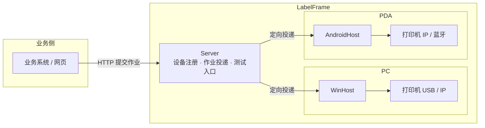

# LabelFrame 设计文档

## 1. 愿景与目标

愿景：**方便仓库完成标签打印，提高办公效率。**

目标（由愿景推导）：
- 操作工在业务动作中一键触发打印，就近出纸，零学习成本；
- 文员可在 PC 上批量打印，无需关心打印机细节；
- 管理员一次配置，多设备可复制，故障可解释；
- 业务系统通过简单契约接入，不依赖具体打印机型号。

## 2. 核心概念（术语表）

| 术语 | 含义 |
|---|---|
| 契约（LabelContract） | 一个标签场景的字段清单（Key / DisplayName / 必填 / 类型 / 格式），可版本化 |
| 版式（LabelLayout） | 标签布局：尺寸 + 元素（文本 / 条码 / 二维码 / 图片 / 线），引用契约版本，毫米坐标 |
| 标签文档（LabelDocument） | 版式 + 数据解析后的中间结果，与打印机指令无关 |
| 作业（Job） | 一次打印请求 = N 张标签，逐张状态，可挂起 / 恢复 / 取消，批内顺序 |
| 设备（Device） | 一台运行宿主的 PC 或 PDA，向 Server 注册 |
| 宿主（Host） | 设备上的本地打印服务（WinHost / AndroidHost） |
| 编码器（Encoder） | LabelDocument → 打印机指令（ZPL 优先，预留 TSPL / CPCL / 图片） |
| 传输（Transport） | 把指令送到打印机：TCP 9100 / Windows 驱动 / 蓝牙 / 日志模拟 |
| 模板包（TemplatePackage） | 契约 + 版式 + 静态图片资源的可导入导出单元（zip） |

## 3. 总体架构

### 3.1 两种打印模式

- **路由模式（主）**：业务系统提交作业（requestId + 目标设备 + labels[]）→ Server 校验并投递到目标设备宿主 → 宿主作业队列逐张打印 → 状态可查 / 可通知。
- **直连模式**：PDA 网页或本机程序直接调用本机宿主（本地 HTTP / JS 桥），不经 Server；适合就近单张，页面有数据时可脱离服务器。

### 3.2 一次请求 = 多张

调用方一次提交 N 张标签（每张可不同），异步返回 jobId，进度与失败项可查；出库拆分、批量、补打统一为同一模型。

## 4. 关键技术决策（决策记录）

| # | 决策 | 决定 | 后果 |
|---|---|---|---|
| 1 | 契约与版式分离 | 字段契约稳定、版式易变，两者分开版本化 | 改版式不碰契约；契约升级后可软校验旧版式（Drifted） |
| 2 | 中间文档模型 + 毫米坐标 | 版式用毫米，编码器按 DPI 换算 | 同模板可跨 203/300 dpi；便于预览与多指令集 |
| 3 | 编码器抽象 | `ILabelEncoder`，ZPL 优先 | 换打印机只增加编码器 |
| 4 | 中文渲染下沉编码器 | 中文文本栅格化为位图（^GF），条码始终原生指令 | 不依赖打印机固件；条码质量不妥协 |
| 5 | 异步作业模型 | 提交即返回 jobId；逐张状态持久化；幂等 requestId；挂起 / 恢复 / 取消；批内顺序 | 大批量不阻塞调用方；不重打不漏打 |
| 6 | 设备定向投递 | 作业目标 = 发起设备；Server 维护设备目录精准投递 | 多人并发互不干扰；替代广播方案 |
| 7 | 本地服务统一入口 | 所有打印经设备宿主；直连与路由并存 | PC / PDA 同构 |
| 8 | 预览是设计期能力 | 预览渲染不进打印主链路，模板设计 / 调试用 | 正式流程零预览开销 |
| 9 | 运行平台 | .NET 10（2026-08-09 起）；WinHost 目标 `net10.0-windows10.0.26100`（Zebra SDK 需要 Windows SDK 投影）；Win7/8 用 net48 版 WinHost（尽量兼容，有真实需求再做） | 官方 SDK 与最新 LTS 能力；兼容后置 |
| 10 | 模板管理先单机 | 单机 CRUD + 模板包导入导出；WMS 下发后置 | 「标准模板包」格式从第一天定，下发复用同一格式 |
| 11 | Server 自带测试入口 | 无业务系统也能提交打印、连接打印机验证 | 系统独立可测 |
| 12 | 迭代 1 编码器范围 | ZPL 编码器先覆盖文本 / Code128 / 图片占位；二维码 / 线元素进入模型但编码器显式报错（NotSupportedException），迭代 2 补全 ^BQ / ^GB | 迭代 1 验收聚焦 ^BC，避免范围膨胀 |
| 13 | 问题码约定 | 校验问题码统一 `LF_VAL_xxx`，消息中文可读 | 故障可解释，后续错误码沿用此约定 |
| 14 | 作业模型与 SQLite 持久化 | 一次请求 = 1 个 Job + N 个 Item（逐张）；SQLite 表 `jobs` / `job_items`，`request_id` 唯一索引实现幂等；Item 存编码后的 ZPL（不可变，避免重打） | 服务重启不丢作业；重放同一 requestId 不重复建单 |
| 15 | 本地 HTTP API（迭代 2 契约） | 提交请求自包含模板（contract + layout + labels[]），因为模板管理在迭代 4；端点：`POST /api/jobs`、`GET /api/jobs/{id}`、`POST /api/jobs/{id}/suspend|resume|cancel`、`GET /healthz` | 无模板库也能端到端打印；迭代 4 再支持模板引用 |
| 16 | 挂起 / 恢复语义 | 传输异常（如打印机离线）→ 当前 Item 记 Failed，若仍有未打 Item 则 Job 挂起；恢复后从未打印的 Pending Item 续打（不重打 Failed，失败项单独重打在迭代 6）；取消 → 剩余 Pending/Printing Item 置 Cancelled；服务重启把 in-flight（Printing）Job 置 Suspended，并把在途（Printing）Item 重置为 Pending，恢复后续打优先保证不漏打（不重打语义在真实设备联调时确认） | 符合底线「不重打、不漏打」；TCP 无法感知缺纸，以发送异常近似 |
| 17 | 中文渲染架构 | Core 定义 `LabelBitmap`（1bpp）+ ZPL `^GF` 编码；WinHost 用 GDI（System.Drawing，Windows 专属）把非 ASCII 文本元素栅格化为位图并替换为图片元素；ASCII 仍用原生 `^A` 文本 | 不依赖打印机固件中文字库；Android 迭代 5 用平台位图实现同契约 |
| 18 | 传输分层 | TCP 9100 在 Core（跨平台，Android 复用）；Windows 驱动（USB）用 winspool P/Invoke raw 打印，放在 WinHost | 每台打印机串行，一台设备一次只处理一个 Item |
| 19 | WinHost 配置 | `appsettings.json` 的 `WinHost` 节 + `LABELFRAME_*` 环境变量覆盖；默认监听 127.0.0.1:53960、Log 传输（联调）、数据库 %LOCALAPPDATA%\\LabelFrame\\jobs.db | 一次配置可复制；无真实打印机时日志模拟 |
| 20 | Zebra 官方 SDK | 传输新增 Zebra 模式（`Zebra.Printer.SDK 3.0.3355`，Link-OS）：TCP / USB（自动发现）/ Windows 驱动统一连接；避开 5.x 引入的 MAUI/WinUI 依赖；轻量 TCP9100 / winspool raw 保留作备选 | 官方 USB 直连与打印机状态（迭代 6）可用；Zebra 模式要求 Win10+ |
| 21 | Server 投递采用「宿主轮询」 | WinHost 注册后周期轮询 Server 领取定向作业，完成后回报结果；不要求宿主开放入站端口 | PC / PDA 同构，天然穿透防火墙；设备在线以心跳（轮询）为准 |
| 22 | 设备离线语义 | 作业投递给离线设备时在 Server 暂存（Pending），设备上线轮询即领取；不设过期 | 符合「不丢作业」底线；后续可按需加过期/通知 |
| 23 | 模板包格式 | zip：`manifest.json`（name / group / contract / layout）+ `images/` 图片资源；模板库 SQLite（Core.Templates，按分组列表） | 两台电脑间可导入导出；WMS 下发复用同一格式 |
| 24 | 预览渲染 | LabelDocument → PNG（设计期）：文本 / 线用 GDI，条码 / 二维码用 ZXing，图片用模板资源或位图；毫米 → 像素按 DPI | 预览与打印同坐标体系，抽查一致 |
| 25 | 失败项单独重打 | Failed Item → Pending（清错误），Failed 作业自动恢复 Pending 由 Worker 续打 | 补打不重建整单；不重打已完成项 |
| 26 | 在线状态 / 测试页 | `GET /api/printer/status` + `POST /api/printer/test`；TCP 用 `~HS` 基础解析（字段映射待真实设备联调），Zebra SDK 3.x PrinterStatus 无公开字段先按「连接成功 = 在线」，驱动模式不可读回 | 故障可解释；真实设备联调确认字段语义 |
| 27 | Android 本地 HTTP | AndroidHost 用 TcpListener 极简 HTTP（仅 127.0.0.1:53970），不承载完整 ASP.NET Core | 包体小、依赖少；JS 桥同端口预留 |
| 28 | Android 中文渲染与存储 | Android.Graphics Bitmap → LabelBitmap（^GF，与 WinHost 同契约）；SQLite 用 lib.e_sqlite3.android | 跨宿主中文输出一致 |
| 29 | Studio 模板工具架构 | `LabelFrame.Studio`（WPF，net10.0-windows）作为 WinHost 的 HTTP 客户端：模板管理 / 导入导出 / 预览 / 测试打印全部复用 WinHost API；V1 不做版式可视化编辑（V2 再加画布） | 零重复逻辑，测试打印走生产同一条打印链路；V2 拖拽画布不改变模板包契约 |
| 30 | Studio V2 版式编排 | 画布用 WPF 原生元素（Canvas + TextBlock/Border/Line），mm → px 按缩放换算；条码 / 二维码在画布上为带 SourceKey 的占位框，真实效果由「刷新预览」（WinHost preview PNG）确认 | 拖拽流畅、无需本地条码渲染；编排所见即模板结构 |
| 31 | 后续规划（迭代 9/10） | Excel 导入：列 → 契约字段映射，批量生成标签数据；MSI 安装包（WiX）：安装 WinHost + Studio、生成 appsettings.json（端口 / 传输 / 打印机 / 数据库）、开始菜单快捷方式 | 交付形态完整；业务侧只传文本，模板决定条码 / 二维码 |
| 32 | Excel 读取选型（预研） | 迭代 9 采用第三方 `TemplateFrame.Excel.Simple 1.0.4`：`SimpleExcel.Read(Stream, tableName)` 读取 xlsx → 表头 + 数据行，再按列映射契约字段；底层 `DocumentFormat.OpenXml 3.3.0`；仅作依赖引用，仓库命名仍为 `LabelFrame.*` | 省去自研 xlsx 解析；列映射与批量提交逻辑由我们实现 |
| 33 | 元素样式与区域（格子）布局 | 文本元素可选 `WidthMm`（块宽）/ `TextAlign`（Left/Center/Right）/ `PaddingMm` / `BorderMm`；矩形元素可选 `BorderMm`；新增区域元素 `LabelRegionElement`（X/Y/W/H/BorderMm）；任何元素可选 `RegionId` + `RegionHAlign/RegionVAlign`（Start/Center/End）锚定到区域 | 支持「先画格子再放元素居中」的编排模式；格子保存、移动元素跟随；旧模板无新属性行为不变（向后兼容） |
| 34 | Studio 2.0 界面（迭代 8C） | 两个工作区：作业工作台（模板列表 / 预览 / 数据表单 / 打印 / 状态日志栏）+ 独立模板设计器（控件栏 / 画布 / 属性分组 / 填充 / 区域 / 实时预览 / 打印测试）；不常用功能收进菜单栏 | 文员日常打印与设计分离；画布所见即所得即实时预览 |
| 35 | 元素内容来源（填充） | 文本 / 条码 / 二维码支持两种来源：`Literal` 固定值（如标题）或 `SourceKey` 字段填充；编码与预览取值 = Literal ?? data[SourceKey] | 固定文本无需建字段；旧模板无 Literal 行为不变 |
| 36 | 容器控件（替代“画区域”） | 设计器控件栏提供「容器」（内部仍是 `LabelRegionElement`，模板包格式不变）；元素拖入容器自动锚定居中；属性面板不再暴露 RegionId / 对齐锚定 UI（后台能力保留） | 用户无需理解区域概念；画格子 → 放元素居中的编排方式不变 |
| 37 | 契约字段自动推导 | 字段集合 = 版式中「字段填充」元素的 `SourceKey` 去重（按元素顺序）；移除字段增删 / 重命名 / 显示名编辑 UI；显示名统一取 Key；加载旧模板保留契约字段顺序与元数据（IsRequired / Type），未被元素引用的字段不再保留 | 字段建立是后台逻辑，用户只负责绑定控件；工作台 / 测试表单用 Key 作标签 |
| 38 | 设计器 2.0 交互与布局（迭代 8D） | 设计 / 测试用 Tab 分开；左键选中、8 手柄拖角缩放、框选多选、Delete 删除、中键平移、Ctrl+滚轮缩放（以鼠标为中心）、标尺 + 网格、边缘 / 中心对齐吸附与右键对齐菜单；属性面板选中控件才显示（默认收起）；底部状态 + 日志栏横跨全窗口（自动滚底 + 清空）；控件栏拖拽不再重复建元素；元素属性变化实时驱动画布重绘与预览 | 用户编辑手感接近主流设计器；设计界面与打印测试界面职责分离 |
| 39 | UI 技术选型评估（2026-08-09，用户已选 A 方案） | 后端（Core / Rendering / WinHost / Server / AndroidHost）保持 .NET 10 不动；Studio UI 层评估 Web 技术栈（Tauri 2 / Blazor Hybrid / 纯浏览器），先用本地 Web 原型验证拖拽设计器体验，再决定是否重写 UI；原型直接调 WinHost API，复用全部后端能力 | UI 是纯客户端，可独立替换；原型成本低、结论直观；无论换栈与否，Excel 读取 / 批量打印等业务逻辑做成可复用服务 |
| 40 | 单机服务与前端工程化（2026-08-09，用户确认） | 单机模式 = 演进 WinHost 为单进程服务（模板库 / 作业 / 打印传输 / 静态托管 Web UI / Excel 导入 / PDA 日志）；前端另起 `web/`（Vite + React + TS + Konva），prototypes 原型冻结不改；后端 C#，前端 JS/TS；Excel 解析在后端复用 TemplateFrame.Excel.Simple | 一台 PC = 一个进程 + 浏览器；前后端并行开发，前端按 FRONTEND-SPEC.md 交付，主 agent 联调 |
| 41 | 模板测试数据 testData（契约扩展） | 模板包与模板 API 增加可选 `testData`（键 → 值字典，向后兼容）；PDA 打印测试与 PC 打印测试共用；manifest / SQLite 模板表同步扩展 | 服务端定义测试数据，PDA 点击模板即可本地测试打印 |
| 42 | PDA 测试模式（迭代 11） | AndroidHost 配置 pc_host（PC 单机服务地址）→ 本地 HTTP 增加 `GET /api/pc/templates` 与 `POST /api/pc/templates/{name}/print-test`（拉模板详情 → 服务端 testData 本地打印 → 终态日志回传 PC）；内置 PDA 测试页（浏览器打开 127.0.0.1:53970） | PDA 开箱即用测试打印；日志回传 PC 便于远程调试；Manifest 允许明文 HTTP（内网） |### 决策 #39 完成记录（2026-08-09）
| 43 | MSI 安装包方案（迭代 10，2026-08-09；2026-08-10 修复） | WiX v7 打包：WinHost 发布产物（win-x64 **framework-dependent**，含 web/dist）+ 桌面 / 开始菜单快捷方式（Target=#WinHostExe）；WinHost 为 WinExe + 自动开浏览器 + host.log + 本机优雅关闭 + **系统托盘（原生 P/Invoke，无 WinForms）**；名称统一 LabelFrame；L 型图标；自签名证书脚本；目标机需 .NET 10 Desktop Runtime（MSI 约 10MB）。2026-08-10 修复：MSI 以 `-arch x64` 构建为 **x64 包**（此前是 32 位包，`ProgramFiles64Folder` 不生效，错装到 `Program Files (x86)`）；版本升至 0.11.1 以支持覆盖已装的 0.11.0 | 干净电脑装 .NET 10 Runtime 后：安装 MSI（`C:\Program Files\LabelFrame`）→ 双击图标 → 浏览器打开即用；正式签名需商业证书 |
| 44 | MSI 运行时缺失处理（2026-08-10，用户决策；2026-08-10 修复检测） | MSI 检测 .NET Desktop Runtime（x64）：缺失时全 UI 安装显示带可点击官方下载链接的对话框（MSI Hyperlink 控件），静默 / 基础 UI 由 LaunchCondition 拦截并提示链接；**放弃 Burn 引导自动下载安装**运行时（曾尝试 WiX v7 Bal 构建 Bundle，扩展加载与依赖链复杂、收益低，用户确认不做）。检测实现改为 WiX NetFx 扩展 `DotNetCompatibilityCheck`（内置官方 NetCoreCheck 自检，检查 Microsoft.WindowsDesktop.App ≥ 10.0.0、RollForward=latestMajor、x64）：不再读取注册表（原方案读 `InstalledVersions\...\sharedfx` 默认值，而运行时版本是**命名值**，且 MSI 为 32 位视图，导致装了运行时仍误报缺失）；NetCoreCheck 实时检测，**装完运行时无需重启**即可识别 | 干净电脑需先装 .NET 10 Desktop Runtime 再装 MSI；MSI 保持约 10MB、不联网自动安装 |
| 45 | 模板预览值 + 测试默认值 + 图片打印（迭代 12，2026-08-10，后端已实施（SkiaSharp 渲染器），前端 renderLabelImage 待实施） | 元素 JSON 新增 `previewValue`（text/barcode/qrcode 字段填充模式写入，固定值仍用 literal）；保存模板时后端自动用元素预览值派生并覆盖 `testData`，作为 PC / PDA 打印测试的初始默认值（单一事实来源=元素预览值）；新增 `PrintMode`（Vector 默认 / Image）：Image 模式用 **SkiaSharp 渲染器**（canvas 类 2D，与前端同源）把整张标签渲染为 1bpp 位图经 `^GF` 直传打印机，用于评估定位与效果；`SubmitJobRequest` 增加可选 `template.name`（取模板图片资源）与 `printMode`（请求覆盖配置） | 先实验评估图片打印效果，再决定是否替代矢量 ZPL；预览值丢失 bug 由前后端契约修复 |
| 46 | 文本垂直对齐契约（迭代 12，2026-08-10） | 文本元素新增 `heightMm`（0=按字高）与 `verticalAlign`（Top/Middle/Bottom，默认 Top 兼容旧模板）；前端保存时写入元素高度与垂直对齐；Skia / GDI 渲染器按框高垂直对齐绘制，边框按框高；修复「打印比前端预览整体偏上」（此前前端框内居中、后端顶部对齐且高度未持久化） | 旧模板需在编辑器重新保存一次才带 heightMm/verticalAlign；矢量 ZPL 打印暂不区分垂直对齐 |
| 47 | 元素契约第二批字段 + 垂直对齐默认值统一（迭代 13，2026-08-10，后端已实施；前端 convert.ts 待联动） | 文本 `wrap / lineHeight / fitMode / fontFamily`（默认 Microsoft YaHei）、二维码 `qrEcc / qrMargin`（默认 M / 2）、条码 `displayValue`（默认 true）、通用双边内边距 `paddingH / paddingV`（`PaddingHMm / PaddingVMm`，0=未设，缺失时回退 `paddingMm`）写入版式契约；写方向非默认才写、读回默认（向后兼容，无数据库迁移）。决策 A：`VerticalAlign` 默认由 Top 改为 **Middle**（与前端一致），旧模板无 `heightMm` 时渲染器框高兜底 = `max(字高 + 2×最大内边距, 10mm)`。Skia 图片打印按这些字段真实绘制（换行 / 行距 / 溢出处理 / 字体 / QR 参数 / 条码文字 / 双边内边距）；新字段**不参与** ZPL 矢量编码 | 导入 → 保存 → 重开逐字段一致；图片打印与前端预览同源；旧模板行为 = 前端现状 |
- Web 设计器原型 v2 已实现（`prototypes/web-designer/`）：视口自适应 + 内容缩放、条码 / 二维码实时渲染（JsBarcode / qrcode-generator）、智能参考线吸附、文本溢出三模式、边框修正、控件精简为文本 / 条码 / 二维码。
- 业界参考：Figma（视口缩放 + 参考线）、BarTender Auto-Fit（文本适应多模式）、Cleverence Label（Shrink to fit + 最小字高）、Konva snapping 库（参考线吸附）。
- 原型 v3（2026-08-09）：画布 = 输入尺寸 + 四周 10mm 留白，标尺以 mm 覆盖全画布并跟随画布；画布平移 clamp 不越界；「实际大小」= 1mm=8 点（203dpi 打印比例）；文本溢出新增「不限制高度」；修复 HTML5 拖入坐标（改用 clientX/Y 几何换算，不依赖 Konva 指针状态）。
- 原型 v3 核心修复（2026-08-09 第二轮）：stage 尺寸 = 逻辑尺寸 × 比例尺（Konva stage.scale 不改变 canvas 容器尺寸，原实现放大时内容被裁剪导致元素不可见 / 网格范围异常）；标尺 0 点与画布左缘对齐（左上角空块布局）；「适应窗口 / 实际大小」统一为同一比例尺的两个预设（设计时按点处理，需要真实比例时再换算点与 mm）。
- 原型 v3 第三轮修复（2026-08-09）：控件不可见根因 = Konva 9.3 Text 无 clipFunc 导致 render 抛异常（改 Group clip + 未绑定占位）；标尺画进 Konva 与内容同坐标系（解决放大 + 平移后错位）；中键平移改用原生 DOM + document 级 mouseup（修复粘滞）。
- 原型 v3 第四轮修复（2026-08-09）：吸附 / 定位统一逻辑坐标（getClientRect relativeTo layer，原绝对坐标在比例尺下偏差）；二维码同步 canvas 渲染；属性下拉 / 勾选补 commit；边框 / 内边距通用化；文本模式收敛为「缩小适应 / 溢出显示」两种（文本框 = 遮罩区域）。
- 原型 v3 第五轮改进（2026-08-09）：字高独立于文本框（拉伸只改遮罩）；内边距拆上下 / 左右；填充默认固定值，字段填充 = 键名称 + 预览填充值；Ctrl+C / Ctrl+V 复制粘贴。
- 原型 v3 第六轮改进（2026-08-09）：Ctrl+Z / Ctrl+Y 撤销恢复；字高调大才撑高文本框；吸附强化（边完全重合）；导出 / 导入设计到剪贴板（labelframe-web-design JSON 格式）；控件栏新增矩形控件（保存映射 region）；文本框基础属性新增高度字段。
- 吸附落点修复（2026-08-09）：Konva 拖拽内部会用指针位置覆盖 dragmove 中设置的吸附位置，导致松手坐标偏离；dragend 时重新吸附再保存坐标。
- 原型 v3 第七轮改进（2026-08-09）：矩形镂空（仅边框，打印无背景色）；图层面板（列表 z 序 / 点击选中同步 / 置顶上移下移置底 / Delete 删除）。
- 原型 v3 第八轮修复（2026-08-09）：网格吸附兜底（无参考目标时贴最近 1mm 网格，消除小数偏移）；字段填充提示明确预览值仅画布显示、打印以外界数据为准。
- 原型 v3 第九轮改进（2026-08-09）：移除适应窗口 / 实际大小按钮；新增 DPI 选择框（203 / 300）与「预览打印效果」——按 DPI 真实打印比例显示（scale = round(dpi/25.4) / 4），可平移 / 缩放，再点退出回到适应窗口。
- 原型 v3 第九轮增强（2026-08-09）：预览 = 纯打印效果（同界面，不弹窗）——隐藏网格 / 标尺 / 内容区边界 / 选中框，元素与所有编辑操作锁定（属性面板 / 图层面板显示预览中提示），退出预览恢复。
- 原型 v3 第九轮增强二（2026-08-09）：预览画布仅显示标签宽高定义的范围（去掉标尺区与 10mm 留白，元素按标签坐标直接渲染）。
- 原型 v3 第十轮改进（2026-08-09）：文本框自动换行 + 行间距 + 字体选择；语义修正：单行 = 超宽缩小（或隐藏）；自动换行 = 按字高超右边界换行、超下边界隐藏（不缩小）；默认单行。
- 文本垂直对齐（顶端 / 居中 / 底部）配合换行；支持无边框标签，靠位置 / 字体 / 字号 / 对齐区分信息层级。
- 填充切换：字段填充 → 固定值时清空键名称；图层显示名称 = 固定值内容 /（键名）预览值 / 条码二维码带类型前缀；原型改为纯前端编辑器（移除后端按钮，导出 / 导入走 Ctrl+Shift+C/V，待桌面壳阶段再讨论与后端结合）。
- 待用户本机验收后确定 UI 技术栈（Tauri 2 / Blazor Hybrid / 维持 WPF）；后端与公共契约不随 UI 选型变动。
## 6. Server API 契约（迭代 3）

| 方法 | 路径 | 说明 |
|---|---|---|
| POST | /api/devices | 设备注册 / 心跳（宿主轮询时也刷新） |
| GET | /api/devices | 设备目录（含在线状态） |
| POST | /api/jobs | 业务提交：`{ requestId, targetDeviceId, template, labels[] }`，幂等 |
| GET | /api/jobs | 作业列表（集中可查） |
| GET | /api/jobs/{jobId} | 作业详情（含设备在线状态） |
| GET | /api/devices/{deviceId}/jobs/pending | 宿主领取定向作业（Pending → Claimed） |
| POST | /api/devices/{deviceId}/jobs/{jobId}/result | 宿主回报结果（Completed / Failed + 计数 + 原因） |
| GET | / | 测试入口（无业务系统提交打印） |

投递方式：宿主轮询（决策 #21）；设备离线作业暂存（决策 #22）。
## 5. 风险与未决问题

- 中文位图渲染的字体嵌入与 ^GF 数据量控制（迭代 2 展开）。
- Android 前台服务在厂商 ROM 上的自启 / 保活差异（迭代 5 展开）。
- 蓝牙打印的配对与重连策略（P1）。
- 设备离线时作业语义：暂存还是拒绝（迭代 3 定）。
- net48 版 WinHost 的技术细节（HttpListener、netstandard2.0 约束），有需求再展开。
- 打印计数 / 库存联动：默认不做；如需，考虑事件接口（未决）。
- ZPL 文本转义策略：`^FD` 数据中的 `^` / `~` / `_` 用 `^FH` 十六进制转义；中文文本迭代 1 直通，迭代 2 位图化（^GF）后不再依赖内置字体（迭代 2 展开）。
- 契约字段格式（Pattern）校验：迭代 1 仅存元数据未执行，需排期（未决）。
- 内嵌中文字体文件：迭代 2 实现「优先加载内嵌/本地字体、回退系统字体（微软雅黑）」的机制；实际字体文件（开源中文 TTF，体积较大）待与用户确认后加入资源（未决）。
- `^GF` 数据量：中文一行按 1bpp 十六进制展开约每字 1KB+，迭代 2 先不做压缩；如需优化（^GF 二进制/压缩模式、字库缓存）再排期（未决）。
- TCP 9100 无法感知打印机缺纸/卡纸，迭代 2 以「发送异常 → 挂起」近似；真实缺纸语义待真实设备联调（迭代 2 验收时确认）。
- SQLitePCLRaw 2.1.6 存在已知漏洞公告（GHSA-2m69-gcr7-jv3q，SQLite 原生库）；离线环境暂固定该版本并在 Core.csproj 抑制 NU1903，联网后升级（如 2.1.10+）（未决）。
- Zebra 模式要求 Win10+（Windows SDK 10.0.26100 投影）；Win7/8 只能用 TCP9100 / winspool raw 传输（未决）。
- Server 暂存作业无过期策略：设备长期离线时作业堆积，需人工处理（迭代 3 暂定，后续可加过期/通知）。
- Android 迭代 5 受阻：当前环境未安装 .NET Android workload（`dotnet workload list` 为空），无法编译 / 验证 AndroidHost；已完成架构设计（本地 HTTP / JS 桥、TCP9100、注册轮询复用），待安装 workload 后实施（未决）。
- Zebra SDK 3.0.3355 的 PrinterStatus 无公开状态字段；`~HS` 字段映射基于常见文档实现，均待真实设备联调确认（未决）。
- AndroidHost 构建依赖：.NET Android workload、Android SDK 36、JDK 17（本机已配齐）；Android 16 起要求 16KB 页，SQLitePCLRaw 2.1.6 的 libe_sqlite3.so 不满足（XA0141 警告），联网升级后处理（未决）。
- Android 12+ 后台启动前台服务受限，开机自启需用户在系统设置允许；厂商 ROM 保活差异（真机验收时确认）。
- Studio V2 画布编辑暂不提供「所见即所得」的真实条码渲染（占位框 + WinHost 预览确认），如需画布内真实条码再引入 ZXing 本地渲染（未决）。
- Excel 导入（迭代 9）拟用 `TemplateFrame.Excel.Simple`（决策 #32）：其为第三方包，构建需联网还原 `DocumentFormat.OpenXml 3.3.0`；版本 / 表名约定在实施时定稿（未决）。
- 区域布局的 ZPL 实现：区域内文本对齐用 `^FB` 块（宽度 = 区域宽 - padding×2）；区域边框用 `^GB`；元素在区域内的位置由对齐参数计算。文本块宽度为 0 时不做块对齐（保持旧行为）。真实打印效果待设备抽查（未决）。
- Studio 2.0 实时预览依赖本地渲染（共享库 `LabelFrame.Rendering`，GDI + ZXing），与打印端同坐标/同解析；拖拽节流刷新。字体渲染差异（GDI vs 打印机）以真机抽查为准（未决）。
- Web 前端增强字段与后端契约的差距（hermes 交付报告决策 #6，已由迭代 13 解决，2026-08-10）：文本 `wrap / lineHeight / valign / fitMode / fontFamily`、条码 `displayValue / 码制`、二维码 `qrEcc / qrMargin` 等前端属性已通过迭代 13 契约扩展补齐后端字段（决策 #47，后端已实施）；`barcodeFormat` 固定 CODE128 不持久化；前端 convert.ts 字段映射待 hermes 联动。
